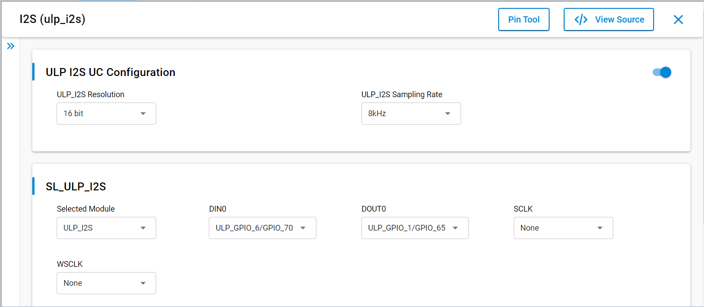
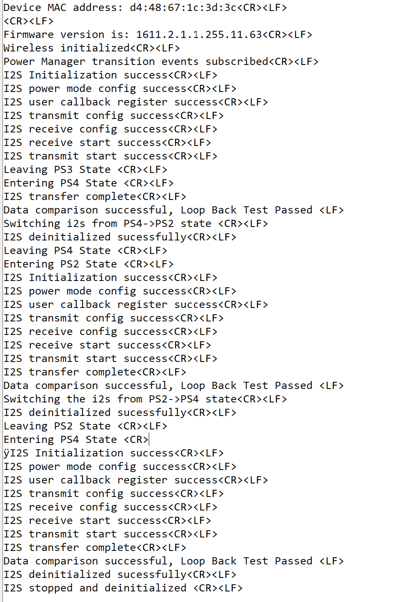

# SiWx91x Platform ULP I2S FreeRTOS

## Table of Contents

- [SiWx91x Platform ULP I2S FreeRTOS](#siwx91x-platform-ulp-i2s-freertos)
  - [Table of Contents](#table-of-contents)
  - [Purpose/Scope](#purposescope)
  - [Overview](#overview)
  - [About Example Code](#about-example-code)
  - [FreeRTOS Architecture](#freertos-architecture)
  - [Prerequisites/Setup Requirements](#prerequisitessetup-requirements)
    - [Hardware Requirements](#hardware-requirements)
    - [Software Requirements](#software-requirements)
    - [Setup Diagram](#setup-diagram)
  - [Getting Started](#getting-started)
  - [Application Build Environment](#application-build-environment)
    - [Application Configuration Parameters](#application-configuration-parameters)
    - [Pin Configuration](#pin-configuration)
  - [Test the Application](#test-the-application)
  - [Troubleshooting](#troubleshooting)
  - [Resources](#resources)
  - [Report Bugs/Support](#report-bugssupport)

## Purpose/Scope

This project runs **ULP I2S (instance 1)** as **master** under **FreeRTOS**: electrical **DOUT → DIN** loopback, **DMA** TX/RX through fixed **ULP SRAM** buffers, completion signaled with two **CMSIS-RTOS2** binary semaphores, **Wi‑Fi client initialization** with the NWP in **deep sleep with RAM retention** during startup, and **PS4 ↔ PS2** transitions with **configuring_ps2_power_state()** before re-arming I2S in the new domain.

## Overview

- The I2S_2CH supports two stereo channels, while the ULP_I2S and NWP/Security subsystem I2S support one stereo channel.
- Supported resolutions include 16-, 24-, and 32-bit; this example uses **16-bit** words and **SL_I2S_DATA_SIZE16** from UC.
- Supported sampling rates include 8 kHz through 192 kHz; **ULP I2S** is limited by **ULP_I2S_REF_CLK** in low-power states (typically up to **48 kHz**).
- **Master** and **Slave** modes exist; this example is **master**, **async** (separate SCK/WS for TX and RX paths in the driver configuration).
- **FIFO** depth up to **8** with **DMA**; this example relies on driver DMA completion events, not busy polling.

## About Example Code

**`ulp_i2s_freertos.c`** drives **ULP I2S** instance **`ULP_I2S_INSTANCE`** (**`1`**) as **master**: **DOUT → DIN** electrical loopback, **DMA** via fixed ULP SRAM (**`I2S_TX_BUF_MEMORY`**, **`I2S_RX_BUF_MEMORY`**, stride **`I2S_ULP_BANK_OFFSET`**), completion via binary semaphores, Wi‑Fi/NWP retention bring-up, and **PS4 ↔ PS2** with **`configuring_ps2_power_state()`** before **`ulp_i2s_application_init()`** resumes transfers.

- **`sl_i2s_xfer_config_t`** uses **`SL_I2S_MASTER`**, **`SL_I2S_PROTOCOL`**, **`SL_I2S_ASYNC`**, **`SL_I2S_DATA_SIZE16`**, **`SL_ULP_I2S_RESOLUTION`**, **`SL_ULP_I2S_SAMPLING_RATE`** (from UC via **`sl_si91x_i2s_config.h`**). After filling **`i2s_lowpower_data_out`** and copying to **`I2S_TX_BUF_MEMORY`**, init calls [sl_si91x_i2s_init](https://docs.silabs.com/wiseconnect/latest/wiseconnect-api-reference-guide-si91x-peripherals/i2-s#sl-si91x-i2s-init), [sl_si91x_i2s_configure_power_mode](https://docs.silabs.com/wiseconnect/latest/wiseconnect-api-reference-guide-si91x-peripherals/i2-s#sl-si91x-i2s-configure-power-mode) (**`SL_I2S_FULL_POWER`**), [sl_si91x_i2s_register_event_callback](https://docs.silabs.com/wiseconnect/latest/wiseconnect-api-reference-guide-si91x-peripherals/i2-s#sl-si91x-i2s-register-event-callback) (**`callback_event`**), **`ulp_i2s_xfer_sem_drain()`**, [sl_si91x_i2s_config_transmit_receive](https://docs.silabs.com/wiseconnect/latest/wiseconnect-api-reference-guide-si91x-peripherals/i2-s#sl-si91x-i2s-config-transmit-receive) for **TX** then **RX**, [sl_si91x_i2s_receive_data](https://docs.silabs.com/wiseconnect/latest/wiseconnect-api-reference-guide-si91x-peripherals/i2-s#sl-si91x-i2s-receive-data) into **`I2S_RX_BUF_MEMORY`**, and [sl_si91x_i2s_transmit_data](https://docs.silabs.com/wiseconnect/latest/wiseconnect-api-reference-guide-si91x-peripherals/i2-s#sl-si91x-i2s-transmit-data) from **`I2S_TX_BUF_MEMORY`** for **`I2S_LOWPOWER_BUFFER_SIZE`** samples.
- **`callback_event`** posts **`ulp_i2s_tx_sem`** / **`ulp_i2s_rx_sem`** on **`SL_I2S_SEND_COMPLETE`** / **`SL_I2S_RECEIVE_COMPLETE`** (keep ISR-side work minimal).
- **`ulp_i2s_wait_transfer_done()`** optionally brackets waits with **[sl_si91x_power_manager_add_ps_requirement](https://docs.silabs.com/wiseconnect/latest/wiseconnect-api-reference-guide-si91x-peripherals/power-manager#sl-si91x-power-manager-add-ps-requirement)** (**PS4**) when not already in **PS2**, acquires both semaphores with **`ULP_I2S_XFER_WAIT_MS`**, then removes **PS4** if held.
- Teardown uses [sl_si91x_i2s_unregister_event_callback](https://docs.silabs.com/wiseconnect/latest/wiseconnect-api-reference-guide-si91x-peripherals/i2-s#sl-si91x-i2s-unregister-event-callback) and **[sl_si91x_i2s_deinit_v2](https://docs.silabs.com/wiseconnect/latest/wiseconnect-api-reference-guide-si91x-peripherals/i2-s#sl-si91x-i2s-deinit-v2)** from **`ulp_i2s_deinit()`**.
- Build **`I2S1_LOOP_BACK`** is required when **`ULP_I2S_INSTANCE == 1`** (see **`#error`** in source).

> **Note:** Non-blocking receive has known limitations in some ULP configurations; this example relies on DMA completion semaphores rather than a separate non-blocking RX API.

## FreeRTOS Architecture

- On startup, `main.c` calls `sl_main_second_stage_init()`, then `app_init()` invokes **`ulp_i2s_example_init()`**, which creates **`ulp_i2s`** (`osThreadNew()`, **`10240`** stack, `osPriorityLow1`).
- `app_process_action()` is unused; I2S DMA, compares, and PS transitions run in the dedicated task (do **`DEBUGINIT()`** only after PS moves—see source comments at thread entry).
- The task creates **`ulp_i2s_tx_sem`** / **`ulp_i2s_rx_sem`**, runs **`initialize_wireless()`**, subscribes **`ulp_i2s_pm_transition_callback`**, then **`ulp_i2s_application_init()`**.
- **`SL_ULP_I2S_PROCESS_ACTION`** waits on **`ulp_i2s_wait_transfer_done()`**, copies **`I2S_RX_BUF_MEMORY`**, checks **`sl_si91x_i2s_get_transmit_data_count`** / **`get_receive_data_count`**, runs **`compare_loop_back_data()`**, then enters **`SL_ULP_I2S_POWER_STATE_TRANSITION`**.
- **PS4 → PS2:** **`ulp_i2s_deinit()`**, spin on **`sl_si91x_power_manager_ps2_pre_check`** with **`osDelay(5)`**, **`add_ps_requirement(PS2)`**, **`DEBUGINIT()`**, **`configuring_ps2_power_state()`**, **`ulp_i2s_application_init()`**, **`current_power_state = PS2`**. **PS2 → PS4:** **`ulp_i2s_deinit()`**, **`add_ps_requirement(PS4)`**, **`DEBUGINIT()`**, re-init, **`LAST_ENUM_POWER_STATE`**, one more **`PROCESS_ACTION`**. Final branch **`ulp_i2s_deinit()`** then **`SL_ULP_I2S_TRANSMISSION_COMPLETED`** idles with **`osDelay(1000)`**.

## Prerequisites/Setup Requirements

### Hardware Requirements

- Windows PC
- Silicon Labs SiWx91x Evaluation Kit [[BRD4002](https://www.silabs.com/development-tools/wireless/wireless-pro-kit-mainboard?tab=overview) + [BRD4338A](https://www.silabs.com/development-tools/wireless/wi-fi/siwx917-rb4338a-wifi-6-bluetooth-le-soc-radio-board?tab=overview) / [BRD4342A](https://www.silabs.com/development-tools/wireless/wi-fi/siwx91x-rb4342a-wifi-6-bluetooth-le-soc-radio-board?tab=overview) / [BRD4343A](https://www.silabs.com/development-tools/wireless/wi-fi/siw917y-rb4343a-wi-fi-6-bluetooth-le-8mb-flash-radio-board-for-module?tab=overview) / [BRD4343C](https://www.silabs.com/development-tools/wireless/wi-fi/siw917y-rb4343c-wi-fi-6-bluetooth-le-8mb-flash-radio-board-for-module?tab=overview)]
- SiWx917 AC1 Module Explorer Kit [BRD2708A](https://www.silabs.com/development-tools/wireless/wi-fi/siw917y-ek2708a-explorer-kit)
- **I2S DOUT** wired to **I2S DIN** on the same board (loopback) per the pin table.

### Software Requirements

- Simplicity Studio
- Serial console — [Console input and output](https://docs.silabs.com/wiseconnect/latest/wiseconnect-developers-guide-developing-for-silabs-hosts/using-the-simplicity-studio-ide#console-input-and-output)

### Setup Diagram

## Getting Started

Refer to [WiSeConnect Getting Started](https://docs.silabs.com/wiseconnect/latest/wiseconnect-getting-started/) for IDE installation, board connection, firmware update, and creating or importing a project.

For example folder layout, see [WiSeConnect Examples](https://docs.silabs.com/wiseconnect/latest/wiseconnect-examples/#example-folder-structure).

## Application Build Environment

### Application Configuration Parameters

- Open **siwx91x_platform_ulp_i2s_freertos.slcp** → **Software Components** → search **I2S**.
- Set **ULP I2S** resolution, sampling rate, and pins for your board. UC feeds **SL_ULP_I2S_RESOLUTION** and **SL_ULP_I2S_SAMPLING_RATE** through **sl_si91x_i2s_config.h** into **sl_i2s_xfer_config_t**.
- The project defines **I2S1_LOOP_BACK**, **I2S_INSTANCE_CONFIG**, **SL_SI91X_ULP_STATE_ENABLE**, memory profile **si91x_mem_config_3**, and RAM execution symbols used with Wi‑Fi + **PS2**. Do not remove **I2S1_LOOP_BACK** when **ULP_I2S_INSTANCE** is **1** or the build fails the **#error** in **ulp_i2s_freertos.c**.

Macros in **ulp_i2s_freertos.c** (tune as needed):

| Macro | Default | Purpose |
|-------|---------|---------|
| **ULP_I2S_INSTANCE** | 1 | ULP I2S / I2S1 index for this example |
| **I2S_LOWPOWER_BUFFER_SIZE** | 1024 | 16-bit samples per TX/RX DMA |
| **I2S_ULP_BANK_OFFSET** | 0x800 | **2 KB** stride between ULP SRAM banks |
| **I2S_TX_BUF_MEMORY** / **I2S_RX_BUF_MEMORY** | (from **ULP_SRAM_START_ADDR**) | Fixed DMA buffer addresses |
| **ULP_I2S_XFER_WAIT_MS** | 15000 | Semaphore wait per TX and RX completion |
| **FIVE_SECOND_DELAY_MS** / **ULP_I2S_POST_INIT_DELAY_MS** | 5000 / 50 | Defined in source; not used on the main PS path in the current loop (reserved / future use) |

### Pin Configuration

**ULP I2S (master):**

| PIN | ULP GPIO pin | Explorer kit GPIO | Description |
| --- | ------------ | ----------------- | ----------- |
| DOUT | ULP_GPIO_1 [EXP_HEADER-5] | P16 | Connect to DIN for loopback |
| DIN | ULP_GPIO_6 [EXP_HEADER-16] | RX | Connect to DOUT |

Ensure **RTE_Device_917.h** under **$project/config/** matches your pinmux for the ULP I2S instance.

> **Recommended settings:** [WiseConnect recommended settings](https://docs.silabs.com/wiseconnect/latest/wiseconnect-developers-guide-prog-recommended-settings/)

## Test the Application

> **Note:** Use **`Log_script.py`** from the **SiWx91x Platform Logger** example (`examples/si91x_soc/service/sl_si91x_logger/`) to decode structured console log output. Run:
>
> `python Log_script.py --out firmware.out --descriptor SYSVIEW_CaptiveCore.txt --port COM5 --max-args 3`
>
> Replace **COM5** with the serial port your board uses on the host PC.

1. Tie **I2S DOUT** to **I2S DIN** (loopback).
2. Build and run **siwx91x_platform_ulp_i2s_freertos**.
3. On the serial console, expect wireless init messages, **I2S transfer complete**, and **Data comparison successful, Loop Back Test Passed** across **PS4** and **PS2** phases (three compare passes total before final deinit messages), assuming wiring and **I2S1_LOOP_BACK** are correct.
4. If TX/RX waits time out, confirm **I2S1_LOOP_BACK**, loopback wiring, and **ULP_I2S_XFER_WAIT_MS**; use a logic analyzer on **DOUT/DIN/SCK/WS** as needed.

> Interrupt work stays in the driver; keep **callback_event** to semaphore posts only — do not print from the ISR path.

## Troubleshooting

- If the project does not build, ensure Simplicity Studio and the WiSeConnect extension are installed and the board is connected.
- If the device is not detected, reinstall the connectivity firmware and check USB drivers.

## Resources

- [WiSeConnect Getting Started](https://docs.silabs.com/wiseconnect/latest/wiseconnect-getting-started/)
- [WiSeConnect Examples](https://docs.silabs.com/wiseconnect/latest/wiseconnect-examples/)
- [I2S API (WiseConnect)](https://docs.silabs.com/wiseconnect/latest/wiseconnect-api-reference-guide-si91x-peripherals/i2-s)
- [SiWx91x SoC Documentation](https://docs.silabs.com/wiseconnect/latest/)

## Report Bugs/Support

For issues and support, use the Silicon Labs Community or your normal support channel.
