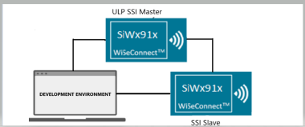
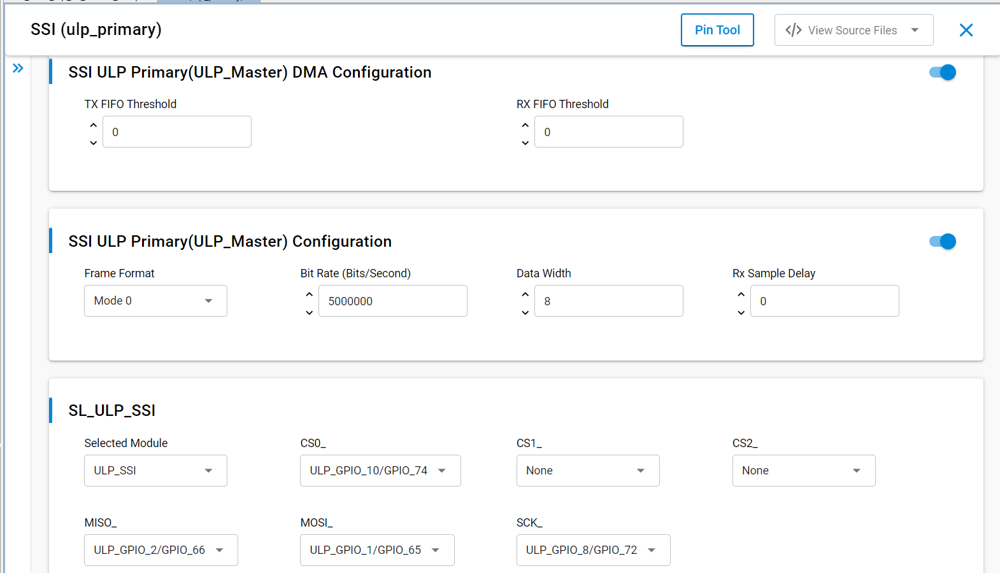
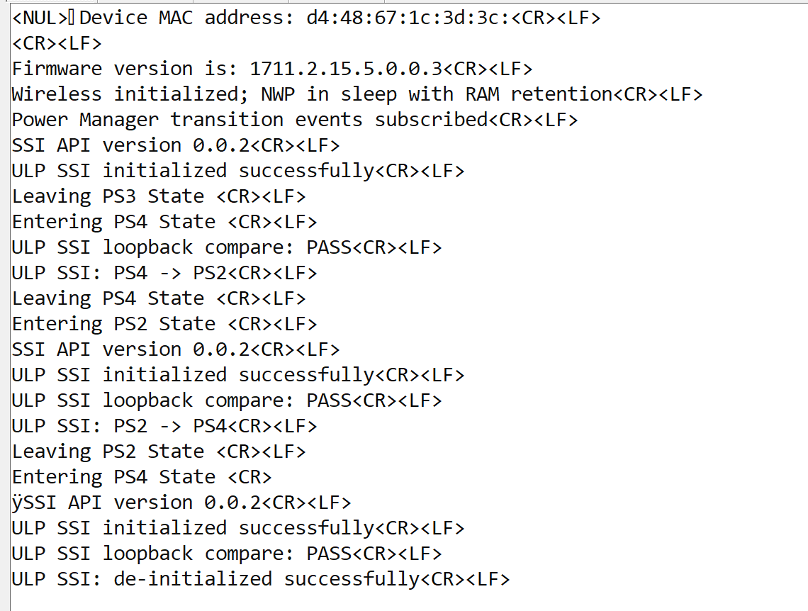
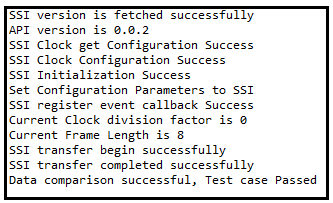

# SiWx91x Platform ULP SSI Master FreeRTOS

## Table of Contents

- [SiWx91x Platform ULP SSI Master FreeRTOS](#siwx91x-platform-ulp-ssi-master-freertos)
  - [Purpose/Scope](#purposescope)
  - [Overview](#overview)
  - [About Example Code](#about-example-code)
  - [FreeRTOS Architecture](#freertos-architecture)
  - [Prerequisites/Setup Requirements](#prerequisitessetup-requirements)
    - [Hardware Requirements](#hardware-requirements)
    - [Software Requirements](#software-requirements)
    - [Setup Diagram](#setup-diagram)
  - [Getting Started](#getting-started)
  - [Application Build Environment](#application-build-environment)
    - [Application Configuration Parameters](#application-configuration-parameters)
  - [Pin Configuration of the WPK\[BRD4002A\] Base Board, and with BRD4338A radio board](#pin-configuration-of-the-wpkbrd4002a-base-board-and-with-brd4338a-radio-board)
  - [Pin Configuration of the WPK\[BRD4002A\] Base Board, and with BRD4343A radio board](#pin-configuration-of-the-wpkbrd4002a-base-board-and-with-brd4343a-radio-board)
  - [Required configuration for BRD4343C](#required-configuration-for-brd4343c)
  - [Test the Application](#test-the-application)
  - [Troubleshooting](#troubleshooting)
  - [Resources](#resources)
  - [Report Bugs/Support](#report-bugssupport)

## Purpose/Scope

This application demonstrates **ULP SSI primary (master)** operation under **FreeRTOS**. 

This application can run in synchronous mode with full-duplex operation. Primary transmits data on MOSI pin and receives the same data on MISO pin.

This also supports send and receive data with any SSI slave.  Additionally, it also supports DMA and non-DMA transfer.

For half-duplex communication (that is, send and receive), a primary / secondary connection is required.

## Overview

- SSI is a synchronous, point-to-point, serial communication channel for digital data transmission.
- Synchronous data transmission is one in which the data is transmitted by synchronizing the transmission at the receiving and sending ends using a common clock signal.
- SSI is a synchronous four-wire interface consisting of two data pins (MOSI, MISO), a device select pin (CSN) and a gated clock pin(SCLK).
- With the two data pins, it allows for full-duplex operation with other SSI compatible devices.
- It supports full-duplex, single-bit SPI Primary mode.
- It supports 6 modes:
  - Mode 0: Clock Polarity is zero and Clock Phase is zero.
  - Mode 1: Clock Polarity is zero, Clock Phase is one.
  - Mode 2: Clock Polarity is one and Clock Phase is zero.
  - Mode 3: Clock Polarity is one and Clock Phase is one.
  - Mode-4: TEXAS_INSTRUMENTS SSI.
  - Mode-5: NATIONAL_SEMICONDUCTORS_MICROWIRE.
- The SPI clock is programmable to meet required baud rates.
- It can generates interrupts for different events, like transfer complete, data lost, and mode fault.
- It supports up to 32K bytes of read data from an SSI device in a single read operation.
- It has support for DMA (Dynamic Memory Access).
- The ULP_SSI_MST in the MCU ULP peripherals supports single-bit mode and can be connected to only one slave.

## About Example Code

**`ulp_ssi_freertos.c`** demonstrates **ULP SSI primary (master)** usage with optional DMA transfers, loopback verification, and power-state transitions.

- Reads the API version with [sl_si91x_ssi_get_version](https://docs.silabs.com/wiseconnect/latest/wiseconnect-api-reference-guide-si91x-peripherals/ssi#sl-si91x-ssi-get-version).
- Initializes the ULP master instance through [sl_si91x_ssi_init](https://docs.silabs.com/wiseconnect/latest/wiseconnect-api-reference-guide-si91x-peripherals/ssi#sl-si91x-ssi-init), then applies timing and frame settings with [sl_si91x_ssi_set_configuration](https://docs.silabs.com/wiseconnect/latest/wiseconnect-api-reference-guide-si91x-peripherals/ssi#sl-si91x-ssi-set-configuration).
- Registers [sl_si91x_ssi_register_event_callback](https://docs.silabs.com/wiseconnect/latest/wiseconnect-api-reference-guide-si91x-peripherals/ssi#sl-si91x-ssi-register-event-callback) so transfer completion can unblock the task via a semaphore.
- Each processing pass selects the slave with [sl_si91x_ssi_set_slave_number](https://docs.silabs.com/wiseconnect/latest/wiseconnect-api-reference-guide-si91x-peripherals/ssi#sl-si91x-ssi-set-slave-number); chip-select mapping follows `SL_SI91X_ACX_MODULE` (`SSI_SLAVE_1` vs `SSI_SLAVE_0`) in the source.
- Depending on `ULP_SSI_MASTER_TRANSFER`, `ULP_SSI_MASTER_SEND`, and `ULP_SSI_MASTER_RECEIVE` in **`ulp_ssi_freertos.h`** , the task calls [sl_si91x_ssi_transfer_data](https://docs.silabs.com/wiseconnect/latest/wiseconnect-api-reference-guide-si91x-peripherals/ssi#sl-si91x-ssi-transfer-data), [sl_si91x_ssi_send_data](https://docs.silabs.com/wiseconnect/latest/wiseconnect-api-reference-guide-si91x-peripherals/ssi#sl-si91x-ssi-send-data), and/or [sl_si91x_ssi_receive_data](https://docs.silabs.com/wiseconnect/latest/wiseconnect-api-reference-guide-si91x-peripherals/ssi#sl-si91x-ssi-receive-data) against `ULP_SSI_TX_BUF_MEMORY` / `ULP_SSI_RX_BUF_MEMORY`; buffer length comes from `ULP_SSI_BUFFER_SIZE`, and ULP SRAM placement uses `ULP_SSI_BANK_OFFSET`.
- When receive or full-duplex transfer runs, loopback compare masks data using [sl_si91x_ssi_get_frame_length](https://docs.silabs.com/wiseconnect/latest/wiseconnect-api-reference-guide-si91x-peripherals/ssi#sl-si91x-ssi-get-frame-length) together with `ULP_SSI_MAX_FRAME_BITS`.
- Power-state transitions tear down the driver with [sl_si91x_ssi_unregister_event_callback](https://docs.silabs.com/wiseconnect/latest/wiseconnect-api-reference-guide-si91x-peripherals/ssi#sl-si91x-ssi-unregister-event-callback) and [sl_si91x_ssi_deinit](https://docs.silabs.com/wiseconnect/latest/wiseconnect-api-reference-guide-si91x-peripherals/ssi#sl-si91x-ssi-deinit) before reinitializing.

## FreeRTOS Architecture

- On startup, `main.c` calls `sl_main_second_stage_init()` to initialize all SDK components, then calls `app_init()`, which invokes `ulp_ssi_master_example_init()`. That creates the `ulp_ssi` FreeRTOS thread with `osThreadNew()` (`8192`-byte stack, `osPriorityLow1`).
- `app_process_action()` is a no-op; all application logic runs in the dedicated task.
- The task allocates `ulp_ssi_xfer_sem`, runs `initialize_wireless()`, subscribes `ulp_ssi_pm_transition_callback` for PS transition logs, then `ulp_ssi_application_init()` configures the ULP master, selects the slave, registers `ulp_ssi_event_callback`, and loads ramp TX data into `ULP_SSI_TX_BUF_MEMORY`.
- The task loops on `ulp_ssi_current_mode`: under `SL_ULP_SSI_PROCESS_ACTION` it clears stale semaphore tokens, runs the enabled transfer/send/receive paths from `ulp_ssi_freertos.h`, blocks in `ulp_ssi_wait_transfer_done()` when needed, and may run `ulp_ssi_compare_loopback()`. `SL_ULP_SSI_POWER_STATE_TRANSITION` tears down and reinitializes SSI while switching PS4 ↔ PS2, then the flow idles in `SL_ULP_SSI_TRANSMISSION_COMPLETED`.
- `ulp_ssi_event_callback` releases `ulp_ssi_xfer_sem` only on `SSI_EVENT_TRANSFER_COMPLETE`.


## Prerequisites/Setup Requirements

### Hardware Requirements

- Windows PC
- Silicon Labs SiWx91x Evaluation Kit [[BRD4002](https://www.silabs.com/development-tools/wireless/wireless-pro-kit-mainboard?tab=overview) + [BRD4338A](https://www.silabs.com/development-tools/wireless/wi-fi/siwx917-rb4338a-wifi-6-bluetooth-le-soc-radio-board?tab=overview) / [BRD4342A](https://www.silabs.com/development-tools/wireless/wi-fi/siwx91x-rb4342a-wifi-6-bluetooth-le-soc-radio-board?tab=overview) / [BRD4343A](https://www.silabs.com/development-tools/wireless/wi-fi/siw917y-rb4343a-wi-fi-6-bluetooth-le-8mb-flash-radio-board-for-module?tab=overview) / [BRD4343C](https://www.silabs.com/development-tools/wireless/wi-fi/siw917y-rb4343c-wi-fi-6-bluetooth-le-8mb-flash-radio-board-for-module?tab=overview)]

### Software Requirements

- Simplicity Studio
- Serial console setup  
  - For Serial Console setup instructions, refer [here](https://docs.silabs.com/wiseconnect/latest/wiseconnect-developers-guide-developing-for-silabs-hosts/using-the-simplicity-studio-ide#console-input-and-output).

### Setup Diagram

> 

## Getting Started

Refer to the instructions [here](https://docs.silabs.com/wiseconnect/latest/wiseconnect-getting-started/) to:

- [Install Simplicity Studio](https://docs.silabs.com/wiseconnect/latest/wiseconnect-developers-guide-developing-for-silabs-hosts/using-the-simplicity-studio-ide#install-simplicity-studio)
- [Install WiSeConnect extension](https://docs.silabs.com/wiseconnect/latest/wiseconnect-developers-guide-developing-for-silabs-hosts/using-the-simplicity-studio-ide#install-the-wiseconnect-3-extension)
- [Connect your device to the computer](https://docs.silabs.com/wiseconnect/latest/wiseconnect-developers-guide-developing-for-silabs-hosts/using-the-simplicity-studio-ide#connect-siwx91x-to-computer)
- [Upgrade your connectivity firmware](https://docs.silabs.com/wiseconnect/latest/wiseconnect-developers-guide-developing-for-silabs-hosts/using-the-simplicity-studio-ide#update-siwx91x-connectivity-firmware)
- [Create a Studio project](https://docs.silabs.com/wiseconnect/latest/wiseconnect-developers-guide-developing-for-silabs-hosts/using-the-simplicity-studio-ide#create-a-project)

For details on the project folder structure, see the [WiSeConnect Examples](https://docs.silabs.com/wiseconnect/latest/wiseconnect-examples/#example-folder-structure) page.

## Application Build Environment

### Application Configuration Parameters

- Open **`siwx91x_platform_ulp_ssi_master_freertos.slcp`**, select **Software Component**, and search for **SSI**.

  

   - **SSI ULP Primary(ULP_Master) Configuration**
     - **Frame Format**: SSI Frame Format can be configured:
       - Mode 0: Clock Polarity is zero and Clock Phase is zero.
       - Mode 1: Clock Polarity is zero, Clock Phase is one.
       - Mode 2: Clock Polarity is one and Clock Phase is zero.
       - Mode 3: Clock Polarity is one and Clock Phase is one.
       - Mode 4: TEXAS_INSTRUMENTS SSI.
       - Mode5: NATIONAL_SEMICONDUCTORS_MICROWIRE.
     - **Bit Rate**: The speed of transfer is configurable. The configuration range is from 500Kbps to 5Mbps in low-power mode.
     - **Data Width**: The size of data packet. The configuration range from 4 to 16.
     - **Mode**: SSI mode/instance can be configurable; it can be configured ULP Primary.
     - **Rx Sample Delay**: Receive Data (rxd) Sample Delay. **Delays** sampling of the rxd input signal. Each value represents a single SSI clock delay on the sample of the rxd signal. **The** configuration range is from 0 to 63.
   - **SSI ULP Primary(ULP_Master) DMA Configuration**
     - **ULP Primary DMA**: DMA enable for ULP SSI Primary mode. It will interface with a DMA Controller using an optional set of DMA signals.
     - **Tx FIFO Threshold**: Transmit FIFO Threshold. Controls the level of entries (or below) at which the transmit FIFO controller triggers an interrupt. The configuration range from 0 to 15.
     - **Rx FIFO Threshold**: Receive FIFO Threshold. Controls the level of entries (or below) at which the receive FIFO controller triggers an interrupt. The configuration range from 0 to 15.
   - Configuration files are generated in **config folder**. If the values are not changed, the code will run on default UC values.
- Configure the compile-time mode macros in **`ulp_ssi_freertos.h`**:

    - `ULP_SSI_MASTER_TRANSFER`: Enables the full-duplex transfer API. When enabled, the ULP SSI master sends and receives data simultaneously. By default, it is set to `ENABLE`.

      ```c
      #define ULP_SSI_MASTER_TRANSFER ENABLE    // To use the transfer API
      ```

    - `ULP_SSI_MASTER_SEND`: Enables the half-duplex send API. When enabled, the ULP SSI master only sends data to the slave. By default, it is set to `DISABLE`.

      ```c
      #define ULP_SSI_MASTER_SEND  DISABLE   // To use the send API
      ```

    - `ULP_SSI_MASTER_RECEIVE`: Enables the half-duplex receive API. When enabled, the ULP SSI master only receives data from the slave. By default, it is set to `DISABLE`.

      ```c
      #define ULP_SSI_MASTER_RECEIVE  DISABLE   // To use the receive API
      ```

- By default, CS0 is selected in the pintool. To use a different chip select (CS), set `ulp_ssi_slave_number` in **`ulp_ssi_freertos.c`** after configuring the desired CS in the pintool.

    ```c
    // For CS0
    static uint32_t ulp_ssi_slave_number = SSI_SLAVE_0;
    // For CS1
    static uint32_t ulp_ssi_slave_number = SSI_SLAVE_1;
    // For CS2
    static uint32_t ulp_ssi_slave_number = SSI_SLAVE_2;
    ```

- **Transfer sizing and timing** in **`ulp_ssi_freertos.c`** (edit in source as needed):

  - `ULP_SSI_BUFFER_SIZE` — Length of data (in data-width units) for send/receive/transfer.
  - `ULP_SSI_BIT_WIDTH` — Data bits per SSI frame.
  - `ULP_SSI_BAUDRATE` — SSI bit rate (default 5 Mbps).
  - `ULP_SSI_RX_SAMPLE_DELAY` — RX sample delay in SSI clock cycles.
  - `ULP_SSI_MAX_FRAME_BITS` — Maximum frame width used when masking compare data.
  - `ULP_SSI_BANK_OFFSET`, `ULP_SSI_TX_BUF_MEMORY`, `ULP_SSI_RX_BUF_MEMORY` — ULP SRAM addresses for DMA aliases.
  - `FIVE_SECOND_DELAY_MS` — Delay used around power-state transitions in the example.

- To unregister a user event callback for a specific instance, use the API [sl_si91x_ssi_per_instance_unregister_event_callback](https://docs.silabs.com/wiseconnect/latest/wiseconnect-api-reference-guide-si91x-peripherals/ssi#sl-si91x-ssi-per-instance-unregister-event-callback). Alternatively, to unregister callbacks for all instances simultaneously, use the API [sl_si91x_ssi_unregister_event_callback](https://docs.silabs.com/wiseconnect/latest/wiseconnect-api-reference-guide-si91x-peripherals/ssi#sl-si91x-ssi-unregister-event-callback).

## Pin Configuration of the WPK[BRD4002A] Base Board, and with BRD4338A radio board

| GPIO pin           | Description              |
| ------------------ | ------------------------ |
| ULP_GPIO_8  [P15]  |RTE_SSI_ULP_MASTER_SCK_PIN|
| ULP_GPIO_10 [P17]  |RTE_SSI_ULP_MASTER_CS0_PIN|
| ULP_GPIO_1  [P16]  | ULP_SSI_MASTER_MOSI_PIN  |
| ULP_GPIO_2  [F10]  | ULP_SSI_MASTER_MISO_PIN  |

## Pin Configuration of the WPK[BRD4002A] Base Board, and with BRD4343A radio board

| GPIO pin           | Description              |
| ------------------ | ------------------------ |
| ULP_GPIO_8  [P15]  |RTE_SSI_ULP_MASTER_SCK_PIN|
| ULP_GPIO_4  [P17]  |RTE_SSI_ULP_MASTER_CS1_PIN|
| ULP_GPIO_1  [P16]  | ULP_SSI_MASTER_MOSI_PIN  |
| ULP_GPIO_2  [P37]  | ULP_SSI_MASTER_MISO_PIN  |

>**Note**: Make sure pin configuration is set in the `RTE_Device_917.h` file.(path: /$project/config/RTE_Device_917.h)

> **Note**: For recommended settings, please refer the [recommendations guide](https://docs.silabs.com/wiseconnect/latest/wiseconnect-developers-guide-prog-recommended-settings/).
## Required configuration for BRD4343C

For the **BRD4343C** pin table above (CS1 on **ULP_GPIO_4** [P17]), apply the updates below in **`config/RTE_Device_917.h`** (path: `/$project/config/RTE_Device_917.h`) and in **`ulp_ssi_freertos.c`** where indicated.

1. **Chip select 1 pin mux** — set CS1 to the ULP_GPIO_4 option
   ```c
   // From:
   #define RTE_SSI_ULP_MASTER_CS1_PORT_ID 1
   // To:
   #define RTE_SSI_ULP_MASTER_CS1_PORT_ID 0
   ```
2. **Enable multiple CSN lines** — use **CS1** only (disable CS0/CS2 for this wiring):
   ```c
   // From:
   #define ULP_SSI_CS0 1
   #define ULP_SSI_CS1 0
   #define ULP_SSI_CS2 0
   // To:
   #define ULP_SSI_CS0 0
   #define ULP_SSI_CS1 1
   #define ULP_SSI_CS2 0
   ```
3. **`ulp_ssi_freertos.c`**
   ```c
   static uint32_t ulp_ssi_slave_number = SSI_SLAVE_1;
   ```
## Test the Application

> **Note:** Use **`Log_script.py`** from the **SiWx91x Platform Logger** example (`examples/si91x_soc/service/sl_si91x_logger/`) to decode structured console log output. Run:
>
> `python Log_script.py --out firmware.out --descriptor SYSVIEW_CaptiveCore.txt --port COM5 --max-args 3`
>
> Replace **COM5** with the serial port your board uses on the host PC.


Refer to the instructions [here](https://docs.silabs.com/wiseconnect/latest/wiseconnect-getting-started/) to:

- Build **`siwx91x_platform_ulp_ssi_master_freertos`** in Studio.
- Flash, run and debug the application

Follow the steps below for successful execution of the application:

1. Connect ULP SSI Primary SCK, CS, MOSI, and MISO pins with the SSI Secondary device.
2. In the SSI slave example, enable Secondary DMA.
3. When the application runs, it transfers the data.
4. After the transfer is completed, it validates the data and prints "Test Case Passed" on the console.
5. Then again reset the SSI slave once application switches to ULP mode and observe "Test Case Passed" print on console.
6. After this, again reset SSI slave once application switches to HP mode back and observe "Test Case Passed" print on console.
7. If `ULP_SSI_MASTER_RECEIVE` or `ULP_SSI_MASTER_SEND` is enabled, SSI slave will receive and send data respectively.
8. After successful program execution, the prints in serial console looks as shown below.

   - ULP Primary output:

     

   - Secondary output:

     

> **Note:**
>
>- After Flashing ULP examples as M4 flash will be turned off, flash erase does not work.
>- For ULP SSI Primary Non-DMA configuration, Secondary device running with ssi_slave_example might not work as expected in all the power states. It requires an handshake mechanism or tuning Secondary device speed to achieve synchronization for large data packets. To verify this case, it is recommended to refer  to the sl_si91x_icm40627 example where a real slave device is demonstrated.
>
- To erase, the chip follow the below procedure:
  - **Press ISP and RESET button at same time and then release, now perform Chip erase through commander.**

> **Note:**
>
>- Interrupt handlers are implemented in the driver layer, and user callbacks are provided for custom code. If you want to write your own interrupt handler instead of using the default one, make the driver interrupt handler a weak handler. Then, copy the necessary code from the driver handler to your custom interrupt handler.
>
> **Note:**
>
>- This application is intended for demonstration purposes only to showcase the ULP peripheral functionality. It should not be used as a reference for real-time use case project development, because the wireless shutdown scenario is not supported in the current SDK.
>
>**Note:**
>
>- The required files for low-power state are moved to RAM; the rest of the application is executed from flash.
>- In this application, the power state changes between PS4 and PS2.

## Troubleshooting

- If the project does not build, ensure Simplicity Studio and the WiSeConnect extension are installed and the board is connected.
- If the device is not detected, reinstall the connectivity firmware and check USB drivers.

## Resources

- [WiSeConnect Getting Started](https://docs.silabs.com/wiseconnect/latest/wiseconnect-getting-started/)
- [WiSeConnect Examples](https://docs.silabs.com/wiseconnect/latest/wiseconnect-examples/)
- [SiWx91x SoC Documentation](https://docs.silabs.com/wiseconnect/latest/)

## Report Bugs/Support

For issues and support, use the Silicon Labs Community or your normal support channel.

