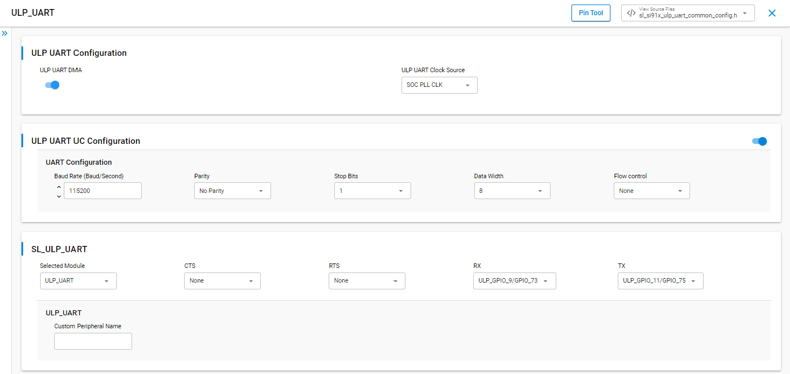
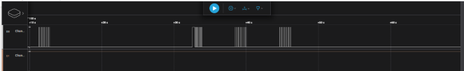

# SiWx91x Platform ULP UART FreeRTOS

## Table of Contents

- [SiWx91x Platform ULP UART FreeRTOS](#siwx91x-platform-ulp-uart-freertos)
  - [Purpose/Scope](#purposescope)
  - [Overview](#overview)
  - [About Example Code](#about-example-code)
  - [FreeRTOS Architecture](#freertos-architecture)
  - [Prerequisites/Setup Requirements](#prerequisitessetup-requirements)
    - [Hardware Requirements](#hardware-requirements)
    - [Software Requirements](#software-requirements)
    - [Setup Diagram](#setup-diagram)
  - [Getting Started](#getting-started)
  - [Application Build Environment](#application-build-environment)
    - [Application Configuration Parameters](#application-configuration-parameters)
  - [Pin Configuration](#pin-configuration)
  - [Test the Application](#test-the-application)
  - [Troubleshooting](#troubleshooting)
  - [Resources](#resources)
  - [Report Bugs/Support](#report-bugssupport)

## Purpose/Scope

This application demonstrates ULP UART operation under **FreeRTOS**, including:

- Asynchronous 8N1 ULP USART at 115200 baud with TX and RX over the ULP UART instance.
- Loopback-style data check: TX buffer is compared to RX; on a full match the firmware toggles a ULP GPIO.
- Power-state exercise: initial operation in **PS4**, transition to **PS2** with peripheral and retention setup, then return toward high performance and stop after de-init.


## Overview

- ULP UART provides wired asynchronous serial communication. This project uses the `ULPUART` instance with:
  - Tx and Rx enabled
  - Asynchronous mode
  - 8 Bit data transfer
  - Stop bits 1
  - No Parity
  - No Auto Flow control
  - Baud Rates - 115200
- HW flow control is currently not supported for ULP_UART.

## About Example Code

**`ulp_uart_freertos.c`** runs **ULP USART** (**`ULPUART`**) at **115200 8N1** async with TX/RX into fixed ULP SRAM aliases (**`TX_BUF_MEMORY`**, **`RX_BUF_MEMORY`**, **`ULP_BANK_OFFSET`**), optional sustained **`send`/`receive`/`compare`** when **`SLI_ULP_UART_USE_SEND`** and **`SLI_ULP_UART_USE_RECEIVE`** are enabled in **`ulp_uart_freertos.h`**, Wi‑Fi/NWP retention bring-up, and **PS4 ↔ PS2** with **`ulp_uart_teardown()`** / **`ulp_uart_application_init()`** around **`configuring_ps2_power_state()`**.

- **[sl_si91x_usart_init](https://docs.silabs.com/wiseconnect/latest/wiseconnect-api-reference-guide-si91x-peripherals/usart#sl-si91x-usart-init)** (**`ULPUART`**) plus **[sl_si91x_usart_set_configuration](https://docs.silabs.com/wiseconnect/latest/wiseconnect-api-reference-guide-si91x-peripherals/usart#sl-si91x-usart-set-configuration)** from **`s_usart_config`** (baud/mode fields above).
- **[sl_si91x_usart_multiple_instance_register_event_callback](https://docs.silabs.com/wiseconnect/latest/wiseconnect-api-reference-guide-si91x-peripherals/usart#sl-si91x-usart-multiple-instance-register-event-callback)** (**`ulp_uart_on_usart_event`**) releases **`ulp_uart_tx_sem`** / **`ulp_uart_rx_sem`** on **`SL_USART_EVENT_SEND_COMPLETE`** / **`SL_USART_EVENT_RECEIVE_COMPLETE`**.
- Loopback path fills **`ulp_uart_data_out`**, copies to **`TX_BUF_MEMORY`**, **`ulp_uart_xfer_sem_drain()`**, then **[sl_si91x_usart_send_data](https://docs.silabs.com/wiseconnect/latest/wiseconnect-api-reference-guide-si91x-peripherals/usart#sl-si91x-usart-send-data)** / **[sl_si91x_usart_receive_data](https://docs.silabs.com/wiseconnect/latest/wiseconnect-api-reference-guide-si91x-peripherals/usart#sl-si91x-usart-receive-data)** into **`RX_BUF_MEMORY`** when receive is enabled; **`ulp_uart_wait_tx_done`** / **`ulp_uart_wait_rx_done`** call **`osSemaphoreAcquire(..., osWaitForever)`** with a temporary **[sl_si91x_power_manager_add_ps_requirement](https://docs.silabs.com/wiseconnect/latest/wiseconnect-api-reference-guide-si91x-peripherals/power-manager#sl-si91x-power-manager-add-ps-requirement)** (**PS4**) when **`current_power_state`** is not **PS2** (mitigates tickless idle vs ULP USART DMA).
- **`ulp_uart_gpio_init_once`** configures **`ulp_gpio_toggle`** (**`ULP_GPIO_PORT`** / **`ULP_GPIO_TOGGLE`**) for **`compare_loop_back_data()`** success indication.
- **`ulp_uart_teardown()`** calls [sl_si91x_usart_multiple_instance_unregister_event_callback](https://docs.silabs.com/wiseconnect/latest/wiseconnect-api-reference-guide-si91x-peripherals/usart#sl-si91x-usart-multiple-instance-unregister-event-callback) (**`ULPUART`**) and **[sl_si91x_usart_deinit](https://docs.silabs.com/wiseconnect/latest/wiseconnect-api-reference-guide-si91x-peripherals/usart#sl-si91x-usart-deinit)** before PS moves; after PS changes always call **`sl_si91x_usart_set_configuration`** again from **`ulp_uart_application_init()`** so baud/dividers match the new clock domain.
- Key sizing macros: **`ULP_UART_BUFFER_SIZE`**, **`ULP_UART_XFER_WAIT_MS`**, **`MINIMUM_COUNT_VALUE`**, **`MAXIMUM_COUNT_VALUE`**, **`FIVE_SECOND_DELAY_MS`**, **`ULP_UART_POST_DELAY_MS`**.

## FreeRTOS Architecture

- On startup, `main.c` calls `sl_main_second_stage_init()`, then `app_init()` invokes **`ulp_uart_example_init()`**, which creates **`ulp_uart`** (`osThreadNew()`, **`10240`** stack, `osPriorityLow1`).
- `app_process_action()` is unused.
- Thread startup creates TX/RX binary semaphores, **`initialize_wireless()`**, **`sl_si91x_power_manager_subscribe_ps_transition_event`** (**`ulp_uart_pm_transition_callback`**, **`PS_EVENT_MASK`**), **`ulp_uart_gpio_init_once()`**, then **`ulp_uart_application_init()`**.
- **`SL_ULP_UART_PROCESS_ACTION`** drains semaphores, sends (and optionally receives/compares), looping while **`ulp_uart_count`** is between **`MINIMUM_COUNT_VALUE`** and **`MAXIMUM_COUNT_VALUE`** when both directions are enabled; failures tear down and jump to **`SL_ULP_UART_TRANSMISSION_COMPLETED`**.
- **`SL_ULP_UART_POWER_STATE_TRANSITION`**: from **PS4**, **`ulp_uart_teardown()`**, **`ps2_pre_check`** polling, **`add_ps_requirement(PS2)`**, **`DEBUGINIT()`**, **`configuring_ps2_power_state()`**, **`sl_si91x_delay_ms(1000)`**, GPIO + UART re-init, **`current_power_state = PS2`**. From **PS2**, teardown, **`sl_si91x_delay_ms(1000)`**, **`add_ps_requirement(PS4)`**, **`DEBUGINIT()`**, re-init, **`LAST_ENUM_POWER_STATE`**. Final **`else`** leg teardown → **`SL_ULP_UART_TRANSMISSION_COMPLETED`** (`osDelay` idle).


## Prerequisites/Setup Requirements

### Hardware Requirements

- Windows PC
- Silicon Labs SiWx917 Evaluation Kit [[BRD4002](https://www.silabs.com/development-tools/wireless/wireless-pro-kit-mainboard?tab=overview) + [BRD4338A](https://www.silabs.com/development-tools/wireless/wi-fi/siwx917-rb4338a-wifi-6-bluetooth-le-soc-radio-board?tab=overview) / [BRD4342A](https://www.silabs.com/development-tools/wireless/wi-fi/siwx91x-rb4342a-wifi-6-bluetooth-le-soc-radio-board?tab=overview) / [BRD4343A](https://www.silabs.com/development-tools/wireless/wi-fi/siw917y-rb4343a-wi-fi-6-bluetooth-le-8mb-flash-radio-board-for-module?tab=overview) / [BRD4343C](https://www.silabs.com/development-tools/wireless/wi-fi/siw917y-rb4343c-wi-fi-6-bluetooth-le-8mb-flash-radio-board-for-module?tab=overview)]
- SiWx917 AC1 Module Explorer Kit [BRD2708A](https://www.silabs.com/development-tools/wireless/wi-fi/siw917y-ek2708a-explorer-kit)

### Software Requirements

- Simplicity Studio
- Serial console setup  
  - For Serial Console setup instructions, refer [here](https://docs.silabs.com/wiseconnect/latest/wiseconnect-developers-guide-developing-for-silabs-hosts/using-the-simplicity-studio-ide#console-input-and-output).

### Setup Diagram


## Getting Started

Refer to the instructions [here](https://docs.silabs.com/wiseconnect/latest/wiseconnect-getting-started/) to:

- [Install Simplicity Studio](https://docs.silabs.com/wiseconnect/latest/wiseconnect-developers-guide-developing-for-silabs-hosts/using-the-simplicity-studio-ide#install-simplicity-studio)
- [Install WiSeConnect extension](https://docs.silabs.com/wiseconnect/latest/wiseconnect-developers-guide-developing-for-silabs-hosts/using-the-simplicity-studio-ide#install-the-wiseconnect-3-extension)
- [Connect your device to the computer](https://docs.silabs.com/wiseconnect/latest/wiseconnect-developers-guide-developing-for-silabs-hosts/using-the-simplicity-studio-ide#connect-siwx91x-to-computer)
- [Upgrade your connectivity firmware](https://docs.silabs.com/wiseconnect/latest/wiseconnect-developers-guide-developing-for-silabs-hosts/using-the-simplicity-studio-ide#update-siwx91x-connectivity-firmware)
- [Create a Studio project](https://docs.silabs.com/wiseconnect/latest/wiseconnect-developers-guide-developing-for-silabs-hosts/using-the-simplicity-studio-ide#create-a-project)

For details on the project folder structure, see the [WiSeConnect Examples](https://docs.silabs.com/wiseconnect/latest/wiseconnect-examples/#example-folder-structure) page.

## Application Build Environment

### Application Configuration Parameters

- Enable **ULP UART** mode in the Software Component configuration before building.
- Open **siwx91x_platform_ulp_uart_freertos.slcp**, select **Software Component**, and search for the USART/ULP UART instance used by the board.

  

- **Compile-time options** in **`ulp_uart_freertos.h`**:

  - `SLI_ULP_UART_USE_SEND` — When set to `ENABLE` together with `SLI_ULP_UART_USE_RECEIVE`, the TX/RX/compare sequence repeats until the internal count limit is reached (useful for observing sustained GPIO toggling).  
  - `SLI_ULP_UART_USE_RECEIVE` — When set to `ENABLE`, each iteration performs `receive_data` and compares RX to TX.

- **Parameters in** **`ulp_uart_freertos.c`** (edit in source if you need different sizing or timing):

  - `ULP_UART_BUFFER_SIZE` — Length of `ulp_uart_data_out[]` / `ulp_uart_data_in[]` and the ULP TX/RX aliases (`ULP_BANK_OFFSET`, `TX_BUF_MEMORY`, `RX_BUF_MEMORY`).
  - `s_usart_config` — ULP USART mode: default **115200** baud, 8N1, asynchronous, no hardware flow control (`ULPUART`).
  - `ULP_GPIO_PORT`, `ULP_GPIO_PIN`, `ULP_GPIO_TOGGLE`, `OUTPUT_VALUE` — ULP GPIO used for the compare-success toggle and related setup.
  - `FIVE_SECOND_DELAY_MS`, `ULP_UART_POST_DELAY_MS` — Delays around power-state transitions and re-initialization.
  - `ULP_UART_XFER_WAIT_MS` — Maximum wall time (converted to RTOS ticks) when waiting on TX/RX completion semaphores.
  - `MINIMUM_COUNT_VALUE`, `MAXIMUM_COUNT_VALUE` — Bounds on the repeated send/receive/compare loop when both directions are enabled.

- Keep **ULP_GPIO_9** reserved for VCOM RX with the default board wiring; use non-VCOM pins for any extra loopback wiring.
- For continuous TX/RX/compare (sustained GPIO toggling), set both `SLI_ULP_UART_USE_SEND` and `SLI_ULP_UART_USE_RECEIVE` to `ENABLE` in **`ulp_uart_freertos.h`**.
- Wire loopback per the pin table so TX/RX can loop data; observe **`ULP_GPIO_TOGGLE`** (default ULP_GPIO_8) on a **logic analyzer** when compares succeed.

## Pin Configuration

|     SiWx91xM       |      SiWx91xY     | Description |
| ------------------ | ----------------- | ----------- |
| ULP_GPIO_11  [F6]  | ULP_GPIO_11 [F6]  | TX (VCOM)   |
| ULP_GPIO_9   [F7]  | ULP_GPIO_9  [F7]  | RX (VCOM)   |
| ULP_GPIO_8   [P15] | ULP_GPIO_8  [P15] | GPIO_Toggle |

> **Note**: For recommended settings, please refer the [recommendations guide](https://docs.silabs.com/wiseconnect/latest/wiseconnect-developers-guide-prog-recommended-settings/).

## Test the Application

> **Note:** Use **`Log_script.py`** from the **SiWx91x Platform Logger** example (`examples/si91x_soc/service/sl_si91x_logger/`) to decode structured console log output. Run:
>
> `python Log_script.py --out firmware.out --descriptor SYSVIEW_CaptiveCore.txt --port COM5 --max-args 3`
>
> Replace **COM5** with the serial port your board uses on the host PC.


Refer to the instructions [here](https://docs.silabs.com/wiseconnect/latest/wiseconnect-getting-started/) to:

- Build the SL ULP UART example in Studio.
- Flash, run and debug the application

Follow the steps below for successful execution of the application:

1. When the application runs, ULP_UART sends and receives data in full-duplex modes
2. When TX and RX data match, ULP_GPIO_8 should be toggled for the SiWx91x. Connect the logic analyzer to observe the toggle state.
3. Here the same pins which are used to send and receive the data are used for data transfer. As a result, you cannot observe prints. Instead, you can use GPIO toggling method as shown below.

   - When send is disabled:

   

   - when send enabled:

   

>**Note:**
>
>- The required files for low-power state are moved to RAM. The rest of the application is executed from flash.
>- In this application, the power state changes between PS4 and PS2.
>- After a PS4↔PS2 transition, call `sl_si91x_usart_set_configuration()` again with settings appropriate to the new clock domain; this example does that from `ulp_uart_application_init()` in **`ulp_uart_freertos.c`**.
>
>- CTS and RTS only work when not using the ROM UART driver.
>
> **Note:**
>
>- Interrupt handlers are implemented in the driver layer, and user callbacks are provided for custom code. If you want to write your own interrupt handler instead of using the default one, make the driver interrupt handler a weak handler. Then, copy the necessary code from the driver handler to your custom interrupt handler.
>
>- To configure the SoC GPIO as ULP GPIO follow below code snippets, In below code snippet shown demonstrates configuring SOC_GPIO_8 and SOC_GPIO_9 as ulp_gpio_2 and ulp_gpio_3 to use as ulp_uart rx and tx pins respectively
>- This gpio should configure as ulp_gpio's only when ulp_uart functioning in  PS4 and PS3 state.

**GPIO 8 as ULP_UART_RX:**

```c
  // Enable PAD selection GPIO HP instance
  // sl_si91x_gpio_enable_pad_selection(gpio_padnum)
  sl_si91x_gpio_enable_pad_selection(3);
  // Set the pin mode
  // sl_gpio_set_pin_mode(port, pin, mode, output_value)
  sl_gpio_set_pin_mode(0,8,9,1);
  // Enable PAD receiver for gpio 8
  // sl_si91x_gpio_enable_pad_receiver(gpio_num);
  sl_si91x_gpio_enable_pad_receiver(8);
  // Set the pin mode
  // sl_gpio_set_pin_mode(port, pin, mode, output_value)
  sl_gpio_set_pin_mode(4,2,0,1);
  // Sets ulp soc gpio mode
  // sl_si91x_gpio_ulp_soc_mode(ulp_gpio_num,mode)
  sl_si91x_gpio_ulp_soc_mode(2,3);
  ```

**GPIO 9 as ULP_UART_TX:**

```c
  // Enable PAD selection GPIO HP instance
  // sl_si91x_gpio_enable_pad_selection(gpio_padnum)
  sl_si91x_gpio_enable_pad_selection(4);
  // Set the pin mode
  // sl_gpio_set_pin_mode(port, pin, mode, output_value)
  sl_gpio_set_pin_mode(0,9,9,1);
  // Enable PAD receiver for gpio 9
  // sl_si91x_gpio_enable_pad_receiver(gpio_num);
  sl_si91x_gpio_enable_pad_receiver(9);
  // Set the pin mode
  // sl_gpio_set_pin_mode(port, pin, mode, output_value)
  sl_gpio_set_pin_mode(4,3,0,1);
  // Sets ulp soc gpio mode
  // sl_si91x_gpio_ulp_soc_mode(ulp_gpio_num,mode)
  sl_si91x_gpio_ulp_soc_mode(3,3);
  ```

> **Note:**
> Header connection pin references mentioned here are all specific to BRD4338A. If user runs this application on a different board, it is recommended to refer the board specific schematic for GPIO-Header connection pin mapping.
>
> **Note:**
>
>- This application is intended for demonstration purposes only to showcase the ULP peripheral functionality. It should not be used as a reference for real-time use case project development, because the wireless shutdown scenario is not supported in the current SDK.
>- On the SiWx91x device, only 4KB of ULP RAM is available for application use. In this example, both the TX (transmit) and RX (receive) data buffers must be placed in ULP memory. Specifically, 2KB of ULP RAM is allocated for TX and 2KB for RX, enabling up to 2KB of data to be transmitted and received per operation.

## Troubleshooting

- If the project does not build, ensure Simplicity Studio and the WiSeConnect extension are installed and the board is connected.
- If the device is not detected, reinstall the connectivity firmware and check USB drivers.

## Resources

- [WiSeConnect Getting Started](https://docs.silabs.com/wiseconnect/latest/wiseconnect-getting-started/)
- [WiSeConnect Examples](https://docs.silabs.com/wiseconnect/latest/wiseconnect-examples/)
- [SiWx91x SoC Documentation](https://docs.silabs.com/wiseconnect/latest/)

## Report Bugs/Support

For issues and support, use the Silicon Labs Community or your normal support channel.


