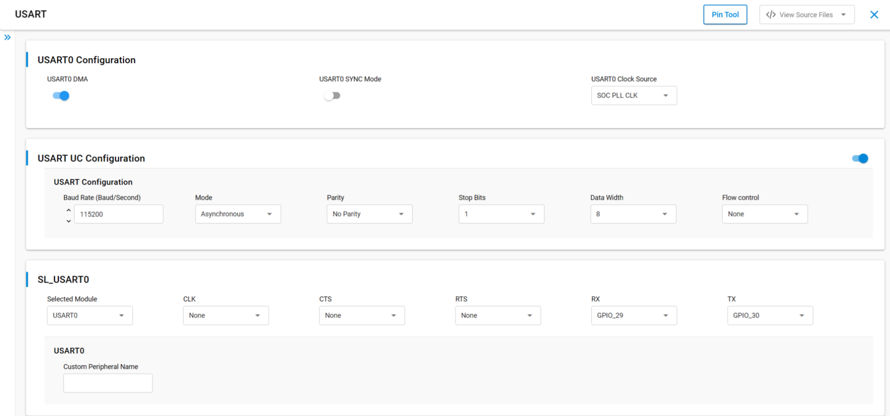
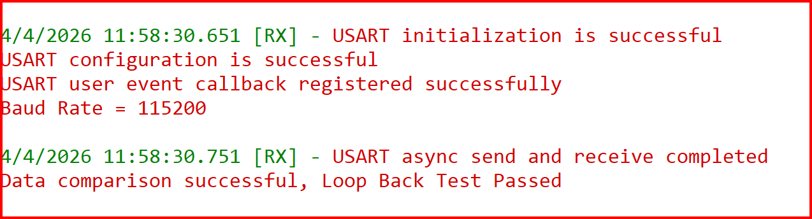

# SiWx91x Platform USART Asynchronous FreeRTOS

## Table of Contents

- [SiWx91x Platform USART Asynchronous FreeRTOS](#platform-siwx91x-usart-asynchronous-freertos)
  - [Purpose/Scope](#purposescope)
  - [Overview](#overview)
  - [About Example Code](#about-example-code)
    - [FreeRTOS Architecture](#freertos-architecture)
  - [Prerequisites/Setup Requirements](#prerequisitessetup-requirements)
    - [Hardware Requirements](#hardware-requirements)
    - [Software Requirements](#software-requirements)
    - [Setup Diagram](#setup-diagram)
  - [Getting Started](#getting-started)
  - [Application Build Environment](#application-build-environment)
  - [Pin Configuration](#pin-configuration)
  - [Flow Control Configuration](#flow-control-configuration)
  - [Test the Application](#test-the-application)
    - [Expected Output](#expected-output)
  - [Configuring Higher Clock](#configuring-higher-clock)
  - [Troubleshooting](#troubleshooting)
  - [Resources](#resources)
  - [Report Bugs / Support](#report-bugs--support)

## Purpose/Scope

This application demonstrates how to configure the Universal Synchronous Asynchronous Receiver-Transmitter (USART) in Asynchronous mode, running as a dedicated FreeRTOS task using CMSIS-RTOS2 APIs. It sends data over USART to an external serial terminal and waits for the user to send the data back for loopback verification.

## Overview

- USART is used in communication through wired medium in both Synchronous and Asynchronous fashion. It enables the device to communicate using serial protocols.
- This application is configured with the following settings:
  - TX and RX enabled
  - Asynchronous mode
  - 8-bit data transfer
  - Stop bits: 1
  - No Parity
  - No Auto Flow control
  - Baud Rate: 115200

## About Example Code

The source file for this example is `usart_async_freertos.c`.

This example demonstrates USART asynchronous data transfer using a loopback test, running inside a dedicated FreeRTOS task with event-flag-based synchronization.

- The USART peripheral (USART0) is initialized using [sl_si91x_usart_init](https://docs.silabs.com/wiseconnect/latest/wiseconnect-api-reference-guide-si91x-peripherals/usart#sl-si91x-usart-init) with clock and DMA configurations.

  > **Note:** If the UART/USART instance is already selected for debug output logs, initialization will return `SL_STATUS_NOT_AVAILABLE`.

- After initialization, USART is configured with the default UC settings (baud rate, data bits, parity, etc.) using [sl_si91x_usart_set_configuration](https://docs.silabs.com/wiseconnect/latest/wiseconnect-api-reference-guide-si91x-peripherals/usart#sl-si91x-usart-set-configuration).
- An event callback is registered using [sl_si91x_usart_multiple_instance_register_event_callback](https://docs.silabs.com/wiseconnect/latest/wiseconnect-api-reference-guide-si91x-peripherals/usart#sl-si91x-usart-multiple-instance-register-event-callback). The driver invokes it from the interrupt path; it sets event flags to wake the task (CMSIS-RTOS2 uses ISR-safe APIs when appropriate).
- A single event flags object (`usart_event_flags`) is created before USART init (so the ISR callback never runs with an invalid handle) with two flag bits: `USART_SEND_COMPLETE_FLAG` and `USART_RECEIVE_COMPLETE_FLAG`.
- The TX buffer is filled with a test pattern (1024 bytes: `0x01` through `0x00`, wrapping at 256).
- The task runs once: clears the RX buffer, starts async send then immediately starts async receive so TX and RX overlap (required for loopback—waiting for send-complete before receive can overflow the RX path). It then waits until both `USART_SEND_COMPLETE_FLAG` and `USART_RECEIVE_COMPLETE_FLAG` are set, compares buffers, then calls `osThreadExit()`.
- If any API call fails, the task prints an error via `DEBUGOUT` and calls `osThreadExit()` to terminate.

### FreeRTOS Architecture

- On startup, `main.c` calls `sl_main_second_stage_init()` to initialize all SDK components, then calls `app_init()` which invokes `usart_async_example_init()`. This function creates the `usart_async_task` FreeRTOS thread using `osThreadNew()`.
- The `app_process_action()` function is a no-op since all application logic runs inside the dedicated task.
- The FreeRTOS version does a single send/receive/compare pass then `osThreadExit()`.

## Prerequisites/Setup Requirements

### Hardware Requirements

- Windows PC
- Silicon Labs SiWx917 Evaluation Kit [[BRD4002](https://www.silabs.com/development-tools/wireless/wireless-pro-kit-mainboard?tab=overview) + [BRD4338A](https://www.silabs.com/development-tools/wireless/wi-fi/siwx917-rb4338a-wifi-6-bluetooth-le-soc-radio-board?tab=overview) / [BRD4342A](https://www.silabs.com/development-tools/wireless/wi-fi/siwx91x-rb4342a-wifi-6-bluetooth-le-soc-radio-board?tab=overview) / [BRD4343A](https://www.silabs.com/development-tools/wireless/wi-fi/siw917y-rb4343a-wi-fi-6-bluetooth-le-8mb-flash-radio-board-for-module?tab=overview) / [BRD4343C](https://www.silabs.com/development-tools/wireless/wi-fi/siw917y-rb4343c-wi-fi-6-bluetooth-le-8mb-flash-radio-board-for-module?tab=overview)]
- SiWx917 AC1 Module Explorer Kit [BRD2708A](https://www.silabs.com/development-tools/wireless/wi-fi/siw917y-ek2708a-explorer-kit)
- USB-to-Serial TTL adapter cable (3.3V)

### Software Requirements

- Simplicity Studio
- Serial console setup
  - For serial console setup instructions, see the [Console Input and Output](https://docs.silabs.com/wiseconnect/latest/wiseconnect-developers-guide-developing-for-silabs-hosts/using-the-simplicity-studio-ide#console-input-and-output) section in the *WiSeConnect Developer's Guide*.
- A second serial terminal (e.g., Docklight, Tera Term, PuTTY) for the USB-to-TTL adapter

### Setup Diagram


## Getting Started

Refer to the instructions [here](https://docs.silabs.com/wiseconnect/latest/wiseconnect-getting-started/) to:

- [Install Simplicity Studio](https://docs.silabs.com/wiseconnect/latest/wiseconnect-developers-guide-developing-for-silabs-hosts/using-the-simplicity-studio-ide#install-simplicity-studio)
- [Install WiSeConnect extension](https://docs.silabs.com/wiseconnect/latest/wiseconnect-developers-guide-developing-for-silabs-hosts/using-the-simplicity-studio-ide#install-the-wiseconnect-3-extension)
- [Connect your device to the computer](https://docs.silabs.com/wiseconnect/latest/wiseconnect-developers-guide-developing-for-silabs-hosts/using-the-simplicity-studio-ide#connect-siwx91x-to-computer)
- [Upgrade your connectivity firmware](https://docs.silabs.com/wiseconnect/latest/wiseconnect-developers-guide-developing-for-silabs-hosts/using-the-simplicity-studio-ide#update-siwx91x-connectivity-firmware)
- [Create a Studio project](https://docs.silabs.com/wiseconnect/latest/wiseconnect-developers-guide-developing-for-silabs-hosts/using-the-simplicity-studio-ide#create-a-project)

For details on the project folder structure, see the [WiSeConnect Examples](https://docs.silabs.com/wiseconnect/latest/wiseconnect-examples/#example-folder-structure) page.

## Application Build Environment

**Configuration of USART at UC (Universal Configuration)**

- Configure UC from the slcp component.
- Open the `siwx91x_platform_usart_async_freertos.slcp` project file, select the **Software Component** tab, and search for **USART** in the search bar.
- You can use the configuration wizard to configure different parameters as required.

  

- By default in UC, USART0 clock source will be configured to `ULP REF CLK`, select `SOC PLL CLK`.

- Configure the following macros in [`usart_async_freertos.c`](https://github.com/SiliconLabs/wiseconnect/blob/v4.1.1-content-for-docs/examples/si91x_soc/peripheral/platform_siwx91x_usart_async_freertos/usart_async_freertos.c) if required:

- `USART_BUFFER_SIZE`: Defines the length (in bytes) of the buffer used to send and receive USART data. By default, it is set to 1024.

  ```c
  #define USART_BUFFER_SIZE     1024   // Data send and receive length
  ```

- `USART_BAUDRATE`: Specifies the USART baud rate used for transmission and reception. Supported range is 9600-7372800. By default, it is set to 115200.

  ```c
  #define USART_BAUDRATE        115200 // Baud rate <9600-7372800>
  ```

## Pin Configuration

This example uses **USART0** on the following pins. An external USB-to-Serial TTL adapter cable is required to connect these pins to a PC serial terminal.

| USART Pin      | GPIO    | WPK (BRD4002A) + BRD4338A | Explorer kit (BRD2708A) | UART-TTL Cable |
| -------------- | ------- | -------------------------- | ----------------------- | -------------- |
| USART0_TX_PIN  | GPIO_30 | P35                        | [RST]                   | RX pin         |
| USART0_RX_PIN  | GPIO_29 | P33                        | [AN]                    | TX pin         |


> **Note:** The debug console (DEBUGOUT) uses a separate VCOM/JLink CDC port over USB. USART0 data transfer uses GPIO_30/GPIO_29 and requires an external USB-to-TTL cable. You need **two serial terminals**: one for the debug console and one for the USART0 data port.

## Flow Control Configuration

- Set the `SL_USART_FLOW_CONTROL_TYPE` parameter to `SL_USART_FLOW_CONTROL_RTS_CTS` to enable USART flow control.
- Make sure the following two macros in `RTE_Device_917.h` (path: `/$project/config/RTE_Device_917.h`) are set to `1` to map RTS and CTS pins to WPK Main Board EXP header or breakout pins.

  ```c
  #define RTE_USART0_CTS_PORT_ID    1
  #define RTE_USART0_RTS_PORT_ID    1
  ```

| USART Pin      | GPIO    | WPK (BRD4002A) Breakout | Explorer kit (BRD2708A) |
| -------------- | ------- | ----------------------- | ----------------------- |
| USART0_CTS_PIN | GPIO_26 | P27                     | [MISO]                  |
| USART0_RTS_PIN | GPIO_28 | P31                     | [CS]                    |

## Test the Application

1. Connect the USB-to-TTL cable to the board:
   - Board GPIO_30 (TX) -> TTL cable **RX** pin
   - Board GPIO_29 (RX) -> TTL cable **TX** pin
   - Board GND -> TTL cable **GND**
2. Open **two serial terminals**:
   - **Terminal 1 (Debug console):** Connect to the VCOM/JLink CDC COM port at 115200 baud to see DEBUGOUT log messages.
   - **Terminal 2 (USART0 data port):** Connect to the USB-to-TTL adapter's COM port at 115200, 8N1, no flow control. Switch to **HEX mode** to view the raw data bytes.
3. Flash and run the application on the board.
4. On Terminal 2 (TTL), you should see 1024 bytes of data arrive from the board (`01 02 03 04 ... FE FF 00 01 ...`).
5. Send the same 1024 bytes back from Terminal 2 to the board. In Docklight, you can capture the received data and send it back as a send sequence.
6. Once the board receives all 1024 bytes, Terminal 1 (Debug console) will show the comparison result.

### Expected Output

**Debug console (VCOM/JLink CDC):**



> **Note:**
>
> - The board sends 1024 bytes first, then waits indefinitely for 1024 bytes to arrive on USART0 RX before proceeding.
> - The data sent by the board consists of non-printable bytes (0x01-0xFF, wrapping). Use HEX mode in your serial terminal to view them.
> - Add `usart_data_in` buffer to the watch window for checking received data during debugging.

## Configuring Higher Clock

- To achieve baud rates exceeding 2 million bps, you need to modify the clock source to INTF PLL CLK in the UC.

> **Note:**
>
> - Interrupt handlers are implemented in the driver layer, and user callbacks are provided for custom code. If you want to write your own interrupt handler instead of using the default one, make the driver interrupt handler a weak handler. Then, copy the necessary code from the driver handler to your custom interrupt handler.
> - By default, Request to Send (RTS) and Clear to Send (CTS) flow control signals are disabled in the UART driver UC, and their corresponding GPIO pins are not assigned in the Pintool. If you enable RTS/CTS in the Driver UC, you must manually configure and assign the appropriate GPIO pins in the Pintool to ensure proper hardware flow control functionality.

## Troubleshooting

- If the project does not build, ensure Simplicity Studio and the WiSeConnect extension are installed and the board is connected.
- If the device is not detected, reinstall the connectivity firmware and check USB drivers.

## Resources

- [WiSeConnect Getting Started](https://docs.silabs.com/wiseconnect/latest/wiseconnect-getting-started/)
- [WiSeConnect Examples](https://docs.silabs.com/wiseconnect/latest/wiseconnect-examples/)
- [Si91x SoC Documentation](https://docs.silabs.com/wiseconnect/latest/)

## Report Bugs / Support

For issues and support, use the Silicon Labs Community or your normal support channel.


