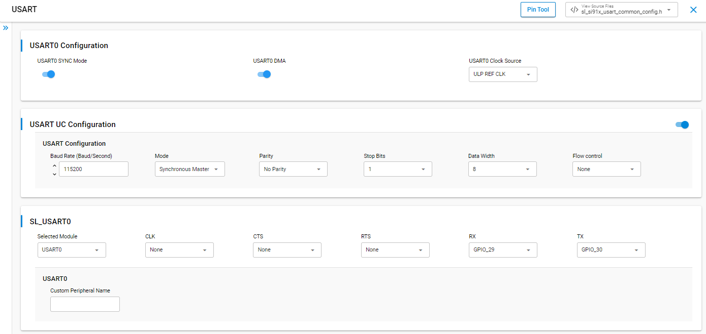
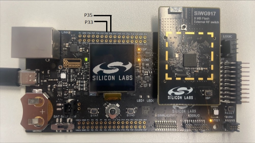
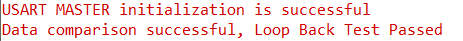

# SiWx91x Platform USART SYNCHRONOUS MASTER - FreeRTOS

## Table of Contents

- [SiWx91x Platform USART SYNCHRONOUS MASTER - FreeRTOS](#platform-siwx91x-usart-synchronous-master---freertos)
  - [Purpose/Scope](#purposescope)
  - [Overview](#overview)
  - [About Example Code](#about-example-code)
  - [Prerequisites/Setup Requirements](#prerequisitessetup-requirements)
    - [Hardware Requirements](#hardware-requirements)
    - [Software Requirements](#software-requirements)
    - [Setup Diagram](#setup-diagram)
  - [Getting Started](#getting-started)
  - [Application Build Environment](#application-build-environment)
    - [Configuration of USART at UC (Universal Configuration)](#configuration-of-usart-at-uc-universal-configuration)
    - [Pin Configuration of the WPK\[BRD4002A\] Base Board, and with BRD4338A radio board](#pin-configuration-of-the-wpkbrd4002a-base-board-and-with-brd4338a-radio-board)
    - [Pin Configuration of the WPK\[BRD4002A\] Base Board, and with BRD4343A radio board](#pin-configuration-of-the-wpkbrd4002a-base-board-and-with-brd4343a-radio-board)
    - [Pin Configuration of the AC1 Module Explorer Kit](#pin-configuration-of-the-ac1-module-explorer-kit)
    - [Flow Control Configuration](#flow-control-configuration)
  - [Test the Application](#test-the-application)
    - [Expected Output](#expected-output)
  - [Troubleshooting](#troubleshooting)
  - [Resources](#resources)
  - [Report Bugs / Support](#report-bugs--support)

## Purpose/Scope

This application demonstrates how to configure the Universal Synchronous/Asynchronous Receiver-Transmitter (USART) in synchronous mode as a master within a **FreeRTOS** environment. It sends a block of data to a synchronous slave and simultaneously receives the slave's response for loopback verification — all from a dedicated RTOS task.

## Overview

- USART is used in communication through wired medium in Synchronous fashion. It enables the device to communicate using serial protocols.
- This application is configured with following configs:
  - Tx and Rx enabled
  - 8 Bit data transfer
  - Synchronous Master
  - Stop bits 1
  - No Parity
  - No Auto Flow control
  - Baud Rates - 115200
- The example runs as a FreeRTOS task and uses CMSIS-RTOS2 semaphores to synchronize with the USART transfer-complete callback.

## About Example Code

- `usart_sync_master_freertos.c` — Demonstrates configuring the USART to send and receive data in synchronous master mode from a FreeRTOS task.
- On startup, `app_init()` calls `usart_sync_example_init()`, which creates the FreeRTOS task (`usart_sync_master_task`) using `osThreadNew()`.
- The task performs the following steps:
  1. **Initialization** — Calls `usart_sync_init_function()`, which returns `sl_status_t`. Inside it:
     - Initializes USART_0 via [`sl_si91x_usart_init()`](https://docs.silabs.com/wiseconnect/latest/wiseconnect-api-reference-guide-si91x-peripherals/usart#sl-si91x-usart-init).
     - Applies USART configuration via [`sl_si91x_usart_set_configuration()`](https://docs.silabs.com/wiseconnect/latest/wiseconnect-api-reference-guide-si91x-peripherals/usart#sl-si91x-usart-set-configuration).
     - Registers the event callback via [`sl_si91x_usart_multiple_instance_register_event_callback()`](https://docs.silabs.com/wiseconnect/latest/wiseconnect-api-reference-guide-si91x-peripherals/usart#sl-si91x-usart-multiple-instance-register-event-callback).
  2. **Semaphore creation** — Creates `usart_transfer_sem` (initial count 0) before starting any transfers so the callback can safely release it.
  3. **TX pattern and startup delay** — Fills `usart_data_out` with the master's test pattern `(i + 1)`, then waits `MASTER_STARTUP_DELAY` ms (default 5000) so the slave can finish booting and call `sl_si91x_usart_transfer_data()` before the master clocks data.
  4. **Single transfer** — Clears `usart_data_in`, calls [`sl_si91x_usart_transfer_data()`](https://docs.silabs.com/wiseconnect/latest/wiseconnect-api-reference-guide-si91x-peripherals/usart#sl-si91x-usart-transfer-data) for simultaneous TX and RX, blocks on `osSemaphoreAcquire()` until the ISR callback signals `SL_USART_EVENT_TRANSFER_COMPLETE`, validates the received data against the slave's expected TX pattern `(USART_BUFFER_SIZE - i)`, then calls `osThreadExit()`.
- **Cross-validation pattern** — The master sends `(i + 1)` and expects to receive the slave's pattern `(USART_BUFFER_SIZE - i)`. Because the patterns differ, the master cannot falsely pass by reading back its own TX data when no slave is connected.
- If any step fails, the task prints an error via `DEBUGOUT` and calls `osThreadExit()` to terminate.

> **Note:** If the UART/USART instance is already selected for debug output logs, initialization returns `SL_STATUS_NOT_AVAILABLE` (this is informational; the application continues using the existing instance).

### Configuration Macros

| Macro | Default | Purpose |
|-------|---------|---------|
| `NON_UC_DEFAULT_CONFIG` | `0` | When set to `1`, uses hard-coded default USART configuration instead of UC component settings. |
| `MASTER_STARTUP_DELAY` | `5000` | Milliseconds to wait after filling the TX pattern and before `sl_si91x_usart_transfer_data()`; allows the slave time to boot and start its transfer. Reduce if the slave is always ready first. |

Advanced users may edit the device configuration header `RTE_Device_917.h` directly for pin/peripheral routing; normally UC handles this automatically.

## Prerequisites/Setup Requirements

### Hardware Requirements

- Windows PC
- Silicon Labs SiWx917 Evaluation Kit [[BRD4002](https://www.silabs.com/development-tools/wireless/wireless-pro-kit-mainboard?tab=overview) + [BRD4338A](https://www.silabs.com/development-tools/wireless/wi-fi/siwx917-rb4338a-wifi-6-bluetooth-le-soc-radio-board?tab=overview) / [BRD4342A](https://www.silabs.com/development-tools/wireless/wi-fi/siwx91x-rb4342a-wifi-6-bluetooth-le-soc-radio-board?tab=overview) / [BRD4343A](https://www.silabs.com/development-tools/wireless/wi-fi/siw917y-rb4343a-wi-fi-6-bluetooth-le-8mb-flash-radio-board-for-module?tab=overview) / [BRD4343C](https://www.silabs.com/development-tools/wireless/wi-fi/siw917y-rb4343c-wi-fi-6-bluetooth-le-8mb-flash-radio-board-for-module?tab=overview)] - Master
- Silicon Labs SiWx917 Evaluation Kit [[BRD4002](https://www.silabs.com/development-tools/wireless/wireless-pro-kit-mainboard?tab=overview) + [BRD4338A](https://www.silabs.com/development-tools/wireless/wi-fi/siwx917-rb4338a-wifi-6-bluetooth-le-soc-radio-board?tab=overview) / [BRD4342A](https://www.silabs.com/development-tools/wireless/wi-fi/siwx91x-rb4342a-wifi-6-bluetooth-le-soc-radio-board?tab=overview) / [BRD4343A](https://www.silabs.com/development-tools/wireless/wi-fi/siw917y-rb4343a-wi-fi-6-bluetooth-le-8mb-flash-radio-board-for-module?tab=overview) / [BRD4343C](https://www.silabs.com/development-tools/wireless/wi-fi/siw917y-rb4343c-wi-fi-6-bluetooth-le-8mb-flash-radio-board-for-module?tab=overview)] - Slave
- SiWx917 AC1 Module Explorer Kit [BRD2708A](https://www.silabs.com/development-tools/wireless/wi-fi/siw917y-ek2708a-explorer-kit) - Master and Slave

### Software Requirements

- Simplicity Studio
- Serial console Setup
  - For Serial Console setup instructions, see the [Console Input and Output](https://docs.silabs.com/wiseconnect/latest/wiseconnect-developers-guide-developing-for-silabs-hosts/using-the-simplicity-studio-ide#console-input-and-output) section of the *WiSeConnect Developer's Guide*.

### Setup Diagram


## Getting Started

Refer to the instructions [here](https://docs.silabs.com/wiseconnect/latest/wiseconnect-getting-started/) to:

- [Install Simplicity Studio](https://docs.silabs.com/wiseconnect/latest/wiseconnect-developers-guide-developing-for-silabs-hosts/using-the-simplicity-studio-ide#install-simplicity-studio)
- [Install WiSeConnect extension](https://docs.silabs.com/wiseconnect/latest/wiseconnect-developers-guide-developing-for-silabs-hosts/using-the-simplicity-studio-ide#install-the-wiseconnect-3-extension)
- [Connect your device to the computer](https://docs.silabs.com/wiseconnect/latest/wiseconnect-developers-guide-developing-for-silabs-hosts/using-the-simplicity-studio-ide#connect-siwx91x-to-computer)
- [Upgrade your connectivity firmware](https://docs.silabs.com/wiseconnect/latest/wiseconnect-developers-guide-developing-for-silabs-hosts/using-the-simplicity-studio-ide#update-siwx91x-connectivity-firmware)
- [Create a Studio project](https://docs.silabs.com/wiseconnect/latest/wiseconnect-developers-guide-developing-for-silabs-hosts/using-the-simplicity-studio-ide#create-a-project)

For details on the project folder structure, see the [WiSeConnect Examples](https://docs.silabs.com/wiseconnect/latest/wiseconnect-examples/#example-folder-structure) page.

## Application Build Environment

### Configuration of USART at UC (Universal Configuration)

- Configure UC from the slcp component.
- Open the **siwx91x_platform_usart_sync_master_freertos.slcp** project file, select the **Software Component** tab, and search for **USART** in the search bar.
- You can use the configuration wizard to configure different parameters. The following configuration screen illustrates what the user can select as per their requirements.

  > 

- Enable `USART0 SYNC Mode` in the UC.

- Connect master (this example) and a board flashed with the slave example: master clock pin (GPIO_8 or GPIO_25 depending on board) to slave clock pin, master TX (GPIO_30) to slave RX, master RX (GPIO_29) to slave TX.

- Configure the following macros in [`usart_sync_master_freertos.c`](https://github.com/SiliconLabs/wiseconnect/blob/v4.1.1-content-for-docs/examples/si91x_soc/peripheral/platform_siwx91x_usart_sync_master_freertos/usart_sync_master_freertos.c) if required:

- `USART_BUFFER_SIZE`: Defines the length (in bytes) of the buffer used to send and receive USART data. By default, it is set to 1024.

  ```c
  #define USART_BUFFER_SIZE     1024   // Data send and receive length
  ```

- `USART_BAUDRATE`: Specifies the USART baud rate used for transmission and reception. Supported range is 9600-7372800. By default, it is set to 115200.

  ```c
  #define USART_BAUDRATE        115200 // Baud rate <9600-7372800>
  ```

- `MASTER_STARTUP_DELAY`: Delay (in milliseconds) that the master waits after boot before initiating the first transfer, giving the slave time to come up. By default, it is set to 5000.

  ```c
  #define MASTER_STARTUP_DELAY  5000   // ms — wait for slave before first transfer
  ```

### Pin Configuration of the WPK[BRD4002A] Base Board, and with BRD4338A radio board

  | USART PINS              | GPIO    | Breakout pin  |
  | ----------------------- | ------- | ------------- |
  | USART_MASTER_CLOCK_PIN  | GPIO_8  |     F8        |
  | USART_MASTER_TX_PIN     | GPIO_30 |     P35       |
  | USART_MASTER_RX_PIN     | GPIO_29 |     P33       |  

### Pin Configuration of the WPK[BRD4002A] Base Board, and with BRD4343A radio board

  | USART PINS              | GPIO    | Breakout pin  |
  | ----------------------- | ------- | ------------- |
  | USART_MASTER_CLOCK_PIN  | GPIO_8  |     F8        |
  | USART_MASTER_TX_PIN     | GPIO_30 |     P35       |
  | USART_MASTER_RX_PIN     | GPIO_29 |     P33       |  

### Pin Configuration of the WPK[BRD4002A] Base Board, and with BRD4342A radio board

  | USART PINS              | GPIO    | Breakout pin  |
  | ----------------------- | ------- | ------------- |
  | USART_MASTER_CLOCK_PIN  | GPIO_25 |     P25       |
  | USART_MASTER_TX_PIN     | GPIO_30 |     P35       |
  | USART_MASTER_RX_PIN     | GPIO_29 |     P33       | 
  


### Pin Configuration of the AC1 Module Explorer Kit

  | USART PINS              | GPIO    | Explorer kit Breakout pin  |
  | ----------------------- | ------- | ------------- |
  | USART_MASTER_CLOCK_PIN  | GPIO_25 |     [SCK]     |
  | USART_MASTER_TX_PIN     | GPIO_30 |     [RST]     |
  | USART_MASTER_RX_PIN     | GPIO_29 |     [AN]      |

### Flow Control Configuration

To enable hardware flow control (RTS/CTS):

1. Open `siwx91x_platform_usart_sync_master_freertos.slcp` → Software Components → USART.
2. Set the **Flow control** field to **RTS/CTS**.
3. Assign RTS and CTS pins either:

- Through the UC pin assignment widget (preferred), OR
- Manually by editing `RTE_Device_917.h` and locating the USART0 RTS/CTS section.

4. Use the following default mapping if your Pin Tool is unavailable:

  | Signal | GPIO  | WPK Breakout | AC1 Explorer |
  |--------|-------|--------------|--------------|
  | CTS    | GPIO_26 | P27 | [MISO] |
  | RTS    | GPIO_28 | P31 | [CS]   |

- If the Pin Tool is not working, UC changes plus manual verification in `RTE_Device_917.h` ensure proper hardware flow control routing.

## Test the Application

1. Wire clock, TX, and RX between the two boards as listed in the pin tables:
   - Master CLK → Slave CLK
   - Master TX (GPIO_30) → Slave RX (GPIO_29)
   - Master RX (GPIO_29) → Slave TX (GPIO_30)
   - GND ↔ GND
2. Flash `siwx91x_platform_usart_sync_slave_freertos` on the slave board **first** and reset it.
3. Flash `siwx91x_platform_usart_sync_master_freertos` on the master board and reset it.
4. Open a serial console (115200 baud) for each board.
5. After boot, the master task waits `MASTER_STARTUP_DELAY` (5 s by default), then performs a single 1024-byte full-duplex transfer and validates the received data against the slave's expected TX pattern before calling `osThreadExit()`.

### Expected Output

**Master console (VCOM/JLink CDC):**



## Configuring higher clock

- To achieve baud rates exceeding 2 million bps, modify the clock source to INTF PLL CLK or SoC PLL CLK in the UC.

> **Note**:
>
> - To monitor incoming data during debugging sessions, add the `usart_data_in` buffer to your watch window. This allows you to inspect received data in real time while stepping through the code.
> - Interrupt handlers are implemented in the driver layer, and user callbacks are provided for custom code. If you want to write your own interrupt handler instead of using the default one, make the driver interrupt handler a weak handler. Then, copy the necessary code from the driver handler to your custom interrupt handler.
> - By default, Request to Send (RTS) and Clear to Send (CTS) flow control signals are disabled in the UART driver UC, and their corresponding GPIO pins are not assigned in the Pintool. If you enable RTS/CTS in the Driver UC, you must manually configure and assign the appropriate GPIO pins in the Pintool to ensure proper hardware flow control functionality.

## Troubleshooting

- If the project does not build, ensure Simplicity Studio and the WiSeConnect extension are installed and the board is connected.
- If the device is not detected, reinstall the connectivity firmware and check USB drivers.

## Resources

- [WiSeConnect Getting Started](https://docs.silabs.com/wiseconnect/latest/wiseconnect-getting-started/)
- [WiSeConnect Examples](https://docs.silabs.com/wiseconnect/latest/wiseconnect-examples/)
- [Si91x SoC Documentation](https://docs.silabs.com/wiseconnect/latest/)

## Report Bugs / Support

For issues and support, use the Silicon Labs Community or your normal support channel.


