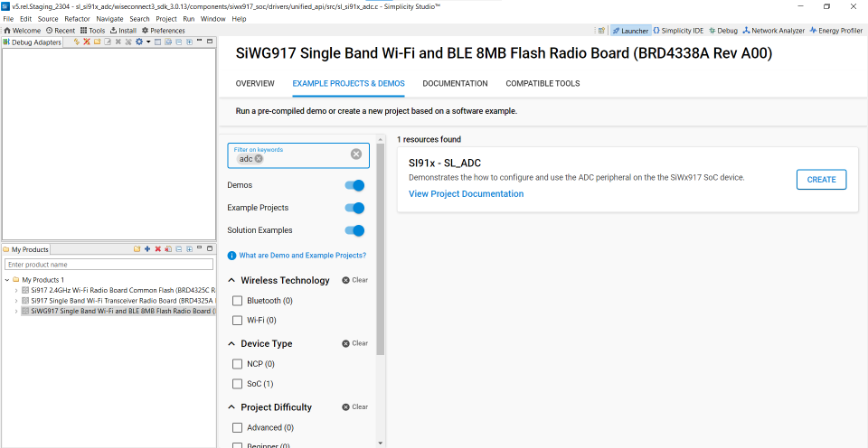

# ADC

## Introduction

- This application demonstrate the ADC peripheral converts analog input to 12 bit digital output.
- The AUXADC can take analog inputs in single ended or differential. The output is 12 bit digital which can be given out with or without noise averaging.
- The Aux VRef can be connected directly to Vbat (Aux LDO bypass mode) or to the Aux LDO output.
- ADC will work on two operation mode i.e. FIFO mode and STATIC mode.
- The ADC channel configure will take care of set the pin mux as analog mode and gpio.
- The example ADC sampling the data and converts its to equivalent input voltage based on operation mode.

## Overview

- The ADC Controller works on a ADC with a resolution of 12bits at 10Msps when ADC reference Voltage is greater than 2.8v or 5Msps when ADC reference Voltage is less than 2.8v.
- Sample application will be 12 bit ADC Output in 2's complement representation.
- There are two operating mode in AUXADC controller:
  - Static Mode Operation: ADC data input will be sampled and written to a register in this mode.
  - FIFO Mode Operation: ADC data input will be sampled and written to the ADC FIFO in this mode.
- There a dedicated ADC DMA to support 16 channel.
- DMA mode supports dual buffer cyclic mode to avoid loss of data when buffer is full. In dual buffer cyclic mode, if buffer 1 is full for particular channel, incoming sampled
  data is written into buffer 2 such that, samples from buffer 1 are read back by controller during this time. That’s why there are two start addresses, two buffer lengths and
  two valid signals for each channel.
- External event-based sampling support.
- Multi-channel mode, as the multiple channels are sensed, after sensing each channel, information related to “buffer length” etc. of that particular channel are rewritten
  in to the corresponding location of internal memory for the next use when same channel is sensed again.
- External triggers can be used in PS4 State to collect the sample from a pre-defined channel.

## Setting Up

- To use this application following Hardware, Software and the Project Setup is required

### Hardware Requirements  

- Windows PC
- Silicon Labs [Si917 Evaluation Kit WPK/WSTK + BRD4338A]

### Software Requirements

- Si91x SDK
- Embedded Development Environment
  - For Silicon Labs Si91x, use the latest version of Simplicity Studio (refer **"Download and Install Simplicity Studio"** section in **getting-started-with-siwx917-soc** guide at **release_package/docs/index.html**)

## Project Setup

- **Silicon Labs Si91x** refer **"Download SDKs"**, **"Add SDK to Simplicity Studio"**, **"Connect SiWx917"**, **"Open Example Project in Simplicity Studio"** section in **getting-started-with-siwx917-soc** guide at **release_package/docs/index.html** to work with Si91x and Simplicity Studio

### VCOM Setup

- The Serial Console tool's setup instructions are provided below..

## Loading Application on Simplicity Studio

1. With the product Si917 selected, navigate to the example projects by clicking on Example Projects & Demos
   in simplicity studio and click on to ADC Example application as shown below.

## Configuration and Steps for Execution

- Configure UC from the slcp component.
- Open **sl_si91x_adc.slcp** project file select **software component** tab and search for **ADC** in search bar.
- Using configuration wizard one can configure different parameters like:
  - **ADC Configuration**
  - Input Type: ADC input type can be configured, i.e. single ended and differential.
  - Sampling rate: we can set sampling rate of ADC, i.e. bits/second it should be minimum is 1bps and maximum is 10Mbps.
  - Sample length: set the length of ADC samples, i.e. number of ADC sample collected for operation, it should be minimum is 1 and maximum is 1023.

## Pin Configuration

- Here mentioned pin numbers for BRD4338a (B0 2.0v boards) if user want to use different radio board refer the pin numbers of same GPIO's to specific board schematic.
| CHANNEL | PIN TO ADCP | PIN TO ADCN |
| --- | --- | --- |
| 0 | ULP_GPIO_8 [P15] | ULP_GPIO_1 [P16] |
| 1 | ULP_GPIO_8 [P15] | ULP_GPIO_1 [P16] |
| 2 | ULP_GPIO_10 [P17] | ULP_GPIO_1 [P16] |
| 3 | ULP_GPIO_10 [P17] | ULP_GPIO_1 [P16] |
| 4 | ULP_GPIO_8 [P15] | ULP_GPIO_1 [P16] |
| 5 | ULP_GPIO_10 [P17] | ULP_GPIO_7 [EXP_HEADER-15] |
| 6 | GPIO_25 [P25] | GPIO_26 [P27] |
| 7 | GPIO_27 [P29] | GPIO_28 [P31] |
| 8 | GPIO_29 [P33] | GPIO_30 [P35] |
| 9 | GPIO_29 [P33] | GPIO_30 [P35] |
| 10 | ULP_GPIO_1 [P16] | GPIO_30 [P35] |
| 11 | ULP_GPIO_1 [P16] | GPIO_28 [P31] |
| 12 | ULP_GPIO_7 [EXP_HEADER-15] | GPIO_26 [P27] |
| 13 | GPIO_26 [P27] | ULP_GPIO_7 [EXP_HEADER-15] |
| 14 | GPIO_28 [P31] | GPIO_26 [P27] |
| 15 | GPIO_30 [P35] | ULP_GPIO_7 [EXP_HEADER-15] |

| OTHER INPUT SELECTION | VALUE TO ADCP | VALUE TO ADCN |
| OPAMP1_OUT | 20 | 10 |
| OPAMP2_OUT | 21 | 11 |
| OPAMP3_OUT | 22 | 12 |
| TEMP_SENSOR_OUT | 23 | |
| DAC_OUT | 24 | 13 |

## Build

1. Compile the application in Simplicity Studio using build icon

## Device Programming

- To program the device ,refer **"Burn M4 Binary"** section in **getting-started-with-siwx917-soc** guide at **release_package/docs/index.html** to work with Si91x and Simplicity Studio

## Executing the Application

While generating the project by default channel_0 insatnce will create for this channel_0 in single ended mode give the positive analog input to ULP_GPIO_8 and GND to ULP_GPIO_1 and
in differential mode give positive analog input to ULP_GPIO_8 and negative input to ULP_GPIO_1 for B0 board.

1. When the application runs, the ADC configure the settings as per the user and start ADC conversion.
2. After completion of conversion ADC input, it will print all the captured samples data in console by connecting vcom.

## Note

- For Multiple channel user want to create above 4 insatnces and need to configure them in UC and also in example application too.
- User can configure input selection GPIO in example application if default GPIO is work around
- ADC input selection rather than GPIO (like OPAMP, DAC and Temperature sensor) user can create their own instances and configure them as per other input selection.

## Expected Results

After running the application it will store the equivalent input voltage from ADC output
samples in 'adc_input_eqv_vltg' buffer.

- ADC output will print configured number of samples output voltage on UART console
- Apply the different voltages(1.8V to Vref) to ADC input and observe console outputs as per input.
- Provided input voltage and console output data should match.

## Formula Reference

- Use following formula to find equivalent input voltage of ADC
   **Differential Ended Mode:**
   vout = ((((float)ADC output/(float)4096) * Vref Voltage) - (Verf Voltage/2));
   **Exp**
   If Positive input to ADC given as 2.4V and Negative input given as 1.5 voltage then
   ADC output will be digital value which is equivalent to 0.9V

   **Single ended Mode:**
   vout = (((float)ADC output/(float)4096) * Vref Voltage);
   **Exp**
   If Positive input to ADC given as 2.4V then ADC output will be digital value which is equivalent to 2.4V
