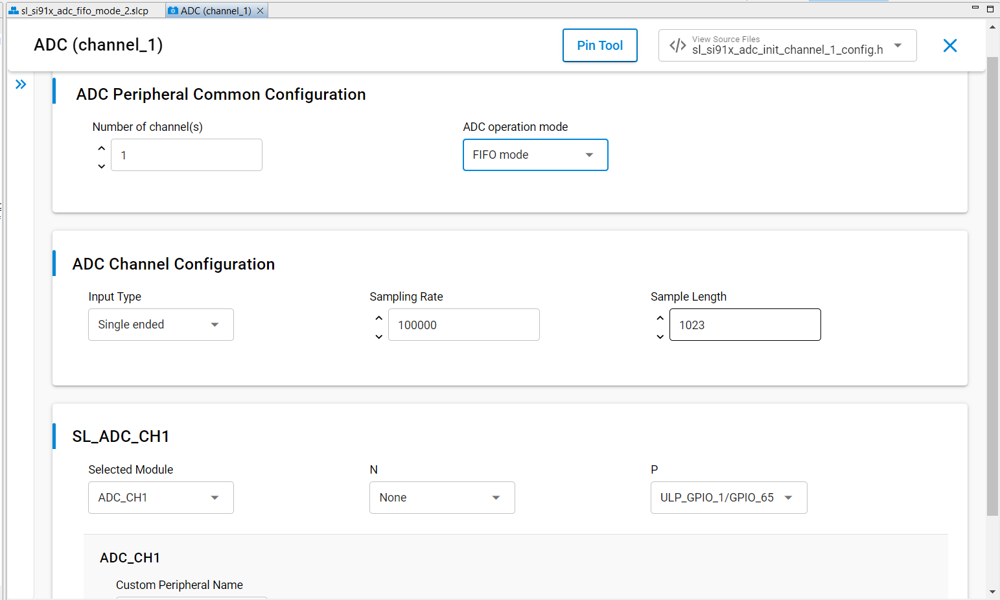
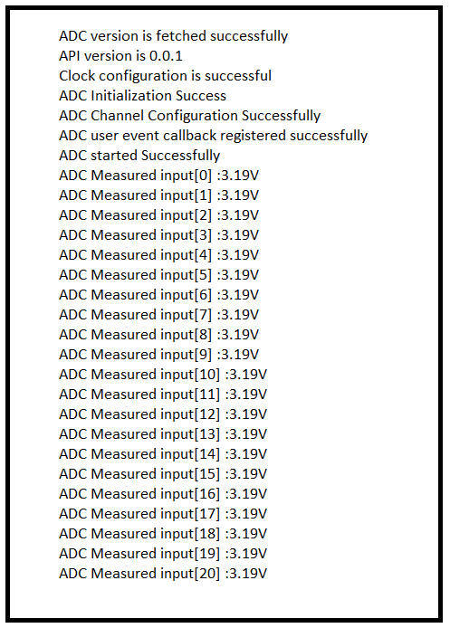

# SL ADC FIFO Mode

## Table of Contents

- [SL ADC FIFO Mode](#sl-adc-fifo-mode)
  - [Table of Contents](#table-of-contents)
  - [Purpose/Scope](#purposescope)
  - [Overview](#overview)
  - [About Example Code](#about-example-code)
  - [Prerequisites/Setup Requirements](#prerequisitessetup-requirements)
    - [Hardware Requirements](#hardware-requirements)
    - [Software Requirements](#software-requirements)
    - [Setup Diagram](#setup-diagram)
  - [Getting Started](#getting-started)
  - [Application Build Environment](#application-build-environment)
    - [Application Configuration Parameters](#application-configuration-parameters)
    - [Pin Configuration](#pin-configuration)
      - [Pin Configuration of the WPK\[BRD4002A\] Base Board, and with radio board](#pin-configuration-of-the-wpkbrd4002a-base-board-and-with-radio-board)
      - [Pin Configuration of the AC1 Module Explorer Kit](#pin-configuration-of-the-ac1-module-explorer-kit)
  - [Test the Application](#test-the-application)

## Purpose/Scope

This application demonstrates the ADC peripheral, including:

- Conversion of analog input to 12-bit digital output.
- Sampling the data.
- Converting data into equivalent input voltage based on operation mode.

## Overview

- The ADC Controller works on an ADC with a resolution of 12bits at 10Msps when ADC reference Voltage is greater than 2.8v or 5Msps when ADC reference Voltage is less than 2.8v.
- Sample application will be 12 bit ADC Output in 2's complement representation.
- There are two operating mode in AUX ADC controller:
  - Static Mode Operation: ADC data input will be sampled and written to a register in this mode.
  - FIFO Mode Operation: ADC data input will be sampled and written to the ADC FIFO in this mode.
- There is a dedicated ADC DMA to support 16 channels.
- DMA mode supports dual buffer cyclic mode to avoid loss of data when the buffer is full. In dual buffer cyclic mode, if buffer 1 is full for particular channel, incoming sampled data is written into buffer 2 such that, samples from buffer 1 are read back by controller during this time. That is why there are two start addresses, two buffer lengths and two valid signals for each channel.
- The AUX ADC can take analog inputs in single ended or differential. The output is 12-bit digital which can be given out with (or) without noise averaging.
- The Aux VRef can be connected directly to Vbat (Aux LDO bypass mode) or to the Aux LDO output.

## About Example Code

- This example demonstrates ADC in FIFO mode of operation. It reads the sampled data from specific channel buffer of ADC and converts it into equivalent input voltage.
- Various parameters like Number of Channel, ADC operation mode, Input Type, Sampling Rate and Sample Length can be configured using UC.
- The [`sl_si91x_adc_common_config.h`](https://github.com/SiliconLabs/wiseconnect/blob/master/components/device/silabs/si91x/mcu/drivers/unified_api/config/sl_si91x_adc_common_config.h) file contains the common configurations for ADC, and [`sl_si91x_adc_init_inst_config.h`](https://github.com/SiliconLabs/wiseconnect/blob/master/components/device/silabs/si91x/mcu/drivers/unified_api/config/sl_si91x_adc_init_inst_config.h) contains channel instance configuration.
- This example is working on ADC FIFO mode and it samples the data using DMA.
- Firmware version of API is fetched using [sl_si91x_adc_get_version](https://docs.silabs.com/wiseconnect/latest/wiseconnect-api-reference-guide-si91x-peripherals/adc#sl-si91x-adc-get-version) which includes release version, major version and minor version [sl_adc_version_t](https://docs.silabs.com/wiseconnect/latest/wiseconnect-api-reference-guide-si91x-peripherals/adc#sl-adc-version-t).
- ADC initialization should call [sl_si91x_adc_init](https://docs.silabs.com/wiseconnect/latest/wiseconnect-api-reference-guide-si91x-peripherals/adc#sl-si91x-adc-init) API and passing parameters [sl_adc_channel_config_t](https://docs.silabs.com/wiseconnect/latest/wiseconnect-api-reference-guide-si91x-peripherals/adc#sl-adc-channel-config-t), [sl_adc_config_t](https://docs.silabs.com/wiseconnect/latest/wiseconnect-api-reference-guide-si91x-peripherals/adc#sl-adc-config-t) and reference voltage value.
- All the necessary parameters are configured using [sl_si91x_adc_set_channel_configuration](https://docs.silabs.com/wiseconnect/latest/wiseconnect-api-reference-guide-si91x-peripherals/adc#sl-si91x-adc-set-channel-configuration) API. It expects a structure with required parameters [sl_adc_channel_config_t](https://docs.silabs.com/wiseconnect/latest/wiseconnect-api-reference-guide-si91x-peripherals/adc#sl-adc-channel-config-t) and [sl_adc_config_t](https://docs.silabs.com/wiseconnect/latest/wiseconnect-api-reference-guide-si91x-peripherals/adc#sl-adc-config-t).
- After configuration, a callback register API is called to register the callback at the time of events [sl_si91x_adc_register_event_callback](https://docs.silabs.com/wiseconnect/latest/wiseconnect-api-reference-guide-si91x-peripherals/adc#sl-si91x-adc-register-event-callback).
- Then start the ADC to sample the data using [sl_si91x_adc_start](https://docs.silabs.com/wiseconnect/latest/wiseconnect-api-reference-guide-si91x-peripherals/adc#sl-si91x-adc-start) API.
- Once sampling is done, the callback will hit and set the true "data_sample_complete_flag" flag to read the sampled data using [sl_si91x_adc_read_data](https://docs.silabs.com/wiseconnect/latest/wiseconnect-api-reference-guide-si91x-peripherals/adc#sl-si91x-adc-read-data) API for FIFO mode of ADC. This process will run continuously.
- If ADC is started, it is recommended to stop it before de-initializing. This is general flow of API calls for ADC: [sl_si91x_adc_init](https://docs.silabs.com/wiseconnect/3.5.0/wiseconnect-api-reference-guide-si91x-peripherals/adc#sl-si91x-adc-init) -> [sl_si91x_adc_start](https://docs.silabs.com/wiseconnect/3.5.0/wiseconnect-api-reference-guide-si91x-peripherals/adc#sl-si91x-adc-start) -> [sl_si91x_adc_stop](https://docs.silabs.com/wiseconnect/3.5.0/wiseconnect-api-reference-guide-si91x-peripherals/adc#sl-si91x-adc-stop) -> [sl_si91x_adc_deinit](https://docs.silabs.com/wiseconnect/3.5.0/wiseconnect-api-reference-guide-si91x-peripherals/adc#sl-si91x-adc-deinit).

## Prerequisites/Setup Requirements

### Hardware Requirements

- Windows PC
- Silicon Labs Si917 Evaluation Kit [WPK(BRD4002)+ BRD4338A / BRD4342A / BRD4343A ]
- SiWx917 AC1 Module Explorer Kit (BRD2708A)

### Software Requirements

- Simplicity Studio
- Serial console setup
  - For serial Console setup instructions, refer [here](https://docs.silabs.com/wiseconnect/latest/wiseconnect-developers-guide-developing-for-silabs-hosts/#console-input-and-output).

### Setup Diagram

> 

## Getting Started

Refer to the instructions [here](https://docs.silabs.com/wiseconnect/latest/wiseconnect-getting-started/) to:

- [Install Simplicity Studio](https://docs.silabs.com/wiseconnect/latest/wiseconnect-developers-guide-developing-for-silabs-hosts/#install-simplicity-studio)
- [Install WiSeConnect 3 extension](https://docs.silabs.com/wiseconnect/latest/wiseconnect-developers-guide-developing-for-silabs-hosts/#install-the-wi-se-connect-3-extension)
- [Connect your device to the computer](https://docs.silabs.com/wiseconnect/latest/wiseconnect-developers-guide-developing-for-silabs-hosts/#connect-si-wx91x-to-computer)
- [Upgrade your connectivity firmware](https://docs.silabs.com/wiseconnect/latest/wiseconnect-developers-guide-developing-for-silabs-hosts/#update-si-wx91x-connectivity-firmware)
- [Create a Studio project](https://docs.silabs.com/wiseconnect/latest/wiseconnect-developers-guide-developing-for-silabs-hosts/#create-a-project)

For details on the project folder structure, see the [WiSeConnect Examples](https://docs.silabs.com/wiseconnect/latest/wiseconnect-examples/#example-folder-structure) page.

## Application Build Environment

### Application Configuration Parameters

- Configure UC from the slcp component.
- Open  the **sl_si91x_adc_fifo_mode.slcp** project file, select **Software Component** tab and search for **ADC** in search bar.
- You can use the configuration wizard to configure different parameters. The configuration screen is below, with options for the user to pick based on need.

  - **ADC Peripheral Common Configuration**

    - Number of channel: By default channel is set to '1'. When the channel number is changed, then care must be taken to create instance of that respective channel number. Otherwise, an error is thrown.
    - ADC operation mode: There are 2 modes, FIFO mode and Static mode. By default it is in FIFO mode. When static mode is set, sample length should be '1'.

  - **ADC Channel Configuration**

    - Input Type: ADC input type can be configured to either single ended (or) differential.
    - Sampling rate: Sample rate can be configurable to ADC channel, sample rate unit is samples/second. The configuration range from 1sps to 2.5 Msps.
    - Sample length: Set the length of ADC samples (that is, the number of ADC samples collected for operation). It should be minimum value set to 1 and maximum of 1023.

      

- After running the application, it will store the equivalent input voltage from ADC output samples in 'vout'.
- ADC output will print the configured number of samples output voltage on UART console
- Apply the different voltages(1.8V to Vref) to ADC input and observe console outputs as per input.
- Provided input voltage and console output data should match.

### Pin Configuration

#### Pin Configuration of the WPK[BRD4002A] Base Board, and with radio board

The following table lists the mentioned pin numbers for the radio board. If you want to use a different radio board, see the board-specific user guide.

  | CHANNEL | PIN TO ADCP | PIN TO ADCN |
  | --- | --- | --- |
  | 1 | ULP_GPIO_1 [P16] | GPIO_28 [P31]  |
  | 2 | GPIO_27 [P29] | GPIO_30 [P35] |
  | 3 | ULP_GPIO_8 [P15] | GPIO_26 [P27] |
  | 4 | GPIO_25 [P25] | ULP_GPIO_7 [EXP_HEADER-15] |
  | 5 | ULP_GPIO_8 [P15] | ULP_GPIO_1 [P16] |
  | 6 | ULP_GPIO_10 [P17] | ULP_GPIO_7 [EXP_HEADER-15] |
  | 7 | GPIO_25 [P25] | GPIO_26 [P27] |
  | 8 | GPIO_27 [P29] | GPIO_28 [P31] |
  | 9 | GPIO_29 [P33] | GPIO_30 [P35] |
  | 10 | GPIO_29 [P33] | GPIO_30 [P35] |
  | 11 | ULP_GPIO_1 [P16] | GPIO_30 [P35] |
  | 12 | ULP_GPIO_1 [P16] | GPIO_28 [P31] |
  | 13 | ULP_GPIO_7 [EXP_HEADER-15] | GPIO_26 [P27] |
  | 14 | GPIO_26 [P27] | ULP_GPIO_7 [EXP_HEADER-15] |
  | 15 | GPIO_28 [P31] | GPIO_26 [P27] |
  | 16 | GPIO_30 [P35] | ULP_GPIO_7 [EXP_HEADER-15] |

  | OTHER INPUT SELECTION | VALUE TO ADCP | VALUE TO ADCN |
  | --- | --- | --- |
  | OPAMP1_OUT            |         20    |     10        |
  | OPAMP2_OUT            |         21    |     11        |
  | OPAMP3_OUT            |         22    |     12        |
  | TEMP_SENSOR_OUT       |         23    |     --        |
  | DAC_OUT               |         24    |     13        |

#### Pin Configuration of the AC1 Module Explorer Kit

 | CHANNEL | PIN TO ADCP | PIN TO ADCN |
  | --- | --- | --- |
  | 1 | ULP_GPIO_1 [EXP_HEADER-5] | GPIO_28 [CS]  |
  | 2 | GPIO_27 [MOSI] | GPIO_30 [RST] |
  | 3 | ULP_GPIO_8 [EXP_HEADER-2] | GPIO_26 [MISO] |
  | 4 | GPIO_25 [SCK] | ULP_GPIO_7 [TX] |
  | 5 | ULP_GPIO_8 [EXP_HEADER-2] | ULP_GPIO_1 [EXP_HEADER-5] |
  | 6 | ULP_GPIO_5 [EXP_HEADER-9] | ULP_GPIO_7 [TX] |
  | 7 | GPIO_25 [SCK] | GPIO_26 [MISO] |
  | 8 | GPIO_27 [MOSI] | GPIO_28 [CS] |
  | 9 | GPIO_29 [AN] | GPIO_30 [RST] |
  | 10 | GPIO_29 [AN] | GPIO_30 [RST] |
  | 11 | ULP_GPIO_1 [EXP_HEADER-5] | GPIO_30 [RST] |
  | 12 | ULP_GPIO_1 [EXP_HEADER-5] | GPIO_28 [CS] |
  | 13 | ULP_GPIO_7 [TX] | GPIO_26 [MISO] |
  | 14 | GPIO_26 [MISO] | ULP_GPIO_7 [TX] |
  | 15 | GPIO_28 [CS] | GPIO_26 [MISO] |
  | 16 | GPIO_30 [RST] | ULP_GPIO_7 [TX] |

> **Note**: For recommended settings, see the [recommendations guide](https://docs.silabs.com/wiseconnect/latest/wiseconnect-developers-guide-prog-recommended-settings/).

## Test the Application

Refer to the instructions [here](https://docs.silabs.com/wiseconnect/latest/wiseconnect-getting-started/) to:

1. Compile and run the application.
2. When the project is generated, the ADC channel by default is configured with the channel_1 instance for the Si917 board and the channel_2 instance for the Si915 board. Also note the following:
   - For single-ended mode, the positive analog input is set to ULP_GPIO_1 for Si917 and GPIO_27 for Si915.
   - For differential mode, the positive analog input is set to ULP_GPIO_1 and the negative input to GPIO_28. For Si915, the positive analog input is set to GPIO_27 and the negative input to GPIO_30.
3. When the application runs, the ADC configures the settings as per the user and start ADC conversion.
4. After completion of conversion ADC input, it will print all the captured samples data in the console by connecting to the serial console.
5. After successful program execution the prints in serial console looks as shown below when the input voltage provided is 3.25v (approximately).

    

> **Note:**
>
>- Users can configure input selection GPIO in the example application if the default GPIO is work around.
>- ADC input selection rather than GPIO (like OP-AMP, DAC and Temperature sensor). Users can create their own instances and configure them as per other input selection.
>- The DAC component needs to be installed in order to verify the support for 5 MHz ADC-DAC without losing samples.
>- In the adc_fifo_mode_example.c file, update the [sl_adc_channel_config_t](https://docs.silabs.com/wiseconnect/latest/wiseconnect-api-reference-guide-si91x-peripherals/adc#sl-adc-channel-config-t) channel parameter to reflect the installed channel number.
>
 Use following formula to find equivalent input voltage of ADC
>
> **Differential Ended Mode:**
>
> vout = ((((float)ADC output/(float)4096) * Vref Voltage) - (Vref Voltage/2));
>
> > **Note:** If Positive input to ADC is given as 2.4V and Negative input is given as 1.5V,  ADC output will be digital value which is equivalent to 0.9V.
>
> **Single ended Mode:**
>
> vout = (((float)ADC output/(float)4096) * Vref Voltage);
>
> **Note:** If Positive input to ADC is given as 2.4V, ADC output will be digital value which is equivalent to 2.4V
>
> **Note:**
>
> - Interrupt handlers are implemented in the driver layer, and user callbacks are provided for custom code. If you want to write your own interrupt handler instead of using the default one, make the driver interrupt handler a weak handler. Then, copy the necessary code from the driver handler to your custom interrupt handler.
