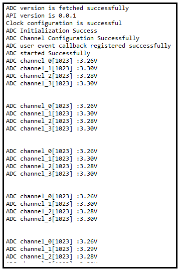

# SL ADC MULTICHANNEL

## Table of Contents

- [Purpose/Scope](#purposescope)
- [Overview](#overview)
- [Prerequisites/Setup Requirements](#prerequisitessetup-requirements)
  - [Hardware Requirements](#hardware-requirements)
  - [Software Requirements](#software-requirements)
  - [Setup Diagram](#setup-diagram)
- [Getting Started](#getting-started)
- [Application Build Environment](#application-build-environment)
  - [Application Configuration Parameters](#application-configuration-parameters)
  - [Pin Configuration](#pin-configuration)
- [Test the Application](#test-the-application)
  - [Formula Reference](#formula-reference)
- [Expected Results](#expected-results)

## Purpose/Scope

- This application demonstrate the ADC peripheral converts analog input to 12 bit digital output.
- ADC multichannel(maximum 4 channels), data will be sampled from four ADC channels in sequential order and written to the receive FIFO in the same order.

## Overview

- The ADC Controller works on a ADC with a resolution of 12bits at 10Msps when ADC reference Voltage is greater than 2.8v or 5Msps when ADC reference Voltage is less than 2.8v.
- Sample application will be 12 bit ADC Output in 2's complement representation.
- There a dedicated ADC DMA to support 16 channels.
- DMA mode supports dual buffer cyclic mode to avoid loss of data when buffer is full. In dual buffer cyclic mode, if buffer 1 is full for particular channel, incoming sampled
  data is written into buffer 2 such that, samples from buffer 1 are read back by controller during this time. That’s why there are two start addresses, two buffer lengths and
  two valid signals for each channel.
- External event-based sampling support.
- Multi-channel mode, as the multiple channels are sensed, after sensing each channel, information related to “buffer length” etc. of that particular channel are rewritten
  in to the corresponding location of internal memory for the next use when same channel is sensed again.
- The AUXADC can take analog inputs in single ended or differential. The output is 12-bit digital which can be given out with (or) without noise averaging.
- The Aux VRef can be connected directly to Vbat (Aux LDO bypass mode) or to the Aux LDO output.

## Prerequisites/Setup Requirements

### Hardware Requirements

- Windows PC
- Silicon Labs Si917 Evaluation Kit [WPK(BRD4002) + BRD4338A]

### Software Requirements

- Simplicity Studio
- Serial console Setup
  - The Serial Console setup instructions are provided below:
Refer [here](https://docs.silabs.com/wiseconnect/latest/wiseconnect-getting-started/getting-started-with-soc-mode#perform-console-output-and-input-for-brd4338-a).

### Setup Diagram

## Getting Started

Refer to the instructions [here](https://docs.silabs.com/wiseconnect/latest/wiseconnect-getting-started/) to:

- Install Studio and WiSeConnect 3 extension
- Connect your device to the computer
- Upgrade your connectivity firmware
- Create a Studio project

## Application Build Environment

### Application Configuration Parameters

- Configure UC from the slcp component.
- Open **sl_si91x_adc_multichannel.slcp** project file select **software component** tab and search for **ADC** in search bar.
- Using configuration wizard one can configure different parameters. Below are the 2 configuration screens where user can select as per requirement.

  - **ADC Peripheral Common Configuration**

    - Number of channel: In multichannel mode by default number of channel is '4'. When the number of channel is changed, then care must be taken to create instance of that respective channel number. Otherwise, an error is thrown.
    - ADC operation mode: There are 2 modes, FIFO mode and Static mode. By default it is in FIFO mode. When static mode is set, sample length should be '1'.

      

  - **ADC Channel Configuration**

    - Input Type: ADC input type can be configured to either single ended or differential.
    - Sampling rate: We can set sampling rate of ADC, i.e. bits/second to minimum of 1sps and maximum to 5Msps.
    - Sample length: Set the length of ADC samples, i.e. number of ADC samples collected for operation, it should be minimum value set to 1 and maximum of 1023.

      

- After running the application it will store the equivalent input voltage from ADC output samples in 'vout'.
- ADC output will print configured number of samples output voltage on UART console
- Apply the different voltages(1.8V to Vref) to ADC input and observe console outputs as per input.
- Provided input voltage and console output data should match.

### Pin Configuration

- Here mentioned pin numbers for BRD4338a (B0 2.0v boards) if user want to use different radio board, refer to board specific user guide

  | CHANNEL | PIN TO ADCP | PIN TO ADCN |
  | --- | --- | --- |
  | 0 | ULP_GPIO_1 [P16] | ULP_GPIO_7 [EXP_HEADER-15] |
  | 1 | ULP_GPIO_10 [P17] | GPIO_30 [P35] |
  | 2 | GPIO_25 [P25] | GPIO_26 [P27] |
  | 3 | GPIO_27 [P29] | GPIO_28 [P31] |
  | 4 | ULP_GPIO_8 [P15] | ULP_GPIO_1 [P16] |
  | 5 | ULP_GPIO_10 [P17] | ULP_GPIO_7 [EXP_HEADER-15] |
  | 6 | GPIO_25 [P25] | GPIO_26 [P27] |
  | 7 | GPIO_27 [P29] | GPIO_28 [P31] |
  | 8 | GPIO_29 [P33] | GPIO_30 [P35] |
  | 9 | GPIO_29 [P33] | GPIO_30 [P35] |
  | 10 | ULP_GPIO_1 [P16] | GPIO_30 [P35] |
  | 11 | ULP_GPIO_1 [P16] | GPIO_28 [P31] |
  | 12 | ULP_GPIO_7 [EXP_HEADER-15] | GPIO_26 [P27] |
  | 13 | GPIO_26 [P27] | ULP_GPIO_7 [EXP_HEADER-15] |
  | 14 | GPIO_28 [P31] | GPIO_26 [P27] |
  | 15 | GPIO_30 [P35] | ULP_GPIO_7 [EXP_HEADER-15] |

  | OTHER INPUT SELECTION | VALUE TO ADCP | VALUE TO ADCN |
  | --- | --- | --- |
  | OPAMP1_OUT | 20 | 10 |
  | OPAMP2_OUT | 21 | 11 |
  | OPAMP3_OUT | 22 | 12 |
  | TEMP_SENSOR_OUT | 23 |
  | DAC_OUT | 24 | 13 |

## Test the Application

Refer to the instructions [here](https://docs.silabs.com/wiseconnect/latest/wiseconnect-getting-started/) to:

1. Compile and run the application.
2. When the application runs, it starts ADC conversion.
3. After completion of conversion ADC input, it will print all the captured samples data in console by connecting vcom.

   - **Channel 0 pin connections**
     - When configured Single ended mode connect the positive analog input to ULP_GPIO_1 and GND to ULP_GPIO_7
     - When configured Differential mode connect the positive analog input to ULP_GPIO_1 and negative input to ULP_GPIO_7
   - **Channel 1 pin connections**
     - When configured Single ended mode connect the positive analog input to ULP_GPIO_10 and GND to GPIO_30
     - When configured Differential mode connect the positive analog input to ULP_GPIO_10 and negative input to GPIO_30
   - **Channel 2 pin connections**
     - When configured Single ended mode connect the positive analog input to GPIO_25 and GND to GPIO_26
     - When configured Differential mode connect the positive analog input to GPIO_25 and negative input to GPIO_26
   - **Channel 3 pin connections**
     - When configured Single ended mode connect the positive analog input to GPIO_27 and GND to GPIO_28
     - When configured Differential mode connect the positive analog input to GPIO_27 and negative input to GPIO_28

> **Note:**
>
- Users who only want to utilize two channels can uninstall channels two and three from the software components on sl_si91x_adc_multichannel.slcp. By default, four channels instances will be created.
- This application only applicable for FIFO mode.
- Sample rate should be either same for all channels or 1/2, 1/4, 1/16.(for example if channel_0 sample rate is 10000sps, then channel_1 = 10000/2 sps, channel_2 = 10000/4 sps, channel_3 = 10000/16 sps)
- User can configure input selection GPIO in channel configuration file ($path: $project/config/specific channel config file) if default GPIO is work around.
- ADC input selection rather than GPIO (like OPAMP, DAC and Temperature sensor) user can create their own instances and configure them as per other input selection.
- **The sample rate for this example application is currently limited to 15 Ksps, 500 sampling lengths, and a maximum of 4 channels.**

### Formula Reference

- Use following formula to find equivalent input voltage of ADC

   **Differential Ended Mode:**

   vout = ((((float)ADC output/(float)4096) * Vref Voltage) - (Vref Voltage/2));

   > **Note:** If Positive input to ADC given as 2.4V and Negative input given as 1.5 voltage then
   ADC output will be digital value which is equivalent to 0.9V

   **Single ended Mode:**

   vout = (((float)ADC output/(float)4096) * Vref Voltage);
  
   > **Note:** If Positive input to ADC given as 2.4V then ADC output will be digital value which is equivalent to 2.4V

## Expected Results

- After successful program execution the prints in serial console looks as shown below.

   
