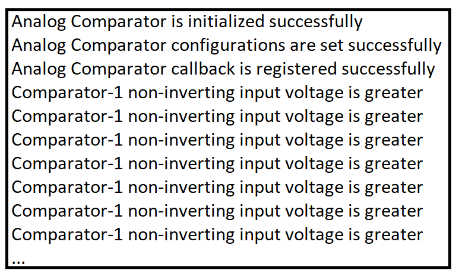
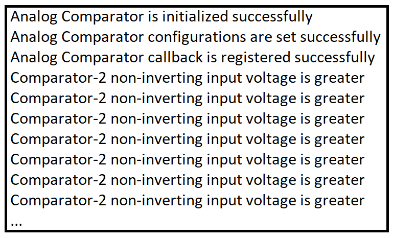

# SL ANALOG COMPARATOR

## Table of Contents

- [Purpose/Scope](#purposescope)
- [Overview](#overview)
- [About Example Code](#about-example-code)
- [Prerequisites/Setup Requirements](#prerequisitessetup-requirements)
  - [Hardware Requirements](#hardware-requirements)
  - [Software Requirements](#software-requirements)
  - [Setup Diagram](#setup-diagram)
- [Getting Started](#getting-started)
- [Application Build Environment](#application-build-environment)
  - [Macros for Clock Configurations](#macros-for-clock-configurations)
  - [Macros for SYSRTC Configuration](#macros-for-sysrtc-configurations)
- [Test the Application](#test-the-application)

## Purpose/Scope

This example demonstrates analog comparator functionality. If non-inverting input voltage is greater than inverting input voltage, analog comparator output will be high and the analog comparator interrupt will hit.

The following configurations are used in this example:
  
- Non-inverting input pin
- Inverting input pin
- Hystersis value
- Filter enable/disable
- Comparator instance used for application
- Threshold and scale factor values for internal voltages

## Overview

- The analog comparators peripheral consists of two analog comparators, a reference buffer, a scaler and a resistor bank.

- The comparator compares analog inputs p and n to produce a digital output, cmp_out according to:
  - p > n, cmp_out = 1
  - p < n, cmp_out = 0
- Both comparators can take inputs from GPIOs.
- There are 9 different inputs for each pin of comparator, and 2 of the 9 are external pin inputs (GPIOs).
- The following cases of comparison are possible:
  - Compare external pin inputs
  - Compare external pin input to internal voltages.
  - Compare internal voltages.
- The inputs of 2 comparators can be programmed independently. The reference buffer, scaler, and resistor bank are shared between the two comparators and can be enabled only when at least one of the comparators is enabled.

## About Example Code

- \ref analog_comparator_example.c - This example file demonstrates how to use analog comparator to compare external pin inputs, external pin input to internal voltages, and internal voltages.
- In this example, the first analog comparator is initialized by enabling clocks through \ref sl_si91x_analog_comparator_init API.
- Sets non-inverting, inverting inputs, hysterisis value and filter for the comparator used through \ref sl_si91x_analog_comparator_set_configurations API(inputs are configured as per the usecase macros enabled).
- Registers callback for comparator interrupts and enable its interrupts through \ref sl_si91x_analog_comparator_register_callback API:
  - **If 'COMPARE_POS_INPUT_EXTERNAL_NEG_INPUT_EXTERNAL' macro is enabled**:
    - Then the comparator will compare external voltages, applied externally.
  - **If 'COMPARE_POS_INPUT_EXTERNAL_NEG_INPUT_REF_SCALER' is enabled:**
    - Then the comparator will compare external input with internal reference scaler voltage & sets reference scaler output by setting its scale factor value through \ref sl_si91x_analog_comparator_set_reference_scaler_output.
  - **If 'COMPARE_POS_INPUT_EXTERNAL_NEG_INPUT_RESISTOR_BANK' is enabled:**
    - Then the comparator will compare external input with internal resistor bank voltage and sets threshold value for resistor bank output voltage through \ref sl_si91x_analog_comparator_set_resistor_bank_threshold.
  - **If 'COMPARE_POS_INPUT_RESISTOR_BANK_NEG_INPUT_REF_SCALER' is enabled:**
    - Then the comparator will compare resistor bank output with internal reference scaler voltage and sets reference scaler output by setting its scale factor value \ref sl_si91x_analog_comparator_set_reference_scaler_output.
    - It also sets threshold value for resistor bank output voltage through \ref sl_si91x_analog_comparator_set_resistor_bank_threshold.
  - **If 'COMPARE_POS_INPUT_OPAMP_NEG_INPUT_EXTERNAL' is enabled:**
    - Then the comparator will compare OPAMP output with external voltage and initializes opamp through opamp_init() function.
  - **If 'COMPARE_POS_INPUT_OPAMP_NEG_INPUT_REF_SCALER' is enabled:**
    - Then the comparator will compare OPAMP output with reference scalar output and initializes opamp through opamp_init() function.
    - It also sets reference scaler output by setting its scale factor value through \ref sl_si91x_analog_comparator_set_reference_scaler_output.
  - **If 'COMPARE_POS_INPUT_OPAMP_NEG_INPUT_RESISTOR_BANK' is enabled:**
    - Then the comparator will compare OPAMP output with resistor bank output and initializes opamp through opamp_init() function.
    - It also sets threshold value for resistor bank output voltage through \ref sl_si91x_analog_comparator_set_resistor_bank_threshold.
  - **If 'COMPARE_POS_INPUT_DAC_NEG_INPUT_EXTERNAL' is enabled:**
    - Then the comparator will compare DAC output with external voltage and initializes DAC through DAC_init() function & sets DAC input value & sampling rate.
  - **If 'COMPARE_POS_INPUT_DAC_NEG_INPUT_REF_SCALER' is enabled:**
    - Then the comparator will compare DAC output with reference scalar output and initializes DAC through DAC_init() function & sets DAC input value & sampling rate.
    - It also sets reference scaler output by setting its scale factor value through \ref sl_si91x_analog_comparator_set_reference_scaler_output.

- In all of the above use cases, if non-inverting input voltage is greater than inverting input voltage, the comparator interrupt will occur and it will toggle ULP-GPIO-5 (for comparator-1) or ULP-GPIO-1 (for comparator-2) continously unless non-inverting voltage is greater.

## Prerequisites/Setup Requirements

### Hardware Requirements

- Windows PC
- Silicon Labs Si917 Evaluation Kit [WPK(BRD4002) + BRD4338A / BRD4342A / BRD4343A ]
- SiWx917 AC1 Module Explorer Kit (BRD2708A)

### Software Requirements

- Simplicity Studio
- Serial console setup
  - For serial console setup instructions, refer [here](https://docs.silabs.com/wiseconnect/latest/wiseconnect-developers-guide-developing-for-silabs-hosts/#console-input-and-output).

### Setup Diagram

> 

## Getting Started

Refer to the instructions [here](https://docs.silabs.com/wiseconnect/latest/wiseconnect-getting-started/) to:

- [Install Simplicity Studio](https://docs.silabs.com/wiseconnect/latest/wiseconnect-developers-guide-developing-for-silabs-hosts/#install-simplicity-studio)
- [Install WiSeConnect 3 extension](https://docs.silabs.com/wiseconnect/latest/wiseconnect-developers-guide-developing-for-silabs-hosts/#install-the-wi-se-connect-3-extension)
- [Connect your device to the computer](https://docs.silabs.com/wiseconnect/latest/wiseconnect-developers-guide-developing-for-silabs-hosts/#connect-si-wx91x-to-computer)
- [Upgrade your connectivity firmware](https://docs.silabs.com/wiseconnect/latest/wiseconnect-developers-guide-developing-for-silabs-hosts/#update-si-wx91x-connectivity-firmware)
- [Create a Studio project](https://docs.silabs.com/wiseconnect/latest/wiseconnect-developers-guide-developing-for-silabs-hosts/#create-a-project)

For details on the project folder structure, see the [WiSeConnect Examples](https://docs.silabs.com/wiseconnect/latest/wiseconnect-examples/#example-folder-structure) page.

## Application Build Environment

1. Open the **sl_si91x_analog_comparator.slcp** project file, select the **Software Component** tab, and search for **analog comparator** in the search bar.
2. Click on **comparator2** and configure its parameters from the wizard.
3. For using any other timer instance, the user has to add that timer instance by clicking on **ULP Timer Instance** from the configuration wizard and then clicking on **Add New Instance**.
4. For creating analog comparator-1 instances, write 'comparator1' and then click on **Done**.
5. After creation of instances, separate configuration files are generated in the **config folder**.
6. If the project is built without selecting configurations, it will take default values from UC.

  
  
### Application Configuration Parameters

- Configure the following macros in the `analog_comparator_example.c` file and update/modify following macros, if required.

  ```c
  // Update below macro as per instance used for application.
  // Update '1' for using comparator1  & '2' for using comparator2
  #define ANALOG_COMPARATOR_USED     2

  // Enable below macro to compare external inputs. 
  // For this comparision select 'External input-1' as non-inverting input & 
  // inverting input from UC, so both inputs will fed from GPIOs.
  #define COMPARE_POS_INPUT_EXTERNAL_NEG_INPUT_EXTERNAL  ENABLE 

  // Enable below macro to compare external input to reference scaler output. 
  // For this comparision select 'External input-1' as non-inverting input & 
  // select 'Reference scaler' as inverting input from UC.
  #define COMPARE_POS_INPUT_EXTERNAL_NEG_INPUT_REF_SCALER  DISABLE 

  // Enable below macro to compare external input to resistor bank output.
  // For this comparision select 'External input-1' as non-inverting input &
  // select 'Resistor bank output' as inverting input from UC.
  #define COMPARE_POS_INPUT_EXTERNAL_NEG_INPUT_RESISTOR_BANK  DISABLE 

  // Enable below macro to compare reference scaler output to resistor bank output,
  // For this comparision select 'Resistor bank output' as non-inverting input &
  // select 'Reference scaler output' as inverting input from UC.
  #define COMPARE_POS_INPUT_REF_SCALAR_NEG_INPUT_RESISTOR_BANK DISABLE

  // Enable below macro to compare OPAMP output with external voltage
  // For this comparision select 'OPAMP1 output' as non-inverting input &
  // select 'External input-1' as inverting input from UC.
  #define COMPARE_POS_INPUT_OPAMP_NEG_INPUT_EXTERNAL DISABLE

  // Enable below macro to compare OPAMP output with reference scaler voltage
  // For this comparision select 'OPAMP1 output' as non-inverting input &
  // select 'Reference scaler output' as inverting input from UC.
  #define COMPARE_POS_INPUT_OPAMP_NEG_INPUT_REF_SCALER DISABLE

  // Enable below macro to compare OPAMP output internal resistor bank voltage
  // For this comparision select 'OPAMP1 output' as non-inverting input &
  // select 'Resistor bank output' as inverting input from UC.
  #define COMPARE_POS_INPUT_OPAMP_NEG_INPUT_RESISTOR_BANK DISABLE

  // Enable to compare DAC output with external voltage
  // For this comparision select 'DAC output' as non-inverting input &
  // select 'External input-1' as inverting input from UC.
  #define COMPARE_POS_INPUT_DAC_NEG_INPUT_EXTERNAL DISABLE

  // Enable to compare DAC output with external voltage
  // For this comparision select 'DAC output' as non-inverting input &
  // select 'Reference scaler output' as inverting input from UC.
  #define COMPARE_POS_INPUT_DAC_NEG_INPUT_REF_SCALER DISABLE
  ```

- Note :
  1. Only one MACRO should be enable from above Compare MACROs at a time.
  2. Use Comparator-2 for 917 boards.
  3. To compare external input to buffer output, enable macro 'COMPARE_POS_INPUT_EXTERNAL_NEG_INPUT_EXTERNAL' and
  select 'External input-1' as non-inverting input and 'Reference buffer ouput' as inverting input from UC. The reference buffer
  will produce a fixed output of 1.2v only.

    ```C
    // Change below macro value to change resistor bank output voltage, 
    // for possible values \ref sl_analog_comparator_threshold_values_t enum present in sl_si91x_analog_comparator.h file.
    #define THRESHOLD_VALUE 
    // Change below macro value to change reference scaler output voltage, 
    // for possible values refer \ref sl_analog_comparator_scale_factor_values_t present in sl_si91x_analog_comparator.h file. 
    #define SCALE_FACT_VAL 
    ```
  
### Pin Configuration

|917 GPIO |915 GPIO |Explorer kit GPIO | Description|
| --- | --- | --- | --- |
|GPIO_27 [P29]|GPIO_27 [P29] |GPIO_27 [MOSI]|Non-inverting input|
|GPIO_28 [P31]|GPIO_28 [P31] |GPIO_28 [CS]  |Inverting input    |
|ULP_GPIO_1 [P16]|ULP_GPIO_4 [P36]|ULP_GPIO_1 [EXP_5]|Output Pin   |

## Test Application

Refer to the instructions [here](https://docs.silabs.com/wiseconnect/latest/wiseconnect-getting-started/) to:

1. Compile and run the application.

2. If 'COMPARE_POS_INPUT_EXTERNAL_NEG_INPUT_EXTERNAL' MACRO is enabled:
   - Connect external voltage to Non-inverting input and Inverting input.
  
3. If 'COMPARE_POS_INPUT_EXTERNAL_NEG_INPUT_REF_SCALER' MACRO is enabled :
  
   - Connect external voltage to non-inverting input.
   - Inverting input will be internally connected to reference scaler output so leave it open.
  
4. If 'COMPARE_POS_INPUT_EXTERNAL_NEG_INPUT_RESISTOR_BANK' MACRO is enabled:

    - Connect external voltage to non-inverting input.
    - Inverting input will be internally connected to resister bank output so leave it open.
  
5. If 'COMPARE_POS_INPUT_RESISTOR_BANK_NEG_INPUT_REF_SCALAR' MACRO is enabled:
    - Non-inverting input will be internally connected to the resistor bank output.
    - Inverting input will be internally connected to the reference scaler output.

6. If 'COMPARE_POS_INPUT_OPAMP_NEG_INPUT_REF_SCALER' MACRO is enabled:
    - Non-inverting input will be internally connected to opamp output, but connect external voltage to opamp1 input (ULP_GPIO_7) to get opamp output.
    - Inverting input will be internally connected to the reference scaler output.

7. If 'COMPARE_POS_INPUT_OPAMP_NEG_INPUT_RESISTOR_BANK' MACRO is enabled:
    - Non-inverting input will be internally connected to opamp output, but connect external voltage to opamp1 input (ULP_GPIO_7) to get opamp output.
    - Inverting input will be internally connected to the resister bank output.

8. If 'COMPARE_POS_INPUT_OPAMP_NEG_INPUT_EXTERNAL' MACRO is enabled:
    - Non-inverting input will be internally connected to opamp output, but connect external voltage to opamp1 input (ULP_GPIO_7) to get opamp output.
    - Connect external voltage to Inverting input.

9. If 'COMPARE_POS_INPUT_DAC_NEG_INPUT_EXTERNAL' MACRO is enabled:
    - Non-inverting input will be internally connected to DAC output. Change the value of the 'DAC_INPUT_SAMPLE_VALUE' macro to change DAC input. Its value should be less than MAX_DAC_INPUT_SAMPLE_VALUE macro value.
    - Connect external voltage to inverting input.

10. If 'COMPARE_POS_INPUT_DAC_NEG_INPUT_REF_SCALER' MACRO is enabled:
    - Non-inverting input will be internally connected to DAC output. Change the value of the 'DAC_INPUT_SAMPLE_VALUE' macro to change DAC input. Its value should be less than MAX_DAC_INPUT_SAMPLE_VALUE macro value.
    - Inverting input will be internally connected to the reference scaler output.

## Expected Results

### For Comparator-1

- If applied non-inverting input supply >= applied Iinverting input supply, then the comparator output will be high, interrupt will hit, and ULP_GPIO_5 will toggle unless the comparator output is high. Also, the following debug prints will be observed. Observe the ULP_GPIO_5 status by using a logic analyzer.

    

- If the applied non-inverting input supply < applied inverting input supply, then comparator output will be low, interrupt will not hit, ULP_GPIO_5 will not toggle, and the following debug prints will be on console. Observe the ULP_GPIO_5 status by using a logic analyzer.

    

### For Comparator-2

- If the voltage at the non-inverting input is greater than or equal to the voltage at the inverting input, the comparator output will go high, triggering an interrupt. This will cause ULP_GPIO_1 on the Si917 board or ULP_GPIO_4 on the Si915 board to toggle, as long as the comparator output remains high. Additionally, the following debug prints will be observed. Use a logic analyzer to monitor the status of ULP_GPIO_1 on the Si917 board or ULP_GPIO_4 on the Si915 board.

    

- If the voltage at the non-inverting input is less than the voltage at the inverting input, the comparator output will be low, and no interrupt will be triggered. As a result, ULP_GPIO_1 on the Si917 board or ULP_GPIO_4 on the Si915 board will not toggle, and the following debug messages will appear on the console. Use a logic analyzer to monitor the status of ULP_GPIO_1 on the Si917 board or ULP_GPIO_4 on the Si915 board.

    

> **Note:**
>
> - Interrupt handlers are implemented in the driver layer, and user callbacks are provided for custom code. If you want to write your own interrupt handler instead of using the default one, make the driver interrupt handler a weak handler. Then, copy the necessary code from the driver handler to your custom interrupt handler.
