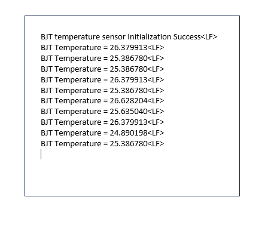

# SI91x BJT Temperature Sensor Example

## Table of Contents

- [SL BJT TEMPERATURE SENSOR](#sl-bjt-temperature-sensor)
  - [Table of Contents](#table-of-contents)
  - [Purpose/Scope](#purposescope)
  - [Overview](#overview)
  - [How the BJT Temperature Sensor Works](#how-the-bjt-temperature-sensor-works)
    - [What is the BJT Temperature Sensor?](#what-is-the-bjt-temperature-sensor)
    - [Temperature Measurement Process](#temperature-measurement-process)
  - [Prerequisites/Setup Requirements](#prerequisitessetup-requirements)
    - [Hardware Requirements](#hardware-requirements)
    - [Software Requirements](#software-requirements)
    - [Setup Diagram](#setup-diagram)
  - [Getting Started](#getting-started)
  - [Application Build Environment](#application-build-environment)
    - [Application Configuration Parameters](#application-configuration-parameters)
    - [Pin Configuration](#pin-configuration)
  - [System Resource Usage](#system-resource-usage)
  - [Test the Application](#test-the-application)

## Purpose/Scope

This application demonstrates how to use the SI91x Bipolar Junction Transistor (BJT) temperature sensor to measure die temperature. The example shows the complete process of configuring the Analog-to-Digital Converter (ADC), Operational Amplifier (OPAMP), and temperature sensor subsystems to convert the BJT voltage output into temperature readings in the range of -40°C to +125°C.

## Overview

The SI91x BJT temperature sensor is **not a standalone temperature sensor** but rather a **voltage output circuit on the die** that provides a temperature-dependent voltage. This voltage must be measured using the ADC and then converted to temperature using a calibration formula.

**Key Points:**

- The "temperature sensor" is actually a BJT circuit that outputs a voltage proportional to temperature.
- Temperature measurement requires coordination between ADC, OPAMP, and calibration subsystems.
- The conversion process uses factory calibration values stored in eFuse memory.
- Temperature calculation involves measuring both the BJT output and a band-gap reference voltage.

## How the BJT Temperature Sensor Works

### What is the BJT Temperature Sensor?

The BJT temperature sensor is a **temperature-dependent voltage source** built into the SI91x die. It works on the principle that the base-emitter voltage (Vbe) of a silicon bipolar junction transistor decreases linearly with temperature at approximately -2mV/°C.

**Important:** This is not a digital temperature sensor like those found on EFR32 Series 2 devices. Instead, it's an analog voltage that must be:

1. Measured using the ADC
2. Compared against a stable reference (band-gap voltage)
3. Converted to temperature using a calibration formula

### Temperature Measurement Process

Measuring the temperature involves the following steps:

1. **Configure OPAMP as a Unity Gain Buffer**: The OPAMP provides impedance matching and signal conditioning.
2. **Measure Band-gap Reference**: Read the stable ~1.2 V reference voltage via the ADC.
3. **Measure BJT Output**: Read the temperature-dependent BJT voltage via the ADC.  
4. **Apply Calibration**: Use factory-stored eFuse values to correct for manufacturing variations.
5. **Calculate Temperature**: Apply the conversion formula to get temperature in Celsius.

**Why Two Measurements?**

- The band-gap reference provides a stable voltage that does not change with temperature.
- By taking a ratio of BJT voltage to band-gap voltage, we eliminate variations in ADC gain and supply voltage.
- This ratiometric measurement ensures consistent accuracy across different chips.

## Prerequisites/Setup Requirements

### Hardware Requirements

- Windows PC
- Silicon Labs Si917 Evaluation Kit [[BRD4002](https://www.silabs.com/development-tools/wireless/wireless-pro-kit-mainboard?tab=overview) + [BRD4338A](https://www.silabs.com/development-tools/wireless/wi-fi/siwx917-rb4338a-wifi-6-bluetooth-le-soc-radio-board?tab=overview) / [BRD4342A](https://www.silabs.com/development-tools/wireless/wi-fi/siwx91x-rb4342a-wifi-6-bluetooth-le-soc-radio-board?tab=overview) / [BRD4343A](https://www.silabs.com/development-tools/wireless/wi-fi/siw917y-rb4343a-wi-fi-6-bluetooth-le-8mb-flash-radio-board-for-module?tab=overview)]
- SiWx917 AC1 Module Explorer Kit [BRD2708A](https://www.silabs.com/development-tools/wireless/wi-fi/siw917y-ek2708a-explorer-kit)

### Software Requirements

- Simplicity Studio
- Serial console setup
  - For Serial Console setup instructions, refer to [link name](https://docs.silabs.com/wiseconnect/latest/wiseconnect-developers-guide-developing-for-silabs-hosts/using-the-simplicity-studio-ide#console-input-and-output).

### Setup Diagram

> 

## Getting Started

Refer to the instructions [here](https://docs.silabs.com/wiseconnect/latest/wiseconnect-getting-started/) to:

- [Install Simplicity Studio](https://docs.silabs.com/wiseconnect/latest/wiseconnect-developers-guide-developing-for-silabs-hosts/using-the-simplicity-studio-ide#install-simplicity-studio)
- [Install WiSeConnect extension](https://docs.silabs.com/wiseconnect/latest/wiseconnect-developers-guide-developing-for-silabs-hosts/using-the-simplicity-studio-ide#install-the-wiseconnect-3-extension)
- [Connect your device to the computer](https://docs.silabs.com/wiseconnect/latest/wiseconnect-developers-guide-developing-for-silabs-hosts/using-the-simplicity-studio-ide#connect-siwx91x-to-computer)
- [Upgrade your connectivity firmware](https://docs.silabs.com/wiseconnect/latest/wiseconnect-developers-guide-developing-for-silabs-hosts/using-the-simplicity-studio-ide#update-siwx91x-connectivity-firmware)
- [Create a Studio project](https://docs.silabs.com/wiseconnect/latest/wiseconnect-developers-guide-developing-for-silabs-hosts/using-the-simplicity-studio-ide#create-a-project)

For details on the project folder structure, see the [WiSeConnect Examples](https://docs.silabs.com/wiseconnect/latest/wiseconnect-examples/#example-folder-structure) page.

## Application Build Environment

### Application Configuration Parameters

The BJT temperature sensor requires specific configuration of the ADC and OPAMP subsystems. The following list describes the key parameters and their purposes:

**Configure the following parameters in [`sl_si91x_bjt_temperature_sensor.c`](https://github.com/SiliconLabs/wiseconnect/blob/v4.0.0-content-for-docs/components/device/silabs/si91x/mcu/drivers/unified_api/src/sl_si91x_bjt_temperature_sensor.c) file:**

```c
#define CHANNEL_NUMBER             0       // ADC channel number
#define POS_IP_OPAMP               20      // OPAMP input selection for band-gap reference
#define OPAMP_GAIN_OPAMP           51      // OPAMP gain configuration  
#define OPAMP_CHANNEL              0       // OPAMP instance to use
```

**Parameter Explanations:**

| Parameter | Value | Required? | Explanation |
|-----------|-------|-----------|-------------|
| `CHANNEL_NUMBER` | 0 | **YES** | **Must be 0** - The BJT temperature sensor is internally connected to ADC channel 0. This cannot be changed. |
| `POS_IP_OPAMP` | 20 | **YES** | **Must be 20** - This selects OPAMP1 output as input to ADC. A value of 20 specifically routes the band-gap reference through OPAMP1. Cannot use other values for temperature measurement. |
| `OPAMP_GAIN_OPAMP` | 51 | **YES** | **Unity gain required** - A value of 51 configures the OPAMP for unity gain (1x) which is required for accurate voltage buffering. Other gains will affect calibration. |
| `OPAMP_CHANNEL` | 0 | **YES** | **Must use OPAMP1** - OPAMP1 (channel 0) is specifically designed for temperature sensor applications. OPAMP2/3 cannot be used for this purpose. |

**Additional Internal Parameters (handled automatically by the driver):**

```c
#define POS_IP_BJT                 23      // ADC input for BJT sensor output (automatic)
#define VREF_VALUE                 2.61f   // Default reference voltage (automatic)
#define SAMPLING_RATE              9000    // ADC sampling rate (automatic)
```

**Why These Specific Values?**

- The BJT temperature sensor has **dedicated internal routing** that requires these exact configurations.
- **ADC Channel 0**: The internal BJT output is hardwired to this channel.
- **OPAMP Input 20**: This is the dedicated path for band-gap reference measurement.
- **Unity Gain**: Ensures the voltage is not amplified/attenuated, maintaining calibration accuracy.
- **OPAMP1**: Has the proper input connections for temperature sensor operation.

### Pin Configuration

**Important: No External Pins Required**

The BJT temperature sensor uses **internal signal routing only**. The following table shows the internal ADC input mappings:

| INPUT SELECTION | ADC INPUT VALUE | DESCRIPTION | USER CONFIGURABLE? |
|-----------------|------------------|-------------|-------------------|
| OPAMP1_OUT | 20 | Band-gap reference via OPAMP1 | **NO** - Required for temp sensor |
| OPAMP2_OUT | 21 | General purpose OPAMP2 output | Yes - for other applications |
| OPAMP3_OUT | 22 | General purpose OPAMP3 output | Yes - for other applications |
| **TEMP_SENSOR_OUT** | **23** | **BJT temperature sensor output** | **NO** - Automatically used |

**Key Points:**

- **No external wiring needed** - Temperature sensor is fully internal.
- **Fixed routing** - You cannot change which ADC inputs are used for temperature measurement.
- **Automatic switching** - The driver automatically switches between input 20 (band-gap) and input 23 (BJT) during measurement.
- **Other applications** - If your application uses OPAMP2 or OPAMP3, they will not interfere with temperature measurement.

## System Resource Usage

**Important: Understanding Resource Impact**

The BJT temperature sensor uses multiple subsystems that might affect other parts of your application:

### Resources Used During Temperature Measurement

| Resource | Usage | Impact on Application |
|----------|-------|----------------------|
| **ADC Channel 0** | Temporarily occupied during measurement | **Cannot use ADC Channel 0 for other measurements during temp reading** |
| **OPAMP1** | Configured as unity gain buffer | **OPAMP1 unavailable for other uses during temp measurement** |
| **ADC Reference** | Uses internal reference voltage | **Other ADC channels may be affected if using different reference** |
| **eFuse Interface** | Read during initialization only | **Brief delay during init, no runtime impact** |

### Resource Reconfiguration

**If your application uses ADC Channel 0 or OPAMP1 for other purposes:**

1. **Save current configuration** before temperature measurement.
2. **Take temperature reading** (resources temporarily used).
3. **Restore your configuration** after measurement.

### Concurrent Usage Limitations

- Cannot measure temperature while using ADC Channel 0 for other purposes.
- Cannot use OPAMP1 for signal conditioning during temperature measurement.
- Other ADC channels (1-15) remain available during temperature measurement.
- OPAMP2 and OPAMP3 are not affected.

> **Note**: For recommended settings, see the [Recommendations Guide](https://docs.silabs.com/wiseconnect/latest/wiseconnect-developers-guide-prog-recommended-settings/).

## Test the Application

Refer to the instructions [here](https://docs.silabs.com/wiseconnect/latest/wiseconnect-getting-started/) to:

1. Compile and run the application.
2. After successful program execution the prints in serial console looks as shown below.

    

## Understanding the Implementation

**What happens when you call the temperature sensor APIs:**

1. **`sl_si91x_bjt_temperature_sensor_init()`:**
   - Configures ADC Channel 0 for temperature measurement.
   - Sets up OPAMP1 as unity gain buffer
   - Reads factory calibration values from eFuse.
   - Prepares both band-gap and BJT measurement paths.

2. **`sl_si91x_bjt_temperature_sensor_read_data()`:**
   - Switches ADC input to band-gap reference (input 20).
   - Takes band-gap voltage measurement via OPAMP1.
   - Switches ADC input to BJT sensor (input 23).
   - Takes BJT voltage measurement.
   - Applies calibration formula: `Temp = -273 + 310 * (calibrated_ratio + offset)`
   - Returns temperature in Celsius.

3. **`sl_si91x_bjt_temperature_sensor_deinit()`:**
   - Releases ADC and OPAMP resources.
   - Restores subsystems to default state.

**Alternative Configurations:**

- **Fixed configuration** - The temperature sensor requires specific ADC/OPAMP settings.
- **No alternative routings** - Must use ADC Channel 0 and OPAMP1.
- **Integration flexibility** - Can be called periodically or on-demand as needed.

> **Note:**
>
> - The temperature sensor measures **die temperature**, not ambient air temperature.
> - For ambient measurements, ensure good thermal coupling between chip and environment.  
> - Interrupt handlers are implemented in the driver layer with user callbacks available.
> - The abstraced APIs handle all low-level ADC configuration, OPAMP setup, and calibration automatically.
