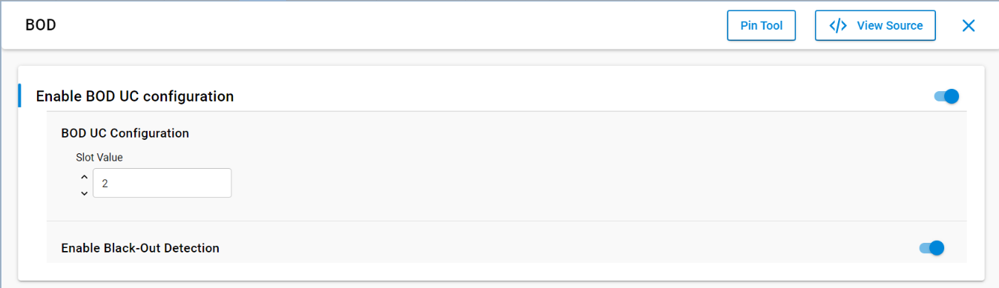
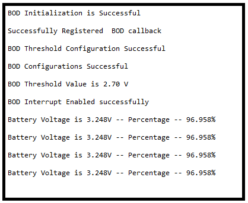

# BOD [Brown Out Detection]

## Table of Contents

- [Purpose/Scope](#purposescope)
- [Prerequisites/Setup Requirements](#prerequisitessetup-requirements)
  - [Hardware Requirements](#hardware-requirements)
  - [Software Requirements](#software-requirements)
  - [Setup Diagram](#setup-diagram)
- [Getting Started](#getting-started)
- [Application Build Environment](#application-build-environment)
  - [Application Configuration Parameters](#application-configuration-parameters)
- [Test the Application](#test-the-application)

## Purpose/Scope

This application demonstrates how to set up and use the Brown Out Detection (BOD) feature. It allows users to configure the threshold value for BOD and monitor the voltage levels on VMCU. When the voltage drops below the configured threshold, a BOD interrupt is triggered, and the application handles the event accordingly.


## Prerequisites/Setup Requirements

To use this application, the following hardware, software, and project setup is required.

### Hardware Requirements
- Windows PC
- SiWx917 Radio Board

### Software Requirements

- Simplicity Studio
- Serial console setup
  - For serial Console setup instructions, refer [here](https://docs.silabs.com/wiseconnect/latest/wiseconnect-developers-guide-developing-for-silabs-hosts/#console-input-and-output).
### Setup Diagram

> 

## Getting Started

Refer to the instructions [here](https://docs.silabs.com/wiseconnect/latest/wiseconnect-getting-started/) to:

- [Install Simplicity Studio](https://docs.silabs.com/wiseconnect/latest/wiseconnect-developers-guide-developing-for-silabs-hosts/#install-simplicity-studio)
- [Install WiSeConnect 3 extension](https://docs.silabs.com/wiseconnect/latest/wiseconnect-developers-guide-developing-for-silabs-hosts/#install-the-wi-se-connect-3-extension)
- [Connect your device to the computer](https://docs.silabs.com/wiseconnect/latest/wiseconnect-developers-guide-developing-for-silabs-hosts/#connect-si-wx91x-to-computer)
- [Upgrade your connectivity firmware](https://docs.silabs.com/wiseconnect/latest/wiseconnect-developers-guide-developing-for-silabs-hosts/#update-si-wx91x-connectivity-firmware)
- [Create a Studio project](https://docs.silabs.com/wiseconnect/latest/wiseconnect-developers-guide-developing-for-silabs-hosts/#create-a-project)

For details on the project folder structure, see the [WiSeConnect Examples](https://docs.silabs.com/wiseconnect/latest/wiseconnect-examples/#example-folder-structure) page.

## Application Build Environment

### Application Configuration Parameters
  - Threshold and slot value are configurable in `bod_example.h` or can be updated through UC (supports only slot value and blackout can be enabled).
  ```
#define SL_BOD_DEFAULT_SLOT_VALUE 2  ///< Default BOD Slot value
#define SL_BOD_DEFAULT_THRESHOLD 2.7f ///< Default BOD threshold value
```
- Configure UC from the slcp component.

  

- Open  the **sl_si91x_bod.slcp** project file, select **Software Component** tab and search for **BOD** in search bar.
- You can use the configuration wizard to configure different parameters. The configuration screen is below, with options for the user to pick based on need.

  - **Enable BOD UC Configuration:** This needs to be enabled to apply these configurations in the application.
    - **Slot Value:** The slot value can be configured using this option.
      > **Note:** Slot configuration values can be verified in power mode applications only. In the active state, we can't observe the difference in terms of power. To verify with different slot values, use a larger value to achieve a lower sleep current.


    - **Enable Black-Out Detection:** By enabling this, the system will reset when the VMCU voltage drops below 1.65V.

## Test the Application
- Refer to the instructions in the Create a Project section on the Developing with WiSeConnect™ SDK v3.x with SiWx91x™ Boards page to:

- Expected Results
If the user decreases the voltage less than the threshold voltage, then a BOD interrupt occurs.
The console will as below.(Interrupt operations are not there in the Console Output)

  - Console Output:

    

> **Note:** Interrupt handlers are implemented in the driver layer, and user callbacks are provided for custom code. If you want to write your own interrupt handler instead of using the default one, make the driver interrupt handler a weak handler. Then, copy the necessary code from the driver handler to your custom interrupt handler.
