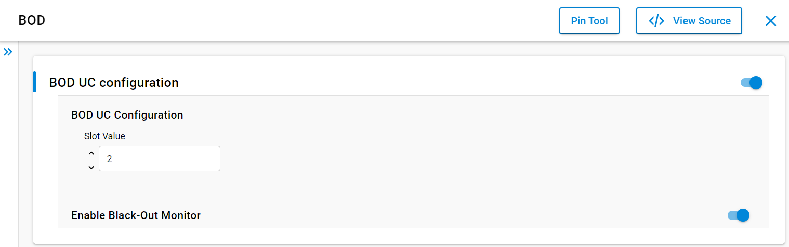
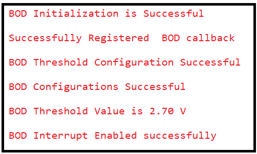

# BOD [Brown Out Detection]

## Table of Contents

- [Purpose/Scope](#purposescope)
- [Prerequisites/Setup Requirements](#prerequisitessetup-requirements)
  - [Hardware Requirements](#hardware-requirements)
  - [Software Requirements](#software-requirements)
  - [Setup Diagram](#setup-diagram)
- [Getting Started](#getting-started)
- [Application Build Environment](#application-build-environment)
  - [Application Configuration Parameters](#application-configuration-parameters)
- [Test the Application](#test-the-application)

## Purpose/Scope

- This application demonstrates how to set up and use the Brown Out Detection (BOD) feature. It allows users to configure the threshold value for BOD and monitor the voltage levels on VMCU. When the voltage drops below the configured threshold, a BOD interrupt is triggered, and the application handles the event accordingly.

- **Black-out:** When Black-out is enabled, the reset line will be pulled down automatically if the battery voltage (Vbatt) falls below ~1.65V.


## Prerequisites/Setup Requirements

To use this application, the following hardware, software, and project setup is required.

### Hardware Requirements
- Windows PC
- SiWx917 Radio Board

### Software Requirements

- Simplicity Studio
- Serial console setup
  - For serial Console setup instructions, refer [here](https://docs.silabs.com/wiseconnect/latest/wiseconnect-developers-guide-developing-for-silabs-hosts/#console-input-and-output).
### Setup Diagram

> 

## Getting Started

Refer to the instructions [here](https://docs.silabs.com/wiseconnect/latest/wiseconnect-getting-started/) to:

- [Install Simplicity Studio](https://docs.silabs.com/wiseconnect/latest/wiseconnect-developers-guide-developing-for-silabs-hosts/#install-simplicity-studio)
- [Install WiSeConnect 3 extension](https://docs.silabs.com/wiseconnect/latest/wiseconnect-developers-guide-developing-for-silabs-hosts/#install-the-wi-se-connect-3-extension)
- [Connect your device to the computer](https://docs.silabs.com/wiseconnect/latest/wiseconnect-developers-guide-developing-for-silabs-hosts/#connect-si-wx91x-to-computer)
- [Upgrade your connectivity firmware](https://docs.silabs.com/wiseconnect/latest/wiseconnect-developers-guide-developing-for-silabs-hosts/#update-si-wx91x-connectivity-firmware)
- [Create a Studio project](https://docs.silabs.com/wiseconnect/latest/wiseconnect-developers-guide-developing-for-silabs-hosts/#create-a-project)

For details on the project folder structure, see the [WiSeConnect Examples](https://docs.silabs.com/wiseconnect/latest/wiseconnect-examples/#example-folder-structure) page.

## Application Build Environment

### Application Configuration Parameters
  - The threshold and slot values can be configured in `bod_example.h`. Alternatively, the slot value and blackout feature can be updated through the UC configuration.
    ```
#define SL_BOD_DEFAULT_SLOT_VALUE 2  ///< Default BOD Slot value
#define SL_BOD_DEFAULT_THRESHOLD 2.7f ///< Default BOD threshold value
```
  - Battery voltage ranges can be customized for improved battery status monitoring by modifying the configurations in `sl_si91x_bod.h`.

  ```
  #define SL_BOD_MAX_BATTERY_VOLTAGE 3.3f ///< Maximum battery voltage for Brown-Out Detector (BOD)
  #define SL_BOD_MIN_BATTERY_VOLTAGE 1.6f ///< Minimum battery voltage for Brown-Out Detector (BOD)
  ```

- Configure UC from the slcp component.

  

- Open  the **sl_si91x_bod.slcp** project file, select **Software Component** tab and search for **BOD** in search bar.
- You can use the configuration wizard to configure different parameters. The configuration screen is below, with options for the user to pick based on need.

  - **Enable BOD UC Configuration:** This needs to be enabled to apply these configurations in the application.
    - **Slot Value:** The slot value can be configured using this option.
      > **Note:** Slot configuration values can only be validated in power mode applications. In the active state, the power difference is not noticeable. To test with various slot values, use a higher value to achieve reduced sleep current.


    - **Enable Black-Out Detection:** By enabling this, the system will reset when the VMCU voltage drops below 1.65V.

## Test the Application
- Refer to the instructions [here](https://docs.silabs.com/wiseconnect/latest/wiseconnect-getting-started/) to:

  - Compile and run the application.
  - After successful program execution, the prints in serial console looks as shown below.

- Expected Results
   - If the user decreases the voltage less than the threshold voltage, then a BOD interrupt occurs.
  - The console output will appear as shown below. (Interrupt operations are not included in the Console Output section.)

  - Console Output:

    

  - When an interrupt occurs, the following behavior can be observed based on the configured threshold value:

    - When Blackout is enabled:

      
    
    - When Blackout is Disabled:

      

> **Note:** Interrupt handlers are implemented in the driver layer, and user callbacks are provided for custom code. If you want to write your own interrupt handler instead of using the default one, make the driver interrupt handler a weak handler. Then, copy the necessary code from the driver handler to your custom interrupt handler.
