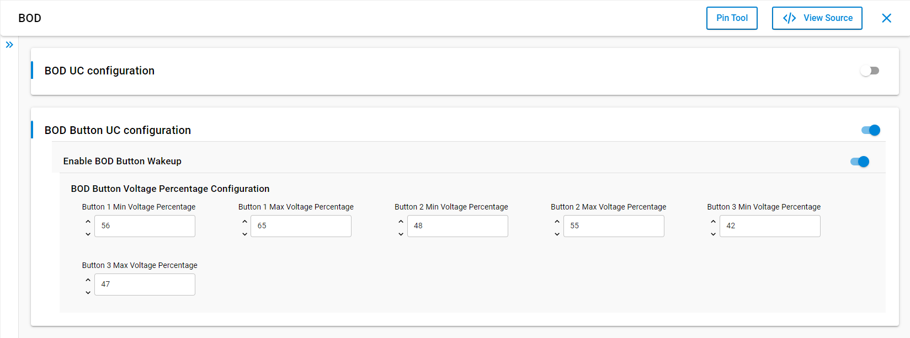
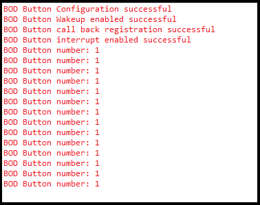

# BOD Button 
## Table of Contents

- [BOD Button](#bod-button)
  - [Table of Contents](#table-of-contents)
  - [Purpose/Scope](#purposescope)
  - [Prerequisites/Setup Requirements](#prerequisitessetup-requirements)
    - [Hardware Requirements](#hardware-requirements)
    - [Software Requirements](#software-requirements)
    - [Setup Diagram](#setup-diagram)
  - [Getting Started](#getting-started)
  - [Application Build Environment](#application-build-environment)
    - [Application Configuration Parameters](#application-configuration-parameters)
  - [Test the Application](#test-the-application)

## Purpose/Scope

 - This application demonstrates how to set up and use the Brown Out Detection (BOD) feature with button voltage monitoring. It allows users to configure voltage ranges for multiple buttons and monitor the voltage levels on the `VBAT_UULP_GPIO_2 (F12)` pin. When the voltage for a button falls within its configured range, a BOD interrupt will be triggered.


## Prerequisites/Setup Requirements

To use this application, the following hardware, software, and project setup is required.

### Hardware Requirements
- Windows PC
- Silicon Labs Si917 Evaluation Kit [WPK(BRD4002) + BRD4338A / BRD4342A / BRD4343A ]
- SiWx917 AC1 Module Explorer Kit (BRD2708A)

### Software Requirements

- Simplicity Studio
- Serial console setup
  - For serial console setup instructions, refer to [here](https://docs.silabs.com/wiseconnect/latest/wiseconnect-developers-guide-developing-for-silabs-hosts/#console-input-and-output).
### Setup Diagram

> 

## Getting Started

Refer to the instructions [here](https://docs.silabs.com/wiseconnect/latest/wiseconnect-getting-started/) to:

- [Install Simplicity Studio](https://docs.silabs.com/wiseconnect/latest/wiseconnect-developers-guide-developing-for-silabs-hosts/#install-simplicity-studio)
- [Install WiSeConnect 3 extension](https://docs.silabs.com/wiseconnect/latest/wiseconnect-developers-guide-developing-for-silabs-hosts/#install-the-wi-se-connect-3-extension)
- [Connect your device to the computer](https://docs.silabs.com/wiseconnect/latest/wiseconnect-developers-guide-developing-for-silabs-hosts/#connect-si-wx91x-to-computer)
- [Upgrade your connectivity firmware](https://docs.silabs.com/wiseconnect/latest/wiseconnect-developers-guide-developing-for-silabs-hosts/#update-si-wx91x-connectivity-firmware)
- [Create a Studio project](https://docs.silabs.com/wiseconnect/latest/wiseconnect-developers-guide-developing-for-silabs-hosts/#create-a-project)

For details on the project folder structure, refer to the [WiSeConnect Examples](https://docs.silabs.com/wiseconnect/latest/wiseconnect-examples/#example-folder-structure) page.

## Application Build Environment

### Application Configuration Parameters
  - **User Input as Percentage:**  
    -  The button voltage regions can also be configured using percentage values through the `sl_bod_button_uc_config_param_t` structure. The application converts these percentage values to actual voltages internally, using the configured VBAT value as a reference.
    -  The voltage ranges for the buttons are mapped and defined in the `sl_si91x_bod.c` file. Users can refer to this file to set appropriate ranges for their application needs.
  - To configure the voltage range for three buttons, define the following macros in `bod_button_example.h`:
  - **Button 1:**
    ```
    #define SL_BOD_BUTTON1_MIN_VOLTAGE_PERCENTAGE <value> ///< Minimum voltage percentage for Button 1
    #define SL_BOD_BUTTON1_MAX_VOLTAGE_PERCENTAGE <value> ///< Maximum voltage percentage for Button 1
    ```
  - **Button 2:**
    ```
    #define SL_BOD_BUTTON2_MIN_VOLTAGE_PERCENTAGE <value> ///< Minimum voltage percentage for Button 2
    #define SL_BOD_BUTTON2_MAX_VOLTAGE_PERCENTAGE <value> ///< Maximum voltage percentage for Button 2

    ```
  - **Button 3:**
    ```
    #define SL_BOD_BUTTON3_MIN_VOLTAGE_PERCENTAGE <value> ///< Minimum voltage percentage for Button 3
    #define SL_BOD_BUTTON3_MAX_VOLTAGE_PERCENTAGE <value> ///< Maximum voltage percentage for Button 3
      ```
**To configure the voltage range for three button using UC**:

 - Open  the **sl_si91x_bod_button.slcp** project file, select the **Software Component** tab and search for the **BOD** in search bar.
- Search for and select the **BOD** component.
- Use the configuration wizard to set the voltage percentage parameters for each button as needed. The configuration screen below shows the available options for customization.
  

  - The `Button 1 Min Voltage Percentage` and `Button 1 Max Voltage Percentage` fields correspond to the `SL_BOD_BUTTON1_MIN_VOLTAGE_PERCENTAGE` and `SL_BOD_BUTTON1_MAX_VOLTAGE_PERCENTAGE` macros, respectively. The same mapping applies for Button 2 and Button 3. These parameters are configurable only when `Enable BOD Button Wakeup` is enabled. 
  - Each button's voltage percentage must be set within the supported range of 33% to 66% of VBAT. 
  
  > **Note:**  
  > This application supports detection of up to three buttons based on voltage regions defined by resistor values.
  >
  > - Each button is mapped to a specific voltage range, determined by the `Resbank_Output_Fraction` in the resistor bank configuration.
  > - The button input is received via the `UULP_VBAT_GPIO_2[F12]` pin. When the voltage measured on this pin enters a configured region, the corresponding button interrupt will be triggered.
  >
  > **To ensure reliable detection:**
  > - The voltage regions for each button must not overlap.
  > - Avoid setting regions at extreme values (very close to 33% or 66% of VBAT).
  > - Carefully set the minimum and maximum values for each region according to the resistor values used in the button circuits.
  >
  > Proper configuration helps prevent false or multiple button detections due to overlapping or poorly defined regions.

> **Note**: For recommended settings, see the [recommendations guide](https://docs.silabs.com/wiseconnect/latest/wiseconnect-developers-guide-prog-recommended-settings/).

## Test the Application
- Refer to the instructions [here](https://docs.silabs.com/wiseconnect/latest/wiseconnect-getting-started/) to:
    1. Create a Project section [here](https://docs.silabs.com/wiseconnect/latest/wiseconnect-developers-guide-developing-for-silabs-hosts/#create-a-project).
    2. Compile and run the application.

- Expected Results
  - If the voltage on the input pin corresponding to a specific button drops below the configured threshold voltage, the respective BOD interrupt for that button will be triggered.
The console will as below. (Interrupt operations are not there in the Console Output)

  - Console Output:

    > 

> **Note:** Interrupt handlers are implemented in the driver layer, and user callbacks are provided for custom code. If you want to write your own interrupt handler instead of using the default one, make the driver interrupt handler a weak handler. Then, copy the necessary code from the driver handler to your custom interrupt handler.
