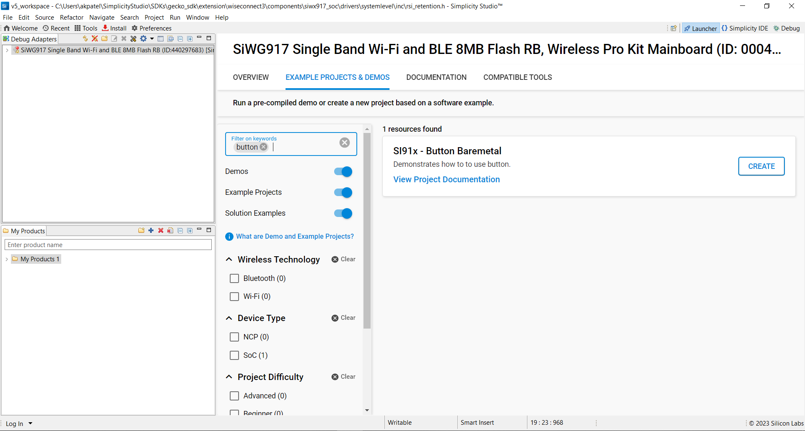

# Simple Button Bare Metal

## Introduction
- This example application demonstrates the use of BUTTON in a bare metal environment.The application toggles LED on each BUTTON press using the sl_si91x_led_toggle() function. Additional LED and BUTTON instances could be added.

## Requirements
- SI91X Board

## Setting Up 
 - To use this application following Hardware, Software and the Project Setup is required

### Hardware Requirements	
  - Windows PC 
  - Silicon Labs [SiWx917 Radio Board]

  

### Software Requirements
  - Si91x SDK
  - Embedded Development Environment
    - For Silicon Labs Si91x, use the latest version of Simplicity Studio (refer **"Download and Install Simplicity Studio"** section in **getting-started-with-siwx917-soc** guide at **release_package/docs/index.html**)
 
## Project Setup
- **Silicon Labs Si91x** refer **"Download SDKs"**, **"Add SDK to Simplicity Studio"**, **"Connect SiWx917"**, **"Open Example Project in Simplicity Studio"** section in **getting-started-with-siwx917-soc** guide at **release_package/docs/index.html** to work with Si91x and Simplicity Studio

## Loading Application on Simplicity Studio

1. With the product BRD4338A selected, navigate to the example projects by clicking on Example Projects & Demos
   in Simplicity Studio and create MEMLCD Baremetal example application as shown below.

## Build 
- Compile the application in Simplicity Studio using build icon 

## Device Programming
- To program the device ,refer **"Burn M4 Binary"** section in **getting-started-with-siwx917-soc** guide at **release_package/docs/index.html** to work with Si91x and Simplicity Studio

## Output
- The application will toggle the selected LED on each selected button press.

## Note
- The project uses BTN0 by default. To change the button to BTN1, follow the below steps :

  1. Add btn1 instance by traversing to the below path and select "Add New Instances" :
  "Software Components -> WiSeConnect 3 SDK -> Platform -> Si91x -> core -> BUTTON"

  
  2. Change the definition of macro BUTTON_INSTANCE_0 in button_baremetal.c file to button_btn1.
  
  3. Build and test the output.