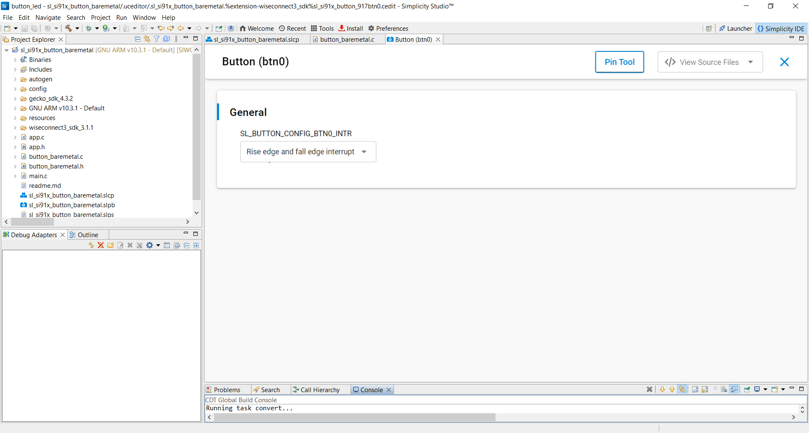
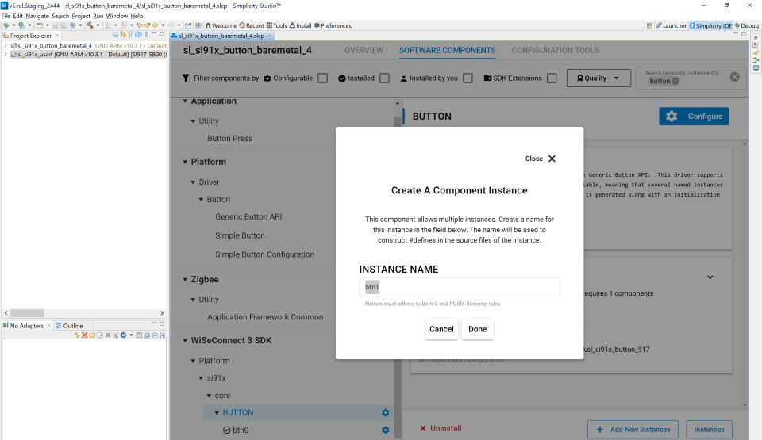

# SL BUTTON BAREMETAL

## Table of Contents

- [Purpose/Scope](#purposescope)
- [Prerequisites/Setup Requirements](#prerequisitessetup-requirements)
  - [Hardware Requirements](#hardware-requirements)
  - [Software Requirements](#software-requirements)
  - [Setup Diagram](#setup-diagram)
- [Getting Started](#getting-started)
- [Application Build Environment](#application-build-environment)
- [Test the Application](#test-the-application)

## Purpose/Scope

This example application demonstrates the use of BUTTON in a bare metal environment. The application toggles the LED on each BUTTON press using the `sl_si91x_led_toggle()` function.

## Prerequisites/Setup Requirements

### Hardware Requirements

- Windows PC
- Silicon Labs Si917 Evaluation Kit [WPK(BRD4002) + BRD4338A / BRD4342A / BRD4343A ]
- SiWx917 AC1 Module Explorer Kit (BRD2708A)

### Software Requirements

- Simplicity Studio

### Setup Diagram

## Getting Started

Refer to the instructions [here](https://docs.silabs.com/wiseconnect/latest/wiseconnect-getting-started/) to:

- [Install Simplicity Studio](https://docs.silabs.com/wiseconnect/latest/wiseconnect-developers-guide-developing-for-silabs-hosts/#install-simplicity-studio)
- [Install WiSeConnect 3 extension](https://docs.silabs.com/wiseconnect/latest/wiseconnect-developers-guide-developing-for-silabs-hosts/#install-the-wi-se-connect-3-extension)
- [Connect your device to the computer](https://docs.silabs.com/wiseconnect/latest/wiseconnect-developers-guide-developing-for-silabs-hosts/#connect-si-wx91x-to-computer)
- [Upgrade your connectivity firmware](https://docs.silabs.com/wiseconnect/latest/wiseconnect-developers-guide-developing-for-silabs-hosts/#update-si-wx91x-connectivity-firmware)
- [Create a Studio project](https://docs.silabs.com/wiseconnect/latest/wiseconnect-developers-guide-developing-for-silabs-hosts/#create-a-project)

For details on the project folder structure, see the [WiSeConnect Examples](https://docs.silabs.com/wiseconnect/latest/wiseconnect-examples/#example-folder-structure) page.

## Application Build Environment

 The application will toggle the selected LED on each selected button press.

### Configuration

- Button Configure Interrupt: The button interrupt type can be configured. By default, Rise and Fall edge interrupt type has been set. One of the following can be selected:
  - Low level interrupt: Interrupt on low/pressed button state can be configured
  - High level interrupt: Interrupt on high/released button state
  - Low level and high level: Interrupt on low/pressed and high/released button state
  - Rise edge interrupt: Interrupt on rising edge of the button press
  - Fall edge interrupt: Interrupt on falling edge of the button press
  - Rise adge and fall edge interrupt: Interrupt on rising edge and falling edge of the button press

> 

## Test the Application

The project uses BTN0 by default. To change the button to BTN1, follow the below steps:

1. Add btn1 instance by traversing to the below path and select "Add New Instances" :
    "Software Components -> WiSeConnect 3 SDK -> Device -> Si91x -> MCU -> Drivers -> BUTTON"

   

2. Change the definition of macro BUTTON_INSTANCE_0 in the `button_baremetal.c` file to button_btn1.

3. Build and test the output.

   - LED0 will toggle when Button0 pressed.

> **Note:**
>
> - In case of DEVKIT board (BRD2605A), the blue LED will toggle on button press. No other LED instance will work for this board. To further use the DEVKIT LED, refer to the RGB LED application.
>
> - Interrupt handlers are implemented in the driver layer, and user callbacks are provided for custom code. If you want to write your own interrupt handler instead of using the default one, make the driver interrupt handler a weak handler. Then, copy the necessary code from the driver handler to your custom interrupt handler.
