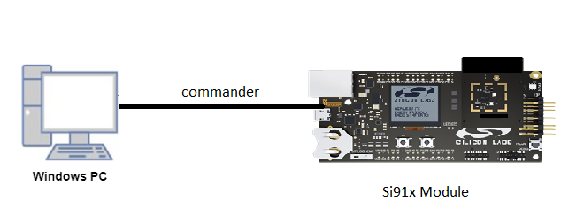
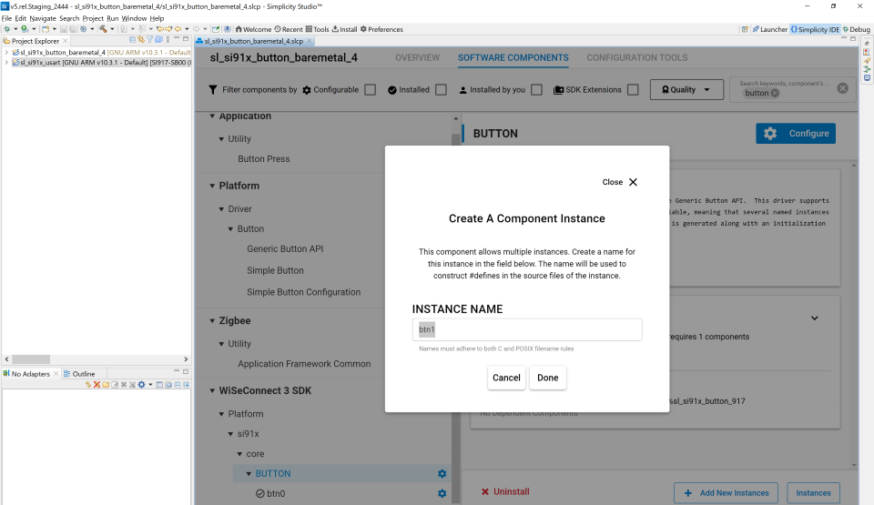

# SiWx91x Platform Button Baremetal

## Table of Contents

- [SiWx91x Platform Button Baremetal](#platform-siwx91x-button-baremetal)
  - [Table of Contents](#table-of-contents)
  - [Purpose/Scope](#purposescope)
  - [Prerequisites/Setup Requirements](#prerequisitessetup-requirements)
    - [Hardware Requirements](#hardware-requirements)
    - [Software Requirements](#software-requirements)
    - [Setup Diagram](#setup-diagram)
  - [Getting Started](#getting-started)
  - [Application Build Environment](#application-build-environment)
    - [Configuration](#configuration)
  - [Test the Application](#test-the-application)
  - [Troubleshooting](#troubleshooting)
  - [Resources](#resources)
  - [Report Bugs/Support](#report-bugssupport)

## Purpose/Scope

This example application demonstrates the use of BUTTON in a bare metal environment. The application toggles the LED on each BUTTON press using the [sl_si91x_led_toggle()](https://docs.silabs.com/wiseconnect/latest/wiseconnect-api-reference-guide-si91x-peripherals/led#sl-si91x-led-toggle) function.

## Prerequisites/Setup Requirements

### Hardware Requirements

- Windows PC
- Silicon Labs SiWx91x Evaluation Kit [[BRD4002](https://www.silabs.com/development-tools/wireless/wireless-pro-kit-mainboard?tab=overview) + [BRD4338A](https://www.silabs.com/development-tools/wireless/wi-fi/siwx917-rb4338a-wifi-6-bluetooth-le-soc-radio-board?tab=overview) / [BRD4342A](https://www.silabs.com/development-tools/wireless/wi-fi/siwx91x-rb4342a-wifi-6-bluetooth-le-soc-radio-board?tab=overview) / [BRD4343A](https://www.silabs.com/development-tools/wireless/wi-fi/siw917y-rb4343a-wi-fi-6-bluetooth-le-8mb-flash-radio-board-for-module?tab=overview) / [BRD4343C](https://www.silabs.com/development-tools/wireless/wi-fi/siw917y-rb4343c-wi-fi-6-bluetooth-le-8mb-flash-radio-board-for-module?tab=overview)]
- SiWx917 AC1 Module Explorer Kit [BRD2708A](https://www.silabs.com/development-tools/wireless/wi-fi/siw917y-ek2708a-explorer-kit)

### Software Requirements

- Simplicity Studio

### Setup Diagram


## Getting Started

Refer to the instructions [here](https://docs.silabs.com/wiseconnect/latest/wiseconnect-getting-started/) to:

- [Install Simplicity Studio](https://docs.silabs.com/wiseconnect/latest/wiseconnect-developers-guide-developing-for-silabs-hosts/using-the-simplicity-studio-ide#install-simplicity-studio)
- [Install WiSeConnect extension](https://docs.silabs.com/wiseconnect/latest/wiseconnect-developers-guide-developing-for-silabs-hosts/using-the-simplicity-studio-ide#install-the-wiseconnect-3-extension)
- [Connect your device to the computer](https://docs.silabs.com/wiseconnect/latest/wiseconnect-developers-guide-developing-for-silabs-hosts/using-the-simplicity-studio-ide#connect-siwx91x-to-computer)
- [Upgrade your connectivity firmware](https://docs.silabs.com/wiseconnect/latest/wiseconnect-developers-guide-developing-for-silabs-hosts/using-the-simplicity-studio-ide#update-siwx91x-connectivity-firmware)
- [Create a Studio project](https://docs.silabs.com/wiseconnect/latest/wiseconnect-developers-guide-developing-for-silabs-hosts/using-the-simplicity-studio-ide#create-a-project)

For details on the project folder structure, see the [WiSeConnect Examples](https://docs.silabs.com/wiseconnect/latest/wiseconnect-examples/#example-folder-structure) page.

## Application Build Environment

- Configure the following macros in [`button_baremetal.c`](button_baremetal.c) file and update/modify following macros, if required.

  - `BUTTON_INSTANCE`: Selects the button instance whose press events toggle the LED. By default, it is set to `button_btn0`.

    ```c
      #define BUTTON_INSTANCE button_btn0 // Button instance
    ```

  - `LED_INSTANCE`: Selects the LED instance that is toggled on each button press. By default, it is set to `led_led0`.

    ```c
      #define LED_INSTANCE    led_led0    // LED instance
    ```

 The application toggles the selected LED on each selected button press.

### Configuration

- Button Configure Interrupt: The button interrupt type can be configured. By default, Rise and Fall edge interrupt type has been set. One of the following can be selected:
  - Low level interrupt: Interrupt on low/pressed button state can be configured
  - High level interrupt: Interrupt on high/released button state
  - Low level and high level: Interrupt on low/pressed and high/released button state
  - Rise edge interrupt: Interrupt on rising edge of the button press
  - Fall edge interrupt: Interrupt on falling edge of the button press
  - Rise adge and fall edge interrupt: Interrupt on rising edge and falling edge of the button press

> 

> **Note**: For recommended settings, please refer the [recommendations guide](https://docs.silabs.com/wiseconnect/latest/wiseconnect-developers-guide-prog-recommended-settings/).

## Test the Application

The project uses BTN0 by default. To change the button to BTN1, follow the below steps:

1. Add btn1 instance by traversing to the below path and select "Add New Instances":
    "Software Components -> WiSeConnect SDK -> Device -> SiWx91x -> MCU -> Drivers -> BUTTON"

   

2. Change the definition of macro BUTTON_INSTANCE_0 in the [`button_baremetal.c`](button_baremetal.c) file to button_btn1.

3. Build and test the output.

   - LED0 will toggle when Button0 pressed.

> **Note:**
>
> - In case of DEVKIT board [BRD2605A](https://www.silabs.com/development-tools/wireless/wi-fi/siwx917-dk2605a-wifi-6-bluetooth-le-soc-dev-kit?tab=overview), the blue LED toggles on button press. No other LED instance works for this board. To further use the DEVKIT LED, refer to the RGB LED application.
>
> - Interrupt handlers are implemented in the driver layer, and user callbacks are provided for custom code. If you want to write your own interrupt handler instead of using the default one, make the driver interrupt handler a weak handler. Further then, copy the necessary code from the driver handler to your custom interrupt handler.
>
> - A maximum of 8 HP GPIO buttons, 8 ULP GPIO buttons, and 5 UULP GPIO buttons can be used simultaneously. This limitation arises from the number of available GPIO interrupts allocated for each GPIO type.
>
> - By default, the `SL_SI91X_BUTTON_DEBOUNCE` macro is disabled. If debouncing is needed, please enable the `SL_SI91X_BUTTON_DEBOUNCE` macro in studio preprocessor settings.
>
> - In case of sleep-wakeup, call `button_init_instances()` and `led_init_instances()` after wakeup before handling button events or toggling LEDs so the configured button and LED instances are restored.

## Troubleshooting

- If the project does not build, ensure Simplicity Studio and the WiSeConnect extension are installed and the board is connected.
- If the device is not detected, reinstall the connectivity firmware and check USB drivers.

## Resources

- [WiSeConnect Getting Started](https://docs.silabs.com/wiseconnect/latest/wiseconnect-getting-started/)
- [WiSeConnect Examples](https://docs.silabs.com/wiseconnect/latest/wiseconnect-examples/)
- [SiWx91x SoC Documentation](https://docs.silabs.com/wiseconnect/latest/)

## Report Bugs/Support

For issues and support, use the Silicon Labs Community or your normal support channel.
