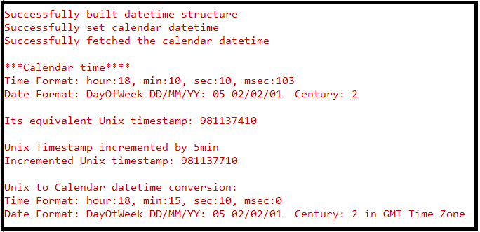

# SL CALENDAR

## Table of Contents

- [Purpose/Scope](#purposescope)
- [Overview](#overview)
- [About Example Code](#about-example-code)
- [Prerequisites/Setup Requirements](#prerequisitessetup-requirements)
  - [Hardware Requirements](#hardware-requirements)
  - [Software Requirements](#software-requirements)
  - [Setup Diagram](#setup-diagram)
- [Getting Started](#getting-started)
- [Application Build Environment](#application-build-environment)
  - [Application Configuration Parameters](#application-configuration-parameters)
- [Test the Application](#test-the-application)

## Purpose/Scope

This example demonstrates the clock configuration, one millisecond trigger, one second trigger, alarm configuration, and time conversion.

  > **Note:** Before enabling any trigger, it is recommended to calibrate the clock.

## Overview

- Calendar calculates milliseconds, seconds, minutes, hours, days, months and years up to 4 centuries.
- It also calculates days of week and takes care of number of days in month as well as leap year.
- It can also configure an alarm for desired time as a one-shot trigger.
- It can generate triggers on one-second and one-millisecond time intervals.
- It uses APB for read and write operations in real time.

## About Example Code

- This example demonstrates clock configuration, setting calendar date-time, retrieving calendar date-time, setting alarm date-time, retrieving alarm date-time, handling alarm triggers, one-millisecond triggers, one-second triggers, and clock calibration.
- A structure is created containing default values for calendar date-time. It is created using \ref sl_si91x_calendar_build_datetime_struct. After entering all the parameters, it returns a structure filled with all the parameters.
- Calendar date-time is configured using the \ref sl_si91x_calendar_set_date_time API. It configures the date-time, and the calendar blocks start counting from that time.
- To verify if the desired time is set, the \ref sl_si91x_calendar_get_date_time API is used. It returns a structure with the current date-time.

- If **ALARM_EXAMPLE** macro is enabled:

  - A date-time structure is created using \ref sl_si91x_calendar_build_datetime_struct for configuring the alarm.  
  - The alarm is configured using \ref sl_si91x_calendar_set_alarm API.
  - Callback is registered to perform action at the time of trigger using \ref sl_si91x_calendar_register_alarm_trigger_callback API.
  - To verify if the desired alarm is set, \ref sl_si91x_calendar_get_alarm API is used. It returns a structure which has configured alarm date-time.
  - At the time of trigger, it prints current date-time on the console.

- If **SEC_INTR** macro is enabled:

  - Callback is registered for one second trigger using \ref sl_si91x_calendar_register_sec_trigger_callback API.
  - At every one second, the console prints `one_sec_callback`.

- If **MILLI_SEC_INTR** macro is enabled:

  - Callback is registered for one millisecond trigger using \ref sl_si91x_calendar_register_msec_trigger_callback API.
  - At every one second, the console prints `on_msec_callback triggered 1000 times`.
  - It accumulates the 1000 trigger at one millisecond time frame and prints at only one second.

- If **TIME_CONVERSION** macro is enabled:

  - This converts NTP time to Unix Time and vice versa.
  - In this example, \ref sl_si91x_calendar_convert_unix_time_to_ntp_time API is called to convert Unix time to NTP time, it expects Unix time as parameter.
  - It updates the variable with NTP time which is passed as parameter.
  - After conversion, NTP time and Unix time are printed on the console.
  - Now \ref sl_si91x_calendar_convert_ntp_time_to_unix_time API is used to convert NTP time to Unix time, it expects NTP time as parameter.
  - It updates the variable with Unix time which is passed as parameter.
  - After conversion, NTP time and Unix time are printed on the console.

## Prerequisites/Setup Requirements

### Hardware Requirements

- Windows PC
- Silicon Labs Si917 Evaluation Kit [WPK(BRD4002)+ BRD4338A / BRD4342A / BRD4343A ]
- SiWx917 AC1 Module Explorer Kit (BRD2708A)

### Software Requirements

- Simplicity Studio
- Serial console setup
  - For serial console setup instructions, refer [here](https://docs.silabs.com/wiseconnect/latest/wiseconnect-developers-guide-developing-for-silabs-hosts/#console-input-and-output).

### Setup Diagram

> 

## Getting Started

Refer to the instructions [here](https://docs.silabs.com/wiseconnect/latest/wiseconnect-getting-started/) to:

- [Install Simplicity Studio](https://docs.silabs.com/wiseconnect/latest/wiseconnect-developers-guide-developing-for-silabs-hosts/#install-simplicity-studio)
- [Install WiSeConnect 3 extension](https://docs.silabs.com/wiseconnect/latest/wiseconnect-developers-guide-developing-for-silabs-hosts/#install-the-wi-se-connect-3-extension)
- [Connect your device to the computer](https://docs.silabs.com/wiseconnect/latest/wiseconnect-developers-guide-developing-for-silabs-hosts/#connect-si-wx91x-to-computer)
- [Upgrade your connectivity firmware](https://docs.silabs.com/wiseconnect/latest/wiseconnect-developers-guide-developing-for-silabs-hosts/#update-si-wx91x-connectivity-firmware)
- [Create a Studio project](https://docs.silabs.com/wiseconnect/latest/wiseconnect-developers-guide-developing-for-silabs-hosts/#create-a-project)

For details on the project folder structure, see the [WiSeConnect Examples](https://docs.silabs.com/wiseconnect/latest/wiseconnect-examples/#example-folder-structure) page.

## Application Build Environment

### Application Configuration Parameters

Configure the following macros in the `calendar_example.h` file and update/modify following macros, if required.

- `ALARM_EXAMPLE`: If ALARM_EXAMPLE is enabled, it prints "Alarm Callback is Triggered" on console when the alarm is triggered. By default, it is set to 0.

  ```C
    #define ALARM_EXAMPLE     0 // To enable alarm trigger 
  ```

- `SEC_INTR`: If SEC_INTR is enabled, every one second "One Sec Callback is Triggered" print is displayed on the serial console. By default, it is set to 0.

  ```C
    #define SEC_INTR          0 // To enable one second trigger 
  ```

- `MILLI_SEC_INTR`: If MILLI_SEC_INTR is enabled, every one second "One Milli-Sec Callback triggered 1000 times" print is displayed on the serial console. By default, it is set to 0.

  ```C
    #define MILLI_SEC_INTR    0 // To enable one millisecond trigger 
  ```

- `TIME_CONVERSION`: If TIME_CONVERSION is enabled, time conversion between Unix and NTP is printed on serial console. By default, it is set to 0.

  ```C
    #define TIME_CONVERSION   0 // To enable time conversion 
  ```

## Test the Application

Refer to the instructions [here](https://docs.silabs.com/wiseconnect/latest/wiseconnect-getting-started/) to:

1. Compile and run the application.
2. By default, time and date is configured and its Unix timestamp conversion is done, and prints are observed on serial console.
3. Unix timestamp is now incemented by 5min and it is converted back to Calendar time and date.
4. After successful program execution, the prints in serial console looks as shown below.

    

> **Note:**
>
> - Interrupt handlers are implemented in the driver layer, and user callbacks are provided for custom code. If you want to write your own interrupt handler instead of using the default one, make the driver interrupt handler a weak handler. Then, copy the necessary code from the driver handler to your custom interrupt handler.
