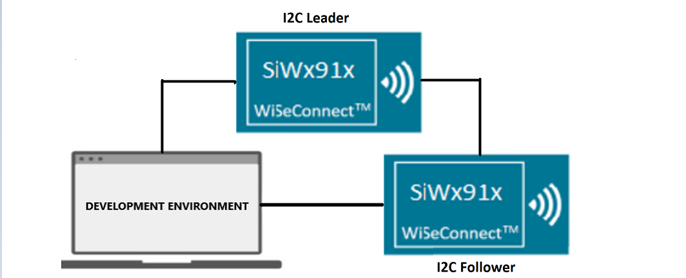
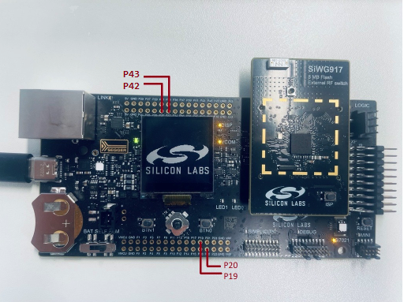

# SL COMBO APP

## Table of Contents

- [Purpose/Scope](#purposescope)
- [Overview](#overview)
- [Prerequisites/Setup Requirements](#prerequisitessetup-requirements)
  - [Hardware Requirements](#hardware-requirements)
  - [Software Requirements](#software-requirements)
  - [Setup Diagram](#setup-diagram)
- [Getting Started](#getting-started)
- [Application Build Environment](#application-build-environment)
  - [Pin Configuration](#pin-configuration)
- [Test the Application](#test-the-application)
  - [Expected Results](#expected-results)

## Purpose/Scope

- The purpose of this application is to demonstrate the use of CMSIS-RTOS concepts embedded with multiple peripherals. The following concepts are demonstrated:
  - Semaphores
  - Event Flags
- This application contains a comprehensive sample application which includes multiple perpherals listed below
  - PWM
  - I2C (as Driver Leader application)
  - GPIO Interrupts
  - Timer
- This example creates separate threads for the peripherals Button, PWM, I2C.
- These threads run in parallel but are synchronized by using above mentioned CMSIS-RTOS concepts

## Overview 

**1. I2C**

- I2C initialization includes creation of an OS Event flag
- I2C thread will try keep on waiting for event flag to occur. On the other hand, timer interrupt is responsible for setting this event flag.
- I2C thread will initiate once timer interrupt occurs after default timeout (5sec)
- I2C instances will be configured in Leader mode. The SCL and SDA lines of Leader controller are connected to another I2C Follower's SCL and SDA pins.

- From Leader the Follower address is sent after START on bus and waits till it gets the ACK respose from the Follower
- The write data to other Follower applicaction and send back same data once received it compares and produce the results.
- I2C can be configured with following features
  - I2C standard compliant bus interface with open-drain pins
    - Configurable as Leader or Follower
    - Four speed modes: Standard Mode (100 kbps), Fast Mode (400 kbps), Fast Mode Plus (1Mbps) and High-Speed Mode (3.4 Mbps)
    - 7 or 10-bit addressing and combined format transfers. 
 
**2. PWM**

- PWM initialization includes creation of an OS Semaphore
- PWM thread will try to acquire this semaphore. On the other hand, button task is responsible for releasing this semaphore.
- Button releases the semaphore on every GPIO interrupt (as soon as it is pressed)
- PWM thread toggles the state of PWM generation upon acquiring semaphore
- The Motor Control PWM (MCPWM) controller is used to generate a periodic pulse waveform, which is useful in motor control and power control applications 
- The MCPWM controller acts as a timer to count up to a period count value,the time period and the duty cycle of the pulses are both programmable
- This application uses the MCPWM driver to create 4 independent PWMs (running at the same frequency),square wave will be generated on 
  PWM_1L,PWM_1H.

## Prerequisites/Setup Requirements

### Hardware Requirements

- Windows PC
- Silicon Labs Si917 Evaluation Kit [WPK(BRD4002) + BRD4338A]

### Software Requirements

- Simplicity Studio
- Serial console Setup
  - The Serial Console setup instructions are provided below:
Refer [here](https://docs.silabs.com/wiseconnect/latest/wiseconnect-developers-guide-developing-for-silabs-hosts/#console-input-and-output)

### Setup Diagram

> 

## Getting Started

Refer to the instructions [here](https://docs.silabs.com/wiseconnect/latest/wiseconnect-getting-started/) to:

- Install Studio and WiSeConnect 3 extension
- Connect your device to the computer
- Upgrade your connectivity firmware
- Create a Studio project

For details on the project folder structure, see the [WiSeConnect Examples](https://docs.silabs.com/wiseconnect/latest/wiseconnect-examples/#example-folder-structure) page.

## Application Build Environment

### Application Configuration Parameters

- Open sl_si91x_i2c_driver_leader.slcp project file select software component tab and search for i2c in search bar.
- Click on **I2C2** and configure the I2C2 instance as per configuration parameters given in wizard.
- For using any other I2C instance user has to add that I2C instance by clicking on **I2C Instance** from configuration wizard and then clicking on **Add New Instance**
- For creating I2C instances write 'I2C0', 'I2C1' or 'I2C2' on the wizard for respective instance and then click on **Done**
- After creation of instances separate configuration files are get generated in **config folder**.
- If project built without selecting configurations, it will take default values from UC.
- Configure mode, operating-mode and transfer-type of I2C instance using respective instance UC.
- Change 'Mode' to 'Leader mode' on UC.
- Change 'Operating Mode' as per bus-speed requirement.
- Change 'Transfer Type' to 'Using Interrupt' for Blocking Application or to 'Using DMA' for NON-Blocking Application.
- After above UC configurations also configure following macros in i2c_leader_example.c file and update/modify following macros if required.

  ```C
    #define I2C_INSTANCE_USED        // Update it with i2c instance number used for this application: 0 for i2c0, 1 for i2c1 and 2 for i2c2
    #define BLOCKING_APPLICATION     // Enable it for enabling I2C transfer using interrupt Application
    #define NON_BLOCKING_APPLICATION // Enable it for enabling I2C transfer using interrupt Application
    #define FOLLOWER_I2C_ADDR        // Update I2C follower address
    #define I2C_SIZE_BUFFERS         // To change the number of bytes to send and receive.Its value should be less than maximum buffer size macro value.
  ```

> **Note:** Enable either BLOCKING application or NON-BLOCKING application macro, at a time. For I2C0 instance change the value of following macros in path: /$project/config/RTE_Device_917.h

```c
  #define RTE_I2C0_SCL_PORT_ID 0   // SCL pin port id
  #define RTE_I2C0_SDA_PORT_ID 0   // SDA pin port id
```

> **Note:** After above configurations connect SCL and SDA pins of Leader and follower then run the application and observe the results by connecting SDA and SCL pins to logic Analyzer(Also enable glitch filter for SCL channel with time period 100ns, to avoid glitches).

- For getting proper speeds with fast and fast plus modes, please use external pullup of around 1.8K
- For high speed mode data transfer external pullup is must.
- Configure the UC as mentioned below.

  

## Pin Configuration

**I2C0:**

| PIN |   ULP GPIO PIN     |   Description             |
| --- | ------------------ | --------------------------|
| SCL |   GPIO_7 [P20]     | Connect to Follower SCL pin |
| SDA |   GPIO_6 [P19]     | Connect to Follower SDA pin |

**I2C1:**

| PIN |   GPIO PIN        |    Description            |
| --- | ----------------- | ------------------------- |
| SCL |   GPIO_50 [P32]   | Connect to Follower SCL pin |
| SDA |   GPIO_51 [P34]   | Connect to Follower SDA pin |

**I2C2:**

| PIN |   ULP GPIO PIN             |   Description             |
| --- | -------------------------- | ------------------------- |
| SCL | ULP_GPIO_7 [EXP_HEADER-15] | Connect to Follower SCL pin |
| SDA | ULP_GPIO_6 [EXP_HEADER-16] | Connect to Follower SDA pin |




**GPIO Interrupt**

| PIN       |     2.0 GPIO PIN      |
| ---       |       ---             | 
| Button 0  | UULP_VBAT_GPIO_2[F12] |

**PWM Channel0**

  | Description   | GPIO    | Connector    |
  | ------------- | ------- | ------------ |
  | PWM_H         | GPIO_7  | P20          |
  | PWM_L         | GPIO_6  | P19          |

**PWM Channel1**

  | Description   | GPIO    | Connector    |
  | ------------- | ------- | ------------ |
  | PWM_H         | GPIO_9  | F9           |
  | PWM_L         | GPIO_8  | F8           |

**PWM Channel2**

  | Description   | GPIO    | Connector    |
  | ------------- | ------- | ------------ |
  | PWM_H         | GPIO_11 | F13          |
  | PWM_L         | GPIO_10 | F11          |

**PWM Channel3**

  | Description   | GPIO        | Connector   |
  | ------------- | -------     | ----------- |
  | PWM_H         | ULP_GPIO_7  | P12         |
  | PWM_L         | ULP_GPIO_6  | P13         |
  
## Test the Application

1. Compile and run the application.
2. Connect SCL(ULP_GPIO_7) and SDA(ULP_GPIO_6) pins with the I2C Driver follower device.
3. When the application runs, it triggers 3 threads (I2C, PWM, Button).
4. After timer interrupt sets the event flag, I2C threads unblocks from that event flag read, and write data to I2C Driver Follower and read back from it.
5. After the transfer is completed, it validates the data and prints "Test Case Passed" on the console.
6. Press push button BTN0 on WSTK board and check PWM output on PWM pins
 as mentioned above.

## Expected Results 

**I2C**

- Will get "Leader-Follower read-write Data comparison is successful, Test Case Passed" print on console when I2C instance data send and receive are success.

**PWM**

- PWM signal toggling can be observed whenever the button BTN0 is pressed.
- Check PWM output on PWM GPIOs by connecting logic analyser.

 > 

 **Note:**

- Recommending to adjust sync delay according to i2c follower
- Interrupt handlers are implemented in the driver layer, and user callbacks are provided for custom code. If user needs to implement their own interrupt handler instead of using the default one, it is recommeneded to make the driver interrupt handler a weak handler. Then, copy the necessary code from the driver handler to your custom interrupt handler.
