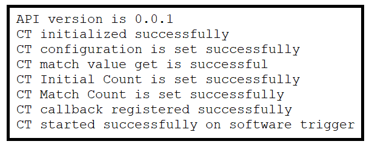
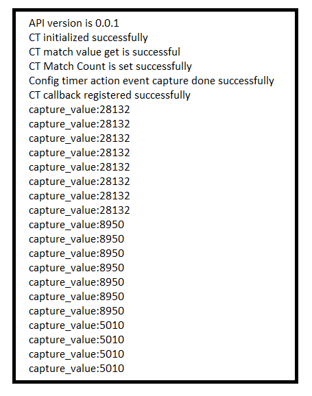

# SL CONFIG TIMER

## Table of Contents

- [Purpose/Scope](#purposescope)
- [Overview](#overview)
- [About Example Code](#about-example-code)
- [Prerequisites/Setup Requirements](#prerequisitessetup-requirements)
  - [Hardware Requirements](#hardware-requirements)
  - [Software Requirements](#software-requirements)
  - [Setup Diagram](#setup-diagram)
- [Getting Started](#getting-started)
- [Application Build Environment](#application-build-environment)
  - [Pin Configuration](#pin-configuration-for-pwm-and-dma-mode-use-case)
  - [Pin Configuration](#pin-configuration-for-input-event-mode-use-case)
  - [Macros for CT Configurations:](#macros-for-ct-configurations)
- [Test the Application](#test-the-application)
  - [Run the application in counter mode](#run-the-application-in-counter-mode)
  - [Run the application in PWM mode](#run-the-application-in-pwm-mode)

## Purpose/Scope

- This Config Timer example demonstrates 4 use cases of a timer:
  - First as free-running timer with GPIO toggle functionality. Counter-0 is configured to generate interrupts every millisecond and toggles GPIO.
  - Second as a waveform generator producing two PWM outputs: counter-1 generates a square wave (50%-duty cycle) and counter-0 will produce a waveform whose duty cycle continuously varies from 100% to 0% then 0% to 100%, in steps of 1%.
  - Third as a CT DMA used to generate varied PWM waveform. counter-0 and counter-1 will generate PWM output with varied duty cycle.
  - Fourth as a input capture event. Here it captures the input event on GPIO pin and store the captured value in
  capture_value variable.

## Overview

- Configurable timers are used for counting clocks and events, capturing events on the GPIOs in input mode, and outputting modulated signals. They can be programmed to work in Pulse Width Modulation (PWM) mode in which a pulse width modulated wave is driven on the outputs according to the programmed ON time and OFF times. Configurable Timers are present in MCU HP peripherals.
  - There is a programming feature to select Clocks, events or external clock as a tick.
  - The input clock can be the reference clock or the system clock.
  - Supports a wide range of features like starting the counter, stopping the counter, continuing the counter from the stopped value, halt and increment the counter, and capturing the events.
  - It can output PWM signals with any cycle/pulse length.
  - It can start a PPG in synchronous with PWM signal output. It can superimpose a PPGs output signal on the PWM signal and output it.
  - It can generate a non-overlap signal that maintains the response time of the power transistor(dead time) from PWM signal output.
  - It can capture timing of input signal changes and pulse width in synchronous with PWM signal.
  - It can start the ADC at any time, in synchronous with the PWM signal output.
  - It performs noise cancelling of the emergency motor shutdown interrupt signal.
  - It can freely set the pin state at the time of motor shutdown when a valid signal input is detected.
  - Supports APB interface for programming.

## About Example Code

- This example demonstrates the Config Timer as a normal counter, toggling GPIO on every interrupt and as PWM output generator.
- Two macros are present: CT_PWM_MODE_USECASE and CT_COUNTER_MODE_USECASE. By default, the normal counter use case is enabled.
- Enable only one of the following use case macros at a time.
  - If **CT_PWM_MODE_USECASE** is enabled:
    - The Config Timer is initialized using \ref sl_si91x_ct_init() API.
    - After initialization, the desired counter parameters are configured using \ref sl_si91x_ct_set_configuration() API, the parameters are set through UC.
    - Match count for both the counters are configured using same @ref sl_si91x_ct_set_match_count() API.
    - The desired OCU parameters are configured using \ref sl_si91x_ct_set_ocu_configuration() API.
    - The desired OCU controls for both counters are configured using API \ref sl_si91x_config_timer_set_ocu_control() by changing the counter number.
    - Registers the callback for enabling peak interrupt, for counter-1 using \ref sl_si91x_ct_register_callback() API.
    - Starts both the counters using API \ref sl_si91x_ct_start_on_software_trigger() by changing the counter number.
    - After enabling OCU mode, a continuous loop for pwm output is performed.
    - It creates 2 independent PWM Outputs - CT output-0 and CT output-1.
    - CT Output-1 will produce a square wave, and CT Output-0 will produce a waveform whose duty cycle continuously varies from 100% to 0% then 0% to 100%, in steps of 1%.
    - Connect the logic analyzer to the Evaluation Kit board's GPIO-29 & GPIO-30 for output-0 and output-1 respectively and observe the PWM waveforms.
  - If **CT_COUNTER_MODE_USECASE** is enabled:
    - First Configuring ULP_GPIO_1 pin mux mode and direction as output.
    - The Config Timer is initialized using \ref sl_si91x_ct_init() API.
    - After initialization, the desired counter parameters are configured using \ref sl_si91x_ct_set_configuration() API. The parameters are set using UC.
    - Set the initial count value of counter using \ref sl_si91x_ct_set_initial_count() API.
    - Match count is configured using \ref sl_si91x_ct_set_match_count() API.
    - Registers the callback for enabling peak interrupt for counter-0 using \ref sl_si91x_ct_register_callback() API.
    - Starts counter-0 using \ref sl_si91x_ct_start_on_software_trigger() API.
  - **Callback Function**
    - ULP_GPIO_1 pin gets toggled on every interrupt occurring at every millisecond and increments interrupt count.
    - When the interrupt count is greater than ten, then timer is de-initialized, callback is unregistered and disables interrupt through \ref sl_si91x_config_timer_deinit() API.
  - If **CT_COUNTER_DMA_MODE_USECASE** is enabled:
    - CT_COUNTER_DMA_MODE_USECASE is used to generate varied PWM waveform.
    - Both counter0 and counter1 compare value arrays are initialized with step increments.
    - The Config Timer is initialized using sl_si91x_config_timer_init() API.
    - Counter parameters are configured using sl_si91x_config_timer_set_configuration() API.
    - Match count for both counters is set using sl_si91x_config_timer_set_match_count() API.
    - OCU (Output Compare Unit) configuration is set for both counters, enabling DMA and output toggling    using sl_si91x_config_timer_set_ocu_configuration() API.
    - DMA is configured for counter0 and counter1 using sl_si91x_config_timer_dma_configure() API.
    - Callback is registered for DMA transfer completion using sl_si91x_config_timer_register_callback() API.
    - Both counters are started using sl_si91x_config_timer_start_on_software_trigger() API.
    - On DMA interrupt, the DMA transfer index for each counter is incremented.
    - When the end of the compare value array is reached, the index wraps around to repeat the sequence.
    - The next DMA transfer is triggered for each counter using sl_si91x_config_timer_dma_transfer() API.
    - CT Output-0 and Output-1 will produce a continuous varied PWM using DMA.
  - If **CT_COUNTER_INPUT_EVENT_USECASE** is enabled:
    - The Config Timer is initialized using sl_si91x_config_timer_init() API.
    - Counter parameters are configured using sl_si91x_config_timer_set_configuration() API.
    - Action events are selected for start and capture using sl_si91x_config_timer_select_action_event() API.
    - Callback is registered for the capture event using sl_si91x_config_timer_register_callback() API.
    - Captured values are read using sl_si91x_config_timer_read_capture() API.
    - The captured value is printed or processed as needed.
  
## Prerequisites/Setup Requirements

### Hardware Requirements

- Windows PC.
- Silicon Labs Si917 Evaluation Kit [WPK(BRD4002) + BRD4338A / BRD4342A / BRD4343A ].
- SiWx917 AC1 Module Explorer Kit (BRD2708A)

### Software Requirements

- Simplicity Studio
- Serial console setup
  - For serial console setup instructions, refer [here](https://docs.silabs.com/wiseconnect/latest/wiseconnect-developers-guide-developing-for-silabs-hosts/#console-input-and-output).

### Setup Diagram

> 

## Getting Started

Refer to the instructions [here](https://docs.silabs.com/wiseconnect/latest/wiseconnect-getting-started/) to:

- [Install Simplicity Studio](https://docs.silabs.com/wiseconnect/latest/wiseconnect-developers-guide-developing-for-silabs-hosts/#install-simplicity-studio)
- [Install WiSeConnect 3 extension](https://docs.silabs.com/wiseconnect/latest/wiseconnect-developers-guide-developing-for-silabs-hosts/#install-the-wi-se-connect-3-extension)
- [Connect your device to the computer](https://docs.silabs.com/wiseconnect/latest/wiseconnect-developers-guide-developing-for-silabs-hosts/#connect-si-wx91x-to-computer)
- [Upgrade your connectivity firmware](https://docs.silabs.com/wiseconnect/latest/wiseconnect-developers-guide-developing-for-silabs-hosts/#update-si-wx91x-connectivity-firmware)
- [Create a Studio project](https://docs.silabs.com/wiseconnect/latest/wiseconnect-developers-guide-developing-for-silabs-hosts/#create-a-project)

For details on the project folder structure, see the [WiSeConnect Examples](https://docs.silabs.com/wiseconnect/latest/wiseconnect-examples/#example-folder-structure) page.

## Application Build Environment

- Configure the following macros in `config_timer_example.h file` to change the application use case (enable any one at a time).

  ```C
    #define CT_PWM_MODE_USECASE           1      -  To run PWM output code
    #define CT_COUNTER_MODE_USECASE       1      -  To run normal counter code
    #define CT_COUNTER_DMA_MODE_USECASE   1      -  To run DMA counter mode
    #define CT_COUNTER_INPUT_EVENT_USECASE 1     -  To run input event mode
  ```

- Also enable the CT-configuration for using PWM mode use case.
- In the `config_timer_example.c` file, configure the "TIME_PERIOD_VALUE" macro to facilitate user-defined adjustments of the time period value for a counter-mode use case. Modify or update the following macro as necessary to allow flexible customization of the timer's period and compare value.

  ```C
   #define TIME_PERIOD_VALUE     1000         // Time period in microseconds
   #define STEP_SIZE_COUNTER_0   400          // Step size for counter0 increments
   #define STEP_SIZE_COUNTER_1   400        // Step size for counter1 increments
  ```

  

- Use following CT configurations to run application in Normal counter mode use case (using Counter-0 or Counter-1).

  

  - Change following macros in config_timer_example.c file to change counter-number used for counter-mode use case, by default application is using counter-0 to use counter-1 change it to 'SL_COUNTER_1'.

  ```C
  #define CT_COUNTER_USED            SL_COUNTER_0  -  For using counter-0
  ```

- Use following CT configurations to run the application in PWM mode use case.

  > 

   **Note:**
  > The Config Timer supports only 16-bit counter mode, with a maximum match value of 65,535.
 
### Pin Configuration for pwm and DMA mode use case

|  Discription  | GPIO    | Breakout pin  | Explorer kit Breakout pin|
| ------------- | ------- | ------------- | ------------------------ |
|    output-0   | GPIO_29 |     P33       |        [AN]              |
|    output-1   | GPIO_30 |     P35       |        [RST]             |

> 

### Pin Configuration for INPUT EVENT mode use case

|  Discription  | GPIO    | Breakout pin  | 
| ------------- | ------- | ------------- |
|    input-0    | GPIO_25 |     P25       | 

### Macros for CT Configurations

- \ref SL_CT_MODE_32BIT_ENABLE_MACRO , for possible values refer \ref sl_config_timer_mode_t
- \ref SL_COUNTER0_DIRECTION_MACRO , for possible values refer \ref sl_counter0_direction_t
- \ref SL_COUNTER1_DIRECTION_MACRO , for possible values refer \ref sl_counter1_direction_t
- \ref SL_COUNTER0_PERIODIC_ENABLE_MACRO, true to enable Counter0 Periodic mode & false to skip Counter0 Periodic mode.
- \ref SL_COUNTER1_PERIODIC_ENABLE_MACRO, true to enable Counter1 Periodic mode & false to skip Counter1 Periodic mode.
- \ref SL_COUNTER0_SYNC_TRIGGER_ENABLE_MACRO, true to enable Counter0 sync trigger & false to skip Counter0 sync trigger.
- \ref SL_COUNTER1_SYNC_TRIGGER_ENABLE_MACRO, true to enable Counter1 sync trigger & false to skip Counter1 sync trigger.

## Test the Application

### Run the application in counter mode

- Evaluation Kit board's ULP_GPIO_1 (Breakout pin - P16) will be toggled ten times at every millisecond.
- After toggling GPIO for 10 times, interrupt callback is unregistered and the counter is de-initialized.
- Following prints will be observed on the console:

  > 

### Run the application in PWM mode

- CT Output-1 will produce a square wave (50% duty cycle).
- CT Output-0 will produce a waveform whose duty cycle continuously varies from 100% to 0% then 0% to 100%, in steps of 1%.
- Connect logic analyzer to the Evaluation Kit board's GPIO-29 & GPIO-30 for output-0 and output-1 respectively and observe the PWM waveforms.
- Following prints will be observed on the console:

  > 

### Run the application in DMA mode

- Both CT Output-0 and CT Output-1 will generate waveforms using DMA, with compare values automatically updated from pre-defined arrays.
- The outputs will continuously repeat their waveform patterns as the DMA cycles through the arrays.
- CT Output-0 and Output-1 will produce a continuous varied PWM using DMA.
- Connect a logic analyzer to the Evaluation Kit board's GPIO-29 & GPIO-30 for output-0 and output-1 respectively to observe the DMA-driven waveforms.
- Following prints will be observed on the console:

  > 

### Run the application in INPUT EVENT mode

- The Config Timer will capture external events (such as rising edge) on the configured input pin.
- Each captured event's capture value will be read and printed to the console.
- Connect the IN0 input pin to any toggled GPIO pin. For every rising edge event, observe capture functionality.
- Following prints will be observed on the console:

  > 

> **Note:**
>
> - Interrupt handlers are implemented in the driver layer, and user callbacks are provided for custom code. If you want to write your own interrupt handler instead of using the default one, make the driver interrupt handler a weak handler. Then, copy the necessary code from the driver handler to your custom interrupt handler.
