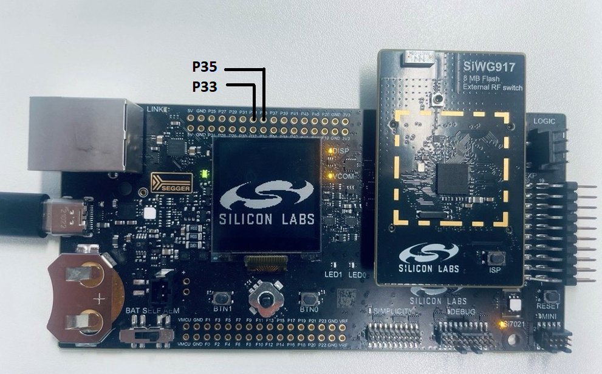

# SL CONFIG TIMER

## Table of Contents

- [Purpose/Scope](#purposescope)
- [Overview](#overview)
- [About Example Code](#about-example-code)
- [Prerequisites/Setup Requirements](#prerequisitessetup-requirements)
  - [Hardware Requirements](#hardware-requirements)
  - [Software Requirements](#software-requirements)
  - [Setup Diagram](#setup-diagram)
- [Getting Started](#getting-started)
- [Application Build Environment](#application-build-environment)
  - [Pin Configuration](#pin-configuration-for-pwm-mode-use-case)
  - [Macros for CT Configurations:](#macros-for-ct-configurations)
  - [Macros for CT Interrupt Flags](#macros-for-ct-interrupt-flags)
  - [Macros for OCU Configuration](#macros-for-ocu-configuration)
  - [Macros for WFG Configuration](#macros-for-wfg-configuration)
- [Test the Application](#test-the-application)
  - [Run the application in counter mode](#run-the-application-in-counter-mode)
  - [Run the application in PWM mode](#run-the-application-in-pwm-mode)

## Purpose/Scope

- This Config Timer example demonstrates two use cases of timer :
  - First as free running timer with GPIO toggle functionality. Counter-0 is configured to generate interrupts every millisecond and toggles GPIO.
  - Second as waveform generator producing two PWM outputs, counter-1 generates a square wave (50%-duty cycle) and counter-0 will produce a waveform whose duty cycle continuously varies from 100% to 0% then 0% to 100%, in steps of 1% at every 20 Milliseconds.

## Overview

- Configurable timers are used for counting clocks and events, capturing events on the GPIOs in input mode and outputting modulated signals. They can be programmed to work in Pulse Width Modulation (PWM) mode in which a pulse width modulated wave is driven on the outputs according to the programmed ON time and OFF times. Configurable Timers are present in MCU HP peripherals.
  - Each config counter(CT) sub-module of configuration timer(CT) can be configured to contain One 32 (or) two 16 bit timers.
  - There is a programming feature to select Clocks, events or external clock as a tick.
  - The input clock can be the reference clock or System clock.
  - Supports wide range of features like starting the counter, stopping the counter, continuing the counter from the stopped value, halt, increment the counter and capturing the events.
  - It can output PWM signals with any cycle/pulse length.
  - It can start a PPG in synchronous with PWM signal output. It can superimpose a PPGs output signal on the PWM signal and output it.
  - It can generate a non-overlap signal that maintains the response time of the power transistor(dead time) from PWM signal output.
  - It can capture timing of input signal changes and pulse width in synchronous with PWM signal.
  - It can start the ADC at any time, in synchronous with PWM signal output.
  - It performs noise cancelling of the emergency motor shutdown interrupt signal.
  - It can freely set the pin state at the time of motor shutdown, when a valid signal input is detected.
  - Supports APB interface for programming.

## About Example Code

- This example demonstrated Config Timer as a normal counter, toggling GPIO on every interrupt and as PWM output generator.
- Two macros are present: CT_PWM_MODE_USECASE and CT_COUNTER_MODE_USECASE, by default normal counter use case is enabled.
- Enable any one of the below use case macro at a time.
- If **CT_PWM_MODE_USECASE** is enabled:
  - Config Timer is initialized using \ref sl_si91x_ct_init() API.
  - After intialization, the desired counter parameters are configured using \ref sl_si91x_ct_set_configuration() API, the parameters are set through UC.
  - Match count for both the counters are configured using same @ref sl_si91x_ct_set_match_count() API.
  - Initial duty cycle is set for PWM channels \ref RSI_MCPWM_SetDutyCycle() API.
  - The desired OCU parameters are configured using \ref sl_si91x_ct_set_ocu_configuration() API.
  - The desired OCU controls for both counters, are configured using API \ref sl_si91x_config_timer_set_ocu_control(), by changing the counter number.
  - Registers callback for enabling peak interrupt, for counter-1 using \ref sl_si91x_ct_register_callback() API.
  - Starts both the counters using API \ref sl_si91x_ct_start_on_software_trigger(), by changing the counter number.
  - After enabling OCU mode, a continuous loop for pwm output is performed.
  - It creates 2 independent PWM Outputs - CT output-0 and CT output-1.
  - CT Output-1 will produce a square wave and CT Output-0 will produce a waveform whose duty cycle continuously varies from 100% to 0% then 0% to 100%, in steps of 1% at every 20 Milliseconds.
  - Connect logic analyzer to Evaluation kit board's GPIO-29 & GPIO-30 for output-0 and output-1 respectively and observe the PWM waveforms.
- If **CT_COUNTER_MODE_USECASE** is enabled:
  - First Configuring ULP_GPIO_1 pinmux mode and direction as output.
  - Config Timer is initialized using \ref sl_si91x_ct_init() API.
  - After intialization, the desired counter parameters are configured using \ref sl_si91x_ct_set_configuration() API, the parameters are set using UC.
  - Set the initial count value of counter using \ref sl_si91x_ct_set_initial_count() API.
  - Match count is configured using \ref sl_si91x_ct_set_match_count() API.
  - Registers callback for enabling peak interrupt for counter-0 using \ref sl_si91x_ct_register_callback() API.
  - Starts counter-0 using \ref sl_si91x_ct_start_on_software_trigger() API.
  - **Callback Function**
  - ULP_GPIO_1 pin gets toggled on every interrupt occurring at every millisecond and increments interrupt count.
  - When interrupt count is greater than ten, then timer is deinitialized, callback is unregistered and disables interrupt through \ref sl_si91x_config_timer_deinit() API.
  
## Prerequisites/Setup Requirements

### Hardware Requirements

- Windows PC.
- Silicon Labs Si917 Evaluation Kit [WPK(BRD4002) + BRD4338A].

### Software Requirements

- Simplicity Studio
- Serial console Setup
  - The Serial Console setup instructions are provided below:
Refer [here](https://docs.silabs.com/wiseconnect/latest/wiseconnect-developers-guide-developing-for-silabs-hosts/#console-input-and-output)

### Setup Diagram

> 

## Getting Started

Refer to the instructions [here](https://docs.silabs.com/wiseconnect/latest/wiseconnect-getting-started/) to:

- Install Studio and WiSeConnect 3 extension
- Connect your device to the computer
- Upgrade your connectivity firmware
- Create a Studio project

For details on the project folder structure, see the [WiSeConnect Examples](https://docs.silabs.com/wiseconnect/latest/wiseconnect-examples/#example-folder-structure) page.

## Application Build Environment

- Configure the following macros in config_timer_example.h file to change the application use case(enable any one at a time).

  ```C
    #define CT_PWM_MODE_USECASE           1      -  To run PWM output code
    #define CT_COUNTER_MODE_USECASE       1      -  To run normal counter code
  ```

- Also enable CT-configuration for using PWM mode use case.
- Configure the following macros in config_timer_example.c file to change match value for counter-mode use case, update/modify following macros if required.

  ```C
   #define CT_MATCH_VALUE             16000  -  For 1ms timer timeout
  ```

   **Note:**
  > As currently Config Timer is supporting only 16-bit mode, we can configure match value to a maximum of 65535.
  > CT_MATCH_VALUE macro depends on the M4 SoC clock configured. Use the following formula for configuring match value against desired time period:
   CT_MATCH_VALUE = (M4_SOC_CLK x time_period_in_us) / (2 x 1000000);

   For example, if M4 SoC clock is configured at 180MHz, and desired time period is 200us then,
      CT_MATCH_VALUE = (180000000 * 200) / (2 x 1000000) = 18000

- Use following CT configurations to run application in Normal counter mode use case (using Counter-0 or Counter-1).

  > 

  - Change following macros in config_timer_example.c file to change counter-number used for counter-mode use case, by default application is using counter-0 to use counter-1 change it to 'SL_COUNTER_1'.

  ```C
    #define CT_COUNTER_USED            SL_COUNTER_0  -  For using counter-0
  ```

- Use following CT Configuraions, to run the application in PWM mode use case.

  > 

### Pin Configuration for pwm-mode use case

|  Discription  | GPIO    | Connector     |
| ------------- | ------- | ------------- |
|    output-0   | GPIO_29 |     P33       |
|    output-1   | GPIO_30 |     P35       |

> 

### Macros for CT Configurations

- \ref SL_CT_MODE_32BIT_ENABLE_MACRO , for possible values refer \ref sl_config_timer_mode_t
- \ref SL_COUNTER0_DIRECTION_MACRO , for possible values refer \ref sl_counter0_direction_t
- \ref SL_COUNTER1_DIRECTION_MACRO , for possible values refer \ref sl_counter1_direction_t
- \ref SL_COUNTER0_PERIODIC_ENABLE_MACRO, true to enable Counter0 Periodic mode & false to skip Counter0 Periodic mode.
- \ref SL_COUNTER1_PERIODIC_ENABLE_MACRO, true to enable Counter1 Periodic mode & false to skip Counter1 Periodic mode.
- \ref SL_COUNTER0_SYNC_TRIGGER_ENABLE_MACRO, true to enable Counter0 sync trigger & false to skip Counter0 sync trigger.
- \ref SL_COUNTER1_SYNC_TRIGGER_ENABLE_MACRO, true to enable Counter1 sync trigger & false to skip Counter1 sync trigger.

## Test the Application

### Run the application in counter mode

- Evaluation kit board's ULP_GPIO_1 (Connector - P16) will be toggled ten times at every millisecond.
- After toggling GPIO for 10 times, interrupt callback is unregistered and counter is de-initialized.
- Following prints will be observed on console:

  > 

### Run the application in PWM mode

- CT Output-1 will produce a square wave (50% duty cycle).
- CT Output-0 will produce a waveform whose duty cycle continuously varies from 100% to 0% then 0% to 100%, in steps of 1% at every 20 Milliseconds.
- Connect logic analyzer to evaluation kit board's GPIO-29 & GPIO-30 for output-0 and output-1 respectively and observe the PWM waveforms.
- Following prints will be observed on console:

  > 

> **Note:**
>
> - Interrupt handlers are implemented in the driver layer, and user callbacks are provided for custom code. If you want to write your own interrupt handler instead of using the default one, make the driver interrupt handler a weak handler. Then, copy the necessary code from the driver handler to your custom interrupt handler.
