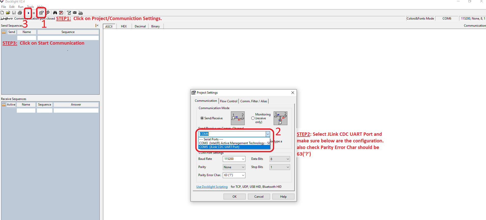
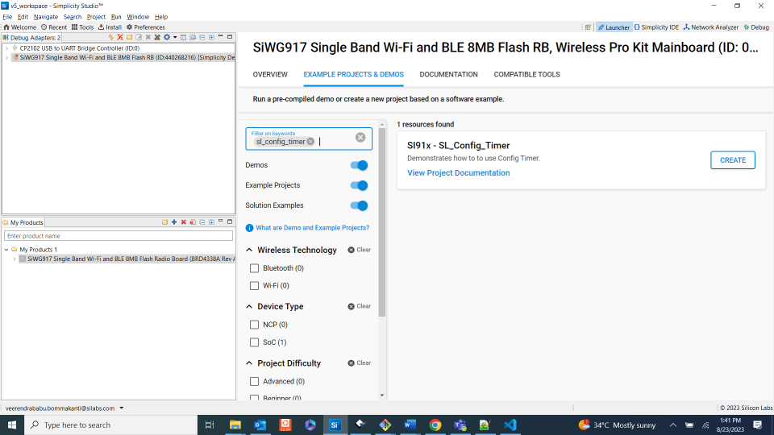

# CONFIG TIMER

## Introduction

- This Config Timer example demonstrates two usecases of timer :
- First as free running timer with GPIO toggle functionality. The timer instance is configured to generate interrupts on reaching match value & toggles GPIO.
  The counter-0 is set to expire at 1-millisecond intervals.
- Second as waveform generator producing two PWM outputs, counter-0 generates square wave output (50%-duty cycle) and counter-1 generates PWM output with duty cycle varrying from 0% to 100% in steps of 0.5% at every 20 Milliseconds and goes down to 0% in the same step.

## Overview

- Configurable timers are used for counting clocks and events, capturing events on the GPIOs in input mode and outputting modulated signals. They can be programmed to work in Pulse Width Modulation (PWM) mode in which a pulse width modulated wave is driven on the outputs according to the programmed ON time and OFF times. Configurable Timers are present in MCU HP peripherals.
  - Each config counter(CT) sub-module of configuration timer(CT) can be configured to contain One 32 (or) two 16 bit timers.
  - There is a programming feature to select Clocks, events or external clock as a tick.
  - The input clock can be the reference clock or System clock.
  - Supports wide range of features like starting the counter, stopping the counter, continuing the counter from the stopped value, halt, increment the counter and capturing the events.
  - It can output PWM signals with any cycle/pulse length.
  - It can start a PPG in synchronous with PWM signal output. It can superimpose a PPGs output signal on the PWM signal and output it.
  - It can generate a non-overlap signal that maintains the response time of the power transistor(dead time) from PWM signal output.
  - It can capture timing of input signal changes and pulse width in synchronous with PWM signal.
  - It can start the ADC at any time, in synchronous with PWM signal output.
  - It performs noise cancelling of the emergency motor shutdown interrupt signal.
  - It can freely set the pin state at the time of motor shutdown, when a valid signal input is detected.
  - Supports APB interface for programming.

## About Example Code

- This example demonstrated Config Timer as a normal counter as well as it generates PWM output and using that PWM, GPIO is toggled.
- Two macros are present i.e., CT_PWM_MODE_USECASE and CT_COUNTER_MODE_USECASE, by defaut PWM use case is enabled.
- Enable any one of the below usecase macro at a time.

- If **CT_PWM_MODE_USECASE** is enabled:
  - Config Timer is initialized using \ref sl_si91x_ct_init() API.
  - After intialization, the desired counter parameters are configured using \ref sl_si91x_ct_set_configuration() API, the parameters are set using UC.
  - Match count for both the counters are configured using same \ref sl_si91x_ct_set_match_count() API.
  - PWM duty cycle \ref RSI_MCPWM_SetDutyCycle() API.
  - The desired OCU parameters are configured using \ref sl_si91x_ct_set_ocu_configuration() API, the parameters are set using UC. For getting these configurations through UC enable OCU-configuration button on UC.
  - The desired parameters for both counters for OCU are configured using same API \ref sl_si91x_ct_control_ocu_operation(), by changing the counter number.
  - Start both the counters using API \ref sl_si91x_ct_start_on_software_trigger(), by changing the counter number.
  - Enable systick timer.
  - After enabling OCU mode, a continuous loop for pwm output is performed.
  - It creates 2 independent PWMs(running at same frequency) - CT output-0 and CT output-1.
  - CT Output-0 will produce a square wave and CT Output-1 will produce a waveform whose duty cycle is continuously varrying from 0% to 100% in steps of 0.5% at every 20 Milliseconds and goes down to 0% in the same step.
  - Connect oscilloscope to Evaluation kit board's GPIO-29 & GPIO-30 for output-0 and output-1 respectively and observe the PWM waveforms.
- If **CT_COUNTER_MODE_USECASE** is enabled:
  - First Configuring PIN 5 GPIO pinmux mode and direction as output.
  - Config Timer is initialized using \ref sl_si91x_ct_init() API.
  - After intialization, the desired counter parameters are configured using \ref sl_si91x_ct_set_configuration() API, the parameters are set using UC.
  - Set the initial count value of Config Timer using \ref sl_si91x_ct_set_initial_count() API.
  - Match count is configured using \ref sl_si91x_ct_set_match_count() API.
  - Register callback for enabling peak interrupt on match value for counter 0 using \ref sl_si91x_ct_register_callback() API.
  - Starts counter 0 using \ref sl_si91x_ct_start_on_software_trigger() API.
- **Callback Function**
- If peak interrupt is enabled, ULP_GPIO_5 pin gets toggled on every interrupt occurring on reaching match(peak) value, and increments interrupt count.
- If interrupt count is greater than \ref TENTH_INTERRUPT_COUNT macro value, then unregisters timer callback and disabling interrupt are done through \ref sl_si91x_ct_unregister_timeout_callback() API.
- At last timer is deinitialized through \ref sl_si91x_config_timer_deinit() API.

## Running Example Code

- To use this application following Hardware, Software and the Project Setup is required.

### Hardware Setup

- Windows PC
- Silicon Labs Si917 Evaluation Kit [WSTK + BRD4338A]


### Software Setup

- Si91x SDK
- Embedded Development Environment
  - For Silicon Labs Si91x, use the latest version of Simplicity Studio (refer **"Download and Install Simplicity Studio"** section in **getting-started-with-siwx917-soc** guide at **release_package/docs/index.html**)

### VCOM Setup
- The Docklight tool's setup instructions are provided below..


### Project Setup

- **Silicon Labs Si91x** refer **"Download SDK"** section in **getting-started-with-siwx917-soc** guide at **release_package/docs/index.html** to work with Si91x and Simplicity Studio.

## Loading Application on Simplicity Studio

1. With the product Si917 selected, navigate to the example projects by clicking on Example Projects & Demos
   in simplicity studio and click on to CONFIG_TIMER Example application as shown below.



## Configuration and Steps for Execution
- Configure the following macros in config_timer_example.h file to change the application usecase(enable any one at a time)
```C
#define CT_PWM_MODE_USECASE           1      -  To run PWM output code
#define CT_COUNTER_MODE_USECASE       1      -  To run normal counter code
```
- Configure the following macros in config_timer_example.c file to change match value for counter Mode usecase and update/modify following macros if required.
```C
#define TIMER_MATCH_VALUE             16000  -  For 1ms timer timeout
```

### Macros for CT Configurations:

- \ref SL_CT_MODE_32BIT_ENABLE_MACRO , for possible values refer \ref sl_config_timer_mode_t
- \ref SL_COUNTER0_DIRECTION_MACRO , for possible values refer \ref sl_counter0_direction_t
- \ref SL_COUNTER1_DIRECTION_MACRO , for possible values refer \ref sl_counter1_direction_t
- \ref SL_COUNTER0_PERIODIC_ENABLE_MACRO, true to enable Counter0 Periodic mode & false to skip Counter0 Periodic mode.
- \ref SL_COUNTER1_PERIODIC_ENABLE_MACRO, true to enable Counter1 Periodic mode & false to skip Counter1 Periodic mode.
- \ref SL_COUNTER0_SOFT_RESET_ENABLE_MACRO, true to enable Counter0 soft reset & false to skip Counter0 soft reset.
- \ref SL_COUNTER1_SOFT_RESET_ENABLE_MACRO, true to Counter1 soft reset & false to skip Counter1 soft reset.
- \ref SL_COUNTER0_TRIGGER_ENABLE_MACRO, true to enable Counter0 software trigger & false to skip Counter0 software trigger.
- \ref SL_COUNTER1_TRIGGER_ENABLE_MACRO, true to enable Counter1 software trigger & false to skip Counter1 software trigger.
- \ref SL_COUNTER0_SYNC_TRIGGER_ENABLE_MACRO, true to enable Counter0 sync trigger & false to skip Counter0 sync trigger.
- \ref SL_COUNTER1_SYNC_TRIGGER_ENABLE_MACRO, true to enable Counter1 sync trigger & false to skip Counter1 sync trigger.
- \ref SL_COUNTER0_BUFFER_ENABLE_MACRO, true to enable Counter0 buffer & false to skip Counter0 buffer.
- \ref SL_COUNTER1_BUFFER_ENABLE_MACRO, true to enable Counter1 buffer & false to skip Counter1 buffer.

### Macros for CT Interrupt Flags

- \ref SL_CT_EVENT_INTR_0_FLAG_MACRO, true to enable interrupt on event occurrence & false to skip interrupt on event occurrence.
- \ref SL_CT_FIFO_0_FULL_FLAG_MACRO, true to enable interrupt on FIFO FULL & false to skip interrupt on FIFO FULL.
- \ref SL_CT_COUNTER_0_IS_ZERO_FLAG_MACRO, true to enable interrupt on zero value & false to skip interrupt on zero value.
- \ref SL_CT_COUNTER_0_IS_PEAK_FLAG_MACRO, true to enable interrupt on match value & false to skip interrupt on match value.
- \ref SL_CT_EVENT_INTR_1_FLAG_MACRO, true to enable interrupt on event occurrence & false to skip interrupt on event occurrence.
- \ref SL_CT_FIFO_1_FULL_FLAG_MACRO, true to enable interrupt on FIFO FULL & false to skip interrupt on FIFO FULL.
- \ref SL_CT_COUNTER_1_IS_ZERO_FLAG_MACRO, true to enable interrupt on zero value & false to skip interrupt on zero value.
- \ref SL_CT_COUNTER_1_IS_PEAK_FLAG_MACRO, true to enable interrupt on match value & false to skip interrupt on match value.

### Macros for OCU Configuration

- \ref SL_COUNTER0_OCU_OUTPUT_ENABLE_MACRO, true to enable Counter0 OCU Output & false to skip Counter0 OCU Output.
- \ref SL_COUNTER0_OCU_DMA_ENABLE_MACRO, true to enable Counter0 OCU DMA & false to skip Counter0 OCU DMA.
- \ref SL_COUNTER0_OCU_8BIT_MODE_ENABLE_MACRO, true to enable Counter0 OCU 8-bit mode & false to skip Counter0 OCU 8-bit mode.
- \ref SL_COUNTER0_OCU_SYNC_ENABLE_MACRO, true to enable Counter0 OCU sync & false to skip Counter0 OCU sync.
- \ref SL_COUNTER1_OCU_OUTPUT_ENABLE_MACRO, true to enable Counter1 OCU Output & false to skip Counter1 OCU Output.
- \ref SL_COUNTER1_OCU_DMA_ENABLE_MACRO, true to enable Counter1 OCU DMA & false to skip Counter1 OCU DMA.
- \ref SL_COUNTER1_OCU_8BIT_ENABLE_MACRO, true to enable Counter1 OCU 8-bit mode & false to skip Counter1 OCU 8-bit mode.
- \ref SL_COUNTER1_OCU_SYNC_ENABLE_MACRO, true to enable Counter1 OCU sync & false to skip Counter1 OCU sync.
- \ref SL_OCU_OUTPUT0_TOGGLE_HIGH_MACRO, true to enable OCU output0 Toggle HIGH & false to skip OCU output1 Toggle HIGH.
- \ref SL_OCU_OUTPUT0_TOGGLE_LOW_MACRO, true to enable OCU output0 Toggle LOW & false to skip OCU output0 Toggle LOW.
- \ref SL_OCU_OUTPUT1_TOGGLE_HIGH_MACRO, true to enable OCU output1 Toggle HIGH & false to skip OCU output1 Toggle LOW.
- \ref SL_OCU_OUTPUT1_TOGGLE_LOW_MACRO, true to enable OCU output1 interrupt on match value & false to skip OCU output1 interrupt on match value.

### Macros for WFG Configuration

- \ref SL_OUTPUT0_TOGGLE0_MACRO, true to enable output-0 toggle-LOW & false to skip output-0 toggle-LOW.
- \ref SL_OUTPUT0_TOGGLE1_MACRO, true to enable output-0 toggle-HIGH & false to skip output-0 toggle-HIGH.
- \ref SL_TOGGLE_COUNTER0_PEAK_MACRO, true to enable Toggle counter-0 peak & false to skip Toggle counter-0 peak.
- \ref SL_OUTPUT1_TOGGLE0_MACRO, true to enable output-1 toggle-LOW & false to skip output-1 toggle-LOW.
- \ref SL_OUTPUT1_TOGGLE1_MACRO, true to enable output-1 toggle-HIGH & false to skip output-1 toggle-HIGH.
- \ref SL_TOGGLE_COUNTER1_PEAK_MACRO, true to enable Toggle counter-1 peak & false to skip Toggle counter-1 peak.

## Build

1. Compile the application in Simplicity Studio using build icon.


## Device Programming

- To program the device ,refer **"Burn M4 Binary"** section in **getting-started-with-siwx917-soc** guide at **release_package/docs/index.html** to work with Si91x and Simplicity Studio.

## Executing the Application

1. Compile and run the application.

## Expected Results -From free counter usecase:

-Evaluation kit board's <** GPIO-69(EXP13)to be resolved on 2.0**> will be toggled ten times at 1 milliseconds periodic rate, along with debug prints.
-After toggling GPIO for 10 times, interrupt callback is unregistered.

## Pin Configuration

|  Discription  | GPIO    | Connector     | 
| ------------- | ------- | ------------- | 
|    output-0   | GPIO_29 |     P33       | 
|    output-1   | GPIO_30 |     P35       |


## Expected Results -From PWM usecase:

-CT Output-0 will produce a square wave and CT Output-1 will produce a waveform whose duty cycle is continuously varrying from 0% to 100%
in steps of 0.5% at every 20 Milliseconds and goes down to 0% in the same step.
-Connect oscilloscope to Evaluation kit board's GPIO-29(P33) & GPIO-30(P35) for output-0 and output-1 respectively and observe the PWM waveforms.
