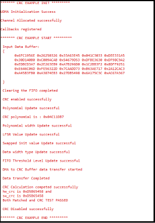

# SL CRC

## Table of Contents

- [SL CRC](#sl-crc)
  - [Purpose/Scope](#purposescope)
  - [Prerequisites/Setup Requirements](#prerequisitessetup-requirements)
    - [Hardware Requirements](#hardware-requirements)
    - [Software Requirements](#software-requirements)
    - [Setup Diagram](#setup-diagram)
  - [Getting Started](#getting-started)
  - [Application Build Environment](#application-build-environment)
    - [Application Configuration Parameters](#application-configuration-parameters)
  - [Test the Application](#test-the-application)

## Purpose/Scope

 This application contains example code to demonstrate CRC (Cyclic Redundancy Check) Generation on DMA-transferred data.

## Prerequisites/Setup Requirements

 To use this application, the following hardware, software, and project setup is required.

### Hardware Requirements

- Windows PC
- Silicon Labs Si917 Evaluation Kit [[BRD4002](https://www.silabs.com/development-tools/wireless/wireless-pro-kit-mainboard?tab=overview) + [BRD4338A](https://www.silabs.com/development-tools/wireless/wi-fi/siwx917-rb4338a-wifi-6-bluetooth-le-soc-radio-board?tab=overview) / [BRD4342A](https://www.silabs.com/development-tools/wireless/wi-fi/siwx91x-rb4342a-wifi-6-bluetooth-le-soc-radio-board?tab=overview) / [BRD4343A](https://www.silabs.com/development-tools/wireless/wi-fi/siw917y-rb4343a-wi-fi-6-bluetooth-le-8mb-flash-radio-board-for-module?tab=overview)]
- SiWx917 AC1 Module Explorer Kit [BRD2708A](https://www.silabs.com/development-tools/wireless/wi-fi/siw917y-ek2708a-explorer-kit)

### Software Requirements

- Serial console setup
  - For serial console setup instructions, see the [Console Input and Output](https://docs.silabs.com/wiseconnect/latest/wiseconnect-developers-guide-developing-for-silabs-hosts/using-the-simplicity-studio-ide#console-input-and-output) section of the *WiSeConnect Developer's Guide*.
- Embedded Development Environment
  - For Silicon Labs Si91x, use the latest version of Simplicity Studio (refer to the [Download and Install Simplicity Studio](https://docs.silabs.com/wiseconnect/latest/wiseconnect-developers-guide-developing-for-silabs-hosts/using-the-simplicity-studio-ide#install-from-scratch) section in the Developing with *WiSeConnect™ SDK with SiWx91x™ Boards Guide*).

### Setup Diagram

> 

## Getting Started

Refer to the instructions [here](https://docs.silabs.com/wiseconnect/latest/wiseconnect-getting-started/) to:

- [Install Simplicity Studio](https://docs.silabs.com/wiseconnect/latest/wiseconnect-developers-guide-developing-for-silabs-hosts/using-the-simplicity-studio-ide#install-simplicity-studio)
- [Install WiSeConnect extension](https://docs.silabs.com/wiseconnect/latest/wiseconnect-developers-guide-developing-for-silabs-hosts/using-the-simplicity-studio-ide#install-the-wiseconnect-3-extension)
- [Connect your device to the computer](https://docs.silabs.com/wiseconnect/latest/wiseconnect-developers-guide-developing-for-silabs-hosts/using-the-simplicity-studio-ide#connect-siwx91x-to-computer)
- [Upgrade your connectivity firmware](https://docs.silabs.com/wiseconnect/latest/wiseconnect-developers-guide-developing-for-silabs-hosts/using-the-simplicity-studio-ide#update-siwx91x-connectivity-firmware)
- [Create a Studio project](https://docs.silabs.com/wiseconnect/latest/wiseconnect-developers-guide-developing-for-silabs-hosts/using-the-simplicity-studio-ide#create-a-project)

For details on the project folder structure, see the [WiSeConnect Examples](https://docs.silabs.com/wiseconnect/latest/wiseconnect-examples/#example-folder-structure) page.

## Application Build Environment

### Application Configuration Parameters

- The application has two configurable parameters:  Polynomial value  and Data width.
- **Polynomial value:** Defines the mathematical polynomial used in CRC (Cyclic Redundancy Check) calculations
- **Data width:** Specifies how many bits wide the input data is (e.g., 8-bit, 16-bit, 32-bit)
- These parameters allow users to customize the CRC implementation for different standards and data types.

- Configure the following parameter in the [`sl_si91x_crc.h`](https://github.com/SiliconLabs/wiseconnect/blob/v4.0.0-content-for-docs/components/device/silabs/si91x/mcu/drivers/unified_api/inc/sl_si91x_crc.h) file. Update or modify the following macro, if required. The code illustrates the default configurations.

  ```C
   #define SL_CRC_POLYNOMIAL      0x04C11DB7 /* Polynomial encryption value */
   #define SL_CRC_POLY_WIDTH       31        /* Polynomial data width */
  ```

> **Note:**
> - When modifying the input data for CRC calculation and comparison with Software CRC:
>   - Update the `input[]` variable in the `sw_crc.c` file with your new data
>   - Update the `gcrc_tx_Buf[]` variable in the `crc_example.c` file with the same data
> - Ensure both variable lengths match the size of your new data array.

## Test the Application

- Compile and run the application.

  - Console Output:

    

> **Note:** Interrupt handlers are implemented in the driver layer, and user callbacks are provided for custom code. If you want to write your own interrupt handler instead of using the default one, make the driver interrupt handler a weak handler. Then, copy the necessary code from the driver handler to your custom interrupt handler.
