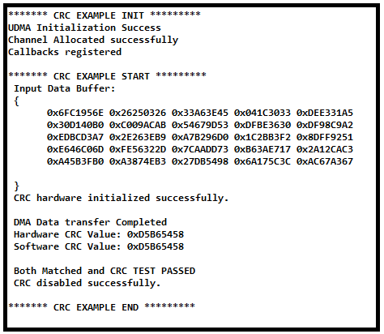

# SL CRC

## Table of Contents

- [Purpose/Scope](#purposescope)
- [Prerequisites/Setup Requirements](#prerequisitessetup-requirements)
  - [Hardware Requirements](#hardware-requirements)
  - [Software Requirements](#software-requirements)
  - [Setup Diagram](#setup-diagram)
- [Getting Started](#getting-started)
- [Application Build Environment](#application-build-environment)
  - [Application Configuration Parameters](#application-configuration-parameters)
- [Test the Application](#test-the-application)

## Purpose/Scope

- This application contains an example code to demonstrate CRC Generation on DMA transferred data.

## Prerequisites/Setup Requirements

- To use this application following Hardware, Software and the Project Setup is required.

### Hardware Requirements

- Windows PC
- Silicon Labs [Si917 Evaluation Kit WPK(BRD4002) + BRD4338A]
  - The Serial Console setup instructions are provided below,
refer instructions [here](https://docs.silabs.com/wiseconnect/latest/wiseconnect-developers-guide-developing-for-silabs-hosts/#console-input-and-output).

### Software Requirements

- Simplicity Studio
- Embedded Development Environment
  - For Silicon Labs Si91x, use the latest version of Simplicity Studio (refer **"Download and Install Simplicity Studio"** section in **getting-started-with-siwx917-soc** guide at **release_package/docs/index.html**)

### Setup Diagram

> 

## Getting Started

Refer instructions [here](https://docs.silabs.com/wiseconnect/latest/wiseconnect-getting-started/) for the following tasks:

- Install Studio and WiSeConnect 3 extension
- Connect your device to the computer
- Upgrade your connectivity firmware
- Create a Studio project

For details on the project folder structure, see the [WiSeConnect Examples](https://docs.silabs.com/wiseconnect/latest/wiseconnect-examples/#example-folder-structure) page.

## Application Build Environment

### Application Configuration Parameters

- An application has two parameters configurable they are Polynomial value and Data width.

- Configure the following parameter in sl_si91x_crc.h file, update/modify following macro if required also below mentioned are default configurations.


 buffer.
  ```C
   #define SL_CRC_POLYNOMIAL      0x04C11DB7 
   #define SL_CRC_POLY_WIDTH       31
  ```
> **Note:**
> while changing the data which CRC has to calculate and compare with Software CRC, need to update the same data in file `sw_crc.c` variable  `input[]`.
## Test the Application

Refer instructions [here](https://docs.silabs.com/wiseconnect/latest/wiseconnect-getting-started/) to:

- Compile and run the application. 

 - Console Output:

    


> **Note:**
>
> - Interrupt handlers are implemented in the driver layer, and user callbacks are provided for custom code. If you want to write your own interrupt handler instead of using the default one, make the driver interrupt handler a weak handler. Then, copy the necessary code from the driver handler to your custom interrupt handler.
