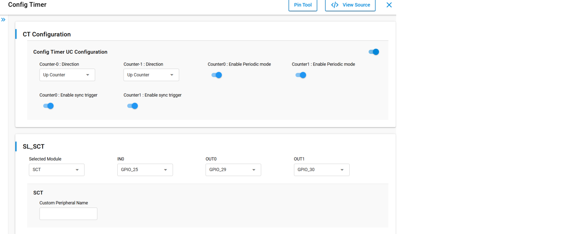
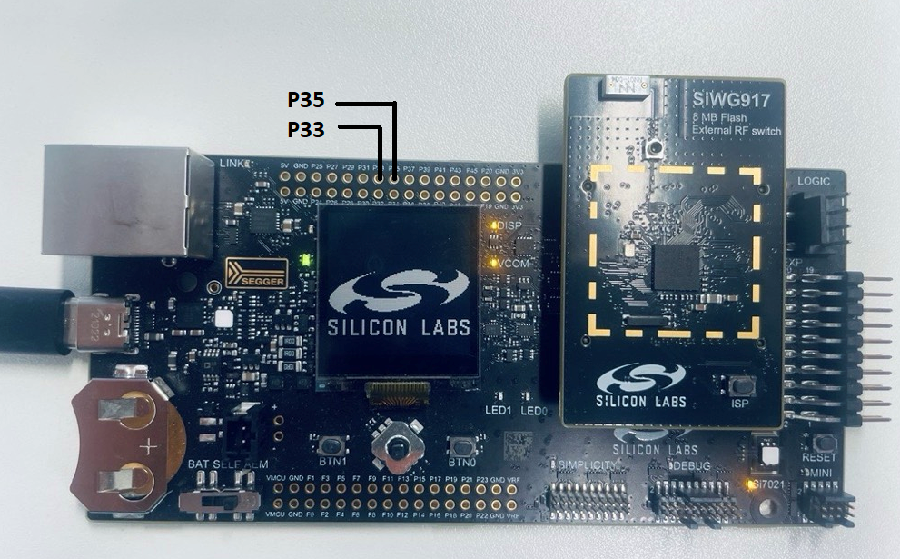
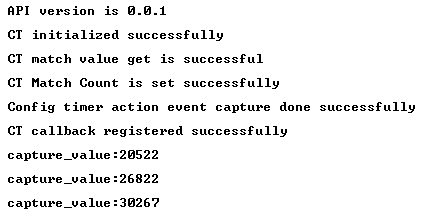
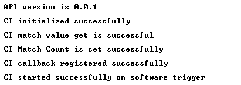

# SL CONFIG TIMER ICU AND OCU DMA

## Table of Contents

- [SL CONFIG TIMER ICU AND OCU DMA](#sl-config-timer-icu-ocu-dma)
  - [Table of Contents](#table-of-contents)
  - [Purpose/Scope](#purposescope)
  - [Overview](#overview)
  - [About Example Code](#about-example-code)
  - [Prerequisites/Setup Requirements](#prerequisitessetup-requirements)
    - [Hardware Requirements](#hardware-requirements)
    - [Software Requirements](#software-requirements)
    - [Setup Diagram](#setup-diagram)
  - [Getting Started](#getting-started)
  - [Application Build Environment](#application-build-environment)
    - [Pin Configuration for OCU DMA mode use case](#pin-configuration-for-ocu-dma-mode-use-case)
    - [Pin Configuration for INPUT EVENT mode use case](#pin-configuration-for-input-event-mode-use-case)
    - [Macros for CT Configurations](#macros-for-ct-configurations)
  - [Test the Application](#test-the-application)
    - [Run the application in DMA mode](#run-the-application-in-dma-mode)
    - [Run the application in INPUT EVENT mode](#run-the-application-in-input-event-mode)

## Purpose/Scope

- This Config Timer ICU OCU example demonstrates 2 use cases of a timer:
  - First as a input capture event. Here it captures the input event on GPIO pin and stores the captured value in
  capture_value variable.
  - Second as a CT DMA used to generate varied PWM waveform. counter-0 and counter-1 will generate PWM output with varied duty cycle.
  

## Overview

- Configurable timers are used for counting clocks and events, capturing events on the GPIOs in input mode, and outputting modulated signals. They can be programmed to work in Pulse Width Modulation (PWM) mode in which a pulse width modulated wave is driven on the outputs according to the programmed ON time and OFF times. Configurable Timers are present in MCU HP peripherals.
  - There is a programming feature to select Clocks, events or external clock as a tick.
  - The input clock can be the reference clock or the system clock.
  - Supports a wide range of features like starting the counter, stopping the counter, continuing the counter from the stopped value, halt and increment the counter, and capturing the events.
  - It can output PWM signals with varying duty cycle.
  - It can generate a non-overlap signal that maintains the response time of the power transistor(dead time) from PWM signal output.This can be with respect to toggling of transistors.
  - It can capture timing of input signal changes and pulse width in synchronous with PWM signal.
  - It can start the ADC at any time, in synchronous with the PWM signal output.
  - It can freely set the pin state at the time of motor shutdown when a valid signal input is detected.

## About Example Code

- This example demonstrates the Config Timer as a Input Capture and Output Compare. Output Compare Values are updated using DMA.
- Two macros are present: CT_COUNTER_INPUT_EVENT_USECASE and CT_COUNTER_DMA_MODE_USECASE. By default, the input capture use case is enabled.
- Enable only one of the following use case macros at a time.
  - If **CT_COUNTER_INPUT_EVENT_USECASE** is enabled:
    - The Config Timer is initialized using [sl_si91x_config_timer_init()](https://docs.silabs.com/wiseconnect/latest/wiseconnect-api-reference-guide-si91x-peripherals/config-timer#sl-si91x-config-timer-init) API.
    - Counter parameters are configured using [sl_si91x_config_timer_set_configuration()](https://docs.silabs.com/wiseconnect/latest/wiseconnect-api-reference-guide-si91x-peripherals/config-timer#sl-si91x-config-timer-set-configuration) API.
    - Action events are selected for start and capture using [sl_si91x_config_timer_select_action_event()](https://docs.silabs.com/wiseconnect/latest/wiseconnect-api-reference-guide-si91x-peripherals/config-timer#sl-si91x-config-timer-select-action-event) API.
    - Callback is registered for the capture event using [sl_si91x_config_timer_register_callback()](https://docs.silabs.com/wiseconnect/latest/wiseconnect-api-reference-guide-si91x-peripherals/config-timer#sl-si91x-config-timer-register-callback) API.
    - Captured values are read using [sl_si91x_config_timer_read_capture()](https://docs.silabs.com/wiseconnect/latest/wiseconnect-api-reference-guide-si91x-peripherals/config-timer#sl-si91x-config-timer-read-capture) API.
    - The captured value is printed or processed as needed.
  - If **CT_COUNTER_DMA_MODE_USECASE** is enabled:
    - CT_COUNTER_DMA_MODE_USECASE is used to generate varied PWM waveform.
    - Both counter0 and counter1 compare value arrays are initialized with step increments.
    - The Config Timer is initialized using [sl_si91x_config_timer_init()](https://docs.silabs.com/wiseconnect/latest/wiseconnect-api-reference-guide-si91x-peripherals/config-timer#sl-si91x-config-timer-init) API.
    - Counter parameters are configured using [sl_si91x_config_timer_set_configuration()](https://docs.silabs.com/wiseconnect/latest/wiseconnect-api-reference-guide-si91x-peripherals/config-timer#sl-si91x-config-timer-set-configuration) API.
    - Match count for both counters is set using [sl_si91x_config_timer_set_match_count()](https://docs.silabs.com/wiseconnect/latest/wiseconnect-api-reference-guide-si91x-peripherals/config-timer#sl-si91x-config-timer-set-match-count) API.
    - OCU (Output Compare Unit) configuration is set for both counters, enabling DMA and output toggling using [sl_si91x_config_timer_set_ocu_configuration()](https://docs.silabs.com/wiseconnect/latest/wiseconnect-api-reference-guide-si91x-peripherals/config-timer#sl-si91x-config-timer-set-ocu-configuration) API.
    - DMA is configured for counter0 and counter1 using [sl_si91x_config_timer_dma_configure()](https://docs.silabs.com/wiseconnect/latest/wiseconnect-api-reference-guide-si91x-peripherals/config-timer#sl-si91x-config-timer-dma-configure) API.
    - Callback is registered for DMA transfer completion using [sl_si91x_config_timer_register_callback()](https://docs.silabs.com/wiseconnect/latest/wiseconnect-api-reference-guide-si91x-peripherals/config-timer#sl-si91x-config-timer-register-callback) API.
    - Both counters are started using [sl_si91x_config_timer_start_on_software_trigger()](https://docs.silabs.com/wiseconnect/latest/wiseconnect-api-reference-guide-si91x-peripherals/config-timer#sl-si91x-config-timer-start-on-software-trigger) API.
    - On DMA interrupt, the DMA transfer index for each counter is incremented.
    - When the end of the compare value array is reached, the index wraps around to repeat the sequence.
    - The next DMA transfer is triggered for each counter.
    - CT Output-0 and Output-1 will produce a continuous varied PWM using DMA.
  
  
## Prerequisites/Setup Requirements

### Hardware Requirements

- Windows PC.
- Silicon Labs Si917 Evaluation Kit [WPK(BRD4002) + BRD4338A / BRD4342A / BRD4343A ].
- SiWx917 AC1 Module Explorer Kit (BRD2708A)

### Software Requirements

- Simplicity Studio
- Serial console setup
  - For serial console setup instructions, refer [here](https://docs.silabs.com/wiseconnect/latest/wiseconnect-developers-guide-developing-for-silabs-hosts/#console-input-and-output).

### Setup Diagram

> 

## Getting Started

Refer to the instructions [here](https://docs.silabs.com/wiseconnect/latest/wiseconnect-getting-started/) to:

- [Install Simplicity Studio](https://docs.silabs.com/wiseconnect/latest/wiseconnect-developers-guide-developing-for-silabs-hosts/#install-simplicity-studio)
- [Install WiSeConnect 3 extension](https://docs.silabs.com/wiseconnect/latest/wiseconnect-developers-guide-developing-for-silabs-hosts/#install-the-wi-se-connect-3-extension)
- [Connect your device to the computer](https://docs.silabs.com/wiseconnect/latest/wiseconnect-developers-guide-developing-for-silabs-hosts/#connect-si-wx91x-to-computer)
- [Upgrade your connectivity firmware](https://docs.silabs.com/wiseconnect/latest/wiseconnect-developers-guide-developing-for-silabs-hosts/#update-si-wx91x-connectivity-firmware)
- [Create a Studio project](https://docs.silabs.com/wiseconnect/latest/wiseconnect-developers-guide-developing-for-silabs-hosts/#create-a-project)

For details on the project folder structure, see the [WiSeConnect Examples](https://docs.silabs.com/wiseconnect/latest/wiseconnect-examples/#example-folder-structure) page.

## Application Build Environment

- Configure the following macros in `config_timer_icu_ocu_example.h file` to change the application use case (enable any one at a time).

  ```C
    #define CT_COUNTER_DMA_MODE_USECASE     SET       -  To run DMA counter mode
    #define CT_COUNTER_INPUT_EVENT_USECASE  SET       -  To run input event mode
  ```

- Also enable the CT-configuration for using PWM DMA mode use case.
- In the `config_timer_icu_ocu_example.c` file, configure the "TIME_PERIOD_VALUE" macro to facilitate user-defined adjustments of the time period value. Modify or update the following macro as necessary to allow flexible customization of the timer's period and compare value.

  ```C
   #define TIME_PERIOD_VALUE     1000         // Time period in microseconds
   #define STEP_SIZE_COUNTER_0   400          // Step size for counter0 increments
  ```

  

- Use following CT configurations to run the application either in ICU or OCU DMA Mode.
  
  > 

   **Note:**
  > The Config Timer supports only 16-bit counter mode, with a maximum match value of 65,535.
 
### Pin Configuration for OCU DMA mode use case

|  Description  | GPIO    | Breakout pin  | Explorer kit Breakout pin|
| ------------- | ------- | ------------- | ------------------------ |
|    output-0   | GPIO_29 |     P33       |        [AN]              |
|    output-1   | GPIO_30 |     P35       |        [RST]             |

> 

### Pin Configuration for INPUT EVENT mode use case

|  Description  | GPIO    | Breakout pin  | 
| ------------- | ------- | ------------- |
|    input-0    | GPIO_25 |     P25       | 

### Macros for CT Configurations

- SL_CT_MODE_32BIT_ENABLE_MACRO , for possible values refer [sl_config_timer_mode_t](https://docs.silabs.com/wiseconnect/latest/wiseconnect-api-reference-guide-si91x-peripherals/config-timer#sl-config-timer-mode-t)
- SL_COUNTER0_DIRECTION_MACRO , for possible values refer [sl_counter0_direction_t](https://docs.silabs.com/wiseconnect/latest/wiseconnect-api-reference-guide-si91x-peripherals/config-timer#sl-counter0-direction-t)
- SL_COUNTER1_DIRECTION_MACRO , for possible values refer [sl_counter1_direction_t](https://docs.silabs.com/wiseconnect/latest/wiseconnect-api-reference-guide-si91x-peripherals/config-timer#sl-counter1-direction-t)
- SL_COUNTER0_PERIODIC_ENABLE_MACRO, true to enable Counter0 Periodic mode & false to skip Counter0 Periodic mode.
- SL_COUNTER1_PERIODIC_ENABLE_MACRO, true to enable Counter1 Periodic mode & false to skip Counter1 Periodic mode.
- SL_COUNTER0_SYNC_TRIGGER_ENABLE_MACRO, true to enable Counter0 sync trigger & false to skip Counter0 sync trigger.
- SL_COUNTER1_SYNC_TRIGGER_ENABLE_MACRO, true to enable Counter1 sync trigger & false to skip Counter1 sync trigger.


> **Note**: For recommended settings, please refer the [recommendations guide](https://docs.silabs.com/wiseconnect/latest/wiseconnect-developers-guide-prog-recommended-settings/).

## Test the Application

### Run the application in INPUT EVENT mode

- The Config Timer will capture external events (such as rising edge) on the configured input pin.
- Each captured event's capture value will be read and printed to the console.
- Connect the input-0 pin to any toggled GPIO pin. For every rising edge event, observe capture functionality.
- Following prints will be observed on the console:

  > 

### Run the application in DMA mode

- Both CT Output-0 and CT Output-1 will generate waveforms using DMA, with compare values automatically updated from pre-defined arrays.
- The outputs will continuously repeat their waveform patterns as the DMA cycles through the arrays.
- CT Output-0 and Output-1 will produce a continuous varied PWM using DMA.
- Connect a logic analyzer to the Evaluation Kit board's GPIO-29 & GPIO-30 for output-0 and output-1 respectively to observe the DMA-driven waveforms.
- Following prints will be observed on the console:

  > 

> **Note:**
>
> - Interrupt handlers are implemented in the driver layer, and user callbacks are provided for custom code. If you want to write your own interrupt handler instead of using the default one, make the driver interrupt handler a weak handler. Then, copy the necessary code from the driver handler to your custom interrupt handler.
