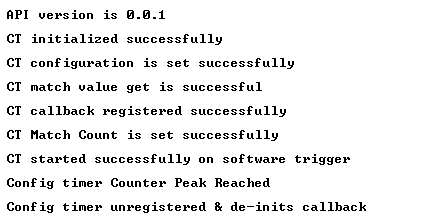
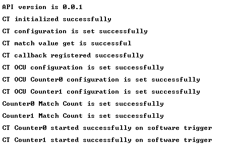

# SL CONFIG TIMER OCU NON DMA

## Table of Contents

- [SL CONFIG TIMER OCU NON DMA](#sl-config-timer-ocu-non-dma)
  - [Table of Contents](#table-of-contents)
  - [Purpose/Scope](#purposescope)
  - [Overview](#overview)
  - [About Example Code](#about-example-code)
  - [Prerequisites/Setup Requirements](#prerequisitessetup-requirements)
    - [Hardware Requirements](#hardware-requirements)
    - [Software Requirements](#software-requirements)
    - [Setup Diagram](#setup-diagram)
  - [Getting Started](#getting-started)
  - [Application Build Environment](#application-build-environment)
    - [Pin Configuration for OCU PWM mode use case](#pin-configuration-for-ocu-pwm-mode-use-case)
    - [Macros for CT Configurations](#macros-for-ct-configurations)
  - [Test the Application](#test-the-application)
    - [Run the application in counter mode](#run-the-application-in-counter-mode)
    - [Run the application in Output Compare Unit PWM mode](#run-the-application-in-output-compare-unit-pwm-mode)

## Purpose/Scope

- This Config Timer example demonstrates 2 use cases of a timer:
  - First as free-running timer. Counter-0 is configured to generate interrupt. Once interrupt is trigerred we get the console message and timer is deinitialized.
  - Second as a waveform generator producing two PWM outputs: counter-1 generates a square wave (50%-duty cycle) and counter-0 will produce a waveform whose duty cycle continuously varies from 100% to 0% then 0% to 100%.
  

## Overview

- Configurable timers are used for counting clocks and events, capturing events on the GPIOs in input mode, and outputting modulated signals. They can be programmed to work in Pulse Width Modulation (PWM) mode in which a pulse width modulated wave is driven on the outputs according to the programmed ON time and OFF times. Configurable Timers are present in MCU HP peripherals.
  - There is a programming feature to select Clocks, events or external clock as a tick.
  - The input clock can be the reference clock or the system clock.
  - Supports a wide range of features like starting the counter, stopping the counter, continuing the counter from the stopped value, halt and increment the counter, and capturing the events.
  - It can output PWM signals with varying duty cycle.
  - It can generate a non-overlap signal that maintains the response time of the power transistor(dead time) from PWM signal output.This can be with respect to toggling of transistors.
  - It can capture timing of input signal changes and pulse width in synchronous with PWM signal.
  - It can start the ADC at any time, in synchronous with the PWM signal output.
  - It can freely set the pin state at the time of motor shutdown when a valid signal input is detected.

## About Example Code

- This example demonstrates the Config Timer as a normal counter and Output Compare unit for PWM output generator.
- Two macros are present: CT_PWM_MODE_USECASE and CT_COUNTER_MODE_USECASE. By default, the normal counter use case is enabled.
- Enable only one of the following use case macros at a time.
  - If **CT_PWM_MODE_USECASE** is enabled:
    - The Config Timer is initialized using [sl_si91x_config_timer_init()](https://docs.silabs.com/wiseconnect/latest/wiseconnect-api-reference-guide-si91x-peripherals/config-timer#sl-si91x-config-timer-init) API.
    - After initialization, the desired counter parameters are configured using [sl_si91x_config_timer_set_configuration()](https://docs.silabs.com/wiseconnect/latest/wiseconnect-api-reference-guide-si91x-peripherals/config-timer#sl-si91x-config-timer-set-configuration) API, the parameters are set through UC.
    - Match count for both the counters are configured using same [sl_si91x_config_timer_set_match_count()](https://docs.silabs.com/wiseconnect/latest/wiseconnect-api-reference-guide-si91x-peripherals/config-timer#sl-si91x-config-timer-set-match-count) API.
    - The desired OCU parameters are configured using [sl_si91x_config_timer_set_ocu_configuration()](https://docs.silabs.com/wiseconnect/latest/wiseconnect-api-reference-guide-si91x-peripherals/config-timer#sl-si91x-config-timer-set-ocu-configuration) API.
    - The desired OCU controls for both counters are configured using API [sl_si91x_config_timer_set_ocu_control()](https://docs.silabs.com/wiseconnect/latest/wiseconnect-api-reference-guide-si91x-peripherals/config-timer#sl-si91x-config-timer-set-ocu-control) by changing the counter number.
    - Registers the callback for enabling peak interrupt, for counter-1 using [sl_si91x_config_timer_register_callback()](https://docs.silabs.com/wiseconnect/latest/wiseconnect-api-reference-guide-si91x-peripherals/config-timer#sl-si91x-config-timer-register-callback) API.
    - Starts both the counters using API [sl_si91x_config_timer_start_on_software_trigger()](https://docs.silabs.com/wiseconnect/latest/wiseconnect-api-reference-guide-si91x-peripherals/config-timer#sl-si91x-config-timer-start-on-software-trigger) by changing the counter number.
    - After enabling OCU mode, a continuous loop for pwm output is performed.
    - It creates 2 independent PWM Outputs - CT output-0 and CT output-1.
    - CT Output-1 will produce a square wave, and CT Output-0 will produce a waveform whose duty cycle continuously varies from 100% to 0% then 0% to 100%.
    - Connect the logic analyzer to the Evaluation Kit board's GPIO-29 & GPIO-30 for output-0 and output-1 respectively and observe the PWM waveforms.
  - If **CT_COUNTER_MODE_USECASE** is enabled:
    - The Config Timer is initialized using [sl_si91x_config_timer_init()](https://docs.silabs.com/wiseconnect/latest/wiseconnect-api-reference-guide-si91x-peripherals/config-timer#sl-si91x-config-timer-init) API.
    - After initialization, the desired counter parameters are configured using [sl_si91x_config_timer_set_configuration()](https://docs.silabs.com/wiseconnect/latest/wiseconnect-api-reference-guide-si91x-peripherals/config-timer#sl-si91x-config-timer-set-configuration) API. The parameters are set using UC.
    - Set the initial count value of counter using [sl_si91x_config_timer_set_initial_count()](https://docs.silabs.com/wiseconnect/latest/wiseconnect-api-reference-guide-si91x-peripherals/config-timer#sl-si91x-config-timer-set-initial-count) API.
    - Match count is configured using [sl_si91x_config_timer_set_match_count()](https://docs.silabs.com/wiseconnect/latest/wiseconnect-api-reference-guide-si91x-peripherals/config-timer#sl-si91x-config-timer-set-match-count) API.
    - Registers the callback for enabling peak interrupt for counter-0 using [sl_si91x_config_timer_register_callback()](https://docs.silabs.com/wiseconnect/latest/wiseconnect-api-reference-guide-si91x-peripherals/config-timer#sl-si91x-config-timer-register-callback) API.
    - Starts counter-0 using [sl_si91x_config_timer_start_on_software_trigger()](https://docs.silabs.com/wiseconnect/latest/wiseconnect-api-reference-guide-si91x-peripherals/config-timer#sl-si91x-config-timer-start-on-software-trigger) API.
    - Generates the console message once the interrupt is triggered.
  -
  
## Prerequisites/Setup Requirements

### Hardware Requirements

- Windows PC.
- Silicon Labs Si917 Evaluation Kit [WPK(BRD4002) + BRD4338A / BRD4342A / BRD4343A ].
- SiWx917 AC1 Module Explorer Kit (BRD2708A)

### Software Requirements

- Simplicity Studio
- Serial console setup
  - For serial console setup instructions, refer [here](https://docs.silabs.com/wiseconnect/latest/wiseconnect-developers-guide-developing-for-silabs-hosts/#console-input-and-output).

### Setup Diagram

> 

## Getting Started

Refer to the instructions [here](https://docs.silabs.com/wiseconnect/latest/wiseconnect-getting-started/) to:

- [Install Simplicity Studio](https://docs.silabs.com/wiseconnect/latest/wiseconnect-developers-guide-developing-for-silabs-hosts/#install-simplicity-studio)
- [Install WiSeConnect 3 extension](https://docs.silabs.com/wiseconnect/latest/wiseconnect-developers-guide-developing-for-silabs-hosts/#install-the-wi-se-connect-3-extension)
- [Connect your device to the computer](https://docs.silabs.com/wiseconnect/latest/wiseconnect-developers-guide-developing-for-silabs-hosts/#connect-si-wx91x-to-computer)
- [Upgrade your connectivity firmware](https://docs.silabs.com/wiseconnect/latest/wiseconnect-developers-guide-developing-for-silabs-hosts/#update-si-wx91x-connectivity-firmware)
- [Create a Studio project](https://docs.silabs.com/wiseconnect/latest/wiseconnect-developers-guide-developing-for-silabs-hosts/#create-a-project)

For details on the project folder structure, see the [WiSeConnect Examples](https://docs.silabs.com/wiseconnect/latest/wiseconnect-examples/#example-folder-structure) page.

## Application Build Environment

- Configure the following macros in `config_timer_ocu_non_dma_example.h file` to change the application use case (enable any one at a time).

  ```C
    #define CT_PWM_MODE_USECASE           SET      -  To run PWM output code
    #define CT_COUNTER_MODE_USECASE       SET      -  To run normal counter code
  ```

- Also enable the CT-configuration for using PWM mode use case.
- In the `config_timer_ocu_non_dma_example.c` file, configure the "TIME_PERIOD_VALUE" macro to facilitate user-defined adjustments of the time period value for a counter-mode use case. Modify or update the following macro as necessary to allow flexible customization of the timer's period and compare value.

  ```C
   #define TIME_PERIOD_VALUE     1000         // Time period in microseconds
   
  ```

  

  - Change following macros in config_timer_example.c file to change counter-number used for counter-mode use case, by default application is using counter-0 to use counter-1 change it to 'SL_COUNTER_1'.

  ```C
  #define CT_COUNTER_USED            SL_COUNTER_0  -  For using counter-0
  ```
- Use following CT configurations to run the application either in Normal counter mode (using Counter-0 or Counter-1) or in PWM mode.
  
  > 

   **Note:**
  > The Config Timer supports only 16-bit counter mode, with a maximum match value of 65,535.
 
### Pin Configuration for OCU PWM mode use case

|  Description  | GPIO    | Breakout pin  | Explorer kit Breakout pin|
| ------------- | ------- | ------------- | ------------------------ |
|    output-0   | GPIO_29 |     P33       |        [AN]              |
|    output-1   | GPIO_30 |     P35       |        [RST]             |

> 


### Macros for CT Configurations

- SL_CT_MODE_32BIT_ENABLE_MACRO , for possible values refer [sl_config_timer_mode_t](https://docs.silabs.com/wiseconnect/latest/wiseconnect-api-reference-guide-si91x-peripherals/config-timer#sl-config-timer-mode-t)
- SL_COUNTER0_DIRECTION_MACRO , for possible values refer [sl_counter0_direction_t](https://docs.silabs.com/wiseconnect/latest/wiseconnect-api-reference-guide-si91x-peripherals/config-timer#sl-counter0-direction-t)
- SL_COUNTER1_DIRECTION_MACRO , for possible values refer [sl_counter1_direction_t](https://docs.silabs.com/wiseconnect/latest/wiseconnect-api-reference-guide-si91x-peripherals/config-timer#sl-counter1-direction-t)
- SL_COUNTER0_PERIODIC_ENABLE_MACRO, true to enable Counter0 Periodic mode & false to skip Counter0 Periodic mode.
- SL_COUNTER1_PERIODIC_ENABLE_MACRO, true to enable Counter1 Periodic mode & false to skip Counter1 Periodic mode.
- SL_COUNTER0_SYNC_TRIGGER_ENABLE_MACRO, true to enable Counter0 sync trigger & false to skip Counter0 sync trigger.
- SL_COUNTER1_SYNC_TRIGGER_ENABLE_MACRO, true to enable Counter1 sync trigger & false to skip Counter1 sync trigger.


> **Note**: For recommended settings, please refer the [recommendations guide](https://docs.silabs.com/wiseconnect/latest/wiseconnect-developers-guide-prog-recommended-settings/).

## Test the Application

### Run the application in counter mode

- Once the interrupt is trigerred console message is generated .
- Following prints will be observed on the console:

  > 

### Run the application in Output Compare Unit PWM mode

- CT Output-1 will produce a square wave (50% duty cycle).
- CT Output-0 will produce a waveform whose duty cycle continuously varies from 100% to 0% then 0% to 100%.
- Connect logic analyzer to the Evaluation Kit board's GPIO-29 & GPIO-30 for output-0 and output-1 respectively and observe the PWM waveforms.
- Following prints will be observed on the console:

  > 


> **Note:**
>
> - Interrupt handlers are implemented in the driver layer, and user callbacks are provided for custom code. If you want to write your own interrupt handler instead of using the default one, make the driver interrupt handler a weak handler. Then, copy the necessary code from the driver handler to your custom interrupt handler.
