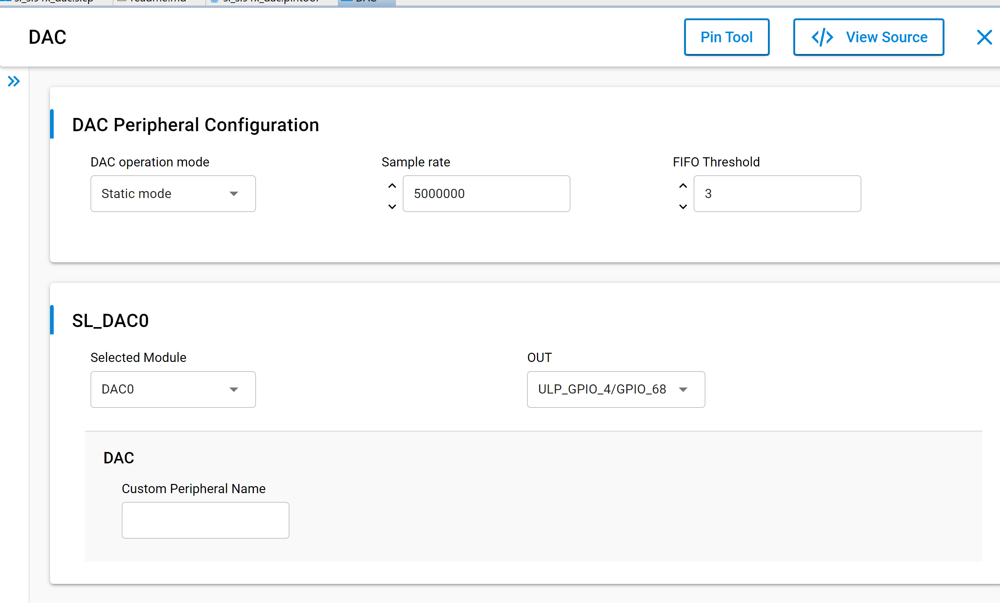
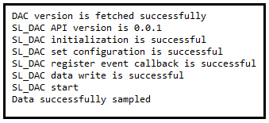
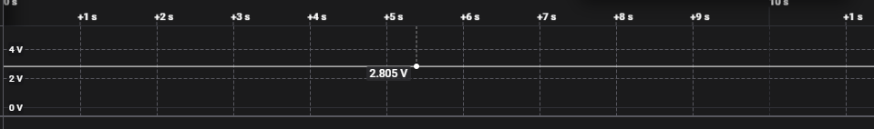
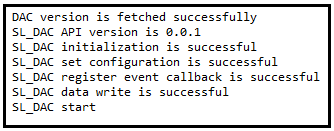
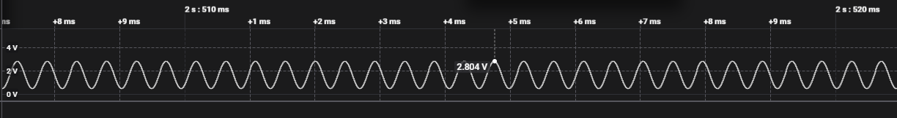

# SL DAC

## Table of Contents

- [SL DAC](#sl-dac)
  - [Table of Contents](#table-of-contents)
  - [Purpose/Scope](#purposescope)
  - [Overview](#overview)
  - [Prerequisites/Setup Requirements](#prerequisitessetup-requirements)
    - [Hardware Requirements](#hardware-requirements)
    - [Software Requirements](#software-requirements)
    - [Setup Diagram](#setup-diagram)
  - [Getting Started](#getting-started)
  - [Application Build Environment](#application-build-environment)
    - [Application Configuration Parameters](#application-configuration-parameters)
    - [Pin Configuration](#pin-configuration)
  - [Test the Application](#test-the-application)

## Purpose/Scope

This application demonstrate the DAC peripheral, including:

- Conversion of digital input to 10-bit analog output.
- Samples the data.
- Converting data into analog output based on operation mode.

## Overview

- The DAC Controller works on a DAC with a resolution of 10 bits at 5MHZ sampling frequency maximum.
- These are the following operating modes in AUX DAC controller:
  - Static Mode Operation: DAC will give out constant voltage output for a programmed DAC.
  - FIFO Mode Operation: DAC controller can be kept in FIFO mode to play continuously digital word on DAC. This mode can be used for playing Single tone waveform in DAC.
  - Reference voltage for ADC operation: This mode is currently not supported
- DAC will work only in single ended.
- Monotonic by design - based on input sample it will give equivalent output.
- If DAC is started, it is recommended to **stop it before de-initializing**. This is general flow of API calls for DAC:  [sl_si91x_dac_init](https://docs.silabs.com/wiseconnect/latest/wiseconnect-api-reference-guide-si91x-peripherals/dac#sl-si91x-dac-init) -> [sl_si91x_dac_start](https://docs.silabs.com/wiseconnect/latest/wiseconnect-api-reference-guide-si91x-peripherals/dac#sl-si91x-dac-start) -> [sl_si91x_dac_stop](https://docs.silabs.com/wiseconnect/latest/wiseconnect-api-reference-guide-si91x-peripherals/dac#sl-si91x-dac-stop) -> [sl_si91x_dac_deinit](https://docs.silabs.com/wiseconnect/latest/wiseconnect-api-reference-guide-si91x-peripherals/dac#sl-si91x-dac-deinit).

## Prerequisites/Setup Requirements

### Hardware Requirements

- Windows PC
- Silicon Labs Si917 Evaluation Kit [[BRD4002](https://www.silabs.com/development-tools/wireless/wireless-pro-kit-mainboard?tab=overview) + [BRD4338A](https://www.silabs.com/development-tools/wireless/wi-fi/siwx917-rb4338a-wifi-6-bluetooth-le-soc-radio-board?tab=overview) / [BRD4342A](https://www.silabs.com/development-tools/wireless/wi-fi/siwx91x-rb4342a-wifi-6-bluetooth-le-soc-radio-board?tab=overview) / [BRD4343A](https://www.silabs.com/development-tools/wireless/wi-fi/siw917y-rb4343a-wi-fi-6-bluetooth-le-8mb-flash-radio-board-for-module?tab=overview)]
- SiWx917 AC1 Module Explorer Kit [BRD2708A](https://www.silabs.com/development-tools/wireless/wi-fi/siw917y-ek2708a-explorer-kit)

### Software Requirements

- Simplicity Studio
- Serial console setup
  - For Serial Console setup instructions, refer to [link name](https://docs.silabs.com/wiseconnect/latest/wiseconnect-developers-guide-developing-for-silabs-hosts/using-the-simplicity-studio-ide#console-input-and-output).

### Setup Diagram

> 

## Getting Started

Refer to the instructions [here](https://docs.silabs.com/wiseconnect/latest/wiseconnect-getting-started/) to:

- [Install Simplicity Studio](https://docs.silabs.com/wiseconnect/latest/wiseconnect-developers-guide-developing-for-silabs-hosts/using-the-simplicity-studio-ide#install-simplicity-studio)
- [Install WiSeConnect extension](https://docs.silabs.com/wiseconnect/latest/wiseconnect-developers-guide-developing-for-silabs-hosts/using-the-simplicity-studio-ide#install-the-wiseconnect-3-extension)
- [Connect your device to the computer](https://docs.silabs.com/wiseconnect/latest/wiseconnect-developers-guide-developing-for-silabs-hosts/using-the-simplicity-studio-ide#connect-siwx91x-to-computer)
- [Upgrade your connectivity firmware](https://docs.silabs.com/wiseconnect/latest/wiseconnect-developers-guide-developing-for-silabs-hosts/using-the-simplicity-studio-ide#update-siwx91x-connectivity-firmware)
- [Create a Studio project](https://docs.silabs.com/wiseconnect/latest/wiseconnect-developers-guide-developing-for-silabs-hosts/using-the-simplicity-studio-ide#create-a-project)

For details on the project folder structure, see the [WiSeConnect Examples](https://docs.silabs.com/wiseconnect/latest/wiseconnect-examples/#example-folder-structure) page.

## Application Build Environment

### Application Configuration Parameters

- Configure UC from the slcp component.
- Open the **sl_si91x_dac.slcp** project file, select the **Software Component** tab, and search for **DAC** in the search bar.
- Use the configuration wizard to configure different parameters. Below are the configuration screen, where user can select as per requirement.

  - **DAC Peripheral Configuration**

    - DAC operation mode: Static mode and FIFO mode. By default it is in Static mode.
    - Sample rate: Sample rate can be configurable to DAC, sample rate unit is samples/second. The configuration range from 63sps to 5Msps.
    - FIFO Threshold: This is applicable only for FIFO mode. There is no impact even configure for other modes. The configuration range from 0 to 7.

      

- After running the application, see the output on logic analyzer in GPIO_30[P35].
- Apply the different voltages (1.8V to 3.6v) as reference voltage and input samples, based on this observe output in analyzer.
- The output data should match the input sample that was supplied. Due to DAC electrical specifications, the highest output voltage tolerance is 0.85v and lowest output voltage tolerance is 0.15v.

### Pin Configuration

- The following table lists the mentioned pin numbers for BRD4338a. If you want to use a different radio board, see the board-specific user guide.

  | DAC | GPIO's | Breakout pin on WPK (4002A baseboard)|
  | --- | --- | --- |
  | DAC0 | ULP_GPIO_4 | NA |
  | DAC1 | GPIO_30 | [P35] |
  
- Because of the GPIO workarounds described below, the DAC output in BRD4338a is read internally, supplied to OPAMP1, and allows the user to see the OPAMP1 output on the GPIO_30[P35] pin.

> **Note:**
>
> - For BRD4338A, ULP GPIO_4 is not available, so the pintool annotation for DAC is bypassed.
> - Before configuring DAC pins, review your board’s pinout to ensure the necessary GPIOs are available and not assigned to other functions. Assign DAC pins in your project according to your hardware setup, especially when working with different OPNs.

## Test the Application

Refer to the instructions [here](https://docs.silabs.com/wiseconnect/latest/wiseconnect-getting-started/) to:

1. Compile and run the application.
2. By default, DAC will be in Static mode. The output in this mode will be a constant voltage.
3. Make use of a logic analyzer to examine the output in GPIO_30[P35].

   - DAC Static mode:

     - Console Output:

       

     - Logic Analyzer Output:

       

   - DAC FIFO mode:

     - Console Output:

       

     - Logic Analyzer Output:

       

> **Note:**
> - In the [`dac_example.c`](https://github.com/SiliconLabs/wiseconnect/blob/v4.0.0-content-for-docs/examples/si91x_soc/peripheral/sl_si91x_dac/dac_example.c) file, locate the 'STATIC_MODE' macro. If the DAC operation mode is set to Static, make sure to set the value to '1' for this macro. If the FIFO mode is selected, substitute '0' for this macro.
> - BUFFER_SIZE should be '1' for DAC static mode in [`dac_example.c`](https://github.com/SiliconLabs/wiseconnect/blob/v4.0.0-content-for-docs/examples/si91x_soc/peripheral/sl_si91x_dac/dac_example.c).
> - Use following formula to find equivalent output analog voltage of DAC
>
>         DAC_output = ((input sample/(2^10)) * Vref Voltage);
>
> - If input sample value is '0x33A' and voltage reference is 2.8v, then DAC_output = ((0x33A/1024) * 2.8).
> - Interrupt handlers are implemented in the driver layer, and user callbacks are provided for custom code. If you want to write your own interrupt handler instead of using the default one, make the driver interrupt handler a weak handler. Then, copy the necessary code from the driver handler to your custom interrupt handler.
