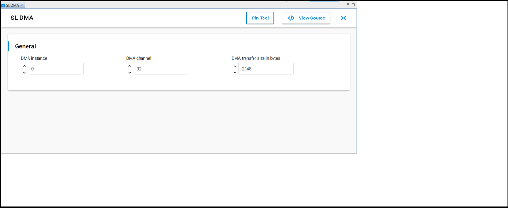
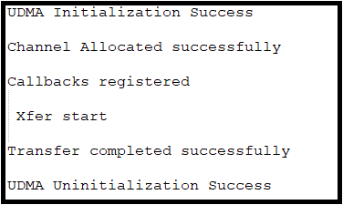

# SL DMA

## Table of Contents

- [SL DMA](#sl-dma)
  - [Table of Contents](#table-of-contents)
  - [Purpose/Scope](#purposescope)
  - [Overview](#overview)
  - [About Example Code](#about-example-code)
  - [Prerequisites/Setup Requirements](#prerequisitessetup-requirements)
    - [Hardware Requirements](#hardware-requirements)
    - [Software Requirements](#software-requirements)
    - [Setup Diagram](#setup-diagram)
  - [Getting Started](#getting-started)
  - [Application Build Environment](#application-build-environment)
  - [Test the Application](#test-the-application)

## Purpose/Scope

This DMA example performs memory-to-memory DMA transfer of different sizes. Users can change the DMA transfer size by updating SL_DMA_TRANSFER_SIZE in UC.

This example used both a simple DMA transfer API and a generic API for performing DMA transfer.

## Overview

- DMA is used for performing transfers without processor intervention.
- Si91x DMA supports three types of DMA transfers: memory-to-memory, peripheral-to-memory, and memory-to-peripheral.
- UDMA0 supports 32 channels--out of which last 24 are dedicated channels for particular peripherals. The first 8 channels can support 32 different peripherals.
- The number of transfers in a single DMA cycle can be programmed from 1 to 1024.
- The transfer address increment can be greater than the data width.
- ULP_DMA only supports 12 channels.

## About Example Code

- [`dma_example.c`](https://github.com/SiliconLabs/wiseconnect/blob/v4.0.0-content-for-docs/examples/si91x_soc/peripheral/sl_si91x_dma/dma_example.c) file demonstrates how to use DMA peripheral to perform memory-to-memory transfers.
- In this example, the first DMA initialization is done using [sl_si91x_dma_init](https://docs.silabs.com/wiseconnect/latest/wiseconnect-api-reference-guide-si91x-peripherals/dma#sl-si91x-dma-init).
- Then [sl_si91x_dma_allocate_channel](https://docs.silabs.com/wiseconnect/latest/wiseconnect-api-reference-guide-si91x-peripherals/dma#sl-si91x-dma-allocate-channel) is used to allocate DMA_CHANNEL for transfer.
- After configuring the channel, callbacks are registered using [sl_si91x_dma_register_callbacks](https://docs.silabs.com/wiseconnect/latest/wiseconnect-api-reference-guide-si91x-peripherals/dma#sl-si91x-dma-register-callbacks).
- In this example DMA transfer can be initiated by two methods:
  1. Using [sl_si91x_dma_simple_transfer](https://docs.silabs.com/wiseconnect/latest/wiseconnect-api-reference-guide-si91x-peripherals/dma#sl-si91x-dma-simple-transfer), the user can quickly perform DMA transfer using bare minimum configurations.
  2. Using [sl_si91x_dma_transfer](https://docs.silabs.com/wiseconnect/latest/wiseconnect-api-reference-guide-si91x-peripherals/dma#sl-si91x-dma-transfer), the user can configure more DMA parameters for transfer.
- The user can either use any of above functions for performing DMA transfer.

## Prerequisites/Setup Requirements

### Hardware Requirements

- Windows PC
- Silicon Labs Si917 Evaluation Kit [[BRD4002](https://www.silabs.com/development-tools/wireless/wireless-pro-kit-mainboard?tab=overview) + [BRD4338A](https://www.silabs.com/development-tools/wireless/wi-fi/siwx917-rb4338a-wifi-6-bluetooth-le-soc-radio-board?tab=overview) / [BRD4342A](https://www.silabs.com/development-tools/wireless/wi-fi/siwx91x-rb4342a-wifi-6-bluetooth-le-soc-radio-board?tab=overview) / [BRD4343A](https://www.silabs.com/development-tools/wireless/wi-fi/siw917y-rb4343a-wi-fi-6-bluetooth-le-8mb-flash-radio-board-for-module?tab=overview)]
- SiWx917 AC1 Module Explorer Kit [BRD2708A](https://www.silabs.com/development-tools/wireless/wi-fi/siw917y-ek2708a-explorer-kit)

### Software Requirements

- Simplicity Studio
- Serial console setup
  - For serial console setup instructions, see the [Console Input and Output](https://docs.silabs.com/wiseconnect/latest/wiseconnect-developers-guide-developing-for-silabs-hosts/using-the-simplicity-studio-ide#console-input-and-output) section in the [*WiSeConnect Developer's Guide*](https://docs.silabs.com/wiseconnect/latest/wiseconnect-developers-guide-about-sdk/).

### Setup Diagram

> 

## Getting Started

Refer to the instructions [here](https://docs.silabs.com/wiseconnect/latest/wiseconnect-getting-started/) to:

- [Install Simplicity Studio](https://docs.silabs.com/wiseconnect/latest/wiseconnect-developers-guide-developing-for-silabs-hosts/using-the-simplicity-studio-ide#install-simplicity-studio)
- [Install WiSeConnect extension](https://docs.silabs.com/wiseconnect/latest/wiseconnect-developers-guide-developing-for-silabs-hosts/using-the-simplicity-studio-ide#install-the-wiseconnect-3-extension)
- [Connect your device to the computer](https://docs.silabs.com/wiseconnect/latest/wiseconnect-developers-guide-developing-for-silabs-hosts/using-the-simplicity-studio-ide#connect-siwx91x-to-computer)
- [Upgrade your connectivity firmware](https://docs.silabs.com/wiseconnect/latest/wiseconnect-developers-guide-developing-for-silabs-hosts/using-the-simplicity-studio-ide#update-siwx91x-connectivity-firmware)
- [Create a Studio project](https://docs.silabs.com/wiseconnect/latest/wiseconnect-developers-guide-developing-for-silabs-hosts/using-the-simplicity-studio-ide#create-a-project)

For details on the project folder structure, see the [WiSeConnect Examples](https://docs.silabs.com/wiseconnect/latest/wiseconnect-examples/#example-folder-structure) page.

## Application Build Environment

- Open **sl_si91x_dma.slcp** project file, select the **Software Component** tab, and search for **SL_DMA** in the search bar.

  > 

- Configure SL_DMA0_CHANNEL_COUNT(1 - 32) in UC - Number of available channels for UDMA0
- Configure the following macros in the [`dma_example.c`](https://github.com/SiliconLabs/wiseconnect/blob/v4.0.0-content-for-docs/examples/si91x_soc/peripheral/sl_si91x_dma/dma_example.c) file and update/modify following macros, if required.

    ```C
    #define DMA_SIMPLE_TRANSFER 1    ///< Enable/Disable simple transfer
    #define DMA_CHANNEL         32   ///< DMA0 channel number 
    #define DMA_TRANSFER_SIZE   2048 ///< DMA transfer size 
    ```  

## Test the Application

Refer to the instructions [here](https://docs.silabs.com/wiseconnect/latest/wiseconnect-developers-guide-developing-for-silabs-hosts/using-the-simplicity-studio-ide#build-an-application) to:

1. compile and run the application.
2. The following prints should appear on console.

   > 

3. In debug mode, users can inspect the source buffer `src0[DMA_TRANSFER_SIZE]` (contains sequential data 1,2,3...) and destination buffer `dst0[DMA_TRANSFER_SIZE]` (initially zeros, then copied data after transfer) to verify successful memory-to-memory DMA transfer.

> **Note:**
> - The debug feature will not work after M4 flash is turned off
> - Interrupt handlers are implemented in the driver layer, and user callbacks are provided for custom code. If you want to write your own interrupt handler instead of using the default one, make the driver interrupt handler a weak handler. Then, copy the necessary code from the driver handler to your custom interrupt handler.
