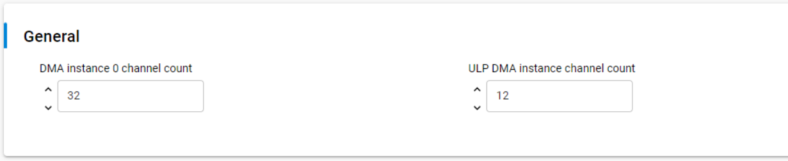

# SL DMA

## Table of Contents

- [Purpose/Scope](#purposescope)
- [Overview](#overview)
- [About Example Code](#about-example-code)
- [Prerequisites/Setup Requirements](#prerequisitessetup-requirements)
  - [Hardware Requirements](#hardware-requirements)
  - [Software Requirements](#software-requirements)
  - [Setup Diagram](#setup-diagram)
- [Getting Started](#getting-started)
- [Application Build Environment](#application-build-environment)
- [Test the Application](#test-the-application)

## Purpose/Scope

- This DMA example performs memory to memory DMA transfer of different sizes. User can change the DMA transfer size by updating SL_DMA_TRANSFER_SIZE in UC.
- This example used both simple DMA transfer API and generic API for performing DMA transfer.

## Overview

- DMA is used for performing transfers without processor intervention.
- Si91x DMA supports 3 types of DMA transfers. They are memory to memory, peripheral to memory, memory to peripheral.
- UDMA0 supports 32 channels. Out of which last 24 are dedicated channels for particular peripherals. First 8 channels can support 32 different peripherals.
- The number of transfers in a single DMA cycle can be programmed from 1 to 1024.
- The transfer address increment can be greater than the data width.
- ULP_DMA only supports 12 channels.

## About Example Code

- \ref dma_example.c file demonstrates how to use DMA peipheral to perform memory to memory transfers
- In this example first dma initialization is done using \ref sl_si91x_dma_init
- Then \ref sl_si91x_dma_allocate_channel is used to allocate DMA_CHANNEL for transfer.
- After configuring channel, callbacks are registered using \ref sl_si91x_dma_register_callbacks
- In this example DMA transfer can be initiated by two methods,
  1.  Using \ref sl_si91x_dma_simple_transfer, user can quickly perform DMA transfer using bare minimum configurations.
  2.  Using \ref sl_si91x_dma_transfer, user can configure more DMA parameters for transfer
- User can either use any of above functions for performing DMA transfer.

## Prerequisites/Setup Requirements

### Hardware Requirements

- Windows PC
- Silicon Labs Si917 Evaluation Kit [WPK(BRD4002) + BRD4338A / BRD4342A / BRD4343A ]
- SiWx917 AC1 Module Explorer Kit (BRD2708A)
- Ezurio Veda SL917 Explorer Kit Board (BRD2911A)

### Software Requirements

- Simplicity Studio
- Serial console Setup
  - For Serial Console setup instructions, refer [here](https://docs.silabs.com/wiseconnect/latest/wiseconnect-developers-guide-developing-for-silabs-hosts/#console-input-and-output).

### Setup Diagram

> 

## Getting Started

Refer to the instructions [here](https://docs.silabs.com/wiseconnect/latest/wiseconnect-getting-started/) to:

- [Install Simplicity Studio](https://docs.silabs.com/wiseconnect/latest/wiseconnect-developers-guide-developing-for-silabs-hosts/#install-simplicity-studio)
- [Install WiSeConnect 3 extension](https://docs.silabs.com/wiseconnect/latest/wiseconnect-developers-guide-developing-for-silabs-hosts/#install-the-wi-se-connect-3-extension)
- [Connect your device to the computer](https://docs.silabs.com/wiseconnect/latest/wiseconnect-developers-guide-developing-for-silabs-hosts/#connect-si-wx91x-to-computer)
- [Upgrade your connectivity firmware ](https://docs.silabs.com/wiseconnect/latest/wiseconnect-developers-guide-developing-for-silabs-hosts/#update-si-wx91x-connectivity-firmware)
- [Create a Studio project ](https://docs.silabs.com/wiseconnect/latest/wiseconnect-developers-guide-developing-for-silabs-hosts/#create-a-project)

For details on the project folder structure, see the [WiSeConnect Examples](https://docs.silabs.com/wiseconnect/latest/wiseconnect-examples/#example-folder-structure) page.

## Application Build Environment

- Open **sl_si91x_dma.slcp** project file select **software component** tab and search for **SL_DMA** in search bar.

  > 

- Configure SL_DMA0_CHANNEL_COUNT(0 - 32) - Number of available channels for UDMA0 
- Configure the following macros in dma_example.c file and update/modify following macros if required.

```C
#define DMA_SIMPLE_TRANSFER 1    ///< Enable/Disable simple transfer
#define DMA_CHANNEL			32   ///< DMA0 channel number 
#define DMA_TRANSFER_SIZE   2048 ///< DMA transfer size 
```  

## Test the Application

Refer to the instructions [here](https://docs.silabs.com/wiseconnect/latest/wiseconnect-getting-started/) to:

1. Build the SI91x - SL_DMA example in Studio.
2. Flash, run and debug the application
3. Following prints should appear on console

   > 

> **Note:**
>
> - The debug feature of Simplicity Studio will not work after M4 flash is turned off.
> - To check Prints for DMA Peripheral examples, connect the USB to TTL uart connector's RX_pin, to the EXP_HEADER-7 of the WPK[BRD4002A] Base Board.


> **Note:**
>
> - Interrupt handlers are implemented in the driver layer, and user callbacks are provided for custom code. If you want to write your own interrupt handler instead of using the default one, make the driver interrupt handler a weak handler. Then, copy the necessary code from the driver handler to your custom interrupt handler.
