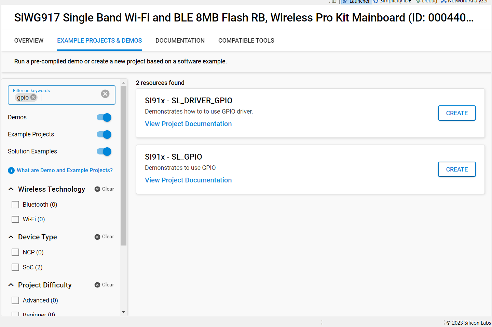

# Driver GPIO

## Introduction

- The GPIO has 3 instances in MCU.
  - HP Domain is used to control the SoC GPIO's(GPIO_n; n=0 to 57).
  - ULP Domain is used to control the ULP GPIO's(ULP_GPIO_n; n=0 to 11)
  - UULP Domain which is used to control the UULP GPIO's(UULP_GPIO_n; n=0 to 4)
- HP and ULP Domain have same features and functionality except for different base address.
- Each port in HP Domain have maximum of 16 GPIO pins. There are total 4 ports in HP Domain. Port 0,1,2 have maximum of 16 GPIO pins. Port 3 have 9 GPIO pins to use.
- ULP GPIO domain has only one port and calling as Port 4 in program which has maximum of 12 pins.

NOTE: Please note that GPIO_n (n=0:5) are dedicated for the Secure Zone Processor's Flash interface. The MCU should NOT be changing any configuration related to these GPIOs under any circumstances since it may lead to the Flash content being corrupted, rendering the chip unusable. This is applicable to MCU HP EGPIO Instance.

- All the GPIO pins in HP/ULP Domain support set,clear,toggle,programmed as output,input etc.

## Setting Up

- To use this application following Hardware, Software and the Project Setup is required

### Hardware Requirements

- Windows PC
- Silicon Labs [Si917 Evaluation Kit WSTK/WPK + BRD4338A]


### Software Requirements

- Si91x SDK
- Embedded Development Environment
  - For Silicon Labs Si91x, use the latest version of Simplicity Studio (refer **"Download and Install Simplicity Studio"** section in **getting-started-with-siwx917-soc** guide at **release_package/docs/index.html**)

## Examples

- Details for the example code are described in the following subsections.

## Initialization of GPIO in HP Domain

NOTE : GPIO HP instance have port-0, port-1, port-2, port-3.

- GPIO to work in HP Domain requires few steps to consider.
- Call \ref sl_gpio_driver_initialization(). This API has some API's being called, which are discussed below.
  - Enable \ref sl_si91x_gpio_driver_enable_clock(), passing enumerator M4CLK_GPIO of type sl_si91x_gpio_driver_select_clock_t as parameter.
  - Enable PAD selection for GPIO pins using \ref sl_si91x_gpio_driver_enable_pad_selection(), passing PAD selection number as parameter.
    NOTE: Do not enable PAD selection number 9, as it is pre-configured for other function .
  - Enable PAD receiver for GPIO pin to program it as either input (or) output toggling \ref sl_si91x_gpio_driver_enable_pad_receiver(), passing GPIO pin number as parameter.
  - Set mode of the GPIO pin using \ref sl_gpio_driver_set_pin_mode() API. Pass port of type \ref sl_gpio_port_t, pin, mode of type \ref sl_gpio_mode_t, output value as parameters.
  - Set direction of the GPIO pin using \ref sl_si91x_gpio_driver_set_pin_direction() API. Pass port, pin , direction of type \ref sl_si91x_gpio_driver_direction_t as parameters.
- Toggle the GPIO pin using API \ref sl_gpio_driver_toggle_pin_output(), by passing port, pin number as parameters.
- To handle the pin interrupt in HP GPIO, API \ref sl_gpio_driver_configure_interrupt() is used.
- To handle the group interrupt in HP GPIO, API \ref sl_si91x_gpio_driver_configure_group_interrupt() is used.

## Initialization of GPIO in ULP Domain

NOTE : GPIO ULP instance have port-4.

- GPIO to work in ULP Domain requires few steps to consider.
- Call \ref sl_gpio_driver_ulp_initialization(). This API has some API's being called, which are discussed below.
  - Enable \ref sl_si91x_gpio_driver_enable_clock(), passing enumerator ULPCLK_GPIO of type sl_si91x_gpio_driver_select_clock_t as parameter.
  - Enable PAD receiver for GPIO pin to program if using pin as input \ref sl_si91x_gpio_driver_enable_ulp_pad_receiver(), passing GPIO pin number as parameter.
  - Set mode of the GPIO pin using \ref sl_gpio_driver_set_pin_mode() API. Pass port of type \ref sl_gpio_port_t, pin, mode of type \ref sl_gpio_mode_t, output value as parameters.
  - Set direction of the GPIO pin using \ref sl_si91x_gpio_driver_set_pin_direction() API. Pass port, pin , direction of type \ref sl_si91x_gpio_driver_direction_t as parameters.
- We can use \ref sl_gpio_driver_get_pin_input() API, to get/read status from gpio pin. Parameters passed are ULP port and pin.
- To handle the pin interrupt in ULP GPIO, API \ref sl_si91x_gpio_driver_configure_ulp_pin_interrupt() is used.
- To handle the group interrupt in ULP GPIO, API \ref sl_si91x_gpio_driver_configure_ulp_group_interrupt() is used.

## Initialization of GPIO in UULP Domain

- GPIO to work in UULP Domain requires few steps to consider.
- Call \ref sl_gpio_driver_uulp_initialization(). This API has some API's being called, which are discussed below.
  - Enable \ref sl_si91x_gpio_driver_enable_clock(), passing enumerator ULPCLK_GPIO of type sl_si91x_gpio_driver_select_clock_t as parameter.
  - Enable input buffer for GPIO pin \ref sl_si91x_gpio_driver_select_uulp_npss_input_buffer(), passing GPIO pin number, buffer of type \ref sl_si91x_gpio_input_buffer_t as parameter.
  - Set mode of the GPIO pin using \ref sl_si91x_gpio_driver_set_uulp_npss_pin_mux() API. Pass pin, mode of type \ref sl_si91x_uulp_npss_mode_t as parameters.
  - Set direction of the GPIO pin using \ref sl_si91x_gpio_driver_set_uulp_npss_direction() API. Pass pin , direction of type \ref sl_si91x_gpio_direction_t as parameters.
- We can use \ref sl_si91x_gpio_driver_set_uulp_npss_pin_value() API, to set the GPIO pin.
- To handle the pin interrupt in UULP GPIO, API \ref sl_si91x_gpio_driver_configure_uulp_interrupt() is used.
- To get the status of the GPIO pin use \ref sl_si91x_gpio_driver_get_uulp_npss_pin() API, by passing pin number as parameter.

## Project Setup

- **Silicon Labs Si91x** refer **"Download SDK"** section in **getting-started-with-siwx917-soc** guide at **release_package/docs/index.html** to work with Si91x and Simplicity Studio

## Loading Application on Simplicity Studio

1. With the product Si917 selected, navigate to the example projects by clicking on Example Projects & Demos in simplicity studio and click on to  DRIVER_GPIO Example application as shown below.



## Configuration and Steps for Execution

- Configure the following parameters in gpio_driver_example.c (examples/si91x_soc/peripheral/sl_si91x_driver_gpio/) file and update/modify following macros if required

  ```c
  # define POLARITY  0 // Polarity for GPIO pin
  # define PIN_COUNT 2 // Number of interrupts needed
  # define LEVEL_EVENT 0 // level for group interrupt
  # define EDGE_EVENT  1 // Edge for group interrupt
  # define GRP_COUNT   2 // Count of group interrupt pins
  # define PINS       0x0c40 // Pins in a port to mask
  # define INT_CH       0 // GPIO Pin interrupt 0
  ```

## Build

1. Compile the application in Simplicity Studio using build icon.


## Device Programming

- To program the device ,refer **"Burn M4 Binary"** section in **getting-started-with-siwx917-soc** guide at **release_package/docs/index.html** to work with Si91x and Simplicity Studio

## Executing the Application

1. Compile and run the application. Please refer **getting-started-with-siwx917-soc** guide at **release_package/docs/index.html** on how to complie and run the application. 

## Expected Results

- GPIO(LED1) should be continously toggled ,connect logic analyser to F11 on WSTK board to observe the toggle state.

NOTE: These pin configurations are specific to BRD4338A board.

## Additional Information:
  NOTE: ALL enumerators defined below are of type \ref gpio_instance_type_t which are present in gpio_driver_example.c. Make corresponding enumerator to '1', in order to enable the individual functionalities mentioned below.
- By default M4_GPIO_PIN(HP GPIO instance) is enabled. GPIO pin direction, output are printed on the serial console and GPIO should toggle for every 1sec. Connect logic analyser to F11 on WSTK board to observe the toggle state.
- If ULP_GPIO_PIN is enabled, ULP pin direction, mode are printed on the serial console. Connect ULP_GPIO_1 pin to 0v and to 3.3v, and observe the LED0 toggle state. By default led(LED0) will be in high state. Connect logic analyser to P16(ULP_GPIO_1), F10(LED0) and observe the pins state.
- If UULP_GPIO_PIN is enabled, UULP pin direction is printed on the serial console. Connect logic analyser to P14 on WSTK board to observe the toggle state.
- If M4_GPIO_PIN_INTR is enabled, it triggers HP Domain pin interrupt. By default pin interrupt 0 is considered. For analyzing pin interrupt keep a print (or) toggle (or) set(or) clear in gpio_pin_interrupt0_callback() present in gpio_driver_example.c.
- If M4_GPIO_GROUP_INTR is enabled, it triggers HP Domain group interrupt. For analyzing group interrupt keep a print (or) toggle (or) set(or) clear in gpio_group_interrupt0_callback() present in gpio_driver_example.c.
- If M4_GPIO_PORT is enabled, we can set, get pins in a port in a group and clear them.
- If ULP_GPIO_PIN_INTR is enabled, it triggers ULP Domain pin interrupt. For analyzing pin interrupt keep a print (or) toggle (or) set(or) clear in gpio_ulp_pin_interrupt_callback() present in gpio_driver_example.c.
- If ULP_GPIO_GROUP_INTR is enabled, it triggers ULP group interrupt. For analyzing group interrupt keep a print (or) toggle (or) set(or) clear in gpio_ulp_group_interrupt_callback() present in gpio_driver_example.c.
- If UULP_GPIO_PIN_INTR is enabled, it triggers UULP pin interrupt. For analyzing pin interrupt keep a print (or) toggle (or) set(or) clear in gpio_uulp_pin_interrupt_callback() present in gpio_driver_example.c.