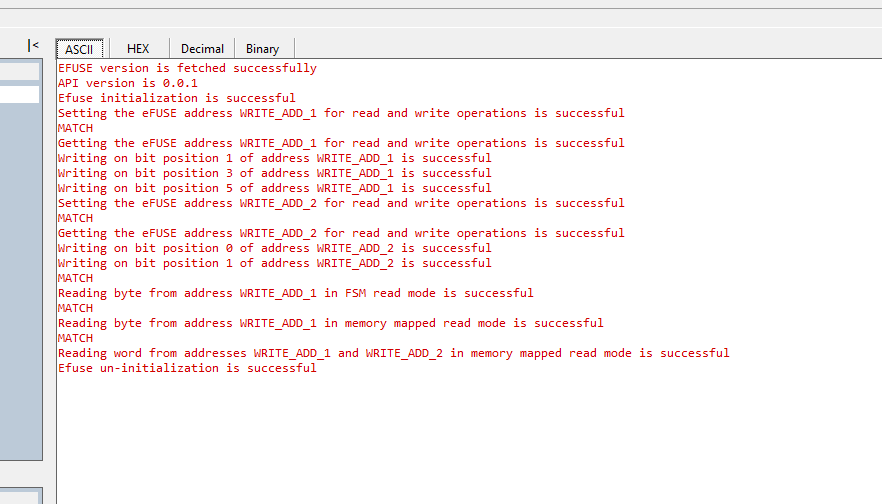

# SL EFUSE

## Table of Contents

- [SL EFUSE](#sl-efuse)
  - [Table of Contents](#table-of-contents)
  - [Purpose/Scope](#purposescope)
  - [Overview](#overview)
  - [About Example Code](#about-example-code)
  - [Prerequisites/Setup Requirements](#prerequisitessetup-requirements)
    - [Hardware Requirements](#hardware-requirements)
    - [Software Requirements](#software-requirements)
    - [Setup Diagram](#setup-diagram)
  - [Getting Started](#getting-started)
  - [Application Build Environment](#application-build-environment)
    - [Application Configuration Parameters](#application-configuration-parameters)
  - [Test the Application](#test-the-application)

## Purpose/Scope

- This application demonstrates how to program the eFuse and read from eFuse. 

## Overview

- The efuse chip set provides 256 eFuse bits as a one-time programmable memory location. These bits use 32-bit addressing 
  with each address containing 8 bits. 
- The eFuse controller is used to program and read these bits. The 255th eFuse bit is programmed to 1'b1 and tested as part of manufacturing tests.
  Hence this bit has to be marked as Reserved with a default value to '1'.
- Supports eFuse programming and read operations.
- Supports memory mapped and FSM based read operation.

## About Example Code

- [`efuse_example.c`](https://github.com/SiliconLabs/wiseconnect/blob/master/examples/si91x_soc/peripheral/sl_si91x_efuse/efuse_example.c) demonstrates how to program the efuse to write and read the data in various modes.
- In this example, first version information of efuse is checked.
- Initialize the efuse if it's not initialized already using [sl_si91x_efuse_init](https://docs.silabs.com/wiseconnect/latest/wiseconnect-api-reference-guide-si91x-peripherals/efuse#sl-si91x-efuse-init), in efuse initialization the efuse and efuse clock is enabled.
- After efuse initialization, we will set and get the address and then read the data from the efuse address after writing the data into the efuse.
- Set the address1 to write and read using [sl_si91x_efuse_set_address](https://docs.silabs.com/wiseconnect/latest/wiseconnect-api-reference-guide-si91x-peripherals/efuse#sl-si91x-efuse-set-address).
- Get the address1 which we have set to write and read from efuse using [sl_si91x_efuse_get_address](https://docs.silabs.com/wiseconnect/latest/wiseconnect-api-reference-guide-si91x-peripherals/efuse#sl-si91x-efuse-get-address). If read address matches with the expected address, console prints MATCH else UNMATCH.
- Write the bit location 1, 3 and 5 of address1 using [sl_si91x_efuse_write_bit](https://docs.silabs.com/wiseconnect/latest/wiseconnect-api-reference-guide-si91x-peripherals/efuse#sl-si91x-efuse-write-bit).
- Set the address2 to write and read using [sl_si91x_efuse_set_address](https://docs.silabs.com/wiseconnect/latest/wiseconnect-api-reference-guide-si91x-peripherals/efuse#sl-si91x-efuse-set-address).
- Get the address2 which we have set to write and read from efuse using [sl_si91x_efuse_get_address](https://docs.silabs.com/wiseconnect/latest/wiseconnect-api-reference-guide-si91x-peripherals/efuse#sl-si91x-efuse-get-address). If read address matches with the expected address, console prints MATCH else UNMATCH.
- Write the bit location 0 and 1 of address2 using [sl_si91x_efuse_write_bit](https://docs.silabs.com/wiseconnect/latest/wiseconnect-api-reference-guide-si91x-peripherals/efuse#sl-si91x-efuse-write-bit).
- Read the 1 byte of data in FSM Read Mode(Indirect Read Mode) from address1 using [sl_si91x_efuse_fsm_read_byte](https://docs.silabs.com/wiseconnect/latest/wiseconnect-api-reference-guide-si91x-peripherals/efuse#sl-si91x-efuse-fsm-read-byte). If read data matches with the expected data, console prints MATCH else UNMATCH.
- Read the 1 byte of data in Memory mapped mode from address1 using [sl_si91x_efuse_memory_mapped_read_byte](https://docs.silabs.com/wiseconnect/latest/wiseconnect-api-reference-guide-si91x-peripherals/efuse#sl-si91x-efuse-memory-mapped-read-byte). If read data matches with the expected data, console prints MATCH else UNMATCH.
- Read the 1 word of data in Memory mapped mode from address1 and address2 using [sl_si91x_efuse_memory_mapped_read_word](https://docs.silabs.com/wiseconnect/latest/wiseconnect-api-reference-guide-si91x-peripherals/efuse#sl-si91x-efuse-memory-mapped-read-word). If read data matches with the expected data, console prints MATCH else UNMATCH.
- Un-Initialize the efuse using [sl_si91x_efuse_deinit](https://docs.silabs.com/wiseconnect/latest/wiseconnect-api-reference-guide-si91x-peripherals/efuse#sl-si91x-efuse-deinit), in efuse Un-Initialize the efuse and efuse clock is disabled.

## Prerequisites/Setup Requirements

### Hardware Requirements

- Windows PC
- Silicon Labs Si917 Evaluation Kit [WPK(BRD4002) + BRD4338A / BRD4342A / BRD4343A ]
- SiWx917 AC1 Module Explorer Kit (BRD2708A)

### Software Requirements

- Simplicity Studio
- Serial console Setup
  - For Serial Console setup instructions, refer [here](https://docs.silabs.com/wiseconnect/latest/wiseconnect-developers-guide-developing-for-silabs-hosts/#console-input-and-output).

### Setup Diagram

> 

## Getting Started

Refer to the instructions [here](https://docs.silabs.com/wiseconnect/latest/wiseconnect-getting-started/) to:

- [Install Simplicity Studio](https://docs.silabs.com/wiseconnect/latest/wiseconnect-developers-guide-developing-for-silabs-hosts/#install-simplicity-studio)
- [Install WiSeConnect 3 extension](https://docs.silabs.com/wiseconnect/latest/wiseconnect-developers-guide-developing-for-silabs-hosts/#install-the-wi-se-connect-3-extension)
- [Connect your device to the computer](https://docs.silabs.com/wiseconnect/latest/wiseconnect-developers-guide-developing-for-silabs-hosts/#connect-si-wx91x-to-computer)
- [Upgrade your connectivity firmware ](https://docs.silabs.com/wiseconnect/latest/wiseconnect-developers-guide-developing-for-silabs-hosts/#update-si-wx91x-connectivity-firmware)
- [Create a Studio project ](https://docs.silabs.com/wiseconnect/latest/wiseconnect-developers-guide-developing-for-silabs-hosts/#create-a-project)

For details on the project folder structure, see the [WiSeConnect Examples](https://docs.silabs.com/wiseconnect/latest/wiseconnect-examples/#example-folder-structure) page.

## Application Build Environment

### Application Configuration Parameters

- Configure the following macros in [`efuse_example.c`](https://github.com/SiliconLabs/wiseconnect/blob/master/examples/si91x_soc/peripheral/sl_si91x_efuse/efuse_example.c) file and update/modify following macros if required. The chip set provides 256 efuse bits as one-time programmable memory location. These bits are 32-bit addressing with each address containing 8-bits. The 255th efuse bit is reserved with a default value to '1'.

  ```C
    #define WRITE_ADD_1         0x00001        // efuse address 1
    #define WRITE_ADD_2         0x00002        // efuse address 2
    #define HOLD                40             // count value depends on clock frequency of EFUSE controller
    #define CLOCK               100            // Clock  
    #define BIT_POS_0           0              // Bit position 0
    #define BIT_POS_1           1              // Bit position 1
    #define BIT_POS_3           3              // Bit position 3
    #define BIT_POS_5           5              // Bit position 5
    #define MATCH_BYTE          0x2A           // 1 byte to be read
    #define MATCH_WORD          0x032A         // 1 word to be read
    #define WRITE_ENABLE        0              // Enables efuse write
  ```

> **Note**: For recommended settings, see the [recommendations guide](https://docs.silabs.com/wiseconnect/latest/wiseconnect-developers-guide-prog-recommended-settings/).

## Test the Application

Refer to the instructions [here](https://docs.silabs.com/wiseconnect/latest/wiseconnect-getting-started/) to:

1. Compile and run the application.
2. When the application is executed, the console displays "MATCH" if the read data matches the expected data (when WRITE_ENABLE is set to 1 in 
   the application).
3. By default write into efuse is disabled by using macro WRITE ENABLE. To write into efuse set the WRITE ENABLE macro.
4. After successful program execution the prints in serial console looks as shown below.

    

>**Note:** As efuse is a one-time programmable, WRITE_ENABLE macro must not be enabled unless we are sure that we want to use the efuse.

> **Note:**
>
> - Interrupt handlers are implemented in the driver layer, and user callbacks are provided for custom code. If you want to write your own interrupt handler instead of using the default one, make the driver interrupt handler a weak handler. Further then, copy the necessary code from the driver handler to your custom interrupt handler.
