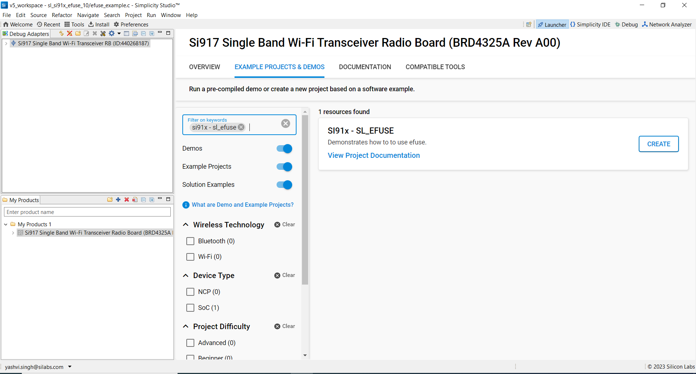

# EFUSE

## Introduction

- Electrical Fuse (EFUSE)
- This application demonstrates how to  program the EFUSE and read the data from EFUSE in various modes. 

## Overview

- The efuse chipset provides 256 eFuse bits as a one-time programmable memory location. These bits use 32-bit addressing 
  with each address containing 8 bits. The eFuse controller is used to program and read these bits. The 255th eFuse 
  bit is programmed to 1'b1 and tested as part of manufacturing tests. Hence this bit has to be marked as Reserved 
  with a default value to '1'.
- Supports eFuse programming and read operations
- Supports memory mapped and FSM based read operation


## About Example Code

- sl_efuse_example.c this example code demonstates how to program the efuse to write and read the data in varoius modes.
- In this example, first version information of efuse is checked.
- Initialize the efuse if it's not initialized already using \ref sl_si91x_efuse_init, in efuse initialization the efuse and efuse clock is enabled.
- After EFUSE initialization, we will set and get the address and then read the data from the efuse address after writing the data into the efuse.
- Set the address1 to write and read using \ref sl_si91x_efuse_set_address.
- Get the address1 which we have set to write and read from efuse using \ref sl_si91x_efuse_get_address. If read address matches with the expected address, console prints MATCH else UNMATCH.
- Write the bit location 1, 3 and 5 of address1 using \ref sl_si91x_efuse_write_bit.
- Set the address2 to write and read using \ref sl_si91x_efuse_set_address.
- Get the address2 which we have set to write and read from efuse using \ref sl_si91x_efuse_get_address. If read address matches with the expected address, console prints MATCH else UNMATCH.
- Write the bit location 0 and 1 of address2 using \ref sl_si91x_efuse_write_bit.
- Read the 1 byte of data in FSM Read Mode(Indirect Read Mode) from address1 using \ref sl_si91x_efuse_fsm_read_byte. If read data matches with the expected data, console prints MATCH else UNMATCH.
- Read the 1 byte of data in Memory mapped mode from address1 using \ref sl_si91x_efuse_memory_mapped_read_byte. If read data matches with the expected data, console prints MATCH else UNMATCH.
- Read the 1 word of data in Memory mapped mode from address1 and address2 using \ref sl_si91x_efuse_memory_mapped_read_word. If read data matches with the expected data, console prints MATCH else UNMATCH.
- Un-Initialize the efuse using \ref sl_si91x_efuse_deinit, in efuse Un-Initialize the efuse and efuse clock is disabled.

## Running Example code

- To use this application following Hardware, Software and the Project Setup is required.

### Hardware Setup

- Windows PC
- Silicon Labs [WSTK + BRD4325A]


### Software Setup

- Si91x SDK
- Embedded Development Environment
  - For Silicon Labs Si91x, use the latest version of Simplicity Studio (refer **"Download and Install Simplicity Studio"** section in **getting-started-with-siwx917-soc** guide at **release_package/docs/index.html**)

## Project Setup

- **Silicon Labs Si91x** refer **"Download SDK"** section in **getting-started-with-siwx917-soc** guide at **release_package/docs/index.html** to work with Si91x and Simplicity Studio

## Loading Application on Simplicity Studio

1. With the product Si917 selected, navigate to the example projects by clicking on Example Projects & Demos
   in simplicity studio and click on to SI91x - SoC EFUSE Example application as shown below.



## Configuration and Steps for Execution

- Configure the following macros in efuse_example.c file and update/modify following macros if required.

```C
#define WRITE_ADD_1         0x00001        // efuse address 1
#define WRITE_ADD_2         0x00002        // efuse address 2
#define HOLD                40             // Hold Time
#define CLOCK               170000000      // Clock Time
#define BIT_POS_0           0              // Bit position 0
#define BIT_POS_1           1              // Bit position 1
#define BIT_POS_3           3              // Bit position 3
#define BIT_POS_5           5              // Bit position 5
#define MATCH_BYTE          0x2A           // 1 byte to be read
#define MATCH_WORD          0x032A         // 1 word to be read
```

## Build

1. Compile the application in Simplicity Studio using build icon
   

## Device Programming

- To program the device ,refer **"Burn M4 Binary"** section in **getting-started-with-siwx917-soc** guide at **release_package/docs/index.html** to work with Si91x and Simplicity Studio

## Executing the Application

1. Connect to the WSTK and BRD4325A Radio board.
2. Compile and run the application.

## Expected Results

- Console prints MATCH if read data matches with the expected data, else prints UNMATCH.