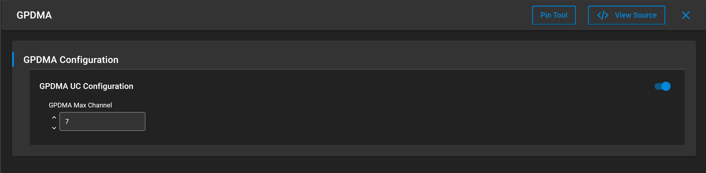
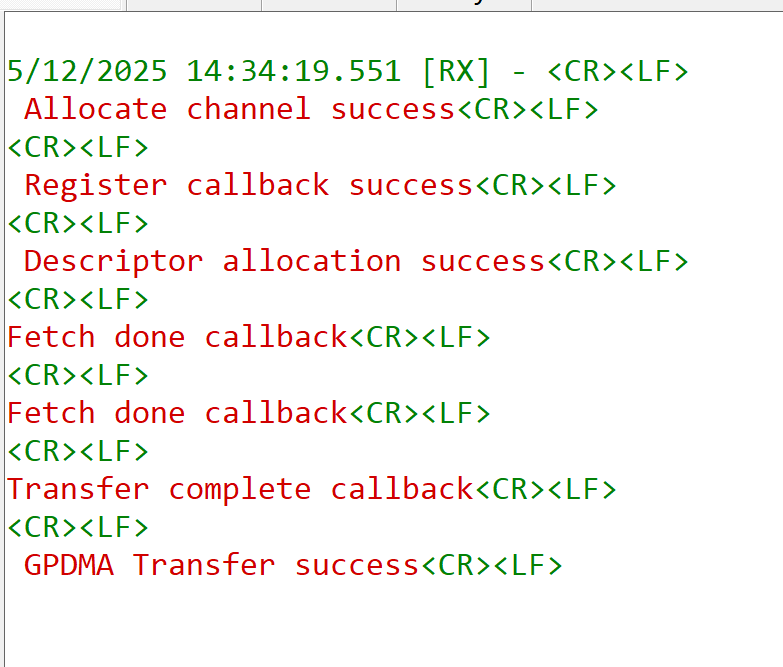

# SiWx91x Platform GPDMA

## Table of Contents

- [SiWx91x Platform GPDMA](#platform-siwx91x-gpdma)
  - [Table of Contents](#table-of-contents)
  - [Purpose/Scope](#purposescope)
  - [Overview](#overview)
  - [About Example Code](#about-example-code)
  - [Prerequisites/Setup Requirements](#prerequisitessetup-requirements)
    - [Hardware Requirements](#hardware-requirements)
    - [Software Requirements](#software-requirements)
    - [Setup Diagram](#setup-diagram)
  - [Getting Started](#getting-started)
  - [Application Build Environment](#application-build-environment)
  - [Test the Application](#test-the-application)
  - [Troubleshooting](#troubleshooting)
  - [Resources](#resources)
  - [Report Bugs/Support](#report-bugssupport)

## Purpose/Scope

This GPDMA example performs memory-to-memory DMA transfer of different sizes. Users can change the DMA transfer size by updating TRANSFER_LENGTH.

This example does both a Generic DMA transfer with a predefined config and a user-defined descriptor for performing DMA transfer.

## Overview

- GPDMA is used for performing transfers without processor intervention.
- SiWx91x GPDMA supports memory-to-memory.
- The GPDMA supports both linked list mode and non linked list mode.
- In linked list mode GPDMA fetches linked descriptors without CPU intervention.
- GPDMA supports 8 channels.

## About Example Code

- [`gpdma_example.c`](gpdma_example.c) demonstrates how to use GPDMA peripheral to perform memory-to-memory transfers.
- In this example, the first GPDMA initialization is done in \ref sl_event_handler.c.
- Then \ref sl_si91x_gpdma_allocate_channel is used to allocate GPDMA_CHANNEL for transfer.
- After configuring the channel, callbacks are registered using \ref sl_si91x_gpdma_register_callbacks
- In this example DMA transfer can be initiated by two methods:
  1. Using \ref sl_si91x_gpdma_allocate_descriptor, the user can quickly perform DMA transfer using predefined configurations.
  2. Using \ref sl_si91x_gpdma_build_descriptor, the user can configure more DMA parameters for transfer.
- The user can either use any of above functions before calling \ref sl_si91x_gpdma_transfer to perform DMA transfer.

## Prerequisites/Setup Requirements

### Hardware Requirements

- Windows PC
- Silicon Labs SiWx91x Evaluation Kit [[BRD4002](https://www.silabs.com/development-tools/wireless/wireless-pro-kit-mainboard?tab=overview) + [BRD4338A](https://www.silabs.com/development-tools/wireless/wi-fi/siwx917-rb4338a-wifi-6-bluetooth-le-soc-radio-board?tab=overview) / [BRD4342A](https://www.silabs.com/development-tools/wireless/wi-fi/siwx91x-rb4342a-wifi-6-bluetooth-le-soc-radio-board?tab=overview) / [BRD4343A](https://www.silabs.com/development-tools/wireless/wi-fi/siw917y-rb4343a-wi-fi-6-bluetooth-le-8mb-flash-radio-board-for-module?tab=overview) / [BRD4343C](https://www.silabs.com/development-tools/wireless/wi-fi/siw917y-rb4343c-wi-fi-6-bluetooth-le-8mb-flash-radio-board-for-module?tab=overview)]
- SiWx917 AC1 Module Explorer Kit [BRD2708A](https://www.silabs.com/development-tools/wireless/wi-fi/siw917y-ek2708a-explorer-kit)

### Software Requirements

- Simplicity Studio
- Serial console setup
  - For serial console setup instructions, see the [Console Input and Output](https://docs.silabs.com/wiseconnect/latest/wiseconnect-developers-guide-developing-for-silabs-hosts/using-the-simplicity-studio-ide#console-input-and-output) section in the *WiSeConnect Developer's Guide*.

### Setup Diagram

> 

## Getting Started

Refer to the instructions [here](https://docs.silabs.com/wiseconnect/latest/wiseconnect-getting-started/) to:

- [Install Simplicity Studio](https://docs.silabs.com/wiseconnect/latest/wiseconnect-developers-guide-developing-for-silabs-hosts/using-the-simplicity-studio-ide#install-simplicity-studio)
- [Install WiSeConnect extension](https://docs.silabs.com/wiseconnect/latest/wiseconnect-developers-guide-developing-for-silabs-hosts/using-the-simplicity-studio-ide#install-the-wiseconnect-3-extension)
- [Connect your device to the computer](https://docs.silabs.com/wiseconnect/latest/wiseconnect-developers-guide-developing-for-silabs-hosts/using-the-simplicity-studio-ide#connect-siwx91x-to-computer)
- [Upgrade your connectivity firmware](https://docs.silabs.com/wiseconnect/latest/wiseconnect-developers-guide-developing-for-silabs-hosts/using-the-simplicity-studio-ide#update-siwx91x-connectivity-firmware)
- [Create a Studio project](https://docs.silabs.com/wiseconnect/latest/wiseconnect-developers-guide-developing-for-silabs-hosts/using-the-simplicity-studio-ide#create-a-project)

For details on the project folder structure, see the [WiSeConnect Examples](https://docs.silabs.com/wiseconnect/latest/wiseconnect-examples/#example-folder-structure) page.

## Application Build Environment

- Open **sl_si91x_gpdma.slcp** project file, select the **Software Component** tab, and search for **SL_GPDMA** in the search bar.

  

- Set `SL_GPDMA_MAX_CHANNEL` (0–7) to specify the maximum channel used in the application.
- Configure and update the required macros in the `gpdma_example.c` file as needed.

  - `SL_GPDMA_SIMPLE_TRANSFER`: When enabled, the transfer uses descriptors with predefined values. To use custom descriptor values, disable this macro and set values for the descriptor manually. By default, it is set to 1.

    ```c
    #define SL_GPDMA_SIMPLE_TRANSFER         1        ///< Enable/Disable simple transfer
    ```

  - `GPDMA_TRANSFER_LENGTH`: Total length (in bytes) of the memory-to-memory GPDMA transfer to be performed by the example. By default, it is set to 4096.

    ```c
    #define GPDMA_TRANSFER_LENGTH            4096     // Transfer length in bytes
    ```

  - `GPDMA_MAX_TRANSFER_LENGTH_CHANNEL0`: Maximum transfer size for the specified channel. This macro should be defined for each channel in use and is used to size the descriptor memory. By default, it is set to 4096.

    ```c
    #define GPDMA_MAX_TRANSFER_LENGTH_CHANNEL0 4096   // Maximum transfer size per channel
    ```

  - `GPDMA_CHANNEL`: Selects the GPDMA channel used for the transfer. It can be any value from 0 to `SL_GPDMA_MAX_CHANNEL`, or `0xFF` to automatically select an available channel. By default, it is set to 0.

    ```c
    #define GPDMA_CHANNEL                    0        // GPDMA channel to use for the transfer
    ```

  - `SL_SI91X_GPDMA_SOURCE_BURST`: Source burst size used by the GPDMA engine during a transfer. By default, it is set to 16.

    ```c
    #define SL_SI91X_GPDMA_SOURCE_BURST      16       // Source burst size
    ```

  - `SL_SI91X_GPDMA_DESTINATION_BURST`: Destination burst size used by the GPDMA engine during a transfer. By default, it is set to 16.

    ```c
    #define SL_SI91X_GPDMA_DESTINATION_BURST 16       // Destination burst size
    ```

- If using multiple channels, ensure each channel has its own buffer for storing descriptors.
- Allocate memory for the descriptors of every channel that is used.
- The size of the descriptor memory buffer for each channel can be calculated similarly to the `SL_MAX_NUMBER_OF_DESCRIPTORS_CHANNEL0` macro.

  - `SL_MAX_NUMBER_OF_DESCRIPTORS_CHANNEL0`: Computes the number of descriptors required for channel 0 based on `GPDMA_MAX_TRANSFER_LENGTH_CHANNEL0` and `MAX_TRANSFER_PER_DESCRIPTOR`. Define a similar macro for each channel that is used.

    ```c
    #define SL_MAX_NUMBER_OF_DESCRIPTORS_CHANNEL0 \
      ((GPDMA_MAX_TRANSFER_LENGTH_CHANNEL0 + MAX_TRANSFER_PER_DESCRIPTOR - 1) / MAX_TRANSFER_PER_DESCRIPTOR)
    ```

- `MAX_TRANSFER_PER_DESCRIPTOR` specifies the maximum transfer length for each descriptor. The maximum allowed value is 4095 bytes.

> **Note**: For recommended settings, please refer the [recommendations guide](https://docs.silabs.com/wiseconnect/latest/wiseconnect-developers-guide-prog-recommended-settings/).

## Test the Application

Refer to the instructions [here](https://docs.silabs.com/wiseconnect/latest/wiseconnect-getting-started/) to:

1. compile and run the application.
2. The following prints should appear on console.

   > 

> **Note:**
>
> - In non-simple transfer FIFO mode or memory fill configurations, direct buffer comparison may fail. As a result, the actual console output may differ from the example shown above.
> - Max transfer size in non linked list mode is 4095.
> - The debug feature of Simplicity Studio will not work after M4 flash is turned off.
> - Only memory-to-memory transfer is supported in GPDMA.
> - By default, the FIFO size for each channel is allocated as 8 in allocate channel. The FIFO size should be higher than or equal to AHB burst size.
> - In case of sleep-wakeup, call `sl_si91x_gpdma_init()` after wakeup before starting a new GPDMA transfer to restore the GPDMA peripheral state.


## Troubleshooting

- If the project does not build, ensure Simplicity Studio and the WiSeConnect extension are installed and the board is connected.
- If the device is not detected, reinstall the connectivity firmware and check USB drivers.

## Resources

- [WiSeConnect Getting Started](https://docs.silabs.com/wiseconnect/latest/wiseconnect-getting-started/)
- [WiSeConnect Examples](https://docs.silabs.com/wiseconnect/latest/wiseconnect-examples/)
- [SiWx91x SoC Documentation](https://docs.silabs.com/wiseconnect/latest/)

## Report Bugs/Support

For issues and support, use the Silicon Labs Community or your normal support channel.

