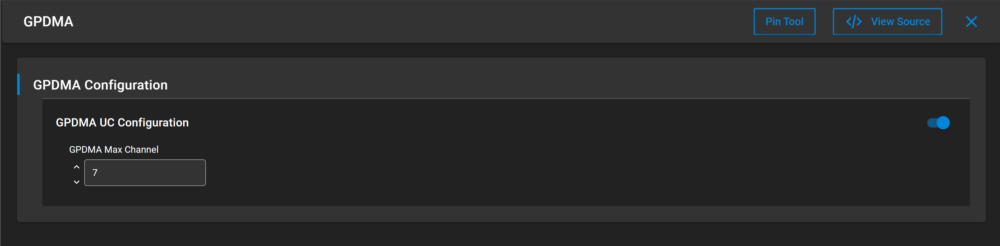

# SL GPDMA

## Table of Contents

- [SL GPDMA](#sl-gpdma)
  - [Table of Contents](#table-of-contents)
  - [Purpose/Scope](#purposescope)
  - [Overview](#overview)
  - [About Example Code](#about-example-code)
  - [Prerequisites/Setup Requirements](#prerequisitessetup-requirements)
    - [Hardware Requirements](#hardware-requirements)
    - [Software Requirements](#software-requirements)
    - [Setup Diagram](#setup-diagram)
  - [Getting Started](#getting-started)
  - [Application Build Environment](#application-build-environment)
  - [Test the Application](#test-the-application)

## Purpose/Scope

This GPDMA example performs memory-to-memory DMA transfer of different sizes. Users can change the DMA transfer size by updating TRANSFER_LENGTH.

This example does both a Generic DMA transfer with a predefined config and a user-defined descriptor for performing DMA transfer.

## Overview

- GPDMA is used for performing transfers without processor intervention.
- Si91x GPDMA supports memory-to-memory.
- The GPDMA supports both linked list mode and non linked list mode.
- In linked list mode GPDMA fetches linked descriptors without CPU intervention.
- GPDMA supports 8 channels.

## About Example Code

- [`gpdma_example.c`](https://github.com/SiliconLabs/wiseconnect/blob/master/examples/si91x_soc/peripheral/sl_si91x_gpdma/gpdma_example.c) demonstrates how to use GPDMA peripheral to perform memory-to-memory transfers.
- In this example, the first GPDMA initialization is done in \ref sl_event_handler.c.
- Then \ref sl_si91x_gpdma_allocate_channel is used to allocate GPDMA_CHANNEL for transfer.
- After configuring the channel, callbacks are registered using \ref sl_si91x_gpdma_register_callbacks
- In this example DMA transfer can be initiated by two methods:
  1. Using \ref sl_si91x_gpdma_allocate_descriptor, the user can quickly perform DMA transfer using predefined configurations.
  2. Using \ref sl_si91x_gpdma_build_descriptor, the user can configure more DMA parameters for transfer.
- The user can either use any of above functions before calling \ref sl_si91x_gpdma_transfer to perform DMA transfer.

## Prerequisites/Setup Requirements

### Hardware Requirements

- Windows PC
- Silicon Labs Si917 Evaluation Kit [WPK(BRD4002) + BRD4338A / BRD4342A / BRD4343A ]
- SiWx917 AC1 Module Explorer Kit (BRD2708A)

### Software Requirements

- Simplicity Studio
- Serial console setup
  - For serial console setup instructions, see the [Console Input and Output](https://docs.silabs.com/wiseconnect/latest/wiseconnect-developers-guide-developing-for-silabs-hosts/#console-input-and-output) section in the *WiSeConnect Developer's Guide*.

### Setup Diagram

> 

## Getting Started

Refer to the instructions [here](https://docs.silabs.com/wiseconnect/latest/wiseconnect-getting-started/) to:

- [Install Simplicity Studio](https://docs.silabs.com/wiseconnect/latest/wiseconnect-developers-guide-developing-for-silabs-hosts/#install-simplicity-studio)
- [Install WiSeConnect 3 extension](https://docs.silabs.com/wiseconnect/latest/wiseconnect-developers-guide-developing-for-silabs-hosts/#install-the-wi-se-connect-3-extension)
- [Connect your device to the computer](https://docs.silabs.com/wiseconnect/latest/wiseconnect-developers-guide-developing-for-silabs-hosts/#connect-si-wx91x-to-computer)
- [Upgrade your connectivity firmware](https://docs.silabs.com/wiseconnect/latest/wiseconnect-developers-guide-developing-for-silabs-hosts/#update-si-wx91x-connectivity-firmware)
- [Create a Studio project](https://docs.silabs.com/wiseconnect/latest/wiseconnect-developers-guide-developing-for-silabs-hosts/#create-a-project)

For details on the project folder structure, see the [WiSeConnect Examples](https://docs.silabs.com/wiseconnect/latest/wiseconnect-examples/#example-folder-structure) page.

## Application Build Environment

- Open **sl_si91x_gpdma.slcp** project file, select the **Software Component** tab, and search for **SL_GPDMA** in the search bar.

  

- Set `SL_GPDMA_MAX_CHANNEL` (0–7) to specify the maximum channel used in the application.
- Configure and update the required macros in the `gpdma_example.c` file as needed.

    ```C
    #define SL_GPDMA_SIMPLE_TRANSFER 1  ///< Enable/Disable simple transfer
    #define GPDMA_TRANSFER_LENGTH   4096  // Transfer length in bytes
    #define GPDMA_MAX_TRANSFER_LENGTH_CHANNEL0 4096 //Maximum transfer size per channel
    #define GPDMA_CHANNEL 0             //GPDMA channel to use for the transfer.
    ```  
- When the `SL_GPDMA_SIMPLE_TRANSFER` macro is enabled, the transfer uses descriptors with predefined values.
- To use custom descriptor values, disable the `SL_GPDMA_SIMPLE_TRANSFER` macro.
- The `GPDMA_MAX_TRANSFER_LENGTH_CHANNEL0` macro defines the maximum transfer size for the specified channel. This macro should be defined for each channel in use.
- Set `GPDMA_CHANNEL` to any value from 0 to `SL_GPDMA_MAX_CHANNEL`, or use `0xFF` to automatically select an available channel.
- If using multiple channels, ensure each channel has its own buffer for storing descriptors.
- Allocate memory for the descriptors of every channel that is used.
- The size of the descriptor memory buffer for each channel can be calculated similarly to the `SL_MAX_NUMBER_OF_DESCRIPTORS_CHANNEL0` macro.
```C
#define SL_MAX_NUMBER_OF_DESCRIPTORS_CHANNEL0 \
  ((GPDMA_MAX_TRANSFER_LENGTH_CHANNEL0 + MAX_TRANSFER_PER_DESCRIPTOR - 1) / MAX_TRANSFER_PER_DESCRIPTOR)
```
- `MAX_TRANSFER_PER_DESCRIPTOR` specifies the maximum transfer length for each descriptor. The maximum allowed value is 4095 bytes.

   - `SL_GPDMA_SIMPLE_TRANSFER`: When this is enabled, descriptors with predefined values are used for transfer. To use custom descriptor values, disable the  `SL_GPDMA_SIMPLE_TRANSFER` macro and select values for the descriptor.
   - ` GPDMA_MAX_TRANSFER_LENGTH_CHANNEL0`: This is the maximum transfer that will be done in the given channel. This should be defined for every channel that is used.
   - Memory should be allocated descriptors of every channel that is used.
   - Size of the descriptor memory buffer can be calculated in the same way as macro `SL_MAX_NUMBER_OF_DESCRIPTORS_CHANNEL0`.

> **Note**: For recommended settings, see the [recommendations guide](https://docs.silabs.com/wiseconnect/latest/wiseconnect-developers-guide-prog-recommended-settings/).

## Test the Application

Refer to the instructions [here](https://docs.silabs.com/wiseconnect/latest/wiseconnect-getting-started/) to:

1. Build the SI91x - SL_GPDMA example in Studio.
2. Flash, run, and debug the application.
3. The following prints should appear on console.

   > 

> **Note:**
>
> - In non-simple transfer FIFO mode or memory fill configurations, direct buffer comparison may fail. As a result, the actual console output may differ from the example shown above.
> - Max transfer size in non linked list mode is 4095.
> - The debug feature of Simplicity Studio will not work after M4 flash is turned off.
> - Only memory-to-memory transfer is supported in GPDMA.
> - By default, the FIFO size for each channel is allocated as 8 in allocate channel. The FIFO size should be higher than or equal to AHB burst size.

