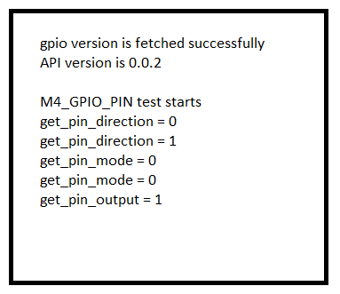

# SL GPIO

## Table of Contents

- [Purpose/Scope](#purposescope)
- [Overview](#overview)
- [About Example Code](#about-example-code)
  - [Initialization of GPIO in HP Domain](#initialization-of-gpio-in-hp-domain)
  - [Initialization of GPIO in ULP Domain](#initialization-of-gpio-in-ulp-domain)
  - [Initialization of GPIO in UULP Domain](#initialization-of-gpio-in-uulp-domain)
- [Prerequisites/Setup Requirements](#prerequisitessetup-requirements)
  - [Hardware Requirements](#hardware-requirements)
  - [Software Requirements](#software-requirements)
  - [Setup Diagram](#setup-diagram)
- [Getting Started](#getting-started)
- [Application Build Environment](#application-build-environment)
  - [Application Configuration Parameters](#application-configuration-parameters)
- [Test the Application](#test-the-application)

## Purpose/Scope

This application provides a low-level driver example and demonstrates the toggling of GPIO for every 1 second.

## Overview

- The GPIO has three instances in MCU.
  - **HP (High Power) Instance:** Controls the SoC GPIOs (GPIO_n; n=0 to 57).
  - **ULP (Ultra Low Power) Instance:** Controls the ULP GPIOs (ULP_GPIO_n; n=0 to 11).
  - **UULP (Ultra Ultra Low Power) Instance:** Controls the UULP GPIOs (UULP_GPIO_n; n=0 to 4).
- The HP and ULP Domains have the same features and functionality except for different base address.
- Each port in the HP Domain has a maximum of 16 GPIO pins. There are total four ports in the HP Domain. Port 0,1, and 2 have maximum of 16 GPIO pins. Port 3 has 9 GPIO pins to use.
- The ULP GPIO Domain has only one port called Port 4 in the program which has maximum of 12 pins.

> **Note:** Please note that GPIO_n (n=0:5) are dedicated for the Secure Zone Processor's Flash interface. The MCU should NOT be changing any configuration related to these GPIOs under any circumstances since it may lead to the Flash content being corrupted, rendering the chip unusable. This is applicable to the MCU HP EGPIO Instance.

- All the GPIO pins in HP/ULP Domain support set, clear, toggle, programmed as output, input, and so on.
- By default, M4_GPIO_PIN (HP GPIO instance) is enabled. GPIO pin direction and output are printed on the serial console, and GPIO should toggle for every 1 second. Connect logic analyzer to F11 on the WPK board to observe the toggle state.
- If ULP_GPIO_PIN is enabled, ULP pin direction and mode are printed on the serial console. Connect ULP_GPIO_1 pin to 0v and to 3.3v, and observe the LED0 toggle state. By default led(LED0) will be in high state. Connect logic analyzer to P16(ULP_GPIO_1), F10(LED0) and observe the pins state.
- If UULP_GPIO_PIN is enabled, UULP pin direction is printed on the serial console. Connect logic analyzer to P14 on WPK board to observe the toggle state.
- If M4_GPIO_PIN_INTR is enabled, it triggers HP Domain pin interrupt. By default pin interrupt 0 is considered. For analyzing pin interrupt keep a print (or) toggle (or) set(or) clear in PIN_IRQ0_Handler() present in gpio_example.c.
- If M4_GPIO_GROUP_INTR is enabled, it triggers HP Domain group interrupt. For analyzing group interrupt keep a print (or) toggle (or) set(or) clear in GRP_IRQ0_Handler() present in gpio_example.c.
- If M4_GPIO_PORT is enabled, we can set, get pins in a port in a group and clear them.
- If ULP_GPIO_PIN_INTR is enabled, it triggers a ULP Domain pin interrupt. For analyzing pin interrupt keep a print (or) toggle (or) set(or) clear in ULP_PIN_IRQ_Handler() present in gpio_example.c.
- If ULP_GPIO_GROUP_INTR is enabled, it triggers a ULP group interrupt. For analyzing group interrupt keep a print (or) toggle (or) set(or) clear in ULP_GROUP_IRQ_Handler() present in gpio_example.c.
- If UULP_GPIO_PIN_INTR is enabled, it triggers a UULP pin interrupt. For analyzing pin interrupt keep a print (or) toggle (or) set(or) clear in UULP_PIN_IRQ_Handler() present in gpio_example.c.

## About Example Code

- Details for the example code are described in the following subsections.

### Initialization of GPIO in HP Domain

> **Note:** GPIO HP instance have port-0, port-1, port-2, port-3.

Getting GPIO to work in the HP Domain requires a few steps to consider.

- Call \ref gpio_initialization(). This API has some APIs being called, which are discussed below.
  - Enable \ref sl_si91x_gpio_enable_clock(), passing enumerator M4CLK_GPIO of type > sl_si91x_gpio_select_clock_t as parameter.
  - Enable PAD selection for GPIO pins using \ref sl_si91x_gpio_enable_pad_selection(), passing PAD selection number as parameter.

     > **Note:** Do not enable PAD selection number 9, as it is pre-configured for other function .

  - To enable host PAD selection for GPIO pin numbers (25 - 30), refer to \ref sl_si91x_gpio_driver_enable_host_pad_selection().
  - Enable PAD receiver for GPIO pin to program it as either input or output toggling \ref sl_si91x_gpio_enable_pad_receiver(), passing GPIO pin number as parameter.
  - Set mode of the GPIO pin using \ref sl_gpio_set_pin_mode() API. Pass port of type \ref sl_gpio_port_t, pin, mode of type \ref sl_gpio_mode_t, and output value as parameters.
  - Set direction of the GPIO pin using \ref sl_si91x_gpio_set_pin_direction() API. Pass port, pin, direction of type \ref sl_si91x_gpio_direction_t as parameters.
- Toggle the GPIO pin using API \ref sl_gpio_toggle_pin_output(), by passing port, pin number as parameters.
- To handle the pin interrupt in HP GPIO, API \ref sl_gpio_configure_interrupt() is used.
- To handle the group interrupt in HP GPIO, API \ref sl_si91x_gpio_configure_group_interrupt() is used.

### Initialization of GPIO in ULP Domain

> **Note:** GPIO ULP instance have port-4.

Getting GPIO to work in ULP Domain requires few steps to consider:

- Call \ref ulp_gpio_initialization(). This API calls some APIs, which are discussed below.
  - Enable \ref sl_si91x_gpio_enable_clock(), passing enumerator ULPCLK_GPIO of type sl_si91x_gpio_select_clock_t as a parameter.
  - Enable PAD receiver for GPIO pin to program if using pin as input \ref sl_si91x_gpio_enable_ulp_pad_receiver(), passing GPIO pin number as a parameter.
  - Set mode of the GPIO pin using \ref sl_gpio_set_pin_mode() API. Pass port of type \ref sl_gpio_port_t, pin, mode of type \ref sl_gpio_mode_t, and output value as parameters.
  - Set direction of the GPIO pin using \ref sl_si91x_gpio_set_pin_direction() API. Pass port, pin, and direction of type \ref sl_si91x_gpio_direction_t as parameters.
- You can use \ref sl_gpio_get_pin_input() API to get/read status from GPIO pin. Parameters passed are ULP port and pin.
- To handle the pin interrupt in ULP GPIO, API \ref sl_si91x_gpio_configure_ulp_pin_interrupt() is used.
- To handle the group interrupt in ULP GPIO, API \ref sl_si91x_gpio_configure_ulp_group_interrupt() is used.

### Initialization of GPIO in UULP Domain

Getting GPIO to work in UULP Domain requires few steps to consider:

- Call \ref uulp_gpio_initialization(). This API calls some APIs, which are discussed below.
  - Enable \ref sl_si91x_gpio_enable_clock(), passing enumerator ULPCLK_GPIO of type sl_si91x_gpio_select_clock_t as a parameter.
  - Enable input buffer for GPIO pin \ref sl_si91x_gpio_select_uulp_npss_input_buffer(), passing GPIO pin number, buffer of type \ref sl_si91x_gpio_input_buffer_t as parameters.
  - Set mode of the GPIO pin using \ref sl_si91x_gpio_set_uulp_npss_pin_mux() API. Pass pin, mode of type \ref sl_si91x_uulp_npss_mode_t as parameters.
  - Set direction of the GPIO pin using \ref sl_si91x_gpio_set_uulp_npss_direction() API. Pass pin , direction of type \ref sl_si91x_gpio_direction_t as parameters.
- You can use \ref sl_si91x_gpio_set_uulp_npss_pin_value() API to set the GPIO pin.
- To handle the pin interrupt in UULP GPIO, API \ref sl_si91x_gpio_configure_uulp_interrupt() is used.
- To get the status of the GPIO pin, use \ref sl_si91x_gpio_get_uulp_npss_pin() API by passing pin number as a parameter.

## Prerequisites/Setup Requirements

### Hardware Requirements

- Windows PC
- Silicon Labs Si917 Evaluation Kit [WPK(BRD4002) + BRD4338A / BRD4342A / BRD4343A ]
- SiWx917 AC1 Module Explorer Kit (BRD2708A)

### Software Requirements

- Simplicity Studio
- Serial console Setup
  - For Serial Console setup instructions, refer [here](https://docs.silabs.com/wiseconnect/latest/wiseconnect-developers-guide-developing-for-silabs-hosts/#console-input-and-output).

### Setup Diagram

> 

## Getting Started

Refer to the instructions [here](https://docs.silabs.com/wiseconnect/latest/wiseconnect-getting-started/) to:

- [Install Simplicity Studio](https://docs.silabs.com/wiseconnect/latest/wiseconnect-developers-guide-developing-for-silabs-hosts/#install-simplicity-studio)
- [Install WiSeConnect 3 extension](https://docs.silabs.com/wiseconnect/latest/wiseconnect-developers-guide-developing-for-silabs-hosts/#install-the-wi-se-connect-3-extension)
- [Connect your device to the computer](https://docs.silabs.com/wiseconnect/latest/wiseconnect-developers-guide-developing-for-silabs-hosts/#connect-si-wx91x-to-computer)
- [Upgrade your connectivity firmware](https://docs.silabs.com/wiseconnect/latest/wiseconnect-developers-guide-developing-for-silabs-hosts/#update-si-wx91x-connectivity-firmware)
- [Create a Studio project](https://docs.silabs.com/wiseconnect/latest/wiseconnect-developers-guide-developing-for-silabs-hosts/#create-a-project)

For details on the project folder structure, see the [WiSeConnect Examples](https://docs.silabs.com/wiseconnect/latest/wiseconnect-examples/#example-folder-structure) page.

## Application Build Environment

### Application Configuration Parameters

- Configure the following parameters in `gpio_example.c` (examples/si91x_soc/peripheral/sl_si91x_gpio) file and update/modify following macros, if required.

  ```c
    #define PORT0                    0      // GPIO Port number(0 to 4)
    #define PIN_COUNT                2      // Number of interrupts needed
    #define POLARITY                 0      // Polarity for GPIO pin
    #define GRP_CNT                  2      // Count of group interrupt pins
    #define INT_CH                   0      // GPIO Pin interrupt 0
    #define NPSS_INTR                2      // NPSS GPIO interrupt number
    #define DELAY                    1000   // Delay for 1sec
  ```

## Test the Application

Refer to the instructions [here](https://docs.silabs.com/wiseconnect/latest/wiseconnect-getting-started/) to:

1. Compile and run the application.
2. By default, GPIO should be continuously toggled.
3. Connect the logic analyzer to GPIO_10 (pin F11) for the Si917 (or GPIO_10 (pin F10) for the Si915 on the WPK board) to observe the toggle state.
4. After successful program execution, the prints in serial console looks as shown below.

    

> **Note:** ALL enumerators defined below are of type \ref gpio_instance_type_t which are present in the `gpio_example.c` file. Make corresponding enumerator to '1' in order to enable the individual functionalities mentioned below.
>> **Note:**
>
> - Interrupt handlers are implemented in the driver layer, and user callbacks are provided for custom code. If you want to write your own interrupt handler instead of using the default one, make the driver interrupt handler a weak handler. Then, copy the necessary code from the driver handler to your custom interrupt handler.
