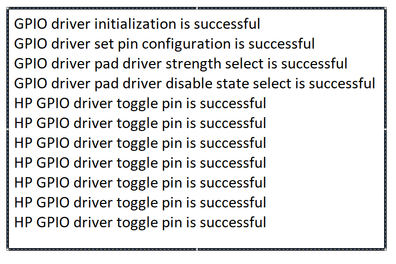

# SL GPIO DETAILED

## Table of Contents

- [SL GPIO DETAILED](#sl-gpio-detailed)
  - [Table of Contents](#table-of-contents)
  - [Purpose/Scope](#purposescope)
  - [Overview](#overview)
  - [About Example Code](#about-example-code)
    - [Initialization of GPIO](#initialization-of-gpio)
  - [Prerequisites/Setup Requirements](#prerequisitessetup-requirements)
    - [Hardware Requirements](#hardware-requirements)
    - [Software Requirements](#software-requirements)
    - [Setup Diagram](#setup-diagram)
  - [Getting Started](#getting-started)
  - [Application Build Environment](#application-build-environment)
    - [Application Configuration Parameters](#application-configuration-parameters)
  - [Test the Application](#test-the-application)

## Purpose/Scope

This application demonstrates the toggling of a High-Power (HP) instance GPIO at intervals of 1 second and provides usage of additional APIs.

## Overview

- The GPIO functionality in the MCU consists of three instances:
  - **HP (High Power) Instance:** Controls the SoC GPIOs (GPIO_n; n=0 to 57).
  - **ULP (Ultra Low Power) Instance:** Controls the ULP GPIOs (ULP_GPIO_n; n=0 to 11).
  - **UULP (Ultra Ultra Low Power) Instance:** Controls the UULP GPIOs (UULP_GPIO_n; n=0 to 4).
- HP and ULP Instance have the same features and functionality except for different base address.
- Each port in the HP Domain supports a maximum of 16 GPIO pins, with a total of four ports (SL_GPIO_PORT_A, SL_GPIO_PORT_B, SL_GPIO_PORT_C, SL_GPIO_PORT_D).
- The ULP GPIO Domain has only one port (SL_GPIO_ULP_PORT) with a maximum of 12 pins.  
- Similarly, the UULP GPIO Domain has only one port (SL_GPIO_UULP_PORT) with a maximum of 5 pins.

  > **Note:** Note that GPIO_n (n=0:5) are dedicated for the Secure Zone Processor's Flash interface. The MCU should NOT be changing any configuration related to these GPIOs under any circumstances since it may lead to the Flash content being corrupted, rendering the chip unusable. This is applicable to MCU HP EGPIO Instance.

- All GPIO pins in the HP/ULP/UULP instances support operations, such as set, clear, and toggle, and can be programmed as either output or input.

 As HP GPIO Instance has 4 ports and each port has 16 pins. Each port pins are represented from 0 - 15 set.
 The table below explains the Port and Pin selections for different instances:

|  GPIO Instance                 |    GPIO Port      |  GPIO Pin Number  |
|--------------------------------|-------------------|-------------------|  
|                                |  SL_GPIO_PORT_A   |   (0-15)          |
| HP GPIO Instance               |  SL_GPIO_PORT_B   |   (16-31)         |
|                                |  SL_GPIO_PORT_C   |   (32-47)         |
|                                |  SL_GPIO_PORT_D   |   (48-57)         |
| ULP GPIO Instance              |  SL_GPIO_ULP_PORT |   (0-11)          |
| UULP GPIO Instance             | SL_GPIO_UULP_PORT |   (0-4)           |
| | | |

**NOTE** : There is also option to select (0-57) pins with SL_GPIO_PORT_A. For example, to select HP GPIO pin number 49, one can select Port as SL_GPIO_PORT_A and pin number as 49. This option is given only when SL_GPIO_PORT_A GPIO port is selected. (57-63)pins are reserved.

> **NOTE** : For reference on how to select Port and Pin number for different instances, see the following points:
>
> - To select HP GPIO pin number 16 for usage, select the port as SL_GPIO_PORT_B and Pin number as 0.
> - To select HP GPIO pin number 31 for usage, select the port as SL_GPIO_PORT_B and Pin number as 15.
> - To select HP GPIO pin number 33 for usage, select the port as SL_GPIO_PORT_C and Pin number as 1.
> - To select HP GPIO pin number 56 for usage, select the port as SL_GPIO_PORT_D and Pin number as 14.
> - To select ULP  GPIO pin number 10 for usage, select the port as SL_GPIO_ULP_PORT and Pin number as 10.
> - To select UULP  GPIO pin number 2 for usage, select the port as SL_GPIO_UULP_PORT and Pin number as 2.

- Refer to the following APIs which are common for all 3 instances and are differentiated based on Port and Pin:

  - [sl_gpio_set_configuration()](https://docs.silabs.com/wiseconnect/3.5.0/wiseconnect-api-reference-guide-si91x-peripherals/gpio#sl_gpio_set_configuration) // configure GPIO pin
  - [sl_gpio_driver_set_pin()](https://docs.silabs.com/wiseconnect/3.5.0/wiseconnect-api-reference-guide-si91x-peripherals/gpio#sl_gpio_driver_set_pin) // set the GPIO pin
  - [sl_gpio_driver_clear_pin()](https://docs.silabs.com/wiseconnect/3.5.0/wiseconnect-api-reference-guide-si91x-peripherals/gpio#sl_gpio_driver_clear_pin) // clear the GPIO pin
  - [sl_gpio_driver_get_pin()](https://docs.silabs.com/wiseconnect/3.5.0/wiseconnect-api-reference-guide-si91x-peripherals/gpio#sl_gpio_driver_get_pin)  // get the status of the GPIO pins
  - [sl_gpio_driver_toggle_pin()](https://docs.silabs.com/wiseconnect/3.5.0/wiseconnect-api-reference-guide-si91x-peripherals/gpio#sl_gpio_driver_toggle_pin) // toggle the GPIO pin
  - [sl_gpio_driver_configure_interrupt()](https://docs.silabs.com/wiseconnect/3.5.0/wiseconnect-api-reference-guide-si91x-peripherals/gpio#sl_gpio_driver_configure_interrupt) // configure the HP/ULP/UULP  pin interrupt


- Using [sl_gpio_set_configuration()](https://docs.silabs.com/wiseconnect/3.5.0/wiseconnect-api-reference-guide-si91x-peripherals/gpio#sl_gpio_set_configuration), you can configure mode and direction using port and pin for all three instances. By default, the mode is set to mode0 using this API.
- To configure the GPIO to a different mode, use [sl_gpio_driver_set_pin_mode()](https://docs.silabs.com/wiseconnect/3.5.0/wiseconnect-api-reference-guide-si91x-peripherals/gpio#sl_gpio_driver_set_pin_mode) - applicable to HP and ULP instances.
- Configure GPIO to another direction using [sl_si91x_gpio_driver_set_pin_direction()](https://docs.silabs.com/wiseconnect/3.5.0/wiseconnect-api-reference-guide-si91x-peripherals/gpio#sl_si91x_gpio_driver_set_pin_direction) - applicable for all three instances and [sl_si91x_gpio_driver_set_uulp_npss_pin_mux()](https://docs.silabs.com/wiseconnect/3.5.0/wiseconnect-api-reference-guide-si91x-peripherals/gpio#sl_si91x_gpio_driver_set_uulp_npss_pin_mux) for UULP instance. To achieve other modes in GPIO, refer to pin MUX section in HRM.
- There are several individual APIs available for specific GPIO configurations:
  - Driver Strength (HP instance): The [sl_si91x_gpio_driver_select_pad_driver_strength()](https://docs.silabs.com/wiseconnect/3.5.0/wiseconnect-api-reference-guide-si91x-peripherals/gpio#sl_si91x_gpio_driver_select_pad_driver_strength) function allows you to adjust the driver strength in the High Power (HP) instance.
  - Driver Strength (ULP instance): The [sl_si91x_gpio_driver_select_ulp_pad_driver_strength()](https://docs.silabs.com/wiseconnect/3.5.0/wiseconnect-api-reference-guide-si91x-peripherals/gpio#sl_si91x_gpio_driver_select_ulp_pad_driver_strength) function allows you to adjust the driver strength in the Ultra-Low Power (ULP) instance.
  - Slew Rate (HP instance): Use [sl_gpio_driver_set_slew_rate()](https://docs.silabs.com/wiseconnect/3.5.0/wiseconnect-api-reference-guide-si91x-peripherals/gpio#sl_gpio_driver_set_slew_rate) to configure the slew rate for the High Power (HP) instance.
  - Slew Rate (ULP instance): The [sl_si91x_gpio_driver_select_ulp_pad_slew_rate()](https://docs.silabs.com/wiseconnect/3.5.0/wiseconnect-api-reference-guide-si91x-peripherals/gpio#sl_si91x_gpio_driver_select_ulp_pad_slew_rate) function is used to set the slew rate for the Ultra-Low Power (ULP) instance.
  - Driver Disable State (HP instance): The [sl_si91x_gpio_driver_select_pad_driver_disable_state()](https://docs.silabs.com/wiseconnect/3.5.0/wiseconnect-api-reference-guide-si91x-peripherals/gpio#sl_si91x_gpio_driver_select_pad_driver_disable_state) function enables the configuration of pull-up, pull-down, or repeater functionality for GPIO pins in the High Power (HP) instance.
  - Driver Disable State (ULP instance): The [sl_si91x_gpio_driver_select_ulp_pad_driver_disable_state()](https://docs.silabs.com/wiseconnect/3.5.0/wiseconnect-api-reference-guide-si91x-peripherals/gpio#sl_si91x_gpio_driver_select_ulp_pad_driver_disable_state) function enables the configuration of pull-up, pull-down, or repeater functionality for GPIO pins in the Ultra-Low Power (ULP) instance.
- The PAD selection for corresponding GPIO is taken care implicitly in [sl_gpio_set_configuration()](https://docs.silabs.com/wiseconnect/3.5.0/wiseconnect-api-reference-guide-si91x-peripherals/gpio#sl_gpio_set_configuration). If you explicitly want to use, refer to [sl_si91x_gpio_driver_enable_pad_selection()](https://docs.silabs.com/wiseconnect/3.5.0/wiseconnect-api-reference-guide-si91x-peripherals/gpio#sl_si91x_gpio_driver_enable_pad_selection).
- To enable host PAD selection for GPIO pin numbers(25 - 30), refer to [sl_si91x_gpio_driver_enable_host_pad_selection()](https://docs.silabs.com/wiseconnect/3.5.0/wiseconnect-api-reference-guide-si91x-peripherals/gpio#sl_si91x_gpio_driver_enable_host_pad_selection).

>**Note:** Do not enable PAD selection number 9, as it is pre-configured for another function.

The following table lists the GPIO examples available and their functionality:

  |  GPIO Examples        |    GPIO Functionality                              |  
  |-----------------------|----------------------------------------------------|  
  | gpio_detailed_example | Demonstrates GPIO toggle and supported APIs        |
  | gpio_example          |  Demonstrates HP GPIO pin interrupt                |  
  | gpio_group_example    | Demonstrates HP, ULP  GPIO group interrupts        |
  | gpio_ulp_example      |  Demonstrates GPIO toggle and ULP  pin interrupt   |
  | gpio_uulp_example     | Demonstrates UULP  pin interrupt                   |
  |                       |                                                    |

## About Example Code

The example shows the additional usage of APIs such as driver strength, disable state etc., along with toggling of GPIO. LED1 can be checked for toggling.

### Initialization of GPIO

Use [sl_gpio_set_configuration()](https://docs.silabs.com/wiseconnect/3.5.0/wiseconnect-api-reference-guide-si91x-peripherals/gpio#sl_gpio_set_configuration). This configures the GPIO pin based on the port, pin, and direction.

## Prerequisites/Setup Requirements

### Hardware Requirements

- Windows PC
- Silicon Labs Si917 Evaluation Kit [WPK(BRD4002) + BRD4338A / BRD4342A / BRD4343A ]
- SiWx917 AC1 Module Explorer Kit (BRD2708A)

### Software Requirements

- Simplicity Studio
- Serial console Setup
  - The serial console setup instructions are provided [here](https://docs.silabs.com/wiseconnect/latest/wiseconnect-getting-started/getting-started-with-soc-mode#perform-console-output-and-input-for-brd4338-a).

### Setup Diagram

> 

## Getting Started

Refer to the instructions [here](https://docs.silabs.com/wiseconnect/latest/wiseconnect-getting-started/) to:

- [Install Simplicity Studio](https://docs.silabs.com/wiseconnect/latest/wiseconnect-developers-guide-developing-for-silabs-hosts/#install-simplicity-studio)
- [Install WiSeConnect 3 extension](https://docs.silabs.com/wiseconnect/latest/wiseconnect-developers-guide-developing-for-silabs-hosts/#install-the-wi-se-connect-3-extension)
- [Connect your device to the computer](https://docs.silabs.com/wiseconnect/latest/wiseconnect-developers-guide-developing-for-silabs-hosts/#connect-si-wx91x-to-computer)
- [Upgrade your connectivity firmware](https://docs.silabs.com/wiseconnect/latest/wiseconnect-developers-guide-developing-for-silabs-hosts/#update-si-wx91x-connectivity-firmware)
- [Create a Studio project](https://docs.silabs.com/wiseconnect/latest/wiseconnect-developers-guide-developing-for-silabs-hosts/#create-a-project)

For details on the project folder structure, see the [WiSeConnect Examples](https://docs.silabs.com/wiseconnect/latest/wiseconnect-examples/#example-folder-structure) page.

## Application Build Environment

### Application Configuration Parameters

Configure the following parameters in [`gpio_detailed_example.c`](https://github.com/SiliconLabs/wiseconnect/blob/master/examples/si91x_soc/peripheral/sl_si91x_gpio_detailed_example/gpio_detailed_example.c) (examples/si91x_soc/peripheral/sl_si91x_gpio_detailed_example/) file and update/modify following macros if required

  ```c
    #define DELAY            1000 // Delay for 1sec
    #define MS_DELAY_COUNTER 4600 // Delay count
  ```

> **Note**: For recommended settings, see the [recommendations guide](https://docs.silabs.com/wiseconnect/latest/wiseconnect-developers-guide-prog-recommended-settings/).

## Test the Application

Refer to the instructions [here](https://docs.silabs.com/wiseconnect/latest/wiseconnect-getting-started/) to:

1. Compile and run the application.
2. By default, GPIO10(LED1) should be toggled for SiWx917 and GPIO10(LED0) should be for SiWx915 board.
3. Connect the logic analyzer to GPIO_10 (pin F11) for the Si917 or GPIO_10 (pin F10) for the Si915 on the WPK board to observe the toggle state.
4. After successful program execution, the prints in serial console looks as shown below.

  

> **Note:**
>
> - Interrupt handlers are implemented in the driver layer, and user callbacks are provided for custom code. If you want to write your own interrupt handler instead of using the default one, make the driver interrupt handler a weak handler. Then, copy the necessary code from the driver handler to your custom interrupt handler.
>- To use GPIO pins 31-34 in GPIO mode, see the [SiWx917 Software Reference Manual](docs/software-reference/manuals/siwx91x-software-reference-manual.md).
