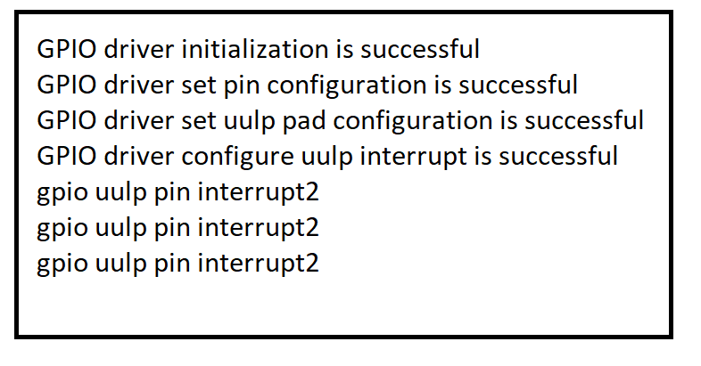

# SL GPIO UULP EXAMPLE 

## Table of Contents

- [Purpose/Scope](#purposescope)
- [Overview](#overview)
- [About Example Code](#about-example-code)
  - [Initialization of GPIO](#initialization-of-gpio)
- [Prerequisites/Setup Requirements](#prerequisitessetup-requirements)
  - [Hardware Requirements](#hardware-requirements)
  - [Software Requirements](#software-requirements)
  - [Setup Diagram](#setup-diagram)
- [Getting Started](#getting-started)
- [Application Build Environment](#application-build-environment)
  - [Application Configuration Parameters](#application-configuration-parameters)
- [Test the Application](#test-the-application)

## Purpose/Scope

- This application demonstrates the usage of configuring UULP (Ultra Ultra Low Power) pin interrupt.

## Overview

- The GPIO functionality in the MCU consists of three instances:
  - HP (High Power) Instance: Controls the SoC GPIOs (GPIO_n; n=0 to 57).
  - ULP (Ultra Low Power) Instance: Controls the ULP GPIOs (ULP_GPIO_n; n=0 to 11).
  - UULP (Ultra Ultra Low Power) Instance: Controls the UULP GPIOs (UULP_GPIO_n; n=0 to 4).
- HP and ULP Instance have same features and functionality except for different base address.
- Each port in the HP domain supports a maximum of 16 GPIO pins, with a total of four ports (SL_GPIO_PORT_A, SL_GPIO_PORT_B, SL_GPIO_PORT_C, SL_GPIO_PORT_D).
- The ULP GPIO domain has only one port (SL_GPIO_ULP_PORT) with a maximum of 12 pins.  
- Similarly, the UULP GPIO domain has only one port (SL_GPIO_UULP_PORT) with a maximum of 5 pins. 

  > **Note:** Please note that GPIO_n (n=0:5) are dedicated for the Secure Zone Processor's Flash interface. The MCU should NOT be changing any configuration related to these GPIOs under any circumstances since it may lead to the Flash content being corrupted, rendering the chip unusable. This is applicable to MCU HP EGPIO Instance.

- All GPIO pins in the HP/ULP/UULP instances support operations such as set, clear, toggle, and can be programmed as either output or input.

 As HP GPIO instance has 4 ports and each port has 16 pins. Each port pins are represented from 0 - 15 set.
 The table below explains the Port and Pin selection for different instances:

|  GPIO Instance                 |    GPIO Port      |  GPIO Pin Number  |
|--------------------------------|-------------------|-------------------|  
|                                |  SL_GPIO_PORT_A   |   (0-15)          |
| HP GPIO Instance               |  SL_GPIO_PORT_B   |   (16-31)         |
|                                |  SL_GPIO_PORT_C   |   (32-47)         | 
|                                |  SL_GPIO_PORT_D   |   (48-57)         |
| ULP GPIO Instance              |  SL_GPIO_ULP_PORT |   (0-11)          |
| UULP GPIO Instance             | SL_GPIO_UULP_PORT |   (0-4)           |
| | | 

**NOTE** : There is also option to select (0-57)pins with SL_GPIO_PORT_A. For example, to select HP GPIO pin number 49, one can select Port as SL_GPIO_PORT_A and pin number as 49. This option is given only when SL_GPIO_PORT_A GPIO port is selected. (57-63)pins are reserved.

**NOTE** : For reference on how to select Port and Pin number for different instances, please see the following points:

- To select HP GPIO pin number 16 for usage, Select Port as SL_GPIO_PORT_B and Pin number as 0. 
- To select HP GPIO pin number 31 for usage, Select Port as SL_GPIO_PORT_B and Pin number as 15. 
- To select HP GPIO pin number 33 for usage, Select Port as SL_GPIO_PORT_C and Pin number as 1. 
- To select HP GPIO pin number 56 for usage, Select Port as SL_GPIO_PORT_D and Pin number as 14. 
- To select ULP  GPIO pin number 10 for usage, Select Port as SL_GPIO_ULP_PORT and Pin number as 10. 
- To select UULP  GPIO pin number 2 for usage, Select Port as SL_GPIO_UULP_PORT and Pin number as 2. 

Please refer to the following APIs which are common for all 3 instances and are differentiated based on Port and Pin:

```c
  \ref sl_gpio_set_configuration() // configure GPIO pin
  \ref sl_gpio_driver_set_pin() // set the GPIO pin
  \ref sl_gpio_driver_clear_pin() // clear the GPIO pin
  \ref sl_gpio_driver_get_pin()  // get the status of the GPIO pin
  \ref sl_gpio_driver_toggle_pin() // toggle the GPIO pin
  \ref sl_gpio_driver_configure_interrupt() // configure the HP/ULP/UULP  pin interrupt
```

- Using \ref sl_gpio_set_configuration(), we can configure mode and direction using port and pin for all 3 instances. By default, the mode is set to mode0 using this API.
- When it is needed to explicitly configure GPIO to other mode use \ref sl_gpio_driver_set_pin_mode() - applicable to HP, ULP  instance.
- Configure GPIO to another direction using \ref sl_si91x_gpio_driver_set_pin_direction() - applicable for all 3 instances, \ref sl_si91x_gpio_driver_set_uulp_npss_pin_mux() for UULP  instance. To achieve other modes in GPIO, refer to pin MUX section in HRM.
- There are also other APIs for increasing driver strength - \ref sl_si91x_gpio_driver_select_pad_driver_strength(), 
slew rate - \ref sl_gpio_driver_set_slew_rate() - for HP instance, 
slew rate - \ref sl_si91x_gpio_driver_select_ulp_pad_slew_rate() - for ULP  instance, 
disable state - \ref sl_si91x_gpio_driver_select_pad_driver_disable_state() for GPIO pin which can be used if necessary.
- The PAD for corresponding GPIO is taken care of implicitly, if explicitly want to use refer to \ref sl_si91x_gpio_driver_enable_pad_selection().
- To enable host PAD selection for GPIO pin numbers(25 - 30) refer to \ref sl_si91x_gpio_driver_enable_host_pad_selection().
**Note:** Do not enable PAD selection number 9, as it is pre-configured for other function .

Below are the list of GPIO examples available and it's functionality:

  |  GPIO Examples        |    GPIO Functionality                              |  
  |-----------------------|----------------------------------------------------|  
  | gpio_detailed_example | Demonstrates GPIO toggle and supported APIs        |       
  | gpio_example          |  Demonstrates HP GPIO pin interrupt                |      
  | gpio_group_example    | Demonstrates HP, ULP  GPIO group interrupts        | 
  | gpio_ulp_example      |  Demonstrates GPIO toggle and ULP  pin interrupt   |           
  | gpio_uulp_example     | Demonstrates UULP  pin interrupt                   | 
  |||
## About Example Code

- Clear all GPIO interrupts and enable the clock.
- Configure the GPIO using the `sl_gpio_set_configuration` API.
- UULP GPIO pad configuration can be done using `sl_si91x_gpio_driver_set_uulp_pad_configuration`.
- Configure UULP GPIO pin interrupt using `sl_gpio_driver_configure_interrupt`.
- In default UULP GPIO example application UULP GPIO 2 (F12) used for GPIO UULP pin interrupt.
- To check the UULP GPIO interrupt, press BTN0. You can observe console prints `gpio uulp pin interrupt2` upon pressing BTN0, pin interrupt will be triggered on the raising edge event.
-To change the interrupt pin configuration, handle the following:
  - `UULP_GPIO_INTR_2`
  - `SL_SI91X_UULP_GPIO_2_PIN`

### Initialization of GPIO

- Use \ref sl_gpio_set_configuration(). This configures the GPIO pin based on the port and pin, direction.
- Use \ref sl_gpio_configure_pin_interrupt(). This configures the pin interrupt for GPIO.

## Prerequisites/Setup Requirements

### Hardware Requirements

- Windows PC
- Silicon Labs Si917 Evaluation Kit [WPK(BRD4002) + BRD4338A / BRD4342A / BRD4343A ]
- SiWx917 AC1 Module Explorer Kit (BRD2708A)

### Software Requirements

- Simplicity Studio
- Serial console Setup
  - For Serial Console setup instructions, refer [here](https://docs.silabs.com/wiseconnect/latest/wiseconnect-developers-guide-developing-for-silabs-hosts/#console-input-and-output)..

### Setup Diagram

> 

## Getting Started

Refer to the instructions [here](https://docs.silabs.com/wiseconnect/latest/wiseconnect-getting-started/) to:

- [Install Simplicity Studio](https://docs.silabs.com/wiseconnect/latest/wiseconnect-developers-guide-developing-for-silabs-hosts/#install-simplicity-studio)
- [Install WiSeConnect 3 extension](https://docs.silabs.com/wiseconnect/latest/wiseconnect-developers-guide-developing-for-silabs-hosts/#install-the-wi-se-connect-3-extension)
- [Connect your device to the computer](https://docs.silabs.com/wiseconnect/latest/wiseconnect-developers-guide-developing-for-silabs-hosts/#connect-si-wx91x-to-computer)
- [Upgrade your connectivity firmware ](https://docs.silabs.com/wiseconnect/latest/wiseconnect-developers-guide-developing-for-silabs-hosts/#update-si-wx91x-connectivity-firmware)
- [Create a Studio project ](https://docs.silabs.com/wiseconnect/latest/wiseconnect-developers-guide-developing-for-silabs-hosts/#create-a-project)

For details on the project folder structure, see the [WiSeConnect Examples](https://docs.silabs.com/wiseconnect/latest/wiseconnect-examples/#example-folder-structure) page.

## Application Build Environment

### Application Configuration Parameters

- Configure the following parameters in gpio_uulp_example.c (examples/si91x_soc/peripheral/sl_si91x_gpio_uulp_example/) file and update/modify following macros if required

  ```c
    #define UULP_GPIO_INTR_2 2      // UULP (Ultra Ultra Low Power) GPIO pin interrupt 2
    #define AVL_INTR_NO      0      // available interrupt number
  ```

## Test the Application

Refer to the instructions [here](https://docs.silabs.com/wiseconnect/latest/wiseconnect-getting-started/) to:

1. Compile and run the application.
2. Press BTN0 for triggering UULP GPIO pin interrupt.
3. After successful program execution the prints in serial console looks as shown below.

  

> **Note:**
>
> - Interrupt handlers are implemented in the driver layer, and user callbacks are provided for custom code. If you want to write your own interrupt handler instead of using the default one, make the driver interrupt handler a weak handler. Then, copy the necessary code from the driver handler to your custom interrupt handler.
