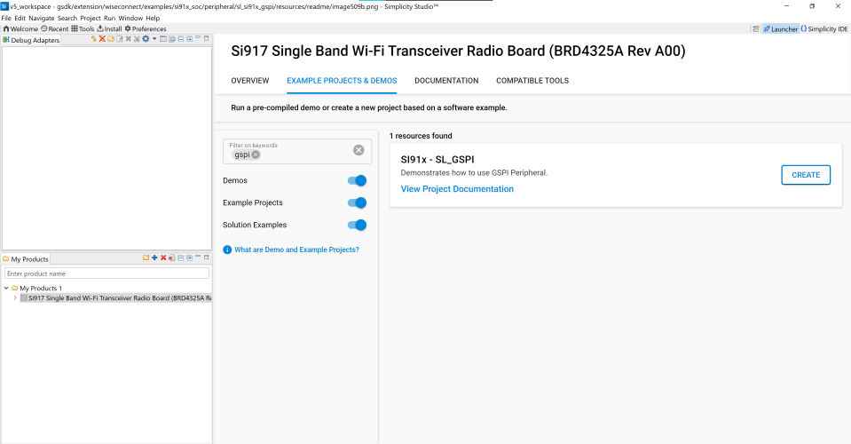

# GSPI

## Introduction

- This application demonstrate the GSPI for data transfer in full duplex as well as full duplex mode.
- This application can run in synchronous mode with full-duplex operation
  - Master transmits data on MOSI pin and receives the same data on MISO pin
- This also supports send and receive data with any SPI slave, additionally it also supports DMA and non-DMA transfer.
- For half duplex communication, i.e., send and receive, master / slave connection is required.

## Overview

- It is a HP peripheral which can be used to drive a wide variety of SPI compatible peripheral devices.
- SPI is a synchronous four-wire interface consisting of two data pins(MOSI, MISO), a device select pin (CSN) and a gated clock pin(SCLK).
- With the two data pins, it allows for full-duplex operation to other SPI compatible devices.
- It supports full duplex Single-bit SPI master mode.
- It has support for Mode-0 and Mode-3 (Motorola). Mode 0: Clock Polarity is zero and Clock Phase is zero, Mode 1: Clock Polarity is one, Clock Phase is one.
- It supports both Full speed and High speed modes.
- The SPI clock is programmable to meet required baud rates
- It can generates interrupt for different events like transfer complete, data lost, mode fault.
- It supports upto 32K bytes of read data from a SPI device in a single read operation.
- It also supports for byte-wise swapping of read and write data.
- It has programmable FIFO thresholds with maximum FIFO depth of 16.
- It has support for DMA (Dynamic Memory Access).

## About Example Code

- This example demonstrates GSPI transfer i.e., full duplex communication and GSPI send - GSPI receive i.e., half duplex communication.
- Various parameters like swap read and write data, data-width, mode, manual cs pin and bitrate can be configured using UC. \ref sl_gspi_control_config_t
- DMA and FIFO Threshold can also be configured using UC.
- sl_si91x_gspi_config.h file contains the control configurations and sl_si91x_gspi_common_config.h contains DMA and FIFO Threshold configuration.
- In example code, firstly the output buffer is filled with some data which is transferred to the slave.
- Firmware version of API is fetched using \ref sl_si91x_gspi_get_version which includes release version, major version and minor version \ref sl_gspi_version_t.
- A static function is called to fill the \ref sl_gspi_clock_config_t structure, which is passed in \ref sl_si91x_gspi_configure_clock API to configure the clock.
- \ref sl_si91x_gspi_init is used to initialize the peripheral, that includes pin configuration and it power up the module.
- GSPI instance must be passed in init to get the respective instance handle \ref sl_gspi_instance_t, which is used in other APIs.
- After initialization \ref sl_si91x_gspi_configure_power_mode is called to set the power mode \ref sl_gspi_power_state_t.
- All the necessary parameters are configured using \ref sl_si91x_gspi_set_configuration API, it expects a structure with required parameters \ref sl_gspi_control_config_t.
- After configuration, a callback register API is called to register the callback at the time of events \ref sl_si91x_gspi_register_event_callback.
- Current frame length and clock divsion factor are printed on console, \ref sl_si91x_gspi_get_clock_division_factor \ref sl_si91x_gspi_get_frame_length.
- State machine code is implemented for transfer, send and receive, the current mode is determined by gspi_mode_enum_t which is declared in example file.
- According to the macro is enabled, the example code exectues the transfer.

- If **SL_USE_TRANSFER** macro is enabled, it will transfer the data, i.e. send and recieve data in full duplex mode.

  - The current_mode enum is set to SL_TRANSFER_DATA and calls the \ref sl_si91x_gspi_transfer_data API which expects data_out, data_in and number of data bytes to be transferred for sending and recieving data simultaneously.
  - This test can also be performed in loopback condition, i.e. connect MISO and MOSI pins.
  - It waits till the transfer is completed, when the transfer complete event is generated, it compares the sent and received data.
  - The result is printed on the console.
  - Now the current_mode enum is updated as per the macros enabled i.e., either SL_USE_SEND or SL_USE_RECEIVE.
  - If no other macros are enabled, the current_mode is updates as SL_TRANSMISSION_COMPLETED.

- If **SL_USE_RECEIVE** macro is enabled, it only receives the data from slave, SPI slave must be connected, it cannot be tested in loopback mode.

  - The current_mode is set to the SL_RECEIVE_DATA and calls the \ref sl_si91x_gspi_receive_data API which expects data_in (empty buffer) and number of data bytes to be received.
  - If it is in DMA mode, it waits till the receive is completed i.e., transfer complete event is generated.
  - If it is not in DMA mode, it waits till the receive is completed i.e., the receive count is equal to the number of bytes entered by user \ref sl_si91x_gspi_get_rx_data_count.
  - Now the current_mode enum is updated as per the macros enabled i.e., SL_USE_SEND.
  - If no other macros are enabled, the current_mode is updates as SL_TRANSMISSION_COMPLETED.

- If **SL_USE_SEND** macro is enabled, it only sends the data to slave, SPI slave must be connected, it cannot be tested in loopback mode.
  - The current_mode enum is set to SL_SEND_DATA and calls the \ref sl_si91x_gspi_send_data API which expects data_out (data buffer that needs to be sent) and number of bytes to send.
  - If it is in DMA mode, it waits till the send is completed i.e., transfer complete event is generated.
  - If it is not in DMA mode, it waits till the send is completed i.e., the send count is equal to the number of bytes entered by user \ref sl_si91x_gspi_get_tx_data_count.
  - Now the current_mode enum is updated as TRANSMISSION_COMPLETED.

## Running Example Code

- To use this application following Hardware, Software and the Project Setup is required

### Hardware Requirements

- Windows PC
- Silicon Labs [Si917 Evaluation Kit WPK/WSTK + BRD4338A]


### Software Requirements

- Si91x SDK
- Embedded Development Environment
  - For Silicon Labs Si91x, use the latest version of Simplicity Studio (refer **"Download and Install Simplicity Studio"** section in **getting-started-with-siwx917-soc** guide at **release_package/docs/index.html**)

## Project Setup

- **Silicon Labs Si91x** refer **"Download SDK"** section in **getting-started-with-siwx917-soc** guide at **release_package/docs/index.html** to work with Si91x and Simplicity Studio

### VCOM Setup
- The Docklight tool's setup instructions are provided below..


## Loading Application on Simplicity Studio

1. With the product Si917 selected, navigate to the example projects by clicking on Example Projects & Demos
   in simplicity studio and click on to GSPI Example application as shown below.



## Configuration and Steps for Execution

- Configure UC from the slcp component.
- Open **sl_si91x_gspi.slcp** project file select **software component** tab and search for **GSPI** in search bar.
- Using configuration wizard one can configure different parameters like:
  - **General Configuration**
  - Mode: SPI mode can be configured, i.e. mode 0 and mode 3 (motorola). Mode 0: Clock Polarity 0 and Clock Phase 0, Mode 1: Clock Polarity 1 and Clock Phase 1.
  - Bitrate: The speed of transfer can be configured, i.e. bits/second.
  - Data Width: The size of data packet, it can be configured between 1 to 15.
  - Manual Chip Select: If the user wants to control the chip select manually, then it can be enabled otherwise it will configure the chip select automatically.
  - Byte-wise swapping of read and write data, enable will swap the data and disable will not swap the data.
  - **DMA Configuration**
  - Enable/Disable the DMA configuration.
  - Configure the FIFO Thresholds, i.e. Almost Full and Almost Empty. It can be configured between 0 to 15.
- Configuration files are generated in **config folder**, if not changed then the code will run on default UC values.

- Configure the following macros in gspi_example.h file and update/modify following macros if required.

```C
#define SL_USE_TRANSFER ENABLE    ///< To use the transfer API
#define SL_USE_SEND     DISABLE   ///< To use the send API
#define SL_USE_RECEIVE  DISABLE   ///< To use the receive API
```

## Build

1. Compile the application in Simplicity Studio using build icon


## Device Programming

- To program the device ,refer **"Burn M4 Binary"** section in **getting-started-with-siwx917-soc** guide at **release_package/docs/index.html** to work with Si91x and Simplicity Studio

## Pin Configuration

|   GPIO Pin    |      Description        |
| ------------- | ----------------------- |
| GPIO_25 [P25] | RTE_SSI_MASTER_CLK_PIN  |
| GPIO_28 [P31] | RTE_SSI_MASTER_CS0_PIN  |
| GPIO_26 [P27] | RTE_SSI_MASTER_MOSI_PIN |
| GPIO_27 [P29] | RTE_SSI_MASTER_MISO_PIN |

## Pin Description


## Executing the Application

1. Compile and run the application.
2. Connect GPIO_26 to GPIO_27 for loopback connection.
3. Enable the macro in gspi_example.h file as per requirement.

- #define SL_USE_TRANSFER ENABLE
- #define SL_USE_RECEIVE DISABLE
- #define SL_USE_SEND DISABLE
- By default transfer is enabled.

4. When the application runs,It sends and receives data in loopback if USE_TRANSFER is enabled.
5. If USE_RECEIVE or USE_SEND is enabled, SPI slave will receive and send data respectively.

## Expected Results

- Console output of successful configuration of clock, power mode and GSPI configuration
- Console output of GSPI transfer complete, Loop back test passed.
