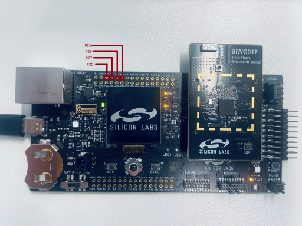

# SL GSPI

## Table of Contents

- [Purpose/Scope](#purposescope)
- [Overview](#overview)
- [About Example Code](#about-example-code)
- [Prerequisites/Setup Requirements](#prerequisitessetup-requirements)
  - [Hardware Requirements](#hardware-requirements)
  - [Software Requirements](#software-requirements)
  - [Setup Diagram](#setup-diagram)
- [Getting Started](#getting-started)
- [Application Build Environment](#application-build-environment)
  - [Pin Configuration](#pin-configuration)
  - [Pin Description](#pin-description)
- [Test the Application](#test-the-application)

## Purpose/Scope

This application demonstrates the GSPI for data transfer in full-duplex as well as half-duplex mode.

- This application can run in synchronous mode with full-duplex operation.
- The master transmits data on the MOSI pin and receives the same data on the MISO pin.
- It also supports sending and receiving data with any SPI slave. Additionally, it supports both DMA and non-DMA transfer.
- For half-duplex communication (that is, send and receive), a master / slave connection is required.

## Overview

- It is an HP peripheral that can be used to drive a wide variety of SPI-compatible peripheral devices.
- SPI is a synchronous four-wire interface consisting of two data pins (MOSI, MISO), a device select pin (CSN), and a gated clock pin (SCLK).
- With the two data pins, it allows for full-duplex operation with other SPI-compatible devices.
- It supports full-duplex, single-bit SPI master mode.
- It has support for Mode-0 and Mode-3 (Motorola). Mode 0: Clock Polarity is zero and Clock Phase is zero, Mode 3: Clock Polarity is one, Clock Phase is one.
- It supports both full-speed mode (up to 58 MHz) and high-speed mode (up to 116 MHz, provided the peripheral clock is set to 220 MHz).
- The SPI clock is programmable to meet required baud rates.
- It can generate interrupts for different events, like transfer complete, data lost, and mode fault.
- It supports up to 32K bytes of read data from an SPI device in a single read operation.
- It also supports for byte-wise swapping of read and write data.
- It has programmable FIFO thresholds with maximum FIFO depth of 16.
- It has support for DMA (Dynamic Memory Access).

## About Example Code

- This example demonstrates GSPI transfer (that is, full-duplex communication) and GSPI send - GSPI receive (that is, half-duplex communication).
- Various parameters like swap read and write data, data width, mode, and bitrate can be configured using \ref sl_gspi_control_config_t
- DMA and FIFO Threshold can also be configured using the UC.
- The file `sl_si91x_gspi_config.h` contains the control configurations and `sl_si91x_gspi_common_config.h` contains DMA and FIFO Threshold configuration.
- In the example code, firstly, the output buffer is filled with some data which is transferred to the slave.
- The firmware version of the API is fetched using \ref sl_si91x_gspi_get_version which includes the release version, major version, and minor version \ref sl_gspi_version_t.
- A static function is called to fill the \ref sl_gspi_clock_config_t structure, which is passed in \ref sl_si91x_gspi_configure_clock API to configure the clock.
- \ref sl_si91x_gspi_init is used to initialize the peripheral, which includes pin configuration and also enables DMA if configured.
- The GSPI instance must be passed in the init to get the respective instance handle \ref sl_gspi_instance_t, which is used in other APIs
- After initialization, \ref sl_si91x_gspi_configure_power_mode is called to set the power mode \ref sl_gspi_power_state_t.
- All the necessary parameters are configured using \ref sl_si91x_gspi_set_configuration API, which expects a structure with required parameters \ref sl_gspi_control_config_t.
- After configuration, a callback register API is called to register the callback at the time of events \ref sl_si91x_gspi_register_event_callback.
- Current frame length and clock division factor are printed on the console, \ref sl_si91x_gspi_get_clock_division_factor \ref sl_si91x_gspi_get_frame_length.
- State machine code is implemented for transfer, send, and receive. The current mode is determined by gspi_mode_enum_t which is declared in the example file.
- According to the macro enabled, the example code executes the transfer.

- If the **SL_USE_TRANSFER** macro is enabled, it will transfer the data (that is, send and receive data in full-duplex mode).

  - The current_mode enum is set to SL_TRANSFER_DATA and calls the \ref sl_si91x_gspi_transfer_data API which expects data_out, data_in, and the number of data bytes to be transferred for sending and receiving data simultaneously.
  - This test can also be performed in a loopback condition (that is, connecting MISO and MOSI pins).
  - It waits till the transfer is completed; when the transfer complete event is generated, it compares the sent and received data.
  - The result is printed on the console.
  - Now the current_mode enum is updated as per the macros enabled (that is, either SL_USE_SEND or SL_USE_RECEIVE).
  - If no other macros are enabled, the current_mode is updated as SL_TRANSMISSION_COMPLETED.

- If the **SL_USE_RECEIVE** macro is enabled, it only receives the data from the slave, the SPI slave must be connected, and it cannot be tested in loopback mode.

  - The current_mode is set to the SL_RECEIVE_DATA and calls the \ref sl_si91x_gspi_receive_data API which expects data_in (empty buffer) and number of data bytes to be received.
  - If it is in DMA mode, it waits till the receive is completed (that is, the transfer complete event is generated).
  - If it is not in DMA mode, it waits till the receive is completed (that is, the receive count is equal to the number of bytes entered by user \ref sl_si91x_gspi_get_rx_data_count).
  - Now the current_mode enum is updated as per the macros enabled (SL_USE_SEND).
  - If no other macros are enabled, the current_mode is updates as SL_TRANSMISSION_COMPLETED.

- If **SL_USE_SEND** macro is enabled, it only sends the data to slave, SPI slave must be connected, and it cannot be tested in loopback mode.
  - The current_mode enum is set to SL_SEND_DATA and calls the \ref sl_si91x_gspi_send_data API which expects data_out (data buffer that needs to be sent) and number of bytes to send.
  - If it is in DMA mode, it waits till the send is completed (that is, the transfer complete event is generated)
  - If it is not in DMA mode, it waits till the send is completed (that is, the send count is equal to the number of bytes entered by user \ref sl_si91x_gspi_get_tx_data_count).
  - Now the current_mode enum is updated as TRANSMISSION_COMPLETED.

> **Note:**
>
>- If SSI Slave application is used with GSPI Master application, it is mandatory to enable DMA in SSI Slave application.

## Prerequisites/Setup Requirements

### Hardware Requirements

- Windows PC
- Silicon Labs Si917 Evaluation Kit [WPK(BRD4002) + BRD4338A / BRD4342A / BRD4343A ]
- SiWx917 AC1 Module Explorer Kit (BRD2708A)

### Software Requirements

- Si91x
- Simplicity Studio
- Serial console Setup
  - For serial console setup instructions, refer [here](https://docs.silabs.com/wiseconnect/latest/wiseconnect-developers-guide-developing-for-silabs-hosts/#console-input-and-output).

### Setup Diagram


## Getting Started

Refer to the instructions [here](https://docs.silabs.com/wiseconnect/latest/wiseconnect-getting-started/) to:

- [Install Simplicity Studio](https://docs.silabs.com/wiseconnect/latest/wiseconnect-developers-guide-developing-for-silabs-hosts/#install-simplicity-studio)
- [Install WiSeConnect 3 extension](https://docs.silabs.com/wiseconnect/latest/wiseconnect-developers-guide-developing-for-silabs-hosts/#install-the-wi-se-connect-3-extension)
- [Connect your device to the computer](https://docs.silabs.com/wiseconnect/latest/wiseconnect-developers-guide-developing-for-silabs-hosts/#connect-si-wx91x-to-computer)
- [Upgrade your connectivity firmware](https://docs.silabs.com/wiseconnect/latest/wiseconnect-developers-guide-developing-for-silabs-hosts/#update-si-wx91x-connectivity-firmware)
- [Create a Studio project](https://docs.silabs.com/wiseconnect/latest/wiseconnect-developers-guide-developing-for-silabs-hosts/#create-a-project)

For details on the project folder structure, see the [WiSeConnect Examples](https://docs.silabs.com/wiseconnect/latest/wiseconnect-examples/#example-folder-structure) page.

## Application Build Environment

### Application Configuration Parameters

- Configure UC from the slcp component.
- Open the **sl_si91x_gspi.slcp** project file, select the **Software Component** tab, and search for **GSPI** in the search bar.
- You can use the configuration wizard to configure different parameters like:

  

- **GSPI Configuration**

  - Mode: SPI mode can be configured: Mode 0 and Mode 3 (motorola). Mode 0: Clock Polarity 0 and Clock Phase 0, Mode 3: Clock Polarity 1 and Clock Phase 1.
  - Bitrate: The speed of transfer can be configured (that is, bits/second).
  - Data Width: The size of data packet, it can be configured between 1 to 16.
  - Byte-wise swapping of read and write data, enable will swap the data and disable will not swap the data. (Can be used only if data width is configured as 16).

- **DMA Configuration**

  - Enable/Disable the DMA configuration.
  - Configure the FIFO thresholds (that is, **Almost Full** and **Almost Empty**). It can be configured between 0 to 15.
  - It is recommended to have maximum depth for FIFO threshold. Almost Full refers to the RX FIFO and Almost Empty refers to TX FIFO.
  - Configuration files are generated in **config folder**. If not changed, the code will run on default UC values.

- Configure the following macros in the `gspi_example.h file` and update/modify following macros, if required.

      ```c
      #define SL_USE_TRANSFER ENABLE    ///< To use the transfer API
      #define SL_USE_SEND     DISABLE   ///< To use the send API
      #define SL_USE_RECEIVE  DISABLE   ///< To use the receive API
      ```

- By default, an 8-bit unsigned integer is declared for data buffer. If using data-width more than 8-bit, update the variable to 16-bit unsigned integer. If the data-width is 16, use 8-bit unsigned integer.

      ```c
      // For data-width less than equal to 8 and data-width 16
      static uint8_t gspi_data_in[GSPI_BUFFER_SIZE];
      static uint8_t gspi_data_out[GSPI_BUFFER_SIZE];
      // For data-width greater than 8 and less than 16
      static uint16_t gspi_data_in[GSPI_BUFFER_SIZE];
      static uint16_t gspi_data_out[GSPI_BUFFER_SIZE];
      ```

### Pin Configuration

|   GPIO Pin    | Explorer kit GPIO|      Description        |
| ------------- | ---------------- | ----------------------- |
| GPIO_25 [P25] |   GPIO_25 [SCK]  |RTE_GSPI_MASTER_CLK_PIN  |
| GPIO_28 [P31] |   GPIO_28 [CS]   |RTE_GSPI_MASTER_CS0_PIN  |
| GPIO_27 [P29] |   GPIO_27 [MOSI] |RTE_GSPI_MASTER_MOSI_PIN |
| GPIO_26 [P27] |   GPIO_26 [MISO] |RTE_GSPI_MASTER_MISO_PIN |

### Pin Description



## Test the Application

Refer to the instructions [here](https://docs.silabs.com/wiseconnect/latest/wiseconnect-getting-started/) to:

1. Compile and run the application.
2. Connect GPIO_26 to GPIO_27 for loopback connection.
3. Enable the macro in `gspi_example.h` file as per requirement.

    - #define SL_USE_TRANSFER ENABLE
    - #define SL_USE_RECEIVE DISABLE
    - #define SL_USE_SEND DISABLE
    - By default transfer is enabled

4. When the application runs, it sends and receives data in loopback if USE_TRANSFER is enabled.
5. If USE_RECEIVE or USE_SEND is enabled, SPI slave will receive and send data respectively.
6. After successful program execution, the prints in serial console looks as shown below.

   

> **Note:**
>
> - Interrupt handlers are implemented in the driver layer, and user callbacks are provided for custom code. If you want to write your own interrupt handler instead of using the default one, make the driver interrupt handler a weak handler. Then, copy the necessary code from the driver handler to your custom interrupt handler.
