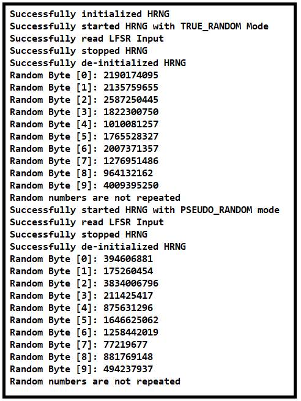

# SL HRNG (Hardware Random Number Generator)

## Table of Contents

- [SL HRNG (Hardware Random Number Generator)](#sl-hrng-hardware-random-number-generator)
  - [Table of Contents](#table-of-contents)
  - [Purpose/Scope](#purposescope)
  - [Overview](#overview)
  - [About Example Code](#about-example-code)
  - [Prerequisites/Setup Requirements](#prerequisitessetup-requirements)
    - [Hardware Requirements](#hardware-requirements)
    - [Software Requirements](#software-requirements)
    - [Setup Diagram](#setup-diagram)
  - [Getting Started](#getting-started)
  - [Application Build Environment](#application-build-environment)
  - [Test the Application](#test-the-application)

## Purpose/Scope

- This application demonstrates the use of the Hardware Random Number Generator (HRNG) module to generate high-quality random numbers using hardware-based entropy sources.

## Overview

- The HRNG module provides an interface to generate random numbers using the hardware capabilities of the SI91x series micro-controllers.
- Key features of the HRNG module include:
  - High-quality random number generation
  - Hardware-based entropy source
  - **Pseudo-random number:** Pseudo-random number rely on mathematical algorithms to generate sequences of numbers that resemble randomness. These algorithms are deterministic, meaning they always produce the same sequence of numbers when initialized with the same starting value, referred to as a seed.
  - **True Random Number :** True Random Number create random numbers using physical processes like electronic noise, radioactive decay, or other unpredictable natural events.
  - Easy-to-use API

## About Example Code

This section provides instructions on how to get started with the Hardware Random Number Generator (HRNG) example.

- **Initialize the HRNG Peripheral**: Before using the HRNG, you need to initialize it. This can be done using the [`sl_si91x_hrng_init()`](https://docs.silabs.com/wiseconnect/3.5.0/wiseconnect-api-reference-guide-si91x-peripherals/hrng#sl-si91x-hrng-init) function.
- **Start the HRNG**: After initialization, start the HRNG using the [`sl_si91x_hrng_start()`](https://docs.silabs.com/wiseconnect/3.5.0/wiseconnect-api-reference-guide-si91x-peripherals/hrng#sl-si91x-hrng-start) function.
- **Generate Random Numbers**: Use the [`sl_si91x_hrng_get_bytes()`](https://docs.silabs.com/wiseconnect/3.5.0/wiseconnect-api-reference-guide-si91x-peripherals/hrng#sl-si91x-hrng-get-bytes) function to generate random numbers.
- **Stop the HRNG**: Once you are done generating random numbers, stop the HRNG using the [`sl_si91x_hrng_stop()`](https://docs.silabs.com/wiseconnect/3.5.0/wiseconnect-api-reference-guide-si91x-peripherals/hrng#sl-si91x-hrng-stop) function.
- **Deinitialize the HRNG**: Finally, deinitialize the HRNG using the [`sl_si91x_hrng_deinit()`](https://docs.silabs.com/wiseconnect/3.5.0/wiseconnect-api-reference-guide-si91x-peripherals/hrng#sl-si91x-hrng-deinit) function to release any allocated resources.

## Prerequisites/Setup Requirements

### Hardware Requirements

- Windows PC
- Silicon Labs Si917 Evaluation Kit [WPK(BRD4002) + BRD4338A / BRD4342A / BRD4343A ]

### Software Requirements

- Si91x
- Simplicity Studio
- Serial console Setup
  - For Serial Console setup instructions, refer [here](https://docs.silabs.com/wiseconnect/latest/wiseconnect-developers-guide-developing-for-silabs-hosts/#console-input-and-output).

### Setup Diagram

> 

## Getting Started

Refer to the instructions [here](https://docs.silabs.com/wiseconnect/latest/wiseconnect-getting-started/) to:

- [Install Simplicity Studio](https://docs.silabs.com/wiseconnect/latest/wiseconnect-developers-guide-developing-for-silabs-hosts/#install-simplicity-studio)
- [Install WiSeConnect 3 extension](https://docs.silabs.com/wiseconnect/latest/wiseconnect-developers-guide-developing-for-silabs-hosts/#install-the-wi-se-connect-3-extension)
- [Connect your device to the computer](https://docs.silabs.com/wiseconnect/latest/wiseconnect-developers-guide-developing-for-silabs-hosts/#connect-si-wx91x-to-computer)
- [Upgrade your connectivity firmware ](https://docs.silabs.com/wiseconnect/latest/wiseconnect-developers-guide-developing-for-silabs-hosts/#update-si-wx91x-connectivity-firmware)
- [Create a Studio project ](https://docs.silabs.com/wiseconnect/latest/wiseconnect-developers-guide-developing-for-silabs-hosts/#create-a-project)

For details on the project folder structure, see the [WiSeConnect Examples](https://docs.silabs.com/wiseconnect/latest/wiseconnect-examples/#example-folder-structure) page.

## Application Build Environment

- Include the HRNG header file in your project:
  
  #include ["sl_si91x_hrng.h"](https://github.com/SiliconLabs/wiseconnect/blob/master/components/device/silabs/si91x/mcu/drivers/unified_api/inc/sl_si91x_hrng.h)
  

> **Note**: For recommended settings, see the [recommendations guide](https://docs.silabs.com/wiseconnect/latest/wiseconnect-developers-guide-prog-recommended-settings/).

 ## Test the Application

1. Compile and run the application. 
2. After successful program execution the prints in serial console looks as shown below.

   > 

