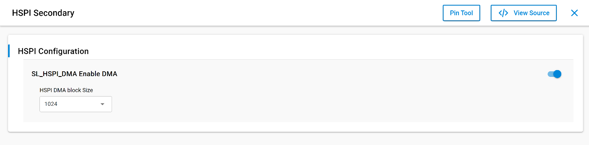

# HSPI Secondary

## Table of Contents

- [HSPI Secondary](#hspi-secondary)
  - [Table of Contents](#table-of-contents)
  - [About Example Code](#about-example-code)
  - [Prerequisites/Setup Requirements](#prerequisitessetup-requirements)
    - [Hardware Requirements](#hardware-requirements)
    - [Software Requirements](#software-requirements)
    - [Setup Diagram](#setup-diagram)
  - [Getting Started](#getting-started)
  - [Application Build Environment](#application-build-environment)
    - [Pin Configuration](#pin-configuration)
  - [Test the Application](#test-the-application)
  - [HSPI Secondary Data Flow:](#hspi-secondary-data-flow)

## About Example Code
This example showcases the use of the HSPI secondary interface with GPDMA, providing reliable communication with an SPI primary device and efficient management of HSPI operation callbacks.

## Prerequisites/Setup Requirements

### Hardware Requirements

- Windows PC
- Silicon Labs Si917 Evaluation Kit [WPK(BRD4002) + BRD4338A / BRD4342A / BRD4343A]
- An external SPI Primary device.

### Software Requirements

- Simplicity Studio
- Serial console setup
  - For serial console setup instructions, see the [Console Input and Output](https://docs.silabs.com/wiseconnect/latest/wiseconnect-developers-guide-developing-for-silabs-hosts/#console-input-and-output) section in the *WiSeConnect Developer's Guide*.

### Setup Diagram


## Getting Started

Refer to the instructions [here](https://docs.silabs.com/wiseconnect/latest/wiseconnect-getting-started/) to:

1. [Install Simplicity Studio](https://docs.silabs.com/wiseconnect/latest/wiseconnect-developers-guide-developing-for-silabs-hosts/#install-simplicity-studio)

2. [Install WiSeConnect 3 extension](https://docs.silabs.com/wiseconnect/latest/wiseconnect-developers-guide-developing-for-silabs-hosts/#install-the-wi-se-connect-3-extension)
3. [Connect your device to the computer](https://docs.silabs.com/wiseconnect/latest/wiseconnect-developers-guide-developing-for-silabs-hosts/#connect-si-wx91x-to-computer)
4. [Create a Studio project](https://docs.silabs.com/wiseconnect/latest/wiseconnect-developers-guide-developing-for-silabs-hosts/#create-a-project)

For details on the project folder structure, see the [WiSeConnect Examples](https://docs.silabs.com/wiseconnect/latest/wiseconnect-examples/#example-folder-structure) page.

## Application Build Environment

- Configure UC from the slcp component to enable or disable the DMA.

  >
 - To change the buffer size do modify the below macros in `sl_si91x_hspi_secondary_drv_config.h file`  under config drop down
  
      ```c
      #define SL_HSPI_TX_BUFFER_SIZE 1024    ///< TX buffer Size
      #define SL_HSPI_RX_BUFFER_SIZE 1024   ///< RX buffer Size
      ```
  >
### Pin Configuration

| GPIO pin  |  Connection |  Description|
|---  | ---  | --- |
|GPIO_25   | P25 | HSPI_CLK|
|GPIO_26   | P27 | HSPI_CSn |
|GPIO_27   | P29 | HSPI_MOSI |
|GPIO_28   | P31 | HSPI_MISO |

## Test the Application

Refer to the instructions [here](https://docs.silabs.com/wiseconnect/latest/wiseconnect-getting-started/) to:

1. **Physical Connections:**

   Establish the hardware connections between the SPI Secondary and SPI Primary by connecting the MOSI, MISO, CLK, and CS pins.

2. **Start Secondary First:**

    Ensure the SPI Secondary application is running before the SPI Primary application. This order is essential for proper data communication with  HSPI Secondary.

3. After successful program execution, the prints in serial console looks as shown below.   
   
  - ####  If GPDMA is enabled
  >

  - ####  If GPDMA is disabled
  > 

   - If DMA is enabled:

     

   - If DMA is disabled

     

## HSPI Secondary Data Flow

- **TX Path (SPI Primary Read):**
   The SPI Primary reads data sent by the HSPI Secondary data buffer.
- **RX Path (SPI Primary Write):**
The SPI Primary writes data to the HSPI Secondary

> **Note:**
>
> - The driver handles interrupts internally, offering user-defined callbacks for custom actions. To replace the default driver interrupt handling with your own, create a weak version of the driver's interrupt handler and then incorporate the required code into your custom handler.
