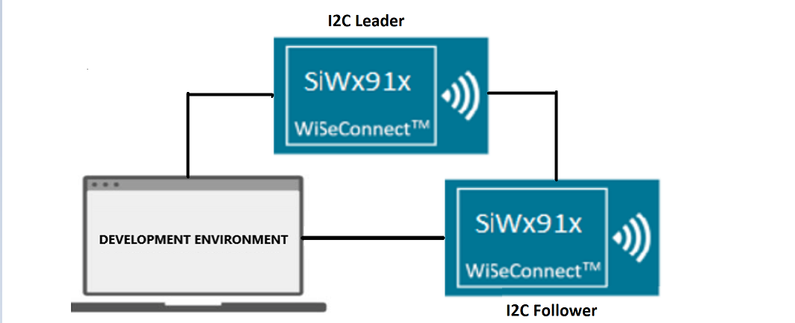
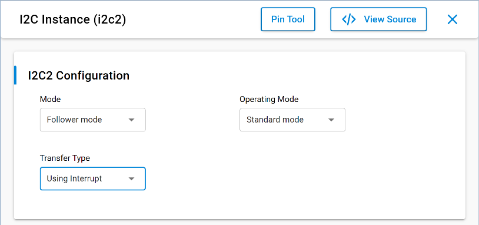
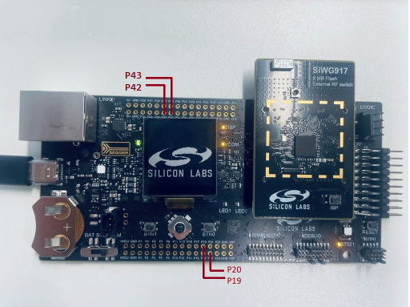
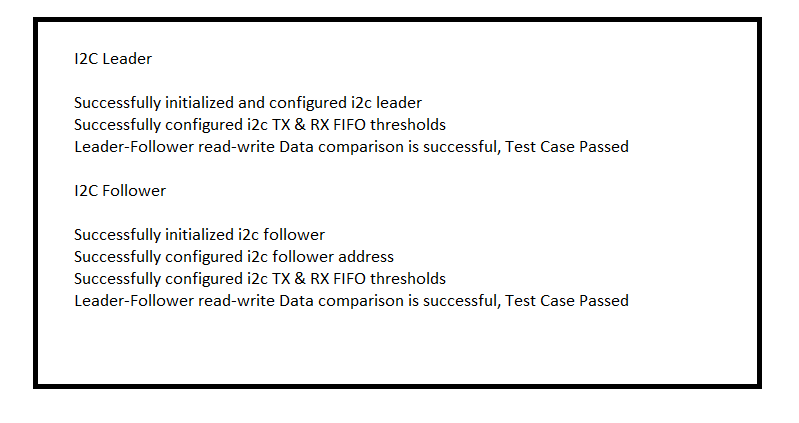

# SL I2C DRIVER FOLLOWER BLOCKING

## Table of Contents

- [SL I2C DRIVER FOLLOWER BLOCKING](#sl-i2c-driver-follower-blocking)
  - [Table of Contents](#table-of-contents)
  - [Purpose/Scope](#purposescope)
  - [Overview](#overview)
  - [About Example Code](#about-example-code)
  - [Prerequisites/Setup Requirements](#prerequisitessetup-requirements)
    - [Hardware Requirements](#hardware-requirements)
    - [Software Requirements](#software-requirements)
    - [Setup Diagram](#setup-diagram)
  - [Getting Started](#getting-started)
  - [Application Build Environment](#application-build-environment)
    - [Application Configuration Parameters](#application-configuration-parameters)
    - [Pin Configuration](#pin-configuration)
  - [Test the Application](#test-the-application)

## Purpose/Scope

The application demonstrates the data transfer from leader to follower and then follower to leader. After transmission the data is compared and result is printed on the console.

> **Note:** The master-slave terminology is now replaced with leader-follower. Master is now recognized as Leader and slave is now recognized as Follower.

## Overview

- The I2C will be configured in Follower mode. The SCL and SDA lines of leader controller are connected to Follower's SCL and SDA pins.
- Here the SCL and SDA lines of Follower are configured as internal pull-up.
- There are three configurable I2C controllers in M4 - two in the MCU HP peripherals (I2C1, I2C2) and one in the MCU ULP subsystem (ULP_I2C). For an  I2C Follower, all instances will in MCU HP mode.
- The I2C interface allows the processor to serve as a Leader or Follower on the I2C bus.
- I2C can be configured with following features:
  - I2C standard compliant bus interface with open-drain pins
  - Configurable as Leader or Follower
  - Four speed modes: Standard Mode (100 kbps), Fast Mode (400 kbps), Fast Mode Plus (1Mbps) and High-Speed Mode (3.4 Mbps)
  - 7- or 10-bit addressing and combined format transfers
  - Support for Clock synchronization and Bus Clear

## About Example Code

- This example code demonstrates I2C data transfer between a Leader and Follower using Blocking APIs.
- In the example code, the first I2c instance is initialized using [sl_i2c_driver_init](https://docs.silabs.com/wiseconnect/3.5.0/wiseconnect-api-reference-guide-si91x-peripherals/i2-c#sl-i2c-driver-init) to configure various init structure parameters
- This structure includes:
  - [sl_i2c_operating_mode_t](https://docs.silabs.com/wiseconnect/3.5.0/wiseconnect-api-reference-guide-si91x-peripherals/i2-c#sl-i2c-operating-mode-t) bus speed, it can be Standard, Fast, Fast plus or High speed.
  - [sl_i2c_mode_t](https://docs.silabs.com/wiseconnect/3.5.0/wiseconnect-api-reference-guide-si91x-peripherals/i2-c#sl-i2c-mode-t) mode, it should be Follower mode for the Follower application.
  - [sl_i2c_transfer_type_t](https://docs.silabs.com/wiseconnect/3.5.0/wiseconnect-api-reference-guide-si91x-peripherals/i2-c#sl-i2c-transfer-type-t), using NON-DMA.
  - [sl_i2c_callback_t](https://docs.silabs.com/wiseconnect/3.5.0/wiseconnect-api-reference-guide-si91x-peripherals/i2-c#sl-i2c-callback-t) , I2C callback
- It also initializes I2C clock and configures I2C SDA & SCL pins.
- Now Follower address has to configure its own address through [sl_i2c_driver_set_follower_address](https://docs.silabs.com/wiseconnect/3.5.0/wiseconnect-api-reference-guide-si91x-peripherals/i2-c#sl-i2c-driver-set-follower-address) API.
- Now transmit and receive FIFO threshold values are configured using [sl_i2c_driver_configure_fifo_threshold](https://docs.silabs.com/wiseconnect/3.5.0/wiseconnect-api-reference-guide-si91x-peripherals/i2-c#sl-i2c-driver-configure-fifo-threshold) API.
- Now write_buffer is filled with some data which needs to be sent to the Leader.
- Current_mode enum is set to I2C_RECEIVE_DATA. It receives data from the Leader through [sl_i2c_driver_receive_data_blocking](https://docs.silabs.com/wiseconnect/3.5.0/wiseconnect-api-reference-guide-si91x-peripherals/i2-c#sl-i2c-driver-receive-data-blocking) for a blocking application.
- After that, it will wait until all the data is received by Leader.
- For Blocking usecase: When all bytes are received then mode changes to I2C_SEND_DATA. (Blocking API will not update any transfer complete flag, as control will be blocked until all bytes are received.)
- Then it calls the send_data API to send data to the Leader through [sl_i2c_driver_send_data_blocking](https://docs.silabs.com/wiseconnect/3.5.0/wiseconnect-api-reference-guide-si91x-peripherals/i2c#sl-i2c-driver-send-data-blocking) for a blocking application.
- After calling send_data, it will wait till all the data is transmitted to leader device.
- Now it compares the data which is received from the Leader device to the data which it has sent.
- If the send and receive data is same, it will print 'Test Case Passed' on the console.
- For Blocking usecase: When all bytes are sent then mode changes to I2C_TRANSMISSION_COMPLETED (Blocking API won't update any transfer complete flag, as control will be blocked until all bytes are sent).
- I2C driver gets in I2C_TRANSMISSION_COMPLETED mode and stays idle.

> **Note:**
>
>- I2C has three instances. Users can handle these I2C instances by adding their instances.
>- I2C0, I2C1, and I2C2 are the names pre-defined for the I2C instances
>- For user-defined instances, one may have to define his hardware specific definitions in config.h file.
>- Users can directly use APIs in the application by passing the appropriate structure members if the user does not want to configure it from the UC.

## Prerequisites/Setup Requirements

### Hardware Requirements

- Windows PC
- Silicon Labs Si917 Evaluation Kit [WPK(BRD4002) +  BRD4338A / BRD4342A / BRD4343A] - as a Follower and Leader
- SiWx917 AC1 Module Explorer Kit (BRD2708A) as a Follower and Leader

### Software Requirements

- Simplicity Studio
- Serial console setup
  - For serial console setup instructions, refer [here](https://docs.silabs.com/wiseconnect/latest/wiseconnect-developers-guide-developing-for-silabs-hosts/#console-input-and-output).

### Setup Diagram



## Getting Started

Refer to the instructions [here](https://docs.silabs.com/wiseconnect/latest/wiseconnect-getting-started/) to:

- [Install Simplicity Studio](https://docs.silabs.com/wiseconnect/latest/wiseconnect-developers-guide-developing-for-silabs-hosts/#install-simplicity-studio)
- [Install WiSeConnect 3 extension](https://docs.silabs.com/wiseconnect/latest/wiseconnect-developers-guide-developing-for-silabs-hosts/#install-the-wi-se-connect-3-extension)
- [Connect your device to the computer](https://docs.silabs.com/wiseconnect/latest/wiseconnect-developers-guide-developing-for-silabs-hosts/#connect-si-wx91x-to-computer)
- [Upgrade your connectivity firmware](https://docs.silabs.com/wiseconnect/latest/wiseconnect-developers-guide-developing-for-silabs-hosts/#update-si-wx91x-connectivity-firmware)
- [Create a Studio project](https://docs.silabs.com/wiseconnect/latest/wiseconnect-developers-guide-developing-for-silabs-hosts/#create-a-project)

For details on the project folder structure, see the [WiSeConnect Examples](https://docs.silabs.com/wiseconnect/latest/wiseconnect-examples/#example-folder-structure) page.

## Application Build Environment

### Application Configuration Parameters

- Open the **sl_si91x_i2c_driver_follower.slcp** project file, select the **Software cComponent** tab, and search for **i2c** in the search bar.
- Click on **I2C2** and configure the ULP_I2C instance as per configuration parameters given in wizard.
- For using any other I2C instance, you must add that I2C instance by clicking on **I2C Instance** from configuration wizard and then clicking on **Add New Instance**
- For creating I2C instances, write 'I2C0', 'I2C1' or 'I2C2' on the wizard for the respective instance and then click on **Done**
- After creation of the instances, separate configuration files are get generated in **config folder**.
- If the project built is without selecting configurations, it uses default values from UC.
- Configure mode, operating-mode, and transfer-type of I2C instance using the respective instance UC.
- Change 'Operating Mode' as per bus-speed requirement.
- After the above UC configurations, also configure following macros in [`i2c_follower_example.c`](https://github.com/SiliconLabs/wiseconnect/blob/master/examples/si91x_soc/peripheral/sl_si91x_i2c_driver_follower/i2c_follower_example.c) file and update/modify following macros, if required.

  ```C
    #define I2C_INSTANCE_USED        // Update it with i2c instance number used for this application: 0 for i2c0, 1 for i2c1 and 2 for i2c2
    #define OWN_I2C_ADDR             // Update I2C own address
    #define I2C_SIZE_BUFFERS         // To change the number of bytes to send and receive.Its value should be less than maximum buffer size macro value.
  ```

> **Notes**
>
> - After completing the above configurations, connect the SCL and SDA pins of the Leader and Follower, run the application, and observe the results by connecting SDA and SCL pins to logic analyzer. (If required, enable the glitch filter for SCL channel with time period 100ns to avoid glitches.)
> - In Follower mode, the receive API will return a timeout error if no data is received from the Leader within 2 seconds.
> - For I2C1 High Speed mode, pin set `GPIO50 and GPIO51` is not working as expected.

- Configure the UC as mentioned below.

  

### Pin Configuration

**I2C0:**

| PIN |   917 GPIO     |        915 GPIO        |  Explorer kit GPIO  |   Description             |
| --- | -------------- | ---------------------- | ------------------- | --------------------------|
| SCL |  GPIO_7 [P20]  | GPIO_7 [EXP_HEADER-15] |     GPIO_7 [SCL]    | Connect to Leader SCL pin |
| SDA |  GPIO_6 [P19]  | GPIO_6 [EXP_HEADER-16] |     GPIO_6 [SDA]    | Connect to Leader SDA pin |

**I2C1:**

| PIN |     917 GPIO   |         915 GPIO       | Explorer kit GPIO |    Description            |
| --- | -------------- | ---------------------- | ----------------- | ------------------------- |
| SCL |  GPIO_54 [P42] | GPIO_6 [EXP_HEADER-16] |    GPIO_6 [SDA]   | Connect to Leader SCL pin |
| SDA |  GPIO_55 [P43] | GPIO_7 [EXP_HEADER-15] |    GPIO_7 [SCL]   | Connect to Leader SDA pin |

**ULP_I2C:**

| PIN |   ULP GPIO PIN             | Explorer kit GPIO  |   Description             |
| --- | -------------------------- | ------------------ | ------------------------- |
| SCL | ULP_GPIO_7 [EXP_HEADER-15] |   ULP_GPIO_7 [TX]  | Connect to Leader SCL pin |
| SDA | ULP_GPIO_6 [EXP_HEADER-16] |   ULP_GPIO_6 [RX]  | Connect to Leader SDA pin |




> **Note- In case of sleep-wakeup :**
>
>- As GPIO configurations will be lost after going to sleep state, the user has to initialize I2C pins and driver again after wakeup, by using [sl_i2c_driver_init](https://docs.silabs.com/wiseconnect/3.5.0/wiseconnect-api-reference-guide-si91x-peripherals/i2c#sl-i2c-driver-init) API for initializing driver and [sl_si91x_i2c_pin_init](https://docs.silabs.com/wiseconnect/3.5.0/wiseconnect-api-reference-guide-si91x-peripherals/i2c#sl-si91x-i2c-pin-init) API for initializing pins.

> **Note**: For recommended settings, see the [recommendations guide](https://docs.silabs.com/wiseconnect/latest/wiseconnect-developers-guide-prog-recommended-settings/).

## Test the Application

Refer to the instructions [here](https://docs.silabs.com/wiseconnect/latest/wiseconnect-getting-started/) to:

1. Compile and run the application.
2. Connect SCL(ULP_GPIO_7) and SDA(ULP_GPIO_6) pins with the Leader device. If the SiWG915 board is used, connect SCL(GPIO_7) and SDA(GPIO_6) pins with the Leader device.
3. When the application runs, it receives and send data.
4. After the transfer is completed, it validates the data and prints "Test Case Passed" on the console.
5. Connect snalyzer channels to the respective I2C instance SDA and SCA pins to observe the data on lines.
6. After successful program execution, the prints in serial console looks as shown below.

    

> **Note:**
>
> - Interrupt handlers are implemented in the driver layer, and user callbacks are provided for custom code. If you want to write your own interrupt handler instead of using the default one, make the driver interrupt handler a weak handler. Then, copy the necessary code from the driver handler to your custom interrupt handler.
