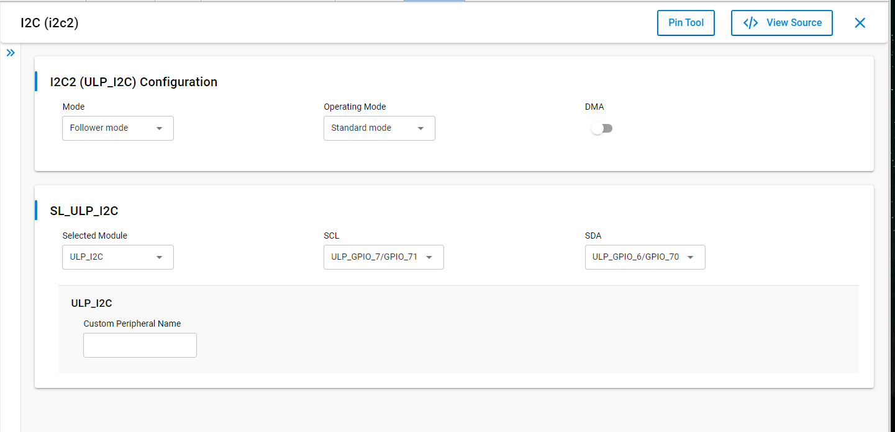

# SL I2C DRIVER FOLLOWER

## Table of Contents

- [Purpose/Scope](#purposescope)
- [Overview](#overview)
- [About Example Code](#about-example-code)
- [Prerequisites/Setup Requirements](#prerequisitessetup-requirements)
  - [Hardware Requirements](#hardware-requirements)
  - [Software Requirements](#software-requirements)
  - [Setup Diagram](#setup-diagram)
- [Getting Started](#getting-started)
- [Application Build Environment](#application-build-environment)
  - [Application Configuration Parameters](#application-configuration-parameters)
  - [Pin Configuration](#pin-configuration)
- [Test the Application](#test-the-application)

## Purpose/Scope

- The application demonstrates the data transfer from leader to follower and then follower to leader. After transmission the data is compared and result is printed on the console.

> **Note:** The master-slave terminology is now replaced with leader-follower. Master is now recognized as Leader and slave is now recognized as Follower.

## Overview

- The I2C will be configured in follower mode. The SCL and SDA lines of leader controller are connected to Follower's SCL and SDA pins.
- Here the SCL and SDA lines of follower are configured as internal pull-up.
- There are three configurable I2C Leader/Follower controllers in M4 - two in the MCU HP peripherals (I2C1, I2C2) and one in the MCU ULP subsystem (ULP_I2C).
- The I2C interface allows the processor to serve as a leader or follower on the I2C bus.
- I2C can be configured with following features
  - I2C standard compliant bus interface with open-drain pins
  - Configurable as Leader or Follower
  - Four speed modes: Standard Mode (100 kbps), Fast Mode (400 kbps), Fast Mode Plus (1Mbps) and High-Speed Mode (3.4 Mbps)
  - 7 or 10-bit addressing and combined format transfers
  - Support for Clock synchronization and Bus Clear

## About Example Code

- This example code demonstrates I2C data transfer between leader and follower either using interrupt (Blocking application) or using DMA (Non-blocking application).
- In example code, first i2c instance is initialized using \ref sl_i2c_driver_init to configure various init structure parameters
- This structure includes:
  - \ref sl_i2c_operating_mode_t bus speed, it can be Standard, Fast, Fast plus or High speed.
  - \ref sl_i2c_mode_t mode, it should be follower mode for follower application.
  - \ref sl_i2c_transfer_type_t, using interrupt or DMA (for using non-blocking send/transfer API it should be set as DMA type and for blocking API
     it should be interrupt type)
  - \ref sl_i2c_callback_t , I2C callback
- It also initializes I2C clock and configures I2C SDA & SCL pins.
- It also initializes DMA, if transfer type is 'Using DMA'.
- Now follower address has to configure its own address through \ref sl_i2c_driver_set_follower_address API.
- Now transmit and receive FIFO threshold values are configured using \ref sl_i2c_driver_configure_fifo_threshold API.
- Now write_buffer is filled with some data which needs to be sent to the leader.
- Current_mode enum is set to RECEIVE_DATA, it receives data from leader through \ref sl_i2c_driver_receive_data_blocking (for blocking Application) or through \ref sl_i2c_driver_receive_data_non_blocking (for Non-blocking Application).
- After that it will wait till all the data is received by leader.
- Once the i2c callback function sets transfer_complete flag, it changes current_mode enum to SEND_DATA.
- Then it calls send_data API to send data to leader through \ref sl_i2c_driver_send_data_blocking (for blocking Application) or through \ref sl_i2c_driver_send_data_non_blocking (for Non-blocking Application).
- After calling send_data, it will wait till all the data is transmitted to leader device.
- Once the i2c callback function sets transfer_complete flag, it changes current_mode enum to TRANSMISSION_COMPLETED.
- Now it compares the data which is received from the leader device to the data which it has sent.
- If the send & receive data is same, it will print 'Test Case Passed' on the console.

> **Note:**
>
>- I2C has three instances. User can handle these i2c-instances by adding their instances.
>- I2C0, I2C1 & I2C2 are the names pre-defined for the I2C instances
>- For user defined instances, one may have to define his hardware specific definitions in config.h file.
>- User can directly use APIs in application by passing appropriate structure members, if user doesn't want to configure from UC.

## Prerequisites/Setup Requirements

### Hardware Requirements

- Windows PC
- Silicon Labs Si917 Evaluation Kit [WPK(BRD4002) + BRD4338A]

### Software Requirements

- Simplicity Studio
- Serial console Setup
  - The Serial Console setup instructions are provided below:
Refer [here](https://docs.silabs.com/wiseconnect/latest/wiseconnect-getting-started/getting-started-with-soc-mode#perform-console-output-and-input-for-brd4338-a).

### Setup Diagram

> 

## Getting Started

Refer to the instructions [here](https://docs.silabs.com/wiseconnect/latest/wiseconnect-getting-started/) to:

- Install Studio and WiSeConnect 3 extension
- Connect your device to the computer
- Upgrade your connectivity firmware
- Create a Studio project

## Application Build Environment

### Application Configuration Parameters

- Open **sl_si91x_i2c_driver_follower.slcp** project file select **software component**tab and search for **i2c** in search bar.
- Click on **I2C0** and configure the I2C0 instance as per configuration parameters given in wizard.
- For using any other I2C instance user has to add that I2C instance by clicking on **I2C Instance** from configuration wizard and then clicking on **Add New Instance**
- For creating I2C instances write 'I2C0', 'I2C1' or 'I2C2' on the wizard for respective instance and then click on **Done**
- After creation of instances separate configuration files are get generated in **config folder**.
- If project built without selecting configurations, it will take default values from UC.
- Configure mode, operating-mode and transfer-type of I2C instance using respective instance UC.
- Change 'Mode' to 'Follower mode' on UC.
- Change 'Operating Mode' as per bus-speed requirement.
- Change 'Transfer Type' to 'Using Interrupt' for Blocking Application or to 'Using DMA' for NON-Blocking Application.
- After above UC configurations also configure following macros in i2c_follower_example.c file and update/modify following macros if required.

  ```C
    #define I2C_INSTANCE_USED        // Update it with i2c instance number used for this application: 0 for i2c0, 1 for i2c1 and 2 for i2c2
    #define BLOCKING_APPLICATION     // Enable it for enabling I2C transfer using interrupt Application
    #define NON_BLOCKING_APPLICATION // Enable it for enabling I2C transfer using interrupt Application
    #define OWN_I2C_ADDR             // Update I2C own address
    #define SIZE_BUFFERS             // To change the number of bytes to send and receive.Its value should be less than maximum buffer size macro value.
  ```

> **Note:** Enable either BLOCKING application or NON-BLOCKING application macro, at a time. Change the value of following macros in path: /$project/config/RTE_Device_917.h

```c
  #define RTE_I2C0_SCL_PORT_ID 0   // SCL pin port id
  #define RTE_I2C0_SDA_PORT_ID 0   //SDA pin port id
```

> **Note:** After above configurations connect SCL and SDA pins of Leader and follower then run the application and observe the results by connecting SDA and SCL pins to logic Analyzer(Also enable glitch filter for SCL channel with time period 100ns, to avoid glitches).

- Configure the UC as mentioned below.

  

### Pin Configuration

**I2C0:**

| PIN |   ULP GPIO PIN     |   Description             |
| --- | ------------------ | --------------------------|
| SCL |   GPIO_7 [P20]     | Connect to Leader SCL pin |
| SDA |   GPIO_6 [P19]     | Connect to Leader SDA pin |

**I2C1:**

| PIN |   GPIO PIN        |    Description            |
| --- | ----------------- | ------------------------- |
| SCL |   GPIO_50 [P32]   | Connect to Leader SCL pin |
| SDA |   GPIO_51 [P34]   | Connect to Leader SDA pin |

**I2C2:**

| PIN |   ULP GPIO PIN             |   Description             |
| --- | -------------------------- | ------------------------- |
| SCL | ULP_GPIO_7 [EXP_HEADER-15] | Connect to Leader SCL pin |
| SDA | ULP_GPIO_6 [EXP_HEADER-16] | Connect to Leader SDA pin |


## Test the Application

Refer to the instructions [here](https://docs.silabs.com/wiseconnect/latest/wiseconnect-getting-started/) to:

1. Compile and run the application.
2. Connect SCL(GPIO_7) and SDA(GPIO_6) pins with the leader device.
3. When the application runs, it receives and send data.
4. After the transfer is completed, it validates the data and prints "Test Case Passed" on the console.
5. Connect Analyzer channels to respective I2C instance SDA & SCA pins to observe the data on lines.
6. After successful program execution the prints in serial console looks as shown below.

    
