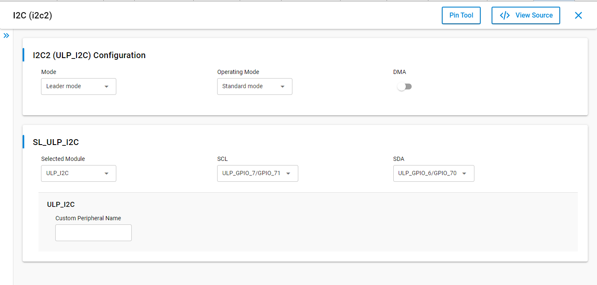
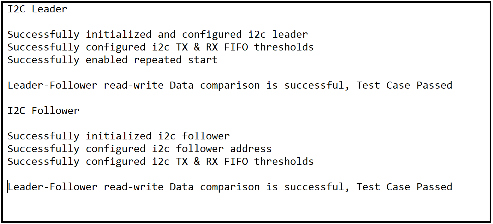

# SL I2C DRIVER LEADER BLOCKING

## Table of Contents

- [SL I2C DRIVER LEADER BLOCKING](#sl-i2c-driver-leader-blocking)
  - [Table of Contents](#table-of-contents)
  - [Purpose/Scope](#purposescope)
  - [Overview](#overview)
  - [About Example Code](#about-example-code)
  - [Prerequisites/Setup Requirements](#prerequisitessetup-requirements)
    - [Hardware Requirements](#hardware-requirements)
    - [Software Requirements](#software-requirements)
    - [Setup Diagram](#setup-diagram)
  - [Getting Started](#getting-started)
  - [Application Build Environment](#application-build-environment)
    - [Application Configuration Parameters](#application-configuration-parameters)
    - [Pin Configuration](#pin-configuration)
  - [Test the Application](#test-the-application)

## Purpose/Scope

The application demonstrates the data transfer from Leader to Follower and then Follower to lLeader. After transmission the data is compared and result is printed on the console.

> **Note:** The master-slave terminology is now replaced with Leader-Follower. Master is now recognized as Leader and slave is now recognized as Follower.

## Overview

- The I2C will be configured in Leader mode. The SCL and SDA lines of the Leader controller are connected to Follower's SCL and SDA pins.
- There are three configurable I2C controllers in M4 - two in the MCU HP peripherals (I2C1, I2C2) and one in the MCU ULP subsystem (ULP_I2C). For an I2C Follower, all instances will in MCU HP mode.
- The I2C interface allows the processor to serve as a Leader or Follower on the I2C bus.
- I2C can be configured with following features:
  - I2C standard compliant bus interface with open-drain pins
  - Configurable as Leader or Follower
  - Four speed modes: Standard Mode (100 kbps), Fast Mode (400 kbps), Fast Mode Plus (1Mbps), and High-Speed Mode (3.4 Mbps)
  - 7- or 10-bit addressing and combined format transfers
  - Support for Clock synchronization and Bus Clear

## About Example Code

This example code demonstrates I2C data transfer between a Leader and Follower using Blocking APIs.

- In the example code, the first I2c instance is initialized using [sl_i2c_driver_init](https://docs.silabs.com/wiseconnect/3.5.0/wiseconnect-api-reference-guide-si91x-peripherals/i2-c#sl-i2c-driver-init) to configure various init structure parameters.
- This structure includes:
  - [sl_i2c_operating_mode_t](https://docs.silabs.com/wiseconnect/3.5.0/wiseconnect-api-reference-guide-si91x-peripherals/i2-c#sl-i2c-operating-mode-t) bus speed, it can be Standard, Fast, Fast plus or High speed.
  - [sl_i2c_mode_t](https://docs.silabs.com/wiseconnect/3.5.0/wiseconnect-api-reference-guide-si91x-peripherals/i2-c#sl-i2c-mode-t) mode, it should be Leader mode for Leader application.
  - [sl_i2c_transfer_type_t](https://docs.silabs.com/wiseconnect/3.5.0/wiseconnect-api-reference-guide-si91x-peripherals/i2-c#sl-i2c-transfer-type-t), using non-DMA.
  - [sl_i2c_callback_t](https://docs.silabs.com/wiseconnect/3.5.0/wiseconnect-api-reference-guide-si91x-peripherals/i2-c#sl-i2c-callback-t) , I2C callback
- It also initializes I2C clock and configures I2C SDA and SCL pins.
- Transmit and receive FIFO threshold values are configured using [sl_i2c_driver_configure_fifo_threshold](https://docs.silabs.com/wiseconnect/3.5.0/wiseconnect-api-reference-guide-si91x-peripherals/i2-c#sl-i2c-driver-configure-fifo-threshold) API.
- Repeated start is enabled for data transfer using [sl_i2c_driver_enable_repeated_start](https://docs.silabs.com/wiseconnect/3.5.0/wiseconnect-api-reference-guide-si91x-peripherals/i2-c#sl-i2c-driver-enable-repeated-start) API. So that master continue read operation after write operation without releasing line.
- Now write_buffer is filled with some data which needs to be sent to the Follower.
- Current_mode enum is set to I2C_SEND_DATA, and it calls send_data API to send data to the the Follower and configures the Follower address through [sl_i2c_driver_send_data_blocking](https://docs.silabs.com/wiseconnect/3.5.0/wiseconnect-api-reference-guide-si91x-peripherals/i2-c#sl-i2c-driver-send-data-blocking) for blocking Application.
- For Blocking use cases: When all bytes are sent, then the mode changes to I2C_RECEIVE_DATA. (The Blocking API will not update any transfer complete flag, as control will be blocked until all bytes are sent).
- Before receiving data from slave, disabled repeated start using [sl_i2c_driver_enable_repeated_start](https://docs.silabs.com/wiseconnect/3.5.0/wiseconnect-api-reference-guide-si91x-peripherals/i2-c#sl-i2c-driver-enable-repeated-start) API. So that stop bit should be added at the end of data transfer.
- Then it receives data from Follower through [sl_i2c_driver_receive_data_blocking](https://docs.silabs.com/wiseconnect/3.5.0/wiseconnect-api-reference-guide-si91x-peripherals/i2-c#sl-i2c-driver-receive-data-blocking) for blocking Application.
- Now it compares the data which is received from the Follower device to the data which it has sent.
- If the send and receive data is same, it will print "Test Case Passed" on the console.
- For Blocking use cases: When all bytes are received, the mode changes to I2C_TRANSMISSION_COMPLETED. (The Blocking API will not update any transfer complete flag, as control will be blocked until all bytes are received).
- The I2C driver gets in I2C_TRANSMISSION_COMPLETED mode and stays idle.

> **Note:**
>
>- I2C has three instances. You can handle these I2C-instances by adding their instances.
>- I2C0, I2C1, and I2C2 are the names pre-defined for the I2C instances.
>- For user-defined instances, you may have to define your hardware-specific definitions in `config.h` file.
>- A user can directly use APIs in an application by passing appropriate structure members if the user does not want to configure from UC.

## Prerequisites/Setup Requirements

### Hardware Requirements

- Windows PC
- Silicon Labs Si917 Evaluation Kit [WPK(BRD4002) +  BRD4338A / BRD4342A / BRD4343A] - as a Follower and Leader
- SiWx917 AC1 Module Explorer Kit (BRD2708A) as a Follower and Leader

### Software Requirements

- Simplicity Studio
- Serial console setup
  - For serial console setup instructions, see the [Console Input and Output](https://docs.silabs.com/wiseconnect/latest/wiseconnect-developers-guide-developing-for-silabs-hosts/#console-input-and-output) section in the *WiSeConnect Developer's Guide*.

### Setup Diagram


## Getting Started

Refer to the instructions [here](https://docs.silabs.com/wiseconnect/latest/wiseconnect-getting-started/) to:

- [Install Simplicity Studio](https://docs.silabs.com/wiseconnect/latest/wiseconnect-developers-guide-developing-for-silabs-hosts/#install-simplicity-studio)
- [Install WiSeConnect 3 extension](https://docs.silabs.com/wiseconnect/latest/wiseconnect-developers-guide-developing-for-silabs-hosts/#install-the-wi-se-connect-3-extension)
- [Connect your device to the computer](https://docs.silabs.com/wiseconnect/latest/wiseconnect-developers-guide-developing-for-silabs-hosts/#connect-si-wx91x-to-computer)
- [Upgrade your connectivity firmware](https://docs.silabs.com/wiseconnect/latest/wiseconnect-developers-guide-developing-for-silabs-hosts/#update-si-wx91x-connectivity-firmware)
- [Create a Studio project](https://docs.silabs.com/wiseconnect/latest/wiseconnect-developers-guide-developing-for-silabs-hosts/#create-a-project)

For details on the project folder structure, see the [WiSeConnect Examples](https://docs.silabs.com/wiseconnect/latest/wiseconnect-examples/#example-folder-structure) page.

## Application Build Environment

### Application Configuration Parameters

- Open the `sl_si91x_i2c_driver_leader.slcp` project file, select the **Software Component** tab, and search for i2c in the search bar.
- Click on **I2C2** and configure the ULP_I2C instance as per configuration parameters given in wizard.
- For using any other I2C instance, the user has to add that I2C instance by clicking on **I2C Instance** from the configuration wizard and then clicking **Add New Instance**
- For creating I2C instances, write 'I2C0', 'I2C1' or 'I2C2' on the wizard for respective instance and then click on **Done**
- After creating the instances, separate configuration files are generated in the **config folder**.
- If the project is built without selecting configurations, it will take default values from UC.
- Configure mode, operating-mode, and transfer-type of I2C instance using respective instance UC.
- Change 'Mode' to 'Leader mode' on UC.
- Change 'Operating Mode' as per bus-speed requirement.
- After completing the above UC configurations, configure the following macros in [`i2c_leader_example.c`](https://github.com/SiliconLabs/wiseconnect/blob/master/examples/si91x_soc/peripheral/sl_si91x_i2c_driver_leader/i2c_leader_example.c) file. Update or modify the following macros, if required.

    ```c
      #define I2C_INSTANCE_USED        // Update it with i2c instance number used for this application: 0 for i2c0, 1 for i2c1 and 2 for i2c2
      #define FOLLOWER_I2C_ADDR        // Update I2C follower address
      #define I2C_SIZE_BUFFERS             // To change the number of bytes to send and receive.Its value should be less than maximum buffer size macro value.
    ```
  
> **Note:** After completing the above configurations, connect the SCL and SDA pins of Leader and Follower and run the application. Observe the results by connecting SDA and SCL pins to the Logic Analyzer. (If required, enable the glitch filter for the SCL channel with time period 100ns,to avoid glitches).
>
> **Note:** For I2C1 High Speed mode, pin set `GPIO50 and GPIO51` is not working as expected.

- For getting proper speeds with fast and fast plus modes, use external pullup of around 4.7K.
- For high-speed mode data transfer external pullup is a must.
- Configure the UC as mentioned below.

  

### Pin Configuration

**I2C0:**

| PIN |   917 GPIO    |        915 GPIO        |  Explorer kit GPIO |   Description             |
| --- | ------------- | ---------------------- | -------------------| --------------------------|
| SCL | GPIO_7 [P20]  | GPIO_7 [EXP_HEADER-15] |    GPIO_7 [SCL]    | Connect to Follower SCL pin |
| SDA | GPIO_6 [P19]  | GPIO_6 [EXP_HEADER-16] |    GPIO_6 [SDA]    | Connect to Follower SDA pin |

**I2C1:**

| PIN |    917 GPIO    |       915 GPIO         | Explorer kit GPIO |   Description            |
| --- | -------------- | ---------------------- | ------------------| ------------------------- |
| SCL |  GPIO_54 [P42] | GPIO_6 [EXP_HEADER-16] |    GPIO_6 [SDA]   | Connect to Follower SCL pin |
| SDA |  GPIO_55 [P43] | GPIO_7 [EXP_HEADER-15] |    GPIO_7 [SCL]   | Connect to Follower SDA pin |

**ULP_I2C:**

| PIN |   ULP GPIO PIN             | Explorer kit GPIO |  Description             |
| --- | -------------------------- | ------------------| ------------------------- |
| SCL | ULP_GPIO_7 [EXP_HEADER-15] |  ULP_GPIO_7 [TX]  | Connect to Follower SCL pin |
| SDA | ULP_GPIO_6 [EXP_HEADER-16] |  ULP_GPIO_6 [RX]  | Connect to Follower SDA pin |


> **Note- In case of sleep-wakeup :**
>
>- As GPIO configurations will be lost after going to sleep state, the user has to initialize the I2C pins and driver again after wakeup by using \ref sl_i2c_driver_init API for initializing driver and \ref sl_si91x_i2c_pin_init API for initializing pins.

> **Note**: For recommended settings, see the [recommendations guide](https://docs.silabs.com/wiseconnect/latest/wiseconnect-developers-guide-prog-recommended-settings/).

## Test the Application

Refer to the instructions [here](https://docs.silabs.com/wiseconnect/latest/wiseconnect-getting-started/) to:

1. Compile and run the application.
2. Connect the SCL(ULP_GPIO_7) and SDA(ULP_GPIO_6) pins with the follower device. If you are using a SiWG915 board, connect SCL(GPIO_7) and SDA(GPIO_6) pins with the leader device.
3. When the application runs, it receives and sends data.
4. After the transfer is completed, it validates the data and prints "Test Case Passed" on the console.
5. Connect Analyzer channels to respective I2C instance SDA & SCA pins to observe the data on lines.
6. After successful program execution, the outputs on the serial console looks as shown below.

   

> **Note:**
>
> - Interrupt handlers are implemented in the driver layer, and user callbacks are provided for custom code. If you want to write your own interrupt handler instead of using the default one, make the driver interrupt handler a weak handler. Then, copy the necessary code from the driver handler to your custom interrupt handler.
