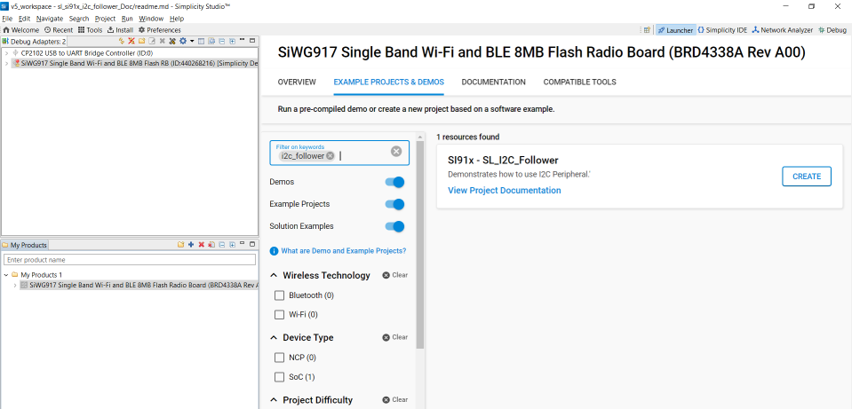
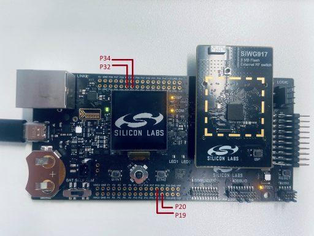

# I2C FOLLOWER

## Introduction

- Note: The master-slave terminology is now replaced with leader-follower. Master is now recognized as Leader and slave is now recognized as Follower.
- This application demonstrates the I2C will be configured in follower mode. The SCL and SDA lines of leader controller are connected to Follower's SCL and SDA pins.
- Here the SCL and SDA lines of follower are configured as internal pull-up.
- Data is transferred from leader to follower and follower to leader. After transmission the data is compared and result is printed on the console.

## Overview

- There are four I2C Master/Slave controllers - two in the MCU HP peripherals (I2C1, I2C2), one in the NWP/security subsystem and one in the MCU ULP subsystem (ULP_I2C).
- The I2C interface allows the processor to serve as a leader or follower on the I2C bus.
- I2C can be configured with following features
  - I2C standard compliant bus interface with open-drain pins
  - Configurable as Leader or Follower
  - Four speed modes: Standard Mode (100 kbps), Fast Mode (400 kbps), Fast Mode Plus (1Mbps) and High-Speed Mode (3.4 Mbps)
  - 7 or 10-bit addressing and combined format transfers
  - Support for Clock synchronization and Bus Clear

## About Example Code

- This example code demonstrates I2C data transfer between leader and follower
- In example code, firstly clock is initialized using static function.
- After that I2C abort is called to clear any pending transfer using \ref sl_si91x_i2c_abort_transfer. Note: I2C should be enabled for aborting.
- \ref sl_si91x_i2c_init API is called to configure various parameters of \ref sl_i2c_init_params_t structure. This structure includes:
  - \ref sl_i2c_clock_hlr_t bus speed, Standard, Fast, Fast plus or High speed.
  - Frequency which needs to be configured.
  - is_10bit_addr flag is set according to the address, here it is set as false.
  - \ref sl_i2c_mode_t mode, either leader or follower, here follower is selected.
  - Address of the slave.
- After initialization of the parameters, pin configuration is performed using static function.
  - Here in pin configuration, the pins are configured as internal pull-up.
  - To configure the pins as internal pull-up, it is necessary to disable ROM APIs.
  - It validates the ROM_BYPASS macro to configure the gpio as internal pull-up.
- Now write_buffer is filled with some data which needs to be sent to the follower.
- Current_mode enum is set to RECEIVE_DATA, so here receive_data is called which is a static function, that internally calls the APIs which needs to be configured before sending data.
  - Disable the interrupt using \ref sl_si91x_i2c_disable_interrupts API.
  - Disable I2C, set the rx thresholds using \ref sl_si91x_i2c_set_rx_threshold API and enable the I2C.
  - Set the direction of transfer using \ref sl_si91x_i2c_control_direction.
  - Set the \ref SL_I2C_EVENT_RECEIVE_FULL interrupt using \ref sl_si91x_i2c_set_interrupts API.
  - Enable the interrupt using \ref sl_si91x_i2c_enable_interrupts API.
- After calling receive_data, it will wait till all the data is received from the leader device.
- Once the irq handler generates send_complete flag, it changes current_mode enum to SEND_DATA.
- Current_mode enum is set to SEND_DATA, so here send_data is called which is a static function, that internally calls the APIs which needs to be configured before sending data.
  - Disable the interrupt using \ref sl_si91x_i2c_disable_interrupts API, fill the write_data variable with the data.
  - Disable I2C, set the tx thresholds using \ref sl_si91x_i2c_set_tx_threshold API and enable the I2C.
  - Set the direction of transfer using \ref sl_si91x_i2c_control_direction.
  - Set the \ref SL_I2C_EVENT_TRANSMIT_EMPTY interrupt using \ref sl_si91x_i2c_set_interrupts API.
  - Enable the interrupt using \ref sl_si91x_i2c_enable_interrupts API.
- After calling send_data, it will wait till all the data is transferred to the leader device.
- Once the irq handler generates receive_complete flag, it changes current_mode enum to TRANSMISSION_COMPLETED.
- Now it compares the data which is received from the leader device to the data which it has sent.
- If the data is same, it will print Test Case Passed on the console.

## Running Example Code

- To use this application following Hardware, Software and the Project Setup is required

### Hardware Requirements

- Windows PC
- Silicon Labs [Si917 Evaluation Kit WSTK/WPK + BRD4338A]


### Software Requirements

- Si91x SDK
- Embedded Development Environment
  - For Silicon Labs Si91x, use the latest version of Simplicity Studio (refer **"Download and Install Simplicity Studio"** section in **getting-started-with-siwx917-soc** guide at **release_package/docs/index.html**)

### VCOM Setup
- The Docklight tool's setup instructions are provided below..


## Project Setup

- **Silicon Labs Si91x** refer **"Download SDKs"**, **"Add SDK to Simplicity Studio"**, **"Connect SiWx917"**, **"Open Example Project in Simplicity Studio"** section in **getting-started-with-siwx917-soc** guide at **release_package/docs/index.html** to work with Si91x and Simplicity Studio

## Loading Application on Simplicity Studio

1. With the product Si917 selected, navigate to the example projects by clicking on Example Projects & Demos
   in simplicity studio and click on to i2c follower Example application as shown below.



## Configuration and Steps for Execution
- Configure the following macros in i2c_leader_example.c file and update/modify following macros if required.
```C
 #define I2C_INSTANCE    0    // I2C Instance for Pin configuration
 #define I2C             I2C0 // I2C Instance 
 Available Configurations:
 #define I2C_INSTANCE    1    // I2C Instance for Pin configuration
 #define I2C             I2C1 // I2C Instance 
 #define I2C_INSTANCE    2    // I2C Instance for Pin configuration
 #define I2C             I2C2 // I2C Instance 
  ```
Change the value of following macros in config/RTE_Device.h
```c
#define RTE_I2C0_SCL_PORT_ID 0  // SCL pin port id

#define RTE_I2C0_SDA_PORT_ID 0  //SDA pin port id
```
## Base Board Pin Configuration

#### I2C0
| PIN | 		ULP GPIO PIN       |	 	Description   		 |
| --- | -------------------------- | --------------------------- |
| SCL | 		GPIO_7 [P20] 	   | Connect to Leader SCL pin |
| SDA | 		GPIO_6 [P19] 	   | Connect to Leader SDA pin |

#### I2C1
| PIN | 		GPIO PIN         | 			Description        |
| --- | -------------------------| --------------------------- |
| SCL | 		GPIO_50 [P32] 	 | Connect to Leader SCL pin |
| SDA | 		GPIO_51 [P34] 	 | Connect to Leader SDA pin |

#### I2C2
| PIN | 		ULP GPIO PIN       | 		Description          |
| --- | -------------------------- | --------------------------- |
| SCL | ULP_GPIO_7 [EXP_HEADER-15] | Connect to Leader SCL pin |
| SDA | ULP_GPIO_6 [EXP_HEADER-16] | Connect to Leader SDA pin |



## Build

1. Compile the application in Simplicity Studio using build icon


## Device Programming

- To program the device ,refer **"Burn M4 Binary"** section in **getting-started-with-siwx917-soc** guide at **release_package/docs/index.html** to work with Si91x and Simplicity Studio

## Executing the Application

1. Compile and run the application.
2. Connect GPIO_6 and GPIO_7 with the leader device. in the case of I2C0.
3. When the application runs, it receives and sends data.
4. After the transfer is completed, it validates the data and prints on the console.

## Expected Results

- Will get "Test Case Pass" print on console
- Both write and read 16 bytes of data should be same
