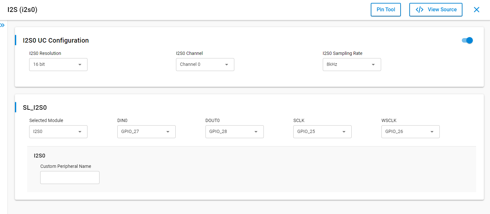

# SL I2S LOOPBACK

## Table of Contents

- [Purpose/Scope](#purposescope)
- [Overview](#overview)
- [About Example Code](#about-example-code)
- [Prerequisites/Setup Requirements](#prerequisitessetup-requirements)
  - [Hardware Requirements](#hardware-requirements)
  - [Software Requirements](#software-requirements)
  - [Setup Diagram](#setup-diagram)
- [Getting Started](#getting-started)
- [Application Build Environment](#application-build-environment)
- [Test the Application](#test-the-application)

## Purpose/Scope

- This application demonstrate the I2S transfer using loopback mechanism

## Overview

- The I2S_2CH supports two stereo channels while the ULP_I2S and the NWP/Security subsystem I2S support one stereo channel
- Programmable Audio data resolutions of 12, 16, 20, 24 and 32 bits
- Supported audio sampling rates are 8, 11.025, 16, 22.05, 24, 32, 44.1, 48, 88.2, 96 and 192 kHz
- Support for Master and Slave modes
- Full duplex communication due to the independence of transmitter and receiver
- Programmable FIFO thresholds with maximum FIFO depth of 8 and support for DMA
- Supports generation of interrupts for different events

## About Example Code

- This example fetches current I2S version using sl_si91x_i2s_get_version()
- Initializes I2S peripheral and store driver handle in i2s_driver_handle using sl_si91x_i2s_init()
- Get the transfer status of I2S peripheral using sl_si91x_i2s_get_status()
- Configure ARM power mode to full power using sl_si91x_i2s_configure_power_mode()
- Register user callback using sl_si91x_i2s_register_event_callback()
- Configure transmitter and receiver transfer parameters for i2s using sl_si91x_i2s_transmit_receive_config()
- Configure receive DMA channel and prepare I2S for data receiving
- Configure transmit DMA channel and send data
- When send data is received by receiver channel, it compares the data received with transferred data
- Loopback test will be pass after successful data comparison.

## Prerequisites/Setup Requirements

### Hardware Requirements

- Windows PC
- Silicon Labs Si917 Evaluation Kit [WPK(BRD4002) + BRD4338A]

### Software Requirements

- Simplicity Studio
- Serial console Setup
  - The Serial Console setup instructions are provided below:
Refer [here](https://docs.silabs.com/wiseconnect/latest/wiseconnect-getting-started/getting-started-with-soc-mode#perform-console-output-and-input-for-brd4338-a).

### Setup Diagram


## Getting Started

Refer to the instructions [here](https://docs.silabs.com/wiseconnect/latest/wiseconnect-getting-started/) to:

- Install Studio and WiSeConnect 3 extension
- Connect your device to the computer
- Upgrade your connectivity firmware
- Create a Studio project

## Application Build Environment

- Configure UC from the slcp component.

   

- Open **sl_si91x_i2s_loopback.slcp** project file select **software component** tab and search for **I2S** in search bar.
- Using configuration wizard one can configure different parameters like:

### General Configuration

- I2S resolution: I2S resolution can be configured through this macro,valid resolution values are 12, 16, 20, 24 and 32 bit.
- I2S sampling rate: I2S sampling rate can be configured through this macro,valid sampling rate values are
    8kHz, 11.025kHz, 16kHz, 22.05kHz, 24kHz, 32kHz, 44.1kHz, 48kHz, 88.2kHz, 96kHz and 192kHz
- Configuration files are generated in **config folder**, if not changed then the code will run on default UC values.

- Configure the following macros in i2s_loopback_example.c file and update/modify following macros if required.

```C
#define BUFFER_SIZE 1024    ///< I2S transfer size
```

### Pin Configuration

| GPIO pin                | Description             |
| ----------------------- | ----------------------- |
| GPIO_25 [P25]           | I2S frequency           |
| GPIO_26 [P27]           | I2S Sampling frequency  |
| GPIO_28 [P31]           | I2S DOUT          |
| GPIO_27 [P29]           | I2S DIN           |

### Pin Description

**Note!** Make sure pin configuration in RTE_Device_917.h file.(path: /$project/config/RTE_Device_917.h)

## Test the Application

Refer to the instructions [here](https://docs.silabs.com/wiseconnect/latest/wiseconnect-getting-started/) to:

1. Connect GPIO_28 to GPIO_27 for loopback connection.
2. Compile and run the application.
3. When the application runs,It sends and receives data in loopback.
4. After successful program execution the prints in serial console looks as shown below.

   >
