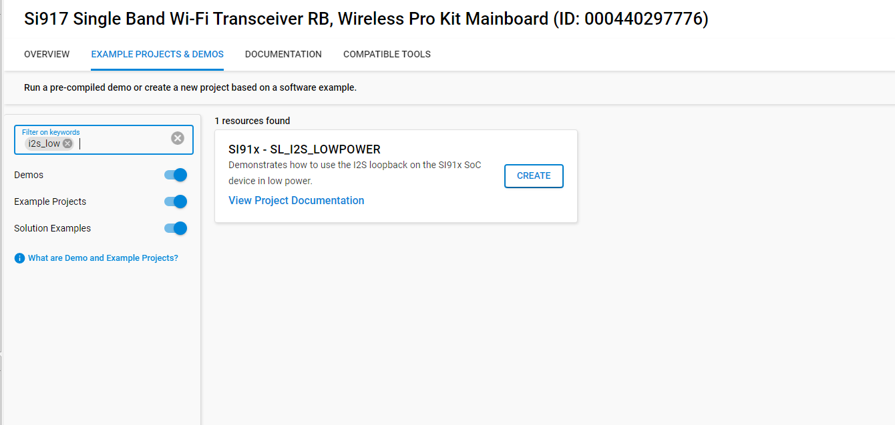

# I2S

## Introduction

- This application demonstrates ULP_I2S will be configured in PS2 state and master mode.Here we will connect TX pin to RX pin in loopback mode
- Master transmits data on TX pin using DMA and receives same data on RX pin using DMA
- The data received should match with the transmitted data

## Overview

- The I2S_2CH supports two stereo channels while the ULP_I2S and the NWP/Security subsystem I2S support one stereo channel
- Programmable Audio data resolutions of 12, 16, 20, 24 and 32 bits
- Supported audio sampling rates are 8, 11.025, 16, 22.05, 24, 32, 44.1, 48, 88.2, 96 and 192 kHz
- Support for Master and Slave modes
- Full duplex communication due to the independence of transmitter and receiver
- Programmable FIFO thresholds with maximum FIFO depth of 8 and support for DMA
- Supports generation of interrupts for different events

## About Example Code

- This example fetches current I2S version using sl_si91x_i2s_get_version()
- Initializes I2S peripheral and store driver handle in i2s_driver_handle using sl_si91x_i2s_init()
- Get the transfer status of I2S peripheral using sl_si91x_i2s_get_status()
- Configure ARM power mode to full power using sl_si91x_i2s_configure_power_mode()
- Register user callback using sl_si91x_i2s_register_event_callback()
- Configure transmitter and receiver transfer parameters for i2s using sl_si91x_i2s_transmit_receive_config()
- Configure receive DMA channel and prepare I2S for data receiving
- Configure transmit DMA channel and send data
- When send data is received by receiver channel, it compares the data received with transferred data
- Loopback test will be pass after successful data comparison.

## Running Example Code

- To use this application following Hardware, Software and the Project Setup is required

### Hardware Requirements

- Windows PC
- Silicon Labs [Si917 Evaluation Kit WPK/WSTK + BRD4325A]


### Software Requirements

- Si91x SDK
- Embedded Development Environment
  - For Silicon Labs Si91x, use the latest version of Simplicity Studio (refer **"Download and Install Simplicity Studio"** section in **getting-started-with-siwx917-soc** guide at **release_package/docs/index.html**)

## Project Setup

- **Silicon Labs Si91x** refer **"Download SDK"** section in **getting-started-with-siwx917-soc** guide at **release_package/docs/index.html** to work with Si91x and Simplicity Studio

## Loading Application on Simplicity Studio

1. With the product Si917 selected, navigate to the example projects by clicking on Example Projects & Demos
   in simplicity studio and click on to I2S loopback Example application as shown below.



## Configuration and Steps for Execution

- Configure UC from the slcp component.
- Open **sl_si91x_i2s_low_power.slcp** project file select **software component** tab and search for **I2S** in search bar.
- Using configuration wizard one can configure different parameters like:
  - **General Configuration**
  - I2S resolution: I2S resolution can be configured through this macro,valid resolution values are 12, 16, 20, 24 and 32 bit.
  - I2S sampling rate: I2S sampling rate can be configured through this macro,valid sampling rate values are 
    8kHz, 11.025kHz, 16kHz, 22.05kHz, 24kHz, 32kHz, 44.1kHz, 48kHz, 88.2kHz, 96kHz and 192kHz
- Configuration files are generated in **config folder**, if not changed then the code will run on default UC values.

- Configure the following macros in i2s_lowpower_example.c file and update/modify following macros if required.

```C
#define BUFFER_SIZE 1024    ///< I2S transfer size
```

## Build

1. Compile the application in Simplicity Studio using build icon


## Device Programming

- To program the device ,refer **"Burn M4 Binary"** section in **getting-started-with-siwx917-soc** guide at **release_package/docs/index.html** to work with Si91x and Simplicity Studio

## Pin Configuration

| GPIO PIN | A0 PIN | B0 1.2 PIN | B0 2.0 PIN |Description |
| --- | ---  | --- | --- | --- |
| SCLK | ULP_GPIO_3 | ULP_GPIO_3 | ULP_GPIO_3 | Connect to SCLK pin |
| WSCLK | ULP_GPIO_4 [EXP_HEADER-11] | ULP_GPIO_8 [F11] | ULP_GPIO_8 [P15] | Connect to WSCLK pin |
| DOUT | ULP_GPIO_5 [EXP_HEADER-13] | ULP_GPIO_1 [P16] | ULP_GPIO_1 [P16] | DOUT |
| DIN | ULP_GPIO_6 [P36] | ULP_GPIO_6 [P36] | ULP_GPIO_6 [EXP_HEADER-16]  | DIN |
| LOOPBACK | ULP_GPIO_5 <-> ULP_GPIO_6 | ULP_GPIO_1  <-> ULP_GPIO_6  | ULP_GPIO_1  <-> ULP_GPIO_6 | DIN and DOUT pin loopback connection|

## Pin Description

**Note!** Make sure pin configuration in RTE_Device_9117.h file.(path: /$project/wiseconnect_1.0.0/platforms/si91x/drivers/cmsis_driver/config/RTE_Device_9117.h)

## Executing the Application

1. Connect DOUT to DIN for loopback connection.
2. Compile and run the application.
3. When the application runs,It sends and receives data in loopback.
Note: To check Prints for ULP Peripheral examples, connect the USB to TTL uart connector's RX_pin,
to the EXP_HEADER-5 of the WPK[BRD4002A]/WSTK[BRD4001A] Base Board.

## Expected Results

- Console output of successful configuration of PLL, initialization, power mode and I2S configuration
- Console output of I2S transfer complete, Data comparison successful, Loop Back Test Passed.
