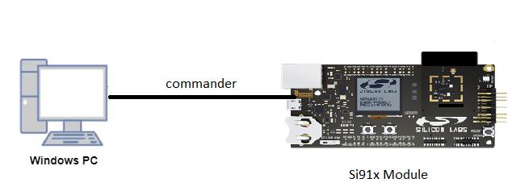
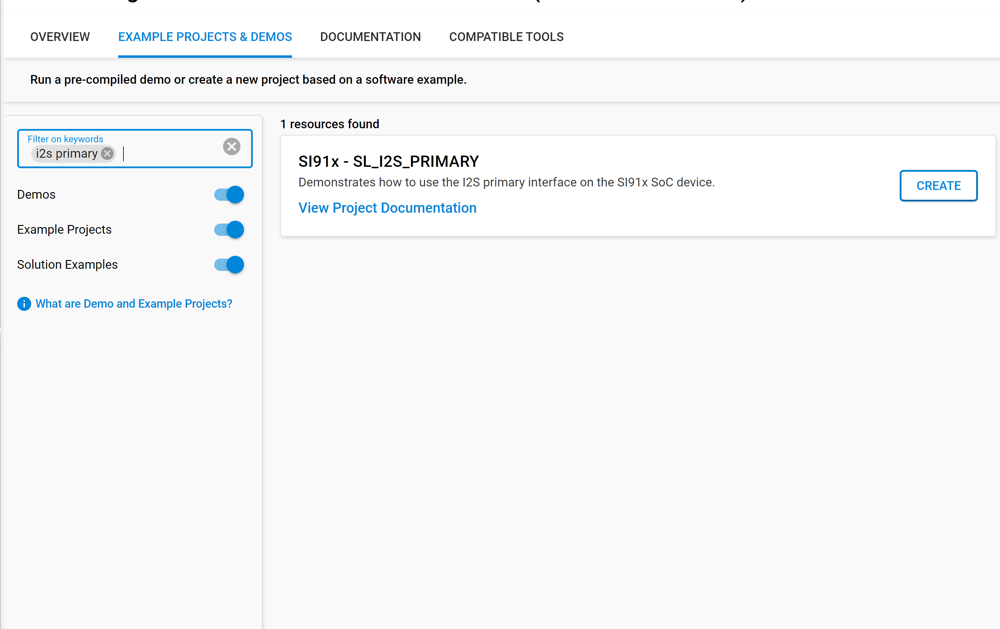
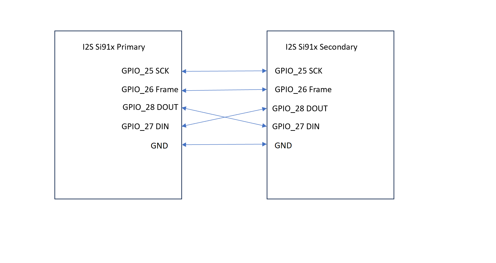

# I2S

## Introduction

- This application demonstrate the I2S primary device transfer 

## Overview

- The I2S_2CH supports two stereo channels while the ULP_I2S and the NWP/Security subsystem I2S support one stereo channel
- Programmable Audio data resolutions of 12, 16, 20, 24 and 32 bits
- Supported audio sampling rates are 8, 11.025, 16, 22.05, 24, 32, 44.1, 48, 88.2, 96 and 192 kHz
- Support for Master and Slave modes
- Full duplex communication due to the independence of transmitter and receiver
- Programmable FIFO thresholds with maximum FIFO depth of 8 and support for DMA
- Supports generation of interrupts for different events

## About Example Code

- This example fetches current I2S version using sl_si91x_i2s_get_version()
- Initializes I2S peripheral and store driver handle in i2s_driver_handle using sl_si91x_i2s_init()
- Get the transfer status of I2S peripheral using sl_si91x_i2s_get_status()
- Configure ARM power mode to full power using sl_si91x_i2s_configure_power_mode()
- Register user callback using sl_si91x_i2s_register_event_callback()
- Configure transmitter transfer parameters for i2s using sl_si91x_i2s_transmit_receive_config()
- Configure transmit DMA channel and send data
- Application will be in wait state until data transmit complete.
- Configure receive DMA channel and wait for data to be received from secondary device.
- When data is received by receiver channel, it compares the data received with transferred data
- Test will be pass after successful data comparison.

## Running Example Code

- To use this application following Hardware, Software and the Project Setup is required

### Hardware Requirements

- Windows PC
- Silicon Labs [Si917 Evaluation Kit WPK/WSTK + BRD4325A]



### Software Requirements

- Si91x SDK
- Embedded Development Environment
  - For Silicon Labs Si91x, use the latest version of Simplicity Studio (refer **"Download and Install Simplicity Studio"** section in **getting-started-with-siwx917-soc** guide at **release_package/docs/index.html**)

## Project Setup

- **Silicon Labs Si91x** refer **"Download SDK"** section in **getting-started-with-siwx917-soc** guide at **release_package/docs/index.html** to work with Si91x and Simplicity Studio

## Loading Application on Simplicity Studio

1. With the product Si917 selected, navigate to the example projects by clicking on Example Projects & Demos
   in simplicity studio and click on to I2S loopback Example application as shown below.



## Configuration and Steps for Execution

- Configure UC from the slcp component.
- Open **sl_si91x_i2s.slcp** project file select **software component** tab and search for **I2S** in search bar.
- Using configuration wizard one can configure different parameters like:
  - **General Configuration**
  - I2S resolution: I2S resolution can be configured through this macro,valid resolution values are 12, 16, 20, 24 and 32 bit.
  - I2S sampling rate: I2S sampling rate can be configured through this macro,valid sampling rate values are 
    8kHz, 11.025kHz, 16kHz, 22.05kHz, 24kHz, 32kHz, 44.1kHz, 48kHz, 88.2kHz, 96kHz and 192kHz
- Configuration files are generated in **config folder**, if not changed then the code will run on default UC values.

- Configure the following macros in i2s_primary_example.c file and update/modify following macros if required.
- Make sure to maintain same configuration parameters for primary and secondary devices

```C
#define BUFFER_SIZE 1024    ///< I2S transfer size
```

## Build

1. Compile the application in Simplicity Studio using build icon


## Device Programming

- To program the device ,refer **"Burn M4 Binary"** section in **getting-started-with-siwx917-soc** guide at **release_package/docs/index.html** to work with Si91x and Simplicity Studio

## Pin Configuration

| GPIO pin                | Description             |
| ----------------------- | ----------------------- |
| GPIO_25 [EXP_HEADER-15] | I2S frequency			|
| GPIO_26 [EXP_HEADER-16] | I2S Sampling frequency  |
| GPIO_28 [EXP_HEADER-8]  | I2S DOUT				|
| GPIO_27 [EXP_HEADER-10] | I2S DIN 				|

## Pin Description

**Note!** Make sure pin configuration in RTE_Device_9117.h file.(path: /$project/wiseconnect_1.0.0/platforms/si91x/drivers/cmsis_driver/config/RTE_Device_9117.h)

## Executing the Application

1. Take two Silicon Labs [Si917 Evaluation Kit WPK/WSTK + BRD4325A]
2. For pin connections, refer to 
3. First compile and run i2s secondary device application in one board.
2. Compile and run this application in another board.
3. When the application runs,It sends and receives data from secondary device

## Expected Results

- Console output of successful configuration of PLL, initialization, power mode and I2S configuration
- Console output of Data send successfully, Data received successfully, Data comparison successful.
