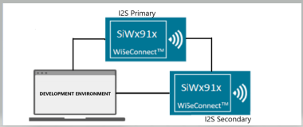
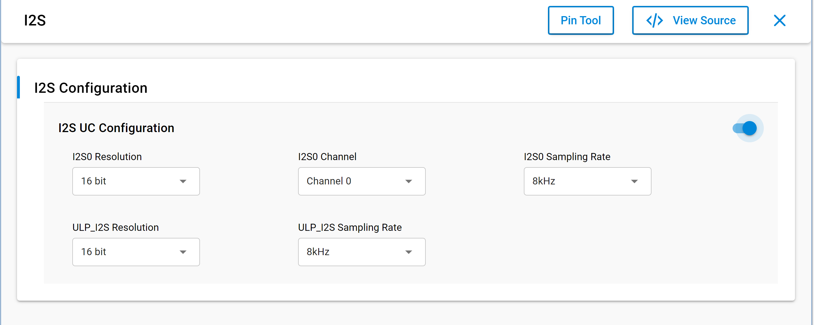
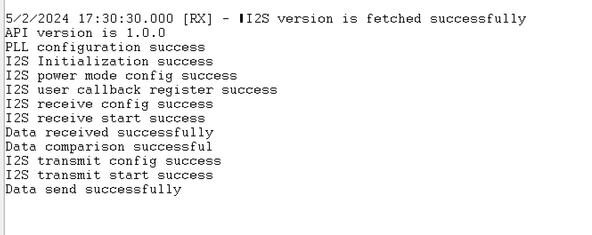

# SL I2S PRIMARY

## Table of Contents

- [SL I2S PRIMARY](#sl-i2s-primary)
  - [Purpose/Scope](#purposescope)
  - [Overview](#overview)
  - [About Example Code](#about-example-code)
  - [Prerequisites/Setup Requirements](#prerequisitessetup-requirements)
    - [Hardware Requirements](#hardware-requirements)
    - [Software Requirements](#software-requirements)
    - [Setup Diagram](#setup-diagram)
  - [Getting Started](#getting-started)
  - [Application Build Environment](#application-build-environment)
    - [General Configuration](#general-configuration)
    - [Pin Configuration](#pin-configuration)
    - [Pin Description](#pin-description)
  - [Test the Application](#test-the-application)

## Purpose/Scope

 - The application performs bidirectional I2S sample transfers between primary and secondary devices, compares the corresponding buffers, and prints the results to the console.

## Overview

- The I2S0 peripheral supports two stereo channels for both transmit and receive while the ULP_I2S supports one stereo channel
- Programmable Audio data resolutions of 16, 24 and 32 bits
- Supported audio sampling rates are 8, 11.025, 16, 22.05, 24, 32, 44.1, 48, 88.2, 96 and 192 kHz
- Support for Master and Slave modes
- Full duplex communication due to the independence of transmitter and receiver
- Programmable FIFO thresholds with maximum FIFO depth of 8 and support for DMA
- Supports generation of interrupts for different events

## About Example Code

- This example fetches current I2S version using [sl_si91x_i2s_get_version](https://docs.silabs.com/wiseconnect/latest/wiseconnect-api-reference-guide-si91x-peripherals/i2-s#sl-si91x-i2s-get-version)()
- Initializes I2S peripheral and store driver handle in i2s_driver_handle using [sl_si91x_i2s_init](https://docs.silabs.com/wiseconnect/latest/wiseconnect-api-reference-guide-si91x-peripherals/i2-s#sl-si91x-i2s-init)()
- Get the transfer status of I2S peripheral using [sl_si91x_i2s_get_status](https://docs.silabs.com/wiseconnect/latest/wiseconnect-api-reference-guide-si91x-peripherals/i2-s#sl-si91x-i2s-get-status)()
- Configure ARM power mode to full power using [sl_si91x_i2s_configure_power_mode](https://docs.silabs.com/wiseconnect/latest/wiseconnect-api-reference-guide-si91x-peripherals/i2-s#sl-si91x-i2s-configure-power-mode)()
- Register user callback using [sl_si91x_i2s_register_event_callback](https://docs.silabs.com/wiseconnect/latest/wiseconnect-api-reference-guide-si91x-peripherals/i2-s#sl-si91x-i2s-register-event-callback)()
- Configure transmitter transfer parameters for i2s using [sl_si91x_i2s_transmit_receive_config()](https://docs.silabs.com/wiseconnect/latest/wiseconnect-api-reference-guide-si91x-peripherals/i2-s#sl-si91x-i2s-transmit-receive-config)
- Configure receive DMA channel and wait for data to be received from secondary device.
- When data is received by receiver channel, it compares the data received with transferred data
- Configure transmit DMA channel and send data
- Application will be in wait state until data transmit complete.
- Test will be pass after successful data comparison.

**Note:**

- sl_i2s_xfer_config_t has following parameters:
  - **mode** - Configure I2S device in Primary(Master)/Secondary(Slave) mode
  - **sync** - I2S synchronous mode (4-pin mode: SCK and WS signals are shared between I2S transmit and receive blocks) and asynchronous mode (requires SCK and WS pins). Currently, the driver only supports ASYNC mode.
  - **protocol** - I2S/PCM protocol. Currently, the driver only supports I2S protocol.
  - **resolution** - Audio data resolutions (16-bit, 24-bit and 32-bit)
  - **data_size** - Transfer buffer data type (8-bit, 16-bit and 32-bit)
  - **sampling_rate** - Audio sampling rate
  - **transfer_type** - Transfer type (Transmit, Receive, Transmit abort, and Receive abort)
- Transfers with 16-bit resolution must use uint16_t data type buffer and pass SL_I2S_DATA_SIZE16 to data_size parameter in sl_i2s_xfer_config_t while configuring transfer.
- Transfers with 24-bit and 32-bit resolutions must use uint32_t data type buffer and pass SL_I2S_DATA_SIZE32 to data_size parameter in sl_i2s_xfer_config_t while configuring transfer.
- Because 8-bit resolution is not supported, use a uint8_t data buffer with 16-bit resolution for the transfer. When configuring the transfer, pass SL_I2S_DATA_SIZE8 to the data_size parameter in sl_i2s_xfer_config_t. Cast the data buffer to (uint16_t *) before the transfer, and set the transfer size to half the size of the 8-bit data type buffer. (Refer to the [I2S loopback](https://github.com/SiliconLabs/wiseconnect/tree/v4.0.0-content-for-docs/examples/si91x_soc/peripheral/sl_si91x_i2s_loopback) application for more details). For 8-bit transfers, the transfer size must be a multiple of four (for example, 8, 12, 16, or 20 bytes).
- For I2S transfers with 16-bit or 32-bit resolution, the transfer size must be an even value (8,10,12,14...)
- For I2S transfers with 24-bit resolution, the transfer size must be a multiple of four (8,12,16,20...)
 - SCK frequency is calculated as SCK = 2 × bit_width × sampling_rate. By default, I2S0 uses I2S_PLL_CLK as the clock source and supports a wide range of audio bit-clock frequencies suitable for common sampling rates.
- By default, ULP_I2S (I2S1) uses ULP_MHZ_RC_CLK to support I2S operation in low-power states. This configuration limits the maximum supported sampling rate to 48 kHz because the 32 MHz RC clock is trimmed to 20 MHz in sleep mode.

## Prerequisites/Setup Requirements

### Hardware Requirements

- Windows PC
- Silicon Labs Si917 Evaluation Kit [[BRD4002](https://www.silabs.com/development-tools/wireless/wireless-pro-kit-mainboard?tab=overview) + [BRD4338A](https://www.silabs.com/development-tools/wireless/wi-fi/siwx917-rb4338a-wifi-6-bluetooth-le-soc-radio-board?tab=overview) / [BRD4342A](https://www.silabs.com/development-tools/wireless/wi-fi/siwx91x-rb4342a-wifi-6-bluetooth-le-soc-radio-board?tab=overview) / [BRD4343A](https://www.silabs.com/development-tools/wireless/wi-fi/siw917y-rb4343a-wi-fi-6-bluetooth-le-8mb-flash-radio-board-for-module?tab=overview)]

### Software Requirements

- Simplicity Studio
- Serial console Setup
  - For Serial Console setup instructions, refer to [Console Input and Output](https://docs.silabs.com/wiseconnect/latest/wiseconnect-developers-guide-developing-for-silabs-hosts/using-the-simplicity-studio-ide#console-input-and-output).

### Setup Diagram

 >

## Getting Started

Refer to the instructions [here](https://docs.silabs.com/wiseconnect/latest/wiseconnect-getting-started/) to:

- [Install Simplicity Studio](https://docs.silabs.com/wiseconnect/latest/wiseconnect-developers-guide-developing-for-silabs-hosts/using-the-simplicity-studio-ide#install-simplicity-studio)
- [Install WiSeConnect extension](https://docs.silabs.com/wiseconnect/latest/wiseconnect-developers-guide-developing-for-silabs-hosts/using-the-simplicity-studio-ide#install-the-wiseconnect-3-extension)
- [Connect your device to the computer](https://docs.silabs.com/wiseconnect/latest/wiseconnect-developers-guide-developing-for-silabs-hosts/using-the-simplicity-studio-ide#connect-siwx91x-to-computer)
- [Upgrade your connectivity firmware](https://docs.silabs.com/wiseconnect/latest/wiseconnect-developers-guide-developing-for-silabs-hosts/using-the-simplicity-studio-ide#update-siwx91x-connectivity-firmware)
- [Create a Studio project](https://docs.silabs.com/wiseconnect/latest/wiseconnect-developers-guide-developing-for-silabs-hosts/using-the-simplicity-studio-ide#create-a-project)

For details on the project folder structure, see the [WiSeConnect Examples](https://docs.silabs.com/wiseconnect/latest/wiseconnect-examples/#example-folder-structure) page.

## Application Build Environment

- Configure UC from the slcp component.
- Open **sl_si91x_i2s_primary.slcp** project file select **software component** tab and search for **I2S** in search bar.

  

- Using configuration wizard one can configure different parameters like:

### General Configuration

- SL_I2S0_RESOLUTION: Use this macro to configure the I2S0 resolution. Supported resolution values are 16, 24, and 32 bit.
- SL_I2S0_SAMPLING_RATE: Use this macro to configure the I2S0 sampling rate. Supported sampling values are 8 kHz, 11.025 kHz, 16 kHz, 22.05 kHz, 24 kHz, 32 kHz, 44.1 kHz, 48 kHz, 88.2 kHz, 96 kHz, and 192 kHz.
- SL_I2S0_CHANNEL: I2S0 channel number (0-channel no 0, 1-channel no 1)
- Configuration files are generated in **config folder**, if not changed then the code will run on default UC values.

- Configure the following macros in [`i2s_primary_example.c`](https://github.com/SiliconLabs/wiseconnect/blob/v4.0.0-content-for-docs/examples/si91x_soc/peripheral/sl_si91x_i2s_primary/i2s_primary_example.c) file and update/modify following macros if required.

```C
#define I2S_PRIMARY_BUFFER_SIZE 1024    ///< Transmit/Receive buffer size
```

### Pin Configuration for I2S primary

- For BRD4338A

| Si917 GPIO pin | Breakout pin on WPK (4002A baseboard) | Description             |
| ---------------| --------------------------------------|------------------------ |
| GPIO_25        | P25                                   | I2S SCK                 |
| GPIO_26        | P27                                   | I2S Frame               |
| GPIO_28        | P31                                   | I2S DOUT                |
| GPIO_27        | P29                                   | I2S DIN                 |

- For pin connections, refer to

   >

## Test the Application

Refer to the instructions [here](https://docs.silabs.com/wiseconnect/latest/wiseconnect-developers-guide-developing-for-silabs-hosts/using-the-simplicity-studio-ide#create-a-project) to:

1. Obtain two Silicon Labs Si917 Evaluation Kits: a [WPK (BRD4002)](https://www.silabs.com/development-tools/wireless/wireless-pro-kit-mainboard?tab=overview) and a [BRD4338A](https://www.silabs.com/development-tools/wireless/wi-fi/siwx917-rb4338a-wifi-6-bluetooth-le-soc-radio-board?tab=overview).
2. On one board, build and run the I2S secondary application from the WiseConnect repository: [i2s secondary](https://github.com/SiliconLabs/wiseconnect/tree/v4.0.0-content-for-docs/examples/si91x_soc/peripheral/sl_si91x_i2s_secondary).
3. Compile and run this application on the other board.
4. When the application runs, it receives data from the secondary device and after successful
   comparison, it sends data to the secondary device.
5. After the program runs successfully, the output in the serial console appears as shown below.

   >

> **Note:**
>
> - Interrupt handlers are implemented in the driver layer, and user callbacks are provided for custom code. If you want to write your own interrupt handler instead of using the default one, make the driver interrupt handler a weak handler. Then, copy the necessary code from the driver handler to your custom interrupt handler.
