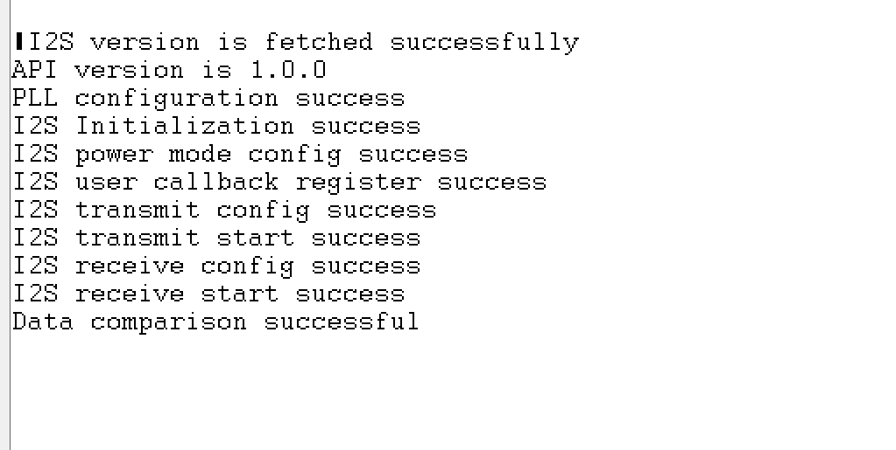

# SL I2S SECONDARY

## Table of Contents

- [SL I2S SECONDARY](#sl-i2s-secondary)
  - [Table of Contents](#table-of-contents)
  - [Purpose/Scope](#purposescope)
  - [Overview](#overview)
  - [About Example Code](#about-example-code)
  - [Prerequisites/Setup Requirements](#prerequisitessetup-requirements)
    - [Hardware Requirements](#hardware-requirements)
    - [Software Requirements](#software-requirements)
    - [Setup Diagram](#setup-diagram)
  - [Getting Started](#getting-started)
  - [Application Build Environment](#application-build-environment)
    - [Pin Description](#pin-description)
  - [Test the Application](#test-the-application)

## Purpose/Scope

This application demonstrates the I2S secondary device transfer.

## Overview

- The I2S_2CH supports two stereo channels, while the ULP_I2S and the NWP/Security subsystem I2S support one stereo channel.
- Supported programmable audio data resolutions are 16-, 24- and 32-bits.
- Supported audio sampling rates are 8, 11.025, 16, 22.05, 24, 32, 44.1, 48, 88.2, 96 and 192 kHz.
- Support for Master and Slave modes.
- Full-duplex communication due to the independence of transmitter and receiver.
- Programmable FIFO thresholds with maximum FIFO depth of 8 and support for DMA.
- Supports generation of interrupts for different events.

## About Example Code

- This example fetches current I2S version using sl_si91x_i2s_get_version().
- Initializes I2S peripheral and store driver handle in i2s_driver_handle using sl_si91x_i2s_init().
- Get the transfer status of I2S peripheral using sl_si91x_i2s_get_status().
- Configure ARM power mode to full power using sl_si91x_i2s_configure_power_mode().
- Register user callback using sl_si91x_i2s_register_event_callback().
- Configure transmitter transfer parameters for i2s using sl_si91x_i2s_transmit_receive_config().
- Configure transmit DMA channel and send data.
- Application will be in wait state until the data transmit completes.
- Configure receive DMA channel and wait for data to be received from the primary device.
- When data is received by receiver channel, it compares the data received with expected receive data.
- Test will be pass after sending data to primary device.

**Note!**

1. sl_i2s_xfer_config_t has following parameters,
   (a) mode - Configure I2S device in Primary(Master)/Secondary(Slave) mode
   (b) sync - I2S synchronous mode (4-pin mode: SCK and WS signals are shared between I2S transmit and receive blocks) and asynchronous mode (requires SCK and WS pins). Currently, the driver only supports ASYNC mode.
   (c) protocol - I2S/PCM protocol. Currently, the driver only supports I2S protocol.
   (d) resolution - Audio data resolutions (16-bit, 24-bit and 32-bit)
   (e) data_size - Transfer buffer data type (8-bit, 16-bit and 32-bit)
   (f) sampling_rate - Audio sampling rate
   (g) transfer_type - Transfer type (Transmit, Receive, Transmit abort, and Receive abort)
2. Transfers with 16-bit resolution must use the `uint16_t` data type buffer and pass SL_I2S_DATA_SIZE16 to data_size parameter
   in sl_i2s_xfer_config_t while configuring the transfer.
3. Transfers with 24-bit and 32-bit resolutions must use `uint32_t` data type buffer and pass SL_I2S_DATA_SIZE32 to data_size parameter
   in sl_i2s_xfer_config_t while configuring the transfer.
4. Since 8-bit resolution is not supported, `uint8_t` data type buffer can use 16-bit resolution for transfer and pass SL_I2S_DATA_SIZE8
   to data_size parameter in sl_i2s_xfer_config_t while configuring a transfer. While performing this operation, the data buffer should be
   typecast to `(uint16_t *)` and the transfer size should be half of the 8-bit data type buffer. (Refer to the I2S loopback application for more details). For 8-bit transfers, transfer size should be multiples of 4 (8,12,16,20...).
5. Any I2S transfers with 16-bit and 32-bit resolutions should only have an even transfer size (8,10,12,14...).
6. Any I2S transfers with 24-bit resolutions should only have transfer size as multiples of 4 (8,12,16,20...).
7. SCK frequency is calculated using `SCK = 2 * bit_width * sampling_frequency`. By default, I2S0 uses I2S_PLL_CLK as a clock source. This can generate any frequency range mentioned in section 6.11.7 of Si91x HRM.
8. By default, ULP_I2S/I2S1 uses ULP_MHZ_RC_CLK to support I2S operation in low-power states. This limits the maximum supported sampling frequency of ULP_I2S to 48kHz (32 MHz RC trims to 20MHz in sleep).

## Prerequisites/Setup Requirements

### Hardware Requirements

- Windows PC
- Silicon Labs Si917 Evaluation Kit [WPK(BRD4002) + BRD4338A / BRD4342A / BRD4343A ]
- SiWx917 AC1 Module Explorer Kit (BRD2708A)

### Software Requirements

- Simplicity Studio
- Serial console setup
  - For serial console setup instructions, see the [Console Input and Output](https://docs.silabs.com/wiseconnect/latest/wiseconnect-developers-guide-developing-for-silabs-hosts/#console-input-and-output) section in the *WiSeConnect Developer's Guide*.

### Setup Diagram

 >

## Getting Started

Refer to the instructions [here](https://docs.silabs.com/wiseconnect/latest/wiseconnect-getting-started/) to:

- [Install Simplicity Studio](https://docs.silabs.com/wiseconnect/latest/wiseconnect-developers-guide-developing-for-silabs-hosts/#install-simplicity-studio)
- [Install WiSeConnect 3 extension](https://docs.silabs.com/wiseconnect/latest/wiseconnect-developers-guide-developing-for-silabs-hosts/#install-the-wi-se-connect-3-extension)
- [Connect your device to the computer](https://docs.silabs.com/wiseconnect/latest/wiseconnect-developers-guide-developing-for-silabs-hosts/#connect-si-wx91x-to-computer)
- [Upgrade your connectivity firmware](https://docs.silabs.com/wiseconnect/latest/wiseconnect-developers-guide-developing-for-silabs-hosts/#update-si-wx91x-connectivity-firmware)
- [Create a Studio project](https://docs.silabs.com/wiseconnect/latest/wiseconnect-developers-guide-developing-for-silabs-hosts/#create-a-project)

For details on the project folder structure, see the [WiSeConnect Examples](https://docs.silabs.com/wiseconnect/latest/wiseconnect-examples/#example-folder-structure) page.

## Application Build Environment

- Configure UC from the slcp component.
- Open the **sl_si91x_i2s_secondary.slcp** project file, select the **Software Component** tab, and search for **I2S** in the search bar.
  
  

- You can use the cofiguration wizard to configure different parameters like:

  - **General Configuration**

    - **SL_I2S0_RESOLUTION**: I2S0 resolution can be configured through this macro. Valid resolution values are 16-, 24- and 32-bit.
    - **SL_I2S0_SAMPLING_RATE**: I2S0 sampling rate can be configured through this macro. Valid sampling rate values are 8kHz, 11.025kHz, 16kHz, 22.05kHz, 24kHz, 32kHz, 44.1kHz, 48kHz, 88.2kHz, 96kHz and 192kHz.
    - **SL_I2S0_CHANNEL**: I2S0 channel number (0-channel no 0, 1-channel no 1).
    - Configuration files are generated in the **config folder**. If not changed, the code will run on default UC values.
    - Configure the following macros in [`i2s_secondary_example.c`](https://github.com/SiliconLabs/wiseconnect/blob/master/examples/si91x_soc/peripheral/sl_si91x_i2s_secondary/i2s_secondary_example.c) file and update/modify following macros, if required.

      ```C
      #define I2S_SECONDARY_BUFFER_SIZE 1024    ///< Transmit/Receive buffer size
      ```

  - **Pin Configuration**

      |   GPIO    | Breakout pin on WPK (4002A baseboard) | Breakout pin Explorer kit |  Description     |
      | ----------| --------------------------------------|-------------------------- | ---------------- |
      | GPIO_25   |         P25                           |          [SCK]            | I2S SCK          |
      | GPIO_26   |         P27                           |          [MISO]           | I2S Frame        |
      | GPIO_28   |         P31                           |          [CS]             | I2S DOUT         |
      | GPIO_27   |         P29                           |          [MOSI]           | I2S DIN          |

      For pin connections, see the following image:

      

### Pin Description

>**Note:** Make sure the pin configuration is set in `RTE_Device_xxx.h` file:
>
> - SiWx917: RTE_Device_917.h (path: /$project/config/RTE_Device_917.h)
> - SiWx915: RTE_Device_915.h (path: /$project/config/RTE_Device_915.h)

> **Note**: For recommended settings, see the [recommendations guide](https://docs.silabs.com/wiseconnect/latest/wiseconnect-developers-guide-prog-recommended-settings/).

## Test the Application

Refer to the instructions [here](https://docs.silabs.com/wiseconnect/latest/wiseconnect-getting-started/) to:

1. Take two Silicon Labs [Si917 Evaluation Kit WPK(BRD4002) + BRD4338A / BRD4342A / BRD4343A].
2. First compile and run I2S secondary device application in one board.
3. Compile and run primary I2S application in another board.
4. When the application runs, it sends data to the primary device and after successful comparision, it receives data from primary device.
5. After successful program execution, the prints in serial console looks as shown below.

   >

> **Note:**
>
> - Interrupt handlers are implemented in the driver layer, and user callbacks are provided for custom code. If you want to write your own interrupt handler instead of using the default one, make the driver interrupt handler a weak handler. Then, copy the necessary code from the driver handler to your custom interrupt handler.
