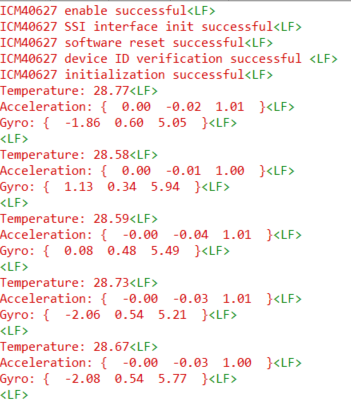

# SL ICM40627

## Table of Contents

- [SL ICM40627](#sl-icm40627)
  - [Table of Contents](#table-of-contents)
  - [Purpose/Scope](#purposescope)
  - [About Example Code](#about-example-code)
  - [Prerequisites/Setup Requirements](#prerequisitessetup-requirements)
    - [Hardware Requirements](#hardware-requirements)
    - [Software Requirements](#software-requirements)
    - [Setup Diagram](#setup-diagram)
  - [Getting Started](#getting-started)
  - [Application Build Environment](#application-build-environment)
  - [Test the Application](#test-the-application)

## Purpose/Scope

This application demonstrates the 6-axis inertial sensor (ICM-40627), which measures the motion parameters and temperature every 2 seconds.

## About Example Code

This example demonstrates the measurement of acceleration in 3 axes, gyroscope in 3 axes, and temperature every 2 seconds. It also shows how to use various APIs available via the SPI interface.

## Prerequisites/Setup Requirements

### Hardware Requirements

- Windows PC
- Silicon Labs SiWx917 Development Kit [ BRD2605A ]

### Software Requirements

- Simplicity Studio
- Serial console setup
  - The serial console setup instructions are provided in the
 [Console Input and Output](https://docs.silabs.com/wiseconnect/latest/wiseconnect-developers-guide-developing-for-silabs-hosts/#console-input-and-output) section of the *WiSeConnect Developer's Guide*.

### Setup Diagram


## Getting Started

Refer to the instructions [here](https://docs.silabs.com/wiseconnect/latest/wiseconnect-getting-started/) to:

- [Install Simplicity Studio](https://docs.silabs.com/wiseconnect/latest/wiseconnect-developers-guide-developing-for-silabs-hosts/#install-simplicity-studio)
- [Install WiSeConnect 3 extension](https://docs.silabs.com/wiseconnect/latest/wiseconnect-developers-guide-developing-for-silabs-hosts/#install-the-wi-se-connect-3-extension)
- [Connect your device to the computer](https://docs.silabs.com/wiseconnect/latest/wiseconnect-developers-guide-developing-for-silabs-hosts/#connect-si-wx91x-to-computer)
- [Upgrade your connectivity firmware](https://docs.silabs.com/wiseconnect/latest/wiseconnect-developers-guide-developing-for-silabs-hosts/#update-si-wx91x-connectivity-firmware)
- [Create a Studio project](https://docs.silabs.com/wiseconnect/latest/wiseconnect-developers-guide-developing-for-silabs-hosts/#create-a-project)

## Application Build Environment

- Configure the following macros in the [`icm40627_example.c`](https://github.com/SiliconLabs/wiseconnect/blob/master/examples/si91x_soc/peripheral/sl_si91x_icm40627/icm40627_example.c) file and update/modify following macros, if required.

- `DELAY_PERIODIC_MS1`: Select the delay for data display. By default, the delay is kept as 2 seconds.

    ```C
    #define DELAY_PERIODIC_MS1  2000      //sleeptimer1 periodic timeout in ms
    ```

> **Note**: For recommended settings, see the [recommendations guide](https://docs.silabs.com/wiseconnect/latest/wiseconnect-developers-guide-prog-recommended-settings/).

## Test the Application

Refer to the instructions [here](https://docs.silabs.com/wiseconnect/latest/wiseconnect-getting-started/) to:

1. Compile and run the application.
2. When the application runs, it measures accelerometer, gyroscope and temperature data for every 2 seconds.
3. After successful program execution the prints in serial console looks as shown below.

   
